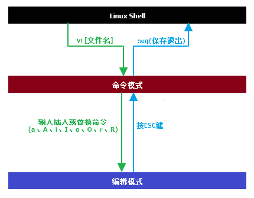
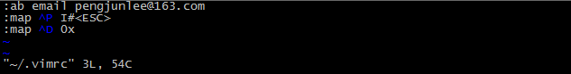

# vi
**命令用途**：`vi`命令是UNIX操作系统和类UNIX操作系统中最通用的全屏幕纯文本编辑器。Linux中的`vi`编辑器叫`vim`，它是`vi`的增强版（`vi Improved`），与vi编辑器完全兼容，而且实现了很多增强功能。 vi编辑器支持命令模式和编辑模式，要正确使用vi编辑器就必须熟练掌握这两种模式的切换。  

**命令语法**：`vi [文件名]`

## 命令模式与编辑模式
**命令模式**：在`Shell`提示符后输入`vi`命令，会自动进入命令模式。此时，从键盘上输入的任何字符都会被当作命令来解释。

**编辑模式**：在`vi`命令模式下，输入**插入**命令（`a、i、o`）或替换命令（r）可以从命令模式进入编辑模式。在编辑模式下，从键盘上输入的所有字符都会被当做该文件的正文内容。

### 命令模式
在`vi`命令模式下，提供了许多非常实用的辅助命令，可以帮助我们更加方便的对文件进行编辑，例如：`设置行号`、`跳转到指定行`、`移动到行首或行尾`和`撤销操作`等。

<table border="1" cellpadding="0" cellspacing="0" style="width:329px;"><tbody><tr><td style="text-align:center;width:70px;">命令</td><td style="text-align:center;width:259px;">作用</td></tr><tr><td style="text-align:center;width:70px;">:set nu</td><td style="text-align:center;width:259px;">设置行号</td></tr><tr><td style="text-align:center;width:70px;">:set nonu</td><td style="text-align:center;width:259px;">取消行号</td></tr><tr><td style="text-align:center;width:70px;">gg</td><td style="text-align:center;width:259px;">跳转至第一行</td></tr><tr><td style="text-align:center;width:70px;">G</td><td style="text-align:center;width:259px;">跳转至最后一行</td></tr><tr><td style="text-align:center;width:70px;">nG</td><td style="text-align:center;width:259px;">跳转至第n行</td></tr><tr><td style="text-align:center;width:70px;">:n</td><td style="text-align:center;width:259px;">跳转至第n行</td></tr><tr><td style="text-align:center;width:70px;">$</td><td style="text-align:center;width:259px;">移动到光标所在行的行尾</td></tr><tr><td style="text-align:center;width:70px;">0</td><td style="text-align:center;width:259px;">移动到光标所在行的行首</td></tr><tr><td style="text-align:center;width:70px;">u</td><td style="text-align:center;width:259px;">撤销上一步的操作</td></tr></tbody></table>

#### 如何删除？

<table border="1" cellpadding="0" cellspacing="0" style="width:328px;"><tbody><tr><td style="text-align:center;width:70px;">命令</td><td style="text-align:center;width:258px;">作用</td></tr><tr><td style="text-align:center;width:70px;">x</td><td style="text-align:center;width:258px;">删除光标所在处的字符</td></tr><tr><td style="text-align:center;width:70px;">nx</td><td style="text-align:center;width:258px;">从光标所在处的字符开始， 连续删除n个字符</td></tr><tr><td style="text-align:center;width:70px;">dd</td><td style="text-align:center;width:258px;">删除光标所在行</td></tr><tr><td style="text-align:center;width:70px;">ndd</td><td style="text-align:center;width:258px;">从光标所在行开始，连续删除n行</td></tr><tr><td style="text-align:center;width:70px;">dG</td><td style="text-align:center;width:258px;">删除光标所在行直到文件末尾的内容</td></tr><tr><td style="text-align:center;width:70px;">D</td><td style="text-align:center;width:258px;">删除光标所在处到行尾的内容</td></tr><tr><td style="text-align:center;width:70px;">:n1,n2d</td><td style="text-align:center;width:258px;">删除第n1行到第n2行的内容</td></tr></tbody></table>

#### 如何复制和剪切？

<table border="1" cellpadding="0" cellspacing="0" style="width:331px;"><tbody><tr><td style="text-align:center;width:70px;">命令</td><td style="text-align:center;width:261px;">作用</td></tr><tr><td style="text-align:center;width:70px;">yy</td><td style="text-align:center;width:261px;">复制当前行</td></tr><tr><td style="text-align:center;width:70px;">nyy</td><td style="text-align:center;width:261px;">从当前行开始，连续复制n行</td></tr><tr><td style="text-align:center;width:70px;">dd</td><td style="text-align:center;width:261px;">剪切当前行</td></tr><tr><td style="text-align:center;width:70px;">ndd</td><td style="text-align:center;width:261px;">从当前行开始，连续剪切n行</td></tr><tr><td style="text-align:center;width:70px;">p（小写）</td><td style="text-align:center;width:261px;">粘贴到当前行上面</td></tr><tr><td style="text-align:center;width:70px;">P （大写）</td><td style="text-align:center;width:261px;">粘贴到当前行下面</td></tr></tbody></table>

#### 如何搜索和替换？

<table border="1" cellpadding="0" cellspacing="0" style="width:581px;"><tbody><tr><td style="text-align:center;width:145px;">命令</td><td style="text-align:center;width:436px;">作用</td></tr><tr><td style="text-align:center;width:145px;">/[匹配条件]</td><td style="text-align:center;width:436px;">搜索指定字符串</td></tr><tr><td style="text-align:center;width:145px;">n</td><td style="text-align:center;width:436px;">查看下一个搜索到的匹配结果</td></tr><tr><td style="text-align:center;width:145px;">:%s/old/new/g</td><td style="text-align:center;width:436px;">全文替换指定字符串</td></tr><tr><td style="text-align:center;width:145px;">:n1,n2s/old/new/g</td><td style="text-align:center;width:436px;">在第n1行到第n2行范围内替换指定字符串</td></tr><tr><td style="text-align:center;width:145px;">:n1,n2s/^/#/g</td><td style="text-align:center;width:436px;">为从第n1行到第n2行的各行行首增加#注释</td></tr><tr><td style="text-align:center;width:145px;">:n1,n2s/^#//g</td><td style="text-align:center;width:436px;">将从第n1行到第n2行的各行行首的#注释去掉</td></tr><tr><td style="text-align:center;width:145px;">:n1,n2s/^/\/\//g</td><td style="text-align:center;width:436px;">为从第n1行到第n2行的各行行首增加//注释</td></tr></tbody></table>

	//为从第97行到第102行的各行行首增加#注释
	:97,102s/^/#/g
	//将从第97行到第102行的各行行首的#注释去掉
	:97,102s/^#//g

#### 如何保存和退出？

<table border="1" cellpadding="0" cellspacing="0" style="width:580px;"><tbody><tr><td style="text-align:center;width:148px;">命令</td><td style="text-align:center;width:432px;">作用</td></tr><tr><td style="text-align:center;width:148px;">:w</td><td style="text-align:center;width:432px;">保存修改</td></tr><tr><td style="text-align:center;width:148px;">:w [另存为文件名]</td><td style="text-align:center;width:432px;">另存为指定文件</td></tr><tr><td style="text-align:center;width:148px;">:wq</td><td style="text-align:center;width:432px;">保存修改并退出</td></tr><tr><td style="text-align:center;width:148px;">ZZ</td><td style="text-align:center;width:432px;">保存修改并退出</td></tr><tr><td style="text-align:center;width:148px;">:q!</td><td style="text-align:center;width:432px;">不保存修改退出</td></tr><tr><td style="text-align:center;width:148px;">:wq!</td><td style="text-align:center;width:432px;">强制保存修改并退出（对文件不具有写权限时，文件所有者及root可以使用）</td></tr></tbody></table>

#### 导入内容、定义快捷键、起别名

<table border="1" cellpadding="0" cellspacing="0" style="width:580px;"><tbody><tr><td style="text-align:center;width:147px;">命令</td><td style="text-align:center;width:433px;">作用</td></tr><tr><td style="text-align:center;width:147px;">:r ![命令]</td><td style="text-align:center;width:433px;">将命令的执行结果导入到当前行下面</td></tr><tr><td style="text-align:center;width:147px;">:map [快捷键] [命令组合]</td><td style="text-align:center;width:433px;">定义快捷键（Ctrl+V+快捷键或Ctrl+V、Ctrl+快捷键）</td></tr><tr><td style="text-align:center;width:147px;">:ab [别名] [原内容]</td><td style="text-align:center;width:433px;">为指定内容起别名</td></tr></tbody></table>

	//为I#<ESC>操作（在当前行的行首增加#注释）创建快捷键Ctrl+p
	:map ^P I#<ESC>
	//为0x操作（删除当前行行首的第一个字符）创建快捷键Ctrl+b
	:map ^D 0x
	//为邮箱pengjunlee@163.com字符串起别名为email 
	:ab email pengjunlee@163.com

> 注：在`vi`命令模式下设置的别名和快捷键仅对本次编辑有效，若需要将别名或快捷键永久存储需在当前用户家目录中的`.vimrc`文件中进行配置。

### 编辑模式
在`vi`命令模式下，输入插入命令或替换命令可以从命令模式进入编辑模式。

常用的`vi`插入命令及其作用如下表。

<table border="1" cellpadding="0" cellspacing="0" style="width:366px;"><tbody><tr><td style="text-align:center;width:70px;">命令</td><td style="text-align:center;width:296px;">作用</td></tr><tr><td style="text-align:center;width:70px;">a</td><td style="text-align:center;width:296px;">在光标所在字符的后面插入内容</td></tr><tr><td style="text-align:center;width:70px;">A</td><td style="text-align:center;width:296px;">在光标所在行的行尾插入内容</td></tr><tr><td style="text-align:center;width:70px;">i</td><td style="text-align:center;width:296px;">在光标所在字符的前面插入内容</td></tr><tr><td style="text-align:center;width:70px;">I</td><td style="text-align:center;width:296px;">在光标所在行的行首插入内容</td></tr><tr><td style="text-align:center;width:70px;">o</td><td style="text-align:center;width:296px;">在光标所在行的下面插入新行</td></tr><tr><td style="text-align:center;width:70px;">O</td><td style="text-align:center;width:296px;">在光标所在行的上面插入新行</td></tr></tbody></table>

常用的`vi`替换命令及其作用如下表。
<table border="1" cellpadding="0" cellspacing="0" style="width:369px;"><tbody><tr><td style="text-align:center;width:70px;">命令</td><td style="text-align:center;width:299px;">作用</td></tr><tr><td style="text-align:center;width:70px;">r</td><td style="text-align:center;width:299px;">替换光标所在处字符</td></tr><tr><td style="text-align:center;width:70px;">R</td><td style="text-align:center;width:299px;">从光标所在处开始替换字符，按ESC结束替换</td></tr></tbody></table>

# cat
**命令用途**：`cat`命令用来显示文件的内容。当文件较大时，文本在屏幕上迅速闪过（滚屏），用户往往看不清所显示的内容。因此，一般用`more`等命令分屏显示。为了控制滚屏，可以按`Ctrl+S`键，停止滚屏；按`Ctrl+Q`键可以恢复滚屏。按`Ctrl+C`（中断）键可以终止该命令的执行，并且返回Shell提示符状态。

**命令语法**：`cat [-选项] [文件名]`

**常用选项**：

	-n：显示行号；
	-b：和-n相似，只不过对于空白行不编号；
	-s：当遇到有连续两行以上的空白行，就代换为一行的空白行； 
 
**用法示例**：

	//显示当前目录下的NOTICE.txt文件的内容，并显示行号
	cat -n ./NOTICE.txt 

# tac
**命令用途**：`逆序显示文件内容`

**命令语法**：`tac [文件名]`

**用法示例**：

	//逆序显示当前目录下的NOTICE.txt文件的内容
	tac NOTICE.txt 

# more
**命令用途**：`分页显示文件内容`

**命令语法**：`more [文件名]`

**操作方法**：

	空格键或f    向下翻页
	
	Enter键      向下换行
	
	q或Q         退出 

**用法示例**：

	//分页显示etc目录下的services文件的内容
	more /etc/services 

# less
**命令用途**：和`more`相似，`less`命令也用来分页显示文件内容。

**命令语法**：`less [文件名]`

**操作方法**：

	空格键或f、PageDown键         向下翻页
	PageUp键                      向上翻页
	Enter键、↓键                 向下换行
	↑键                          向上换行
	q或Q                          退出

**常用选项**：

	-N：显示行号；  

**用法示例**：

	//分页显示etc目录下的services文件，并显示行号。
	less -N /etc/services 

> 注：在使用less命令来分页查看文件内容时，在浏览过程中输入`/要搜索的关键字`后按Enter，可以将搜索到的关键字高亮显示，使用`n`查看下一个搜索到的结果。  

# head
**命令用途**：`显示文件的前几行`

**命令语法**：`head [-选项][文件名]`

**常用选项**：

	-n：指定要显示的行数，若不指定默认显示10行； 

**用法示例**：

	//显示etc目录下的services文件的前20行。
	head -n 20 /etc/services

# tail
**命令用途**：`显示文件末尾几行`

**命令语法**：`tail [-选项][文件名]`

**常用选项**：

	-n：指定要显示的行数，若不指定默认显示10行；
	-f：动态显示文件末尾内容；

**用法示例**：

	//动态显示catalina.out日志文件的末尾20行。
	tail -fn 20 /tomcat/catalina/logs/catalina.out