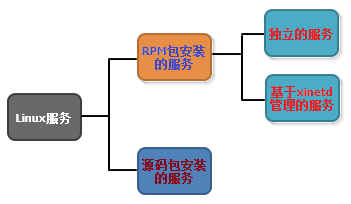
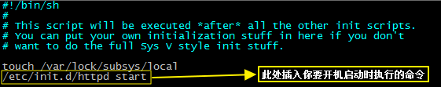
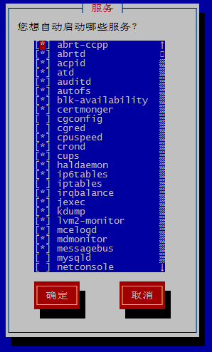
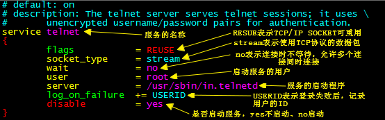
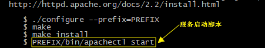
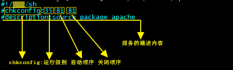

# 服务分类
根据软件安装方式的不同，我们将Linux服务分为了两类：`RPM包安装的服务`和`源码包安装的服务`，其中**RPM包安装的服务**按照管理方式的不同又可以分为：`独立的服务`和`基于xinetd管理的服务`。 

# 独立服务管理
我们使用RPM包安装的大多数软件所提供都是独立服务，例如`Apache服务`，在默认的情况下，这些软件在安装时都会按照约定去存放文件，例如：启动脚本统一存放在`/etc/init.d`目录下。

## 独立服务的启动
独立服务软件的启动脚本都存放在`/etc/init.d`目录下，所以我们可以通过下面的方式来启动或者停止服务。

	/etc/init.d/[独立服务名] [start|stop|status|restart]

在RETHAT系列的Linux还提供了一个`service`命令，用来简化独立服务的启动管理。

	service [独立服务名] [start|stop|status|restart]

## 独立服务的自启动
设置独立服务是否开机启动有以下三种方法：

**1）**使用chkconfig命令，命令语法：`chkconfig [--level 运行级别] [服务名] [on|off]`。

	//查看所有服务的自启动状态
	chkconfig --list
	//将Apache服务的2345运行级别设置为开机自启动
	chkconfig --level 2345 httpd on

**2）**修改`/etc/rc.d/rc.local`文件（Linux系统在启动后会自动执行`rc.local`文件中的命令）。

以Apache服务开机自启动为例，可在`rc.local`文件中增加如下命令：  

	/etc/init.d/httpd start

**3）**如果是在RETHAT系列的Linux中，还可以使用`ntsysv`命令管理自启动服务。

`ntsysv`图形化界面如下图所示，使用空格键进行切换，`*`代表开机自启动。 

# 基于xinetd管理的服务
在Linux中有些软件服务是通过`xinetd`服务进行管理的，例如`telnet`服务和`rsync`服务，这类软件在存放文件时也会遵循一定的规则，如下表所示。 

<table border="1" cellpadding="0" cellspacing="0" style="width:421px;"><tbody><tr><td style="text-align:center;width:129px;">目录</td><td style="text-align:center;width:292px;">用途</td></tr><tr><td style="text-align:center;width:129px;">/etc/xinetd.conf</td><td style="text-align:center;width:292px;">xinetd配置文件安装目录</td></tr><tr><td style="text-align:center;width:129px;">/etc/xinetd.d</td><td style="text-align:center;width:292px;">xinetd服务的启动脚本安装目录</td></tr></tbody></table>

## 安装xinetd服务
现在，基于xinetd管理的服务已经变得越来越少了，这就导致了在新版本的Linux中已默认不再安装xinetd服务，如果需要使用该服务需进行安装。

	//使用yum安装xinetd服务
	yum -y install xinetd

## 基于xinetd管理服务的启动和自启动
基于xinetd管理的服务并不会像独立服务那样区分启动和自启动，这两个状态在xinetd中其实共用的是同一个状态，即：一个服务如果启动了，那它就是自启动状态的；如果服务未启动，那么它就不是自启动状态。

使用xinetd对某一个服务的启动或自启动进行管理，有以下三种方式：

**1）**修改`/etc/xinetd.d`目录下服务所对应的配置文件

以`telnet`服务为例，需修改`/etc/xinetd.d/telnet`配置文件，若将配置文件中的`disable`属性设置为`no`，则表示在xinetd服务启动的时候将自动启动telnet服务。

配置文件修改完成之后，需重启xinetd服务。

	//重启xinetd服务
	service xinetd restart

**2）**使用`chkconfig`命令，命令语法：`chkconfig [--level 运行级别] [服务名] [on|off]`。

	//将Telnet服务的2345运行级别设置为启动或开机自启动
	chkconfig --level 2345 telnet on

**3）**在RETHAT系列的Linux中，基于xinetd管理的服务也可以使用`ntsysv`命令来进行管理。

# 源码包服务管理

## 源码包服务启动
使用源码包安装的服务需调用服务对应的启动脚本来进行启动，不同软件的启动脚本不同，可以通过查看源码包中的安装说明`INSTALL`文件来获得。

以下是Apache服务的安装说明，从中我们可以了解到服务的启动脚本为：`[服务安装目录]/bin/apachectl start`

## 源码包服务的自启动
源码包服务的自启动状态也可以通过修改`/etc/rc.d/rc.local`文件来进行配置，配置方式与独立服务相同。

## 让源码包服务能被service管理
在`/etc/init.d`目录下创建一个源码包服务的启动脚本的软链接文件，可以让`service`命令在调用该软链接文件启动或停止服务的时候自动调用源码包服务的启动脚本去执行，这样就能够用`service`命令来管理源码包服务了。

	//为Apache源码包服务的启动脚本在/etc/init.d目录下创建软链接文件apache
	ln -s /usr/local/apache/bin/apachectl /etc/init.d/apache
	//软链接创建完成之后，通过service管理Apache源码包服务
	//启动Apache服务
	service apache start
	//停止Apache服务
	service apache stop

## 让源码包服务能被chkconfig与ntsysv管理
在源码包服务能被`service`管理了以后，通过修改在`/etc/init.d`目录下创建的软链接文件可以让源码包服务能被`chkconfig`与`ntsysv`管理，具体步骤如下。

首先修改软链接文件，增加如下注释：

	#chkconfig:35 81 81 
	#description:source package apache

各字段含义如下图所示：

其中启动顺序和关闭顺序不能与系统中已经存在的服务的顺序号重复，在`/etc/rc.d/rc[运行级别0-6].d`目录下可以查看该运行级别下已存在的服务的启动和关闭顺序。其中`S[启动顺序号][服务名]`表示的是服务的启动顺序号，`K[关闭顺序号][服务名]`表示的是服务的关闭顺序号。

软链接修改完成之后，执行以下命令将服务加入到`chkconfig`命令的管理序列。

	//将apache服务加入到chkconfig命令的管理序列
	chkconfig --add apache