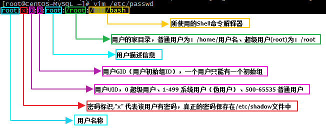
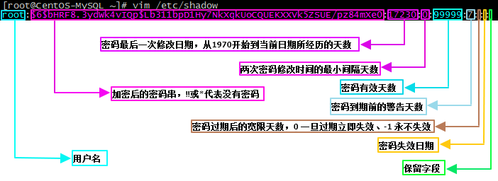
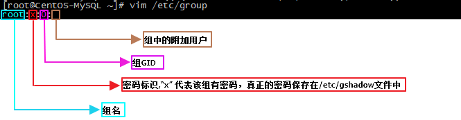
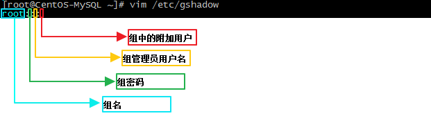
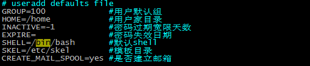

# 配置文件
在Linux系统中主要是通过配置文件来实现对用户和用户组的管理，比较重要的有以下四个配置文件：
`/etc/passwd`（用户信息文件）、`/etc/shadow`（用户密码文件、影子文件）、`/etc/group`（组信息文件）、`/etc/gshadow`（组密码文件）。

## 用户信息文件
在`/etc/passwd`文件中保存了Linux系统中所有用户的基本信息，使用`man 5 passwd`命令查看该配置文件的帮助，可知该配置文件中的每条记录都包含以下七个字段：`account:password:UID:GID:GECOS:directory:shell`，各个字段的含义如下图所示。 

## 用户密码文件
`/etc/shadow`文件中存储了用户的密码信息，包含的内容如下图所示。 

在`/etc/shadow`配置文件中日期字段需使用时间戳来表示，即从`1970年1月1日`到指定日期之间所经历的天数，下面给出其换算方法。  

	//把时间戳换算为日期：14781为需要换算的时间戳
	date -d "1970-01-01 14781 days" "+%Y/%m/%d %H:%M:%S" 
	//把日期换算为时间戳：2017/09/10为需要换算为时间戳的日期
	echo $(($(date --date="2017/09/10" +%s)/86400+1))

## 组信息文件
在`/etc/group`文件中保存了Linux系统中所有用户组的信息，其内容各字段及其含义如下图所示。 

## 组密码文件
在`/etc/gshadow`文件中保存了用户组的密码信息，其内容各字段及其含义如下图所示。 

# 用户管理命令
## useradd
**命令用途**：`添加新用户。`

**命令语法**：`useradd[选项][用户名]`

**常用选项**：

	-u：指定用户的UID；
	-d：指定用户的家目录；
	-c：指定用户的描述内容；
	-g：指定用户的初始组；
	-G：指定用户的附加组；
	-s：指定用户的登录shell，默认为/bin/bash； 

**用法示例**：

	//新添加一个用户user1，并指定其UID、家目录、描述内容、附加组
	useradd -u 567 -d /user1 -c "this is a test user" -G group1 user1
	//执行以上命令以后会在/etc/passwd配置文件中增加以下user1内容
	user1:x:567:567:this is a test user:/user1:/bin/bash

使用`useradd`命令在添加用户时对于那些未设置值的字段，系统会根据`/etc/default/useradd`文件中指定的默认值进行设置。  

新用户在创建时一般情况下会自动创建以下用户相关文件：

**1、**用户的家目录

- 普通用户：/home/用户名/，默认所有者和所属组为此用户及其初始组，权限700；
- 超级用户：/root/，默认所有者和所属组为root用户和root组，权限550；

**2、**用户的邮箱文件，默认文件名：`/var/spool/mail/用户名`

**3、**用户模板目录`/etc/skel/`，添加新用户时，会自动将模板目录下的文件复制到添加的新用户的家目录。

## passwd
**命令用途**：`设置用户密码。`

**命令语法**：`passwd[选项][用户名]`

**常用选项**：

	-S：查询用户的密码状态，仅root用户可用；
	-l：暂时锁定用户，仅root用户可用；
	-u：解锁用户，仅root用户可用；
	--stdin：将管道符输出的内容作为用户密码；

**用法示例**：

	//修改用户user1的密码为123
	echo "123" | passwd --stdin user1
	//暂时锁定user1用户
	passwd -l user1
	//解锁user1用户
	passwd -u user1

## usermod
**命令用途**：`修改用户信息。`

**命令语法**：`usermod[选项][用户名]`

**常用选项**：

	-u：修改用户的UID；
	-d：修改用户的家目录；
	-c：修改用户的描述内容；
	-g：修改用户的初始组；
	-G：修改用户的附加组；
	-s：修改用户的登录shell；
	-L：临时锁定用户；
	-U：解锁用户； 

**用法示例**：

	//修改user1用户的UID、家目录、描述内容三个字段的值
	usermod -u "666" -d /home/user1 -c "user1" user1
	//暂时锁定user1用户
	usermod -L user1
	//解锁user1用户
	usermod -U  user1

## chage
**命令用途**：`修改用户密码状态。`

**命令语法**：`chage[选项][用户名] `

**常用选项**：

	-l：列出用户的详细密码状态；
	-d：修改密码的最后一次修改日期；
	-m：修改密码的最小修改时间间隔天数；
	-M：修改密码有效期；
	-W：修改密码过期前警告天数；
	-I：修改密码过期后宽限天数；
	-E：修改密码失效日期； 

**用法示例**：

	//修改密码的最后修改日期为1970年1月1日
	chage -d 0 user1

## userdel
**命令用途**：`删除用户。`

**命令语法**：`userdel[选项][用户名]`

**常用选项**：

	-r：删除用户的同时删除用户家目录； 

**用法示例**：

	//删除用户user1
	userdel -r user1

## id
**命令用途**：`查看用户的UID和GID。`

**命令语法**：`id[用户名]`

**用法示例**：

	//查看用户user1的UID和GID信息
	id user1

su
**命令用途**：`切换用户。`

**命令语法**：`su[选项][用户名]`

**常用选项**：

	-：连带用户的环境变量一起切换；
	-c：仅执行一次命令； 

**用法示例**：

	//切换到root用户身份
	su - root
	//切换到root用户身份添加一个用户user1
	su - root -c "useradd user1"

## who
**命令用途**：`显示当前登录系统的所有用户的信息。`

**命令语法**：`who`

	//查看当前登录系统的用户信息（登录用户+登录终端+登录时间[+远程主机的IP地址]）
	who
	root			tty1          2013-08-19 13:29
	root			pts/0	      2013-08-19 15:04 (192.168.0.134) 
	pengjunlee	        pts/1	      2013-12-20 10:37 (180.111.155.40)

注：`tty`表示本地终端登录，`pts`表示远程终端登录。  

## w
**命令用途**：`与who类似，显示当前登录系统的所有用户的更为详细的信息。`

**命令语法**：`w`

	//显示当前登录系统的用户的详细信息
	w
	18:18:18 up  8:37,  3 users,  load average: 0.00, 0.00, 0.00
	USER        TTY          FROM   LOGIN@     IDLE    JCPU   PCPU    WHAT
	root        tty1          -     18:18      16.00s  0.01s  0.01s   -bash
	root        pts/0    192.168.12.1          09:46      20:47   0.55s   0.55s   -bash
	pengjunlee  pts/1    192.168.12.1          18:05      0.00s   0.12s   0.09s    w

注：使用w命令显示的内容依次为：登录用户、登录终端、登录IP、登录时间、空闲时间、累计占用CPU时间、当前操作占用的CPU时间和当前正在执行的操作。  

# 用户组管理命令
## groupadd
**命令用途**：`创建新的用户组。`

**命令语法**：`groupadd[选项][组名]`

**常用选项**：

	-g：指定用户组的GID； 

**用法示例**：

	//添加一个default_group组，并指定其GID为600
	groupadd -g 600 default_group

## groupmod
**命令用途**：`修改用户组信息。`

**命令语法**：`groupmod[选项][组名]`

**常用选项**：

	-g：修改用户组的GID；
	-n：修改用户组的组名； 

**用法示例**：

	//修改组group1的组名为default_group
	groupmod -n  default_group group1

## groupdel
**命令用途**：`删除用户组。`

**命令语法**：`groupdel[组名]`

**用法示例**：

	//删除group1用户组
	groupdel group1

## gpasswd
**命令用途**：`gpasswd命令用于向组中添加或删除用户。`

**命令语法**：`gpasswd[选项][组名]`

**常用选项**：

	-a：添加用户；
	-d：删除用户； 

**用法示例**：

	//将用户user1添加到goup1组中
	gpasswd -a user1 group1
  