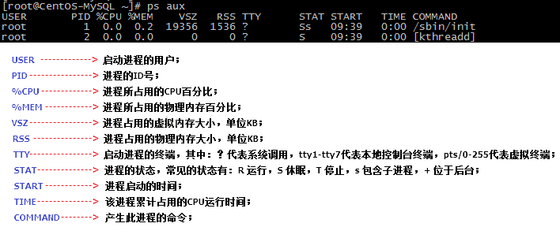
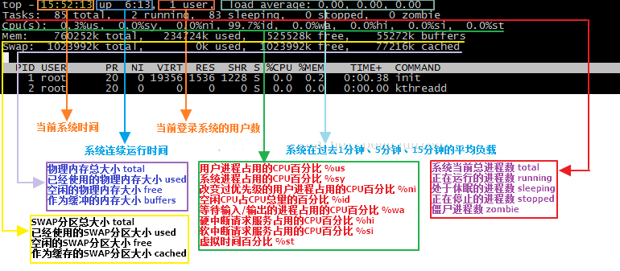
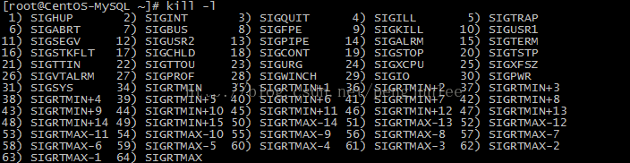

# 查看进程
## ps
**命令用途**：查看系统进程的状态。
**命令语法**：ps [选项]
**常用选项**：

	a：显示所有进程；
	u：以用户为主的格式进行显示；
	x：不以终端机来区分；
	e：列出程序时，显示每个程序所使用的环境变量。
	-A：显示所有进程；
	-e：显示所有进程；
	-f：显示UID,PPID,C与STIME字段。
	-l：显示F,S,PRI,NI,ADDR,SZ,WCHAN字段。 

**用法示例**：

	//使用BSD系统命令格式，查看所有进程
	ps aux
	//使用Linux标准命令格式，查看所有进程
	ps -efl

下图详细列出了使用`ps aux`命令所查看到的内容各字段所代表的含义。  

## top
**命令用途**：`查看系统运行的状态。`
**命令语法**：`top [选项]`
**常用选项**：

	-d：指定屏幕刷新时间间隔，单位秒，默认3秒； 

**用法示例**：

	//查看系统运行状态，设置屏幕每两秒刷新一次
	top -d 2

**交互模式**：

	？或h：显示**交互模式**的帮助；
	P：按照CPU使用率排序，默认选项；
	M：按照内存的使用率排序；
	N：按照PID排序；
	q：退出；

下图详细列出了使用top命令所查看到的内容各字段所代表的含义。  

## pstree
**命令用途**：`以树状图的方式展现进程之间的派生关系。`
**命令语法**：`pstree [选项]`
**常用选项**：

	-p：显示进程的PID；
	-u：显示进程所属的用户； 

**用法示例**：

	//查看进程树，并显示PID号
	pstree -up

# 终止进程
## kill
**命令用途**：`根据进程PID来结束进程`。

**命令语法**：`kill [信号量]  [PID]`

**常用信号量**：

	1（SIGHUP）：重启进程；
	9（SIGKILL）：强制结束；
	15（SIGTERM）：正常结束；

**用法示例**：

	//强制结束PID为45548的进程
	kill -9 45548
	//重启PID为14845的进程
	kill -1 14845

使用`kill -l`命令可以查看kill命令支持的所有信号量，如下图所示。  

## killall

**命令用途**：`根据进程名来结束进程。`

**命令语法**：`killall [选项][信号量] [进程名]`

**常用选项**：

	-i：交互式，杀死进程前会询问确认；
	-I：忽略进程名的大小写； 

**用法示例**：

	//结束进程名称为httpD（不区分大小写）的进程，结束进程前询问确认
	killall -iI httpD

## pkill
**命令用途**：`pkill命令和killall命令类似，根据进程名来结束进程。`

**命令语法**：`pkill[选项][信号量]  [进程名] `

**常用选项**：

	-t：根据终端号踢出用户； 

**用法示例**：

	//踢出终端号为tty1的用户
	pkill -9 -t tty1

# 后台进程
将一个普通进程放入后台执行有以下两种方式：

- 在执行的命令后面跟一个`&`符号，进程会被放入后台继续执行；
- 命令执行过程中，按下`ctrl+z`快捷键，进程会被放入后台，进入停止状态； 

## jobs
**命令用途**：`查看任务列表及任务的状态。`

**命令语法**：`jobs[选项]`

**常用选项**：

	-l：显示进程号；
	-r：显示运行状态（running）的任务；
	-s：显示停止状态（stoped）的任务；

**用法示例**：

	//查看任务列表，并显示进程号
	jobs -l

## fg
**命令用途**：`将任务列表中的任务恢复到前台执行。`

**命令语法**：`fg [%任务号] `

**用法示例**：

	//将任务号为1的任务恢复到前台执行
	fg %1

## bg
**命令用途**：`将任务列表中的任务恢复到后台执行。`

**命令语法**：`bg [%任务号] `

**用法示例**：

	//将任务号为2的任务恢复到后台执行
	bg %2

# 定时任务
## crond
在`Linux`中如果要使用定时任务功能需先开启`crond`服务。 

	//开启crond服务
	service crond start
	//设置crond服务开机自启动
	chkconfig --level 2345 crond on

## crontab
**命令用途**：`管理定时任务。`

**命令语法**：`crontab [选项]`

**常用选项**：

	-l：查看当前用户的定时任务；
	-e：编辑定时任务表；
	-r：删除当前用户所有的定时任务； 

**用法示例**：

	//查看当前用户的定时任务
	crontab -l
	//删除当前用户的所有定时任务
	crontab -r
	//编辑定时任务表
	crontab -e

在创建定时任务时，需使用Cron表达式来设置任务的执行时间和周期，Cron表达式用五个`*`星号来分别表示分钟、小时、天、月、周，各个`*`星号的具体含义如下表。 

<table border="1" cellpadding="0" cellspacing="0" style="width:486px;"><tbody><tr><td style="text-align:center;width:108px;">项目</td><td style="text-align:center;width:210px;">含义</td><td style="text-align:center;width:168px;">取值范围</td></tr><tr><td style="text-align:center;width:108px;">第一个“<strong>*</strong>”</td><td style="text-align:center;width:210px;">一小时当中的第几分钟</td><td style="text-align:center;width:168px;">0-59</td></tr><tr><td style="text-align:center;width:108px;">第二个“<strong>*</strong>”</td><td style="text-align:center;width:210px;">一天当中的第几小时</td><td style="text-align:center;width:168px;">0-23</td></tr><tr><td style="text-align:center;width:108px;">第三个“<strong>*</strong>”</td><td style="text-align:center;width:210px;">一月当中的第几天</td><td style="text-align:center;width:168px;">1-31</td></tr><tr><td style="text-align:center;width:108px;">第四个“<strong>*</strong>”</td><td style="text-align:center;width:210px;">一年当中的第几月</td><td style="text-align:center;width:168px;">1-12</td></tr><tr><td style="text-align:center;width:108px;">第五个“<strong>*</strong>”</td><td style="text-align:center;width:210px;">一周当中的星期几</td><td style="text-align:center;width:168px;">0-7（0和7都代表星期日）</td></tr></tbody></table>

以下是一些Cron表达式的示例用法。

	//每个星期一和星期二的晚上10点45分执行一次
	45 22 * * 1,2
	//每隔10分钟执行一次
	*/10 * * * *
	//每周一和每个月的1号、15号的0点0分执行一次
	0 0 1,15 * 1
	//每周一到周五的上午7点40分执行一次
	40 7 * * 1-5
	定时任务设置语法：Cron表达式 [要执行的命令]
	
	//每隔一分钟向/test/cron.log文件末尾写入数字1
	*/1 * * * * /bin/echo 1 >> /test/cron.log

# 系统监控
## vmstat
**命令用途**：`查看进程、内存、IO等系统整体运行状态。`

**命令语法**：`vmstat [刷新延时] [刷新次数] `

	//查看系统运行状态，每隔3秒刷新一次，刷新两次
	vmstat 3 2

## dmesg
**命令用途**：`查看系统开机时的内核检测信息。`

**命令语法**：`dmesg`

	//查看系统自检信息中与“CPU”相关的内容
	dmesg | grep CPU

## free
**命令用途**：`查看系统内存使用状态。`

**命令语法**：`free [选项]`

**常用选项**：

	-b：以字节为单位显示；
	-k：以KB为单位显示，默认选项；
	-m：以MB为单位显示；
	-g：以GB为单位显示； 

**用法示例**：

	//查看系统内存使用状态，以MB为单位显示
	free -m

注：使用`cat /proc/cpuinfo`命令，可以查看更为详细的CPU信息。  

## uname
**命令用途**：`查看系统内核相关信息。`

**命令语法**：`uname[选项]`

**常用选项**：

	-a：查看所有系统内核相关信息；
	-r：查看系统内核版本；
	-s：查看系统内核名称； 

**用法示例**：

	//查看所有系统内核相关信息；
	uname -a

注:使用file命令查看任意系统外部命令文件可以用来查看当前系统的位数，例如`file /bin/ls`，使用lsb_release -a命令可以查看当前系统的发行版本。 

## lsof
**命令用途**：`查看进程所打开的文件。`

**命令语法**：`lsof[选项] [进程名|PID]`

**常用选项**：

	-c：根据进程名查看；
	-p：根据进程PID查看；
	-u：查看与指定用户相关的进程； 

**用法示例**：

	//查看进程init打开的文件
	lsof -c init
	//查看进程962打开的文件
	lsof -p 962
	//查看与root用户相关的进程打开的文件
	lsof -u root
  