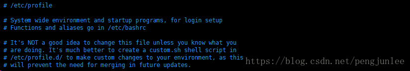

在`Linux`系统中，环境变量按照其作用范围不同大致可以分为系统级环境变量和用户级环境变量。

- 系统级环境变量：每一个登录到系统的用户都能够读取到系统级的环境变量
- 用户级环境变量：每一个登录到系统的用户只能够读取属于自己的用户级的环境变量 

自然而然地，环境变量的配置文件也相应的被分成了系统级和用户级两种。

# 系统级
## /etc/profile
在系统启动后第一个用户登录时运行，并从`/etc/profile.d`目录的配置文件中搜集`shell`的设置，使用该文件配置的环境变量将应用于登录到系统的每一个用户。

提示：在Linux系统中，使用以下命令可以使配置文件立刻生效。

	source /etc/profile
	echo $PATH

## /etc/bashrc（Ubuntu和Debian中是/etc/bash.bashrc）
在`bash shell`打开时运行，修改该文件配置的环境变量将会影响所有用户使用的`bash shell`。

注意：这里的`bash shell`有不同的类别，不同的类别所使用的环境变量配置文件也有所不同。一般情况下，非登录`shell`不会执行任何`profile`文件，非交互`shell`模式不会执行任何`bashrc`文件。

	# 登录shell和非登陆shell：
	登录shell # 需要输入用户密码，例如 ssh 登录或者 su - 命令提权都会启动login shell模式
	非登陆shell # 无需输入用户密码；
	 
	# 交互shell和非交互shell：
	交互shell # 提供命令提示符等待用户输入命令的是交互shell模式
	非交互shell # 直接运行脚本文件是非交互shell模式

## /etc/environment
在系统启动时运行，用于配置与系统运行相关但与用户无关的环境变量，修改该文件配置的环境变量将影响全局。

# 用户级
## ~/.profile（推荐首选）
当用户登录时执行，每个用户都可以使用该文件来配置专属于自己使用的shell信息。

## ~/.bashrc
当用户登录时以及每次打开新的`shell`时该文件都将被读取，不推荐在这里配置用户专用的环境变量，因为每开一个`shell`，该文件都会被读取一次，效率肯定受影响。

	~/.bash_profile 或 ~./bash_login
	~/.bash_profile or ~./bash_login - If one of these file exist, bash executes it rather then "~/.profile" 
	when it is started as a login shell. (Bash will prefer "~/.bash_profile" to "~/.bash_login"). 
	However, these files won't influence a graphical session by default.

以上是`ubuntu`官网给出的关于`~/.bash_profile`和`~./bash_login`的说明，翻译为中文：

	~/.bash_profile 或 ~./bash_login - 
	如果有其中的一个文件存在的话, 当启动的是一个 登录shell时，Bash 会执行该文件而不会执行~/.profile ；
	如果两个文件都存在的话，Bash 将会优先执行~/.bash_profile 而不是~/.bash_login ； 
	然而, 默认情况下，这些文件不会影响图形会话。

## ~/.bash_logout
当每次退出系统(退出`bash shell`)时执行该文件。

注意：`Linux`系统使用`$VARIABLE_NAME`访问环境变量，多个环境变量之间使用`:`分隔，`Windows`系统使用`%VARIABLE_NAME%`访问环境变量，多个环境变量之间使用`;`分隔。

一般情况下，`Linux`加载环境变量配置文件的执行顺序为：

	==> /etc/profile
	==> ~/.bash_profile | ~/.bash_login | ~/.profile
	==> ~/.bashrc
	==> /etc/bashrc
	==> ~/.bash_logout
 