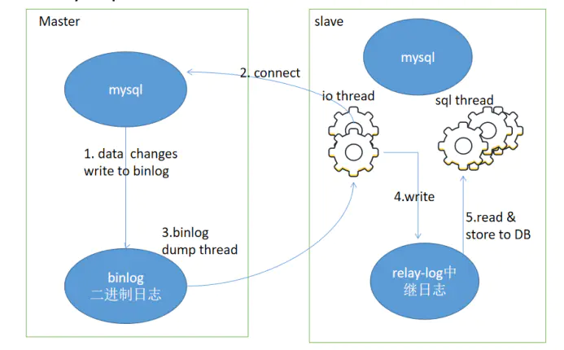
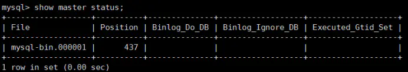

> 原文链接：<https://www.jianshu.com/p/17f0053a9426>

最近在做性能优化的系列课程，其中MySQL数据优化部分用到了主从复制，在这里和大家分享下实现原理以及配置步骤。

# 概念
`MySQL`主从复制是指数据可以从一个MySQL数据库服务器主节点复制到一个或多个从节点。`MySQL`默认采用异步复制方式，这样从节点不用一直访问主服务器来更新自己的数据，数据的更新可以在远程连接上进行，从节点可以复制主数据库中的所有数据库或者特定的数据库，或者特定的表。

# 目的
## 数据同步备份
主库master发生故障后，可以马上切换到从库slave，降低服务风险。
## 读写分离
可以把写操作放在master，读取操作放在slave，减轻单一数据库的操作压力
## 高可用HA
随着系统中业务访问量的增大，如果是单机部署数据库，就会导致I/O访问频率过高。有了主从复制，增加多个数据存储节点，将负载分布在多个从节点上，降低单机磁盘I/O访问的频率，提高单个机器的I/O性能。

# 基本原理
master记录下自己的操作日志，授权从服务器可以读取操作日志，slave会开启两个线程。

## IO线程
负责连接master 连接成功后，睡眠并等待master产生新的事件，有新的就保存到自己的中继日志中，中继日志通常位于操作系统的缓存中，所以开销很小。
## sql进程
负责执行中继日志中的sql操作，这样slave的内容就和master的一致了。

# 执行步骤

# 主从复制原理

1. 主库db的更新事件(update、insert、delete)被写到binlog
2. 从库发起连接，连接到主库
3. 主库创建一个binlog dump thread线程，把binlog的内容发送到从库
4. 从库启动之后，创建一个I/O线程，读取主库传过来的binlog内容并写入到relay log.
5. 还会创建一个SQL线程，从relay log里面读取内容，从Exec_Master_Log_Pos位置开始执行读取到的更新事件，将更新内容写入到slave的db.

# 配置方式
## 前提条件
停止对master数据库的操作，把master中的数据库全部导入到slave，使两边数据库完全一致。

## 配置master
**1)** 修改master的配置文件，使用二进制日志，指定`server-id`，重启服务。目的是让各自都有了自己的唯一标示，并以二进制文件格式进行交流。Centos中路径为`/etc/my.cnf`。

	[mysqld]
	log_bin=mysql-bin //[必须]启用二进制日志
	server-id=10//[必须]服务器唯一ID，默认是1，一般取IP最后一段

配置完成后需要重启`mysqlserver`才能生效。

**2)** 创建授权用户
登陆主服务器`mysql`命令行，创建一个用于从服务器复制的用户。

	mysql>GRANT REPLICATION SLAVE ON *.* to 'root'@'%' identified by '123456'; 

`.`表示对所有库的所有操作，`%`表示所有客户端都可能连，也可用具体客户端IP代替，如`192.168.33.11`，加强安全。

**3)** 记录master 状态信息
查看二进制日志文件名，及最新位置。让slave知道用哪个用户信息访问master，知道读取哪个日志文件，及从哪儿开始读。

	mysql>show master status;
	

其中`file`、`position`字段需要记录下值，`mysql-bin.000001`是用于主从复制的文件名，`437`是日志文件内的最新位置。

## 配置slave
**1)** 修改配置文件`my.cnf`，使用二进制日志，指定`server-id`，重新启动服务。

	[mysqld]
	log_bin=mysql-bin 
	server-id=11

**2)** 将slave指向master
登陆从服务器mysql命令行，使用之前创建的用户和master的日志文件及其位置。slave中使用被授权用户信息及日志文件信息，进行指向master。这时已经建立了和master的联系，明确了从哪儿读取日志文件。

	mysql>change master to master_host='192.168.33.10',master_user='root',master_password='123456',master_log_file='mysql-bin.000001',master_log_pos=437;
	//注意不要断开，“437”无单引号。

**3)** 启动slave

	mysql>start slave;

**4)** 查看slave状态

	mysql> show slave status\G;

结果中有两个重要数据项：

	Slave_IO_Running: Yes IO线程状态，必须YES
	Slave_SQL_Running: Yes SQL线程状态，必须YES

常见的问题是SQL线程没有正常工作`Slave_SQL_Running: No`。通常是两边的数据库不是完全对应的，需要确保master上的库及到目前为止的最新记录都复制到slave上了。

## 验证测试
当IO线程和SQL线程都正常后，到master中随意测试下插入、修改、删除操作，同时到slave中检查。

# 总结
至此就完成了`Mysql server`的主从复制，还是很简单易用的。大家可以弄两台虚机环境实际搭建测试下。