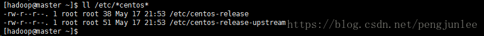

> 原文链接：<https://blog.csdn.net/ZZY1078689276/article/details/77716871>

# 查看版本号
`CentOS`的版本号信息一般存放在配置文件当中，在`CentOS`中，与其版本相关的配置文件中都有`centos`关键字，该文件一般存放在`/etc/`目录下，所以说我们可以直接在该文件夹下搜索相关的文件。

	ll /etc/*centos*

查看的结果：

其中存放其版本配置信息的文件为`centos-release`，翻译过来就是`CentOS的发行版`，所以说我们可以在这里查看`CentOS`相应的版本信息。

查看CentOS的版本号：

	cat /etc/centos-release

显示结果：

	CentOS Linux release 7.3.1611 (Core)

# 查看内核版本
查询操作系统内核版本信息为：

	uname -r

查询结果：

	3.10.0-514.26.2.el7.x86_64

# 查看操作系统位数
查看指令为：

	getconf LONG_BIT

显示的结果为：

	64