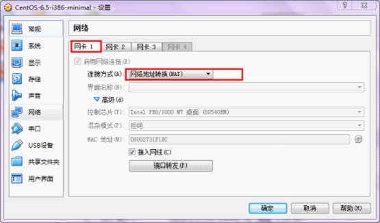
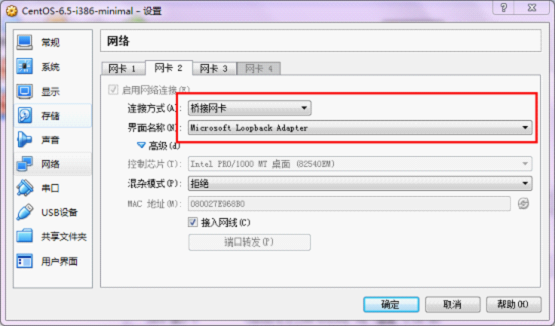
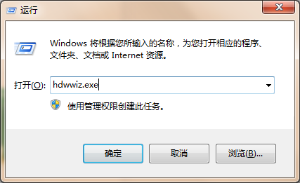
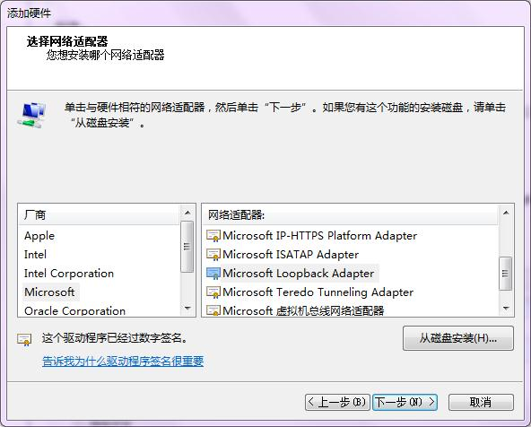
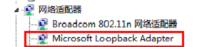
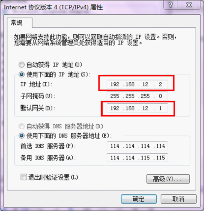

> 原文链接：<https://yq.aliyun.com/articles/33284>

# 虚拟机网络配置
默认只是设置了**网卡1**：方式`NAT`（对应`ifcfg-eth0`）

我们还可以设置**网卡2**，**网卡3**。可以在系统安装完成后设置。
网卡2设置回环网卡，实现虚拟机与宿主机组成局域网（对应`ifcfg-eth1`），这样即使没有路由器也可以组成局域网，可以进行`ssh`连接。

需要宿主机安装`Microsoft Loopback Adapter`。参照附录。
**网卡3**设置连接到互联网，并与宿主机组成局域网（对应`ifcfg-eth2`）。需要依赖网络，且有真实路由器。

# Centos里网卡配置
进入`/etc/sysconfig/network-scripts`目录，默认只有`ifcfg-eth0`。
复制`ifcfg-eth0`为`ifcfg-eth1`，修改为：

	DEVICE=eth1
	 
	#HWADDR=08:00:27:31:F1:DC
	 
	TYPE=Ethernet
	 
	#UUID=b8f8e76e-1f8b-4cf5-9261-493bfc6b04ef
	 
	ONBOOT=yes
	 
	NM_CONTROLLED=yes
	 
	BOOTPROTO=static
	 
	IPADDR="192.168.12.10"
	 
	GATEWAY="192.168.12.1"

复制`ifcfg-eth0`为`ifcfg-eth2`，修改为：

	DEVICE=eth2
	 
	#HWADDR=08:00:27:31:F1:DC
	 
	TYPE=Ethernet
	 
	#UUID=b8f8e76e-1f8b-4cf5-9261-493bfc6b04ef
	 
	ONBOOT=yes
	 
	NM_CONTROLLED=yes
	 
	BOOTPROTO=dhcp

保存好后，使用命令：`service network restart`重启网络服务，如果`ifcfg-eth1`和`ifcfg-eth2`显示为绿色，说明二者设置成功。

网卡文件内容示例说明：

	DEVICE=eth0                 //指出设备名称
	BOOTPROT=static             //启动类型 dhcp|static
	BROADCAST=192.168.1.203     //广播地址
	HWADDR=00:06:5B:FE:DF:7C    //硬件Mac地址
	IPADDR=192.168.0.2          //IP地址
	NETMASK=255.255.255.0       //子网掩码
	NETWORK=192.168.0.0         //网络地址
	GATEWAY=192.168.0.1         //网关地址
	ONBOOT=yes                  //是否启动时应用
	TYPE=Ethernet               //网络类型

为验证结果，可以输入`ifconfig`进行验证：

	[root@localhost network-scripts]# ifconfig
	 
	eth1      Link encap:Ethernet  HWaddr 08:00:27:E9:68:B0  
	 
	          inet addr:192.168.12.10  Bcast:192.168.12.255  Mask:255.255.255.0
	 
	          inet6 addr: fe80::a00:27ff:fee9:68b0/64 Scope:Link
	 
	          UP BROADCAST RUNNING MULTICAST  MTU:1500  Metric:1
	 
	          RX packets:1682 errors:0 dropped:0 overruns:0 frame:0
	 
	          TX packets:775 errors:0 dropped:0 overruns:0 carrier:0
	 
	          collisions:0 txqueuelen:1000 
	 
	          RX bytes:134511 (131.3 KiB)  TX bytes:109027 (106.4 KiB)
	 
	 
	 
	eth2      Link encap:Ethernet  HWaddr 08:00:27:2E:18:7A  
	 
	          inet addr:192.168.36.85  Bcast:192.168.36.255  Mask:255.255.255.0
	 
	          inet6 addr: fe80::a00:27ff:fe2e:187a/64 Scope:Link
	 
	          UP BROADCAST RUNNING MULTICAST  MTU:1500  Metric:1
	 
	          RX packets:885 errors:0 dropped:0 overruns:0 frame:0
	 
	          TX packets:42 errors:0 dropped:0 overruns:0 carrier:0
	 
	          collisions:0 txqueuelen:1000 
	 
	          RX bytes:72712 (71.0 KiB)  TX bytes:4156 (4.0 KiB)
	 
	 
	 
	lo        Link encap:Local Loopback  
	 
	          inet addr:127.0.0.1  Mask:255.0.0.0
	 
	          inet6 addr: ::1/128 Scope:Host
	 
	          UP LOOPBACK RUNNING  MTU:16436  Metric:1
	 
	          RX packets:12 errors:0 dropped:0 overruns:0 frame:0
	 
	          TX packets:12 errors:0 dropped:0 overruns:0 carrier:0
	 
	          collisions:0 txqueuelen:0 
	 
	          RX bytes:1028 (1.0 KiB)  TX bytes:1028 (1.0 KiB)

能显示出`eth1`和`eth2`说明成功了。

# 附录
`Windows7`上安装微软`Microsoft Loopback Adapter`(回环网卡)的方法

- 单击开始图标，在搜索中输入hdwwiz，在搜索结果中鼠标右键单击该程序，使用`以管理员身份运行`方式来启动。 

- 根据操作系统向导，选择“安装我手动从列表选择的硬件（高级）”。
- 在硬件列表中，选择`网络适配器`。 
- 选择`Microsoft`厂商，并在右边网络适配器列表中选中`Microsoft Loopback Adapter`，下一步按照向导完成安装。

- 安装完成后，查看硬件管理器，会多出一个新网卡，这就是虚拟网卡。

接下来，需要进行些配置：
打开`网络和共享中心`->`更改适配器设置`，找到标识有`Microsoft Loopback Adapter`的那个网络，右键属性，选中 `Internet`协议版本4（`TCP/IPv4`），点击下方属性，编辑为：

这里的网关是我自己定义的，为`192.168.12.1`，当然可以改成其他的，比如`192.168.13.1`。这里宿主机的`IP`是`192.168.12.2`，虚拟机里就不能设置为这个了。这里与虚拟机`eth1`是对应的，`eth1`的IP也源自这里。修改后保存即可。

> 注意：回环网卡最好在设置虚拟机网络之前就设置好。