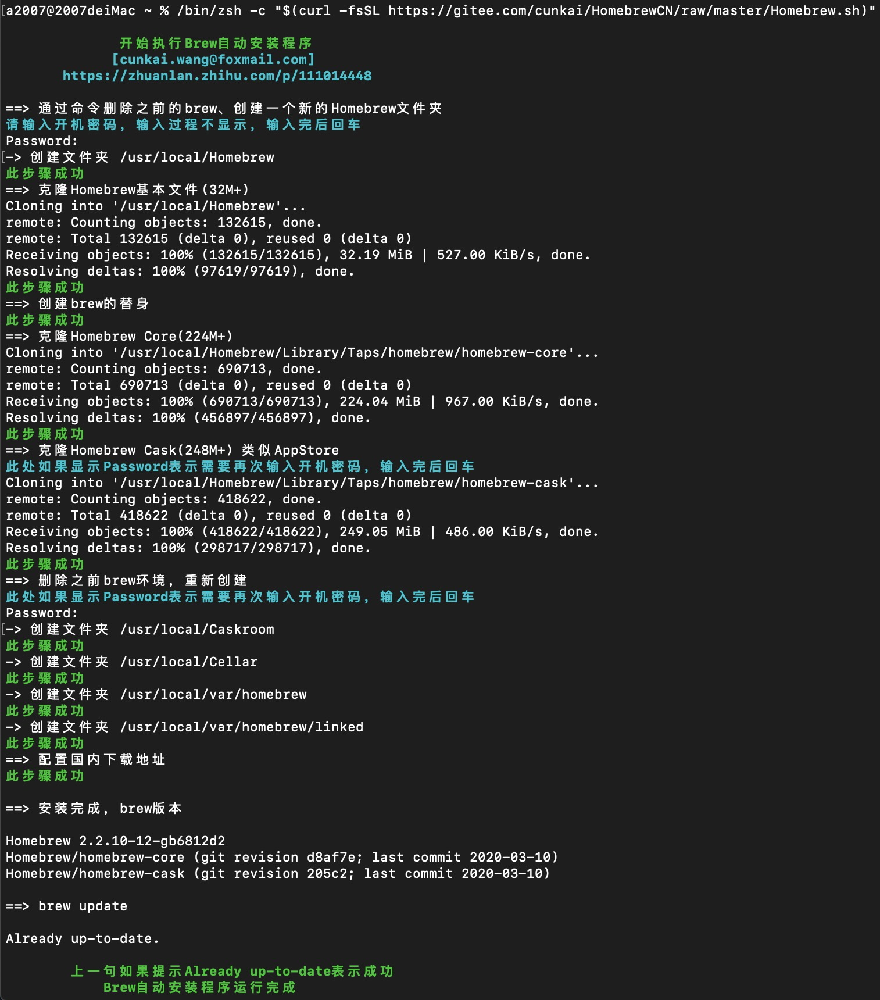
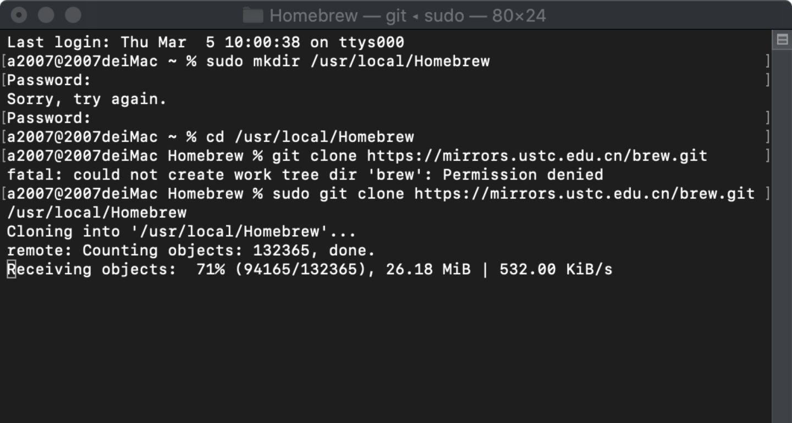
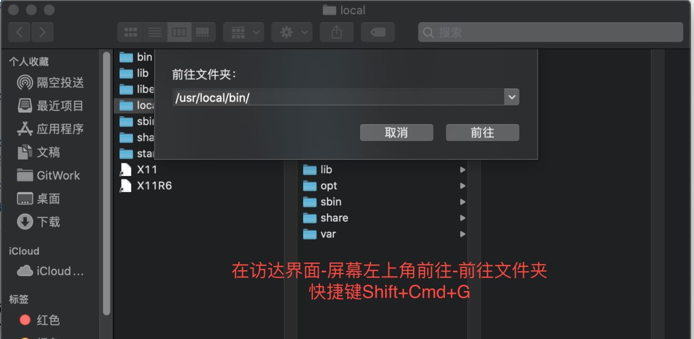

# 自动脚本(全部国内地址)（在Mac os终端中复制粘贴回车下面这句话)
	/bin/zsh -c "$(curl -fsSL https://gitee.com/cunkai/HomebrewCN/raw/master/Homebrew.sh)"

成功的话，如上图所示。

# 手动操作（自动脚本安装完，下面的不需要运行，两种操作方式而已）
**第一步**：通过命令删除之前的brew、创建一个新的Homebrew文件夹

	sudo rm -rf /usr/local/Homebrew
	sudo mkdir /usr/local/Homebrew

回车后，要输入电脑开机密码（输入的密码不会显示出来，输入完正常回车）。

**第二步**：git克隆（速度还是不好看文章尾部的扩展说明-1）

	sudo git clone https://mirrors.ustc.edu.cn/brew.git /usr/local/Homebrew
回车后，会提示`Receiving objects: xx%`等待下载完成。

**第三步**：删除原有的brew，创建一个新的

	sudo rm -f /usr/local/bin/brew
	sudo ln -s /usr/local/Homebrew/bin/brew /usr/local/bin/brew

**第四步**：创建core文件夹、克隆

	sudo mkdir -p /usr/local/Homebrew/Library/Taps/homebrew/homebrew-core
	sudo git clone https://mirrors.ustc.edu.cn/homebrew-core.git /usr/local/Homebrew/Library/Taps/homebrew/homebrew-core

（下面两句非必须操作）如果需要brew-cask的话，运行：

	sudo mkdir -p /usr/local/Homebrew/Library/Taps/homebrew/homebrew-cask
	sudo git clone https://mirrors.ustc.edu.cn/homebrew-cask.git /usr/local/Homebrew/Library/Taps/homebrew/homebrew-cask

**第五步**：删除之前brew环境，重新创建：

	sudo rm -rf /usr/local/var/homebrew/  
	sudo mkdir -p /usr/local/var/homebrew
	sudo chown -R $(whoami) /usr/local/var/homebrew

**最后一步**：获取权限 运行更新（三句话分开运行）

	sudo chown -R $(whoami) /usr/local/Homebrew
	HOMEBREW_BOTTLE_DOMAIN=https://mirrors.tuna.tsinghua.edu.cn/homebrew-bottles
	brew update

显示`Already up-to-date.`表示成功，再进行最后设置（国内下载源）

**最后设置**：设置环境变量，再运行下面两句后，重启终端：

	echo 'export HOMEBREW_BOTTLE_DOMAIN=https://mirrors.ustc.edu.cn/homebrew-bottles' >> ~/.zshrc 
	echo 'export HOMEBREW_BOTTLE_DOMAIN=https://mirrors.ustc.edu.cn/homebrew-bottles' >> ~/.bash_profile

**扩展说明**：可看可不看

1、每一步中的`https://mirrors.ustc.edu.cn/`可以替换为下面任意一个：

- <https://mirrors.aliyun.com/homebrew/>
- <https://mirrors.tuna.tsinghua.edu.cn/git/homebrew/>

如果更换了源依旧速度慢，换下稳定网络，例如手机4G热点或者用网线。

2、看评论说没有git，运行下面这句话，弹出的窗口点安装。（如果提示error表示已经安装）

	xcode-select --install

3、brew有一个自检程序，如果有问题自检试试：

	brew doctor

4、如何去一个目录查看：（在bin下面搜索`brew`确保只有一个）

