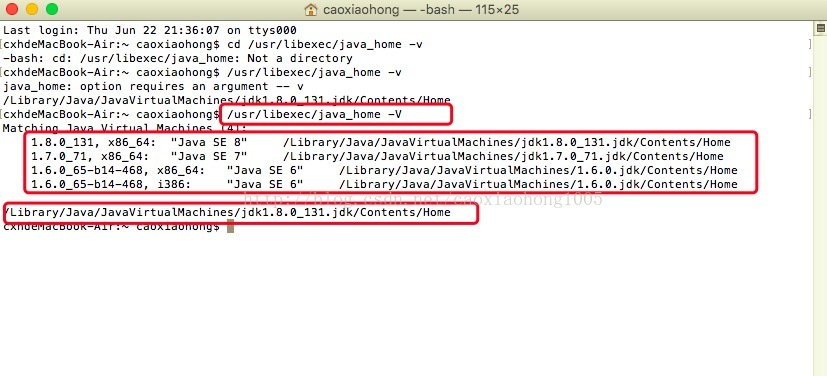

> 原文地址：<https://blog.csdn.net/u011490072/article/details/79329549>

最近在学习JVM，需要运行jdk自带的命令行，需要在特定jdk目录下进行，所以需要查看jdk安装目录，之前也查过，忘记了。这次记录下来为以后备用。

打开终端，输入：

	/usr/libexec/java_home -V

注意：输入命令参数区分大小写(`-v`是不对的，必须是`-V`)

如图，3个红框内依次为：输入命令； 当前Mac已安装jdk目录； Mac默认使用的jdk版本；

 