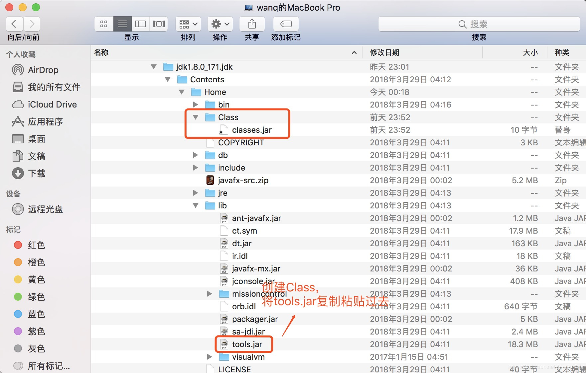

> 原文地址：<https://blog.csdn.net/qq_14811559/article/details/80308434>

编译好的`hadoop3.0.2`的native见<https://download.csdn.net/download/qq_14811559/10413344>

本人的hadoop版本为3.0.0，用3.0.2源码编译的也可以。

# 问题
mac安装`hadoop3.0.0`后报错：WARN util.NativeCodeLoader: Unable to load native-hadoop library for your platform… using builtin-java classes where applicable。

**解决思路**：

打开环境变量配置文件：

	vi ~/.bash_profile

打开`debug`模式，在环境变量中加入:

	export HADOOP_ROOT_LOGGER=DEBUG,console

查看错误信息，`java.library.path`是否是本地库的路径，如果不是，原因一；如果是，直接原因二。

原因一：`lib/native`路径配置问题，解决如下：

修改`/usr/local/Cellar/hadoop/etc/hadoop/hadoop-env.sh`文件（实际路径见你安装hadoop的位置），添加：

	export HADOOP_OPTS="-Djava.library.path=/usr/local/Cellar/hadoop/lib/native"

如果运行正常，没有warn了，问题解决；如果依旧不行，很不幸要编译源码了。

原因二：`brew`安装hadoop后不存在`lib/native`本地库(我遇到的问题)，或者本地库不可用，解决方案：`编译源码`

# 编译hadoop3.0.*
## 下载源码
本机安装的版本是`hadoop3.0.0`，但没找到该版本的源码，所以用的hadoop3.0.2版本的源码，下载地址：`http://hadoop.apache.org/releases.html`。

打开主目录下的`BUILDING.txt`文件，可以看到编译所需环境：

	Requirements:
	 
	* Unix System
	* JDK 1.8
	* Maven 3.3 or later
	* ProtocolBuffer 2.5.0
	* CMake 3.1 or newer (if compiling native code)
	* Zlib devel (if compiling native code)
	* openssl devel (if compiling native hadoop-pipes and to get the best HDFS encryption performance)
	* Linux FUSE (Filesystem in Userspace) version 2.6 or above (if compiling fuse_dfs)
	* Internet connection for first build (to fetch all Maven and Hadoop dependencies)
	* python (for releasedocs)
	* bats (for shell code testing)
	* Node.js / bower / Ember-cli (for YARN UI v2 building)

## JDK环境
在安装hadoop之前，jdk环境已经配置好了，但如果版本不合适，需要重新下载，在环境变量（`～/.bash_profile`）中修改路径就可以了，不需要卸载以前的jdk。

查看jdk版本：

	$ java -version
	java version "1.8.0_171"
	Java(TM) SE Runtime Environment (build 1.8.0_171-b11)
	Java HotSpot(TM) 64-Bit Server VM (build 25.171-b11, mixed mode)

## maven安装
版本没有要求，下载地址：<http://maven.apache.org/download.cgi>

我用的版本是`3.3.3`，在环境变量（`～/.bash_profile`）中配置，路径自行更改：

	export M2_HOME=/usr/local/Cellar/apache-maven-3.3.3
	export PATH=$M2_HOME/bin:$M2_HOME/lib:$PATH

查看是否安装正确：

	$ mvn -version
	Apache Maven 3.3.3 (7994120775791599e205a5524ec3e0dfe41d4a06; 2015-04-22T19:57:37+08:00)
	Maven home: /usr/local/Cellar/apache-maven-3.3.3
	Java version: 1.8.0_171, vendor: Oracle Corporation
	Java home: /Library/Java/JavaVirtualMachines/jdk1.8.0_171.jdk/Contents/Home/jre
	Default locale: zh_CN, platform encoding: UTF-8
	OS name: "mac os x", version: "10.12.6", arch: "x86_64", family: "mac"

## 安装openssl
简单粗暴的用brew：

	brew install openssl

查看是否安装成功：

	$ openssl
	OpenSSL>

注意：在编译时，可能会出现`Apache Hadoop Pipes`编译失败的情况，解决方案就是在环境变量（`～/.bash_profile`）中加入下面的东东：

	export OPENSSL_ROOT_DIR=/usr/local/Cellar/openssl/1.0.2n
	export OPENSSL_INCLUDE_DIR=/usr/local/Cellar/openssl/1.0.2n/include

## 安装cmake

	brew install cmake

查看是否安装成功：

	$ cmake -version
	cmake version 3.11.1

## 安装protocbuf
注意：在`BUILDING.txt`文件中指明要求是`2.5.0`，所以千万不要用brew安装（当然实在闲得*疼，也可以试试）

**（1）**下载`protocbuf2.5.0`，下载地址：<https://download.csdn.net/download/canlets/6878023>
**（2）**解压文件，在该文件的根目录下执行以下几步操作：

	./configure --prefix=/usr/local/Cellar/protobuf

其中，`/usr/local/Cellar/protobuf`是安装目录。

在此说个坑，放在系统文件下有个风险，该文件的拥有者不能是root，否则无法安装，可以将该文件安装到/user/目录下，避免以上问题。但如果因此安装失败了，不要着急，将sudo chown一个拥有者就可以了。

但是-----千万不要更改安装目录，否则。。。自己试着看吧

**（3）**安装：

	make
	make install

**（4）**配置环境变量（～/.bash_profile），增加以下东东：

	export PROTOBUF=/usr/local//Cellar/protobuf
	export PATH=$PROTOBUF/bin:$PATH

**（5）**查看安装是否正确

	$ protoc --version
	libprotoc 2.5.0

## 进入JAVA_HOME目录
`JAVA_HOME`就是你的JDK安装目录 ，`/Library/Java/JavaVirtualMachines/jdk1.8.0_171.jdk/Contents/Home`，创建Class目录，并在`JAVA_HOME`目录下执行软链接：

	sudo ln -s ./lib/tools.jar ./Classes/classes.jar

或者，投机取巧的方法是（本人这样做的，但不建议如此）：

## 进入下载的hadoop3.0.* 源码目录下，执行：

	mvn package -Pdist,native -DskipTests -Dtar
一次编译成功请忽略，但是，如果第一步编译错了，重新编译之前尽量用下面代码清理下：

	mvn clean

如果网速差，比蜗牛还慢，不着急，慢慢等。。。我就花了3个小时呢

最后如果出现`BUILD SUCCESS`，搞定了。。。喝瓶零度庆祝下。。。

## 将lib/native库替换
编译好的`lib/native`库位置：

	hadoop-3.0.2-src/hadoop-dist/target/hadoop-3.0.2/lib/native

复制到你需要的hadoop位置：

	/Users/wanq/Downloads/hadoop-3.0.2-src/hadoop-dist/target/hadoop-3.0.2/lib/native

## 重新启动hadoop，运行正常，不会出现以上warn