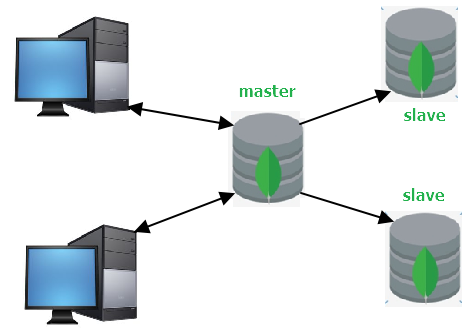
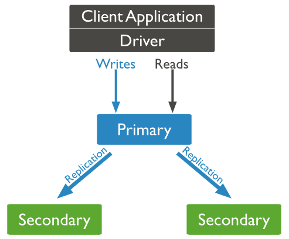

# MongoDB主从复制
主从复制是MongoDB最早使用的复制方式， 该复制方式易于配置，并且可以支持任意数量的从节点服务器，与使用单节点模式相比有如下优点：

- 在从服务器上存储数据副本，提高了数据的可用性， 并可以保证数据的安全性。
- 可配置读写分离,主节点负责写操作,从节点负责读操作,将读写压力分开,提高系统的稳定性。

MongoDB的主从复制至少需要两个服务器或者节点。其中一个是主节点，负责处理客户端请求，其它的都是从节点，负责同步主节点的数据。

主节点记录在其上执行的所有写操作，从节点定期轮询主节点获取这些操作，然后再对自己的数据副本执行这些操作。由于和主节点执行了相同的操作，从节点就能保持与主节点的数据同步。

主节点的操作记录称为`oplog`(operation log)，它被存储在MongoDB的`local`数据库中。oplog中的每个文档都代表主节点上执行的一个操作。需要重点强调的是oplog只记录改变数据库状态的操作。比如，查询操作就不会被存储在oplog中。这是因为oplog只是作为从节点与主节点保持数据同步的机制。

然而，主从复制并非生产环境下推荐的复制方式，主要原因如下两点：

- 灾备都是完全人工的 如果主节点发生故障失败，管理员必须关闭一个从服务器，然后作为主节点重新启动它。然后应用程序必须重新配置连接新的主节点。
- 数据恢复困难 因为oplog只在主节点存在，故障失败需要在新的服务器上创建新的oplog，这意味着任意存在的节点需要重新从新的主节点同步oplog。

因此，在新版本的MongoDB中已经不再支持使用主从复制这种复制方式了，取而代之的是使用副本集复制方式。

# MongoDB副本集
MongoDB副本集（Replica Set）其实就是具有自动故障恢复功能的主从集群，和主从复制最大的区别就是在副本集中没有固定的“主节点；整个副本集会选出一个节点作为“主节点”，当其挂掉后，再在剩下的从节点中选举一个节点成为新的“主节点”，在副本集中总有一个主节点(primary)和一个或多个备份节点(secondary)。

除了primary和secondary之外，副本集中的节点还可以是以下角色：

 <table><tbody><tr><td> 
&nbsp;
 </td><td> 
成为primary
 </td><td> 
对客户端可见
 </td><td> 
参与投票
 </td><td> 
延迟同步
 </td><td> 
复制数据
 </td></tr><tr><td> 
Default
 </td><td> 
√
 </td><td> 
√
 </td><td> 
√
 </td><td> 
∕
 </td><td> 
√
 </td></tr><tr><td> 
Secondary-Only
 </td><td> 
∕
 </td><td> 
√
 </td><td> 
√
 </td><td> 
∕
 </td><td> 
√
 </td></tr><tr><td> 
Hidden
 </td><td> 
∕
 </td><td> 
∕
 </td><td> 
√
 </td><td> 
∕
 </td><td> 
√
 </td></tr><tr><td> 
Delayed
 </td><td> 
∕
 </td><td> 
√
 </td><td> 
√
 </td><td> 
√
 </td><td> 
√
 </td></tr><tr><td> 
Arbiters
 </td><td> 
∕
 </td><td> 
∕
 </td><td> 
√
 </td><td> 
∕
 </td><td> 
∕
 </td></tr><tr><td> 
Non-Voting
 </td><td> 
√
 </td><td> 
√
 </td><td> 
∕
 </td><td> 
∕
 </td><td> 
√
 </td></tr></tbody></table>

关于副本集的基础概念，可以参考：<https://blog.csdn.net/pengjunlee/article/details/83958794>

官方帮助文档：<https://docs.mongodb.com/manual/replication/>

官方推荐的副本集最小配置需要有三个节点：一个主节点接收和处理所有的写操作，两个备份节点通过复制主节点的操作来对主节点的数据进行同步备份。

# 配置副本集
## 环境准备
副本集各节点IP如下：

	172.16.250.234
	172.16.250.239
	172.16.250.240

首先，参照如下文章先对三个MongoDB节点进行安装：

<https://blog.csdn.net/pengjunlee/article/details/82979542>

然后，依次修改各个节点的`mongodb.conf`配置文件，增加副本集相关配置，内容如下：

	dbpath=/usr/local/mongodb-4.0.2/data
	logpath=/usr/local/mongodb-4.0.2/log/mongodb.log
	fork=true
	logappend=true
	bind_ip= # 此处填写服务器的IP
	port=27017
	 
	# 设置副本集名称，在各个配置文件中，其值必须相同
	replSet=rs0

配置完成之后，分别在三个节点上执行如下命令通过加载文件配置来启动MongoDB服务：

	mongod -config /usr/local/mongodb-4.0.2/mongodb.conf
	# 或者
	mongod -f /usr/local/mongodb-4.0.2/mongodb.conf

至此，3个MongoDB实例都已经以副本集方式启动，但它们彼此之间现在还不会进行通信，仍需要进行一些配置。

## 副本集初始化
通过`Shell`连接到任意一个MongoDB实例，执行`rs.initiate()`方法对副本集进行初始化。

	[root@hadoop34 mongodb-4.0.2]# mongo 172.16.250.234:27017
	> conf=
	    {
	    "_id" : "rs0",
	    "members" : [
	        { "_id" : 0, "host" : "172.16.250.234:27017" },
	        { "_id" : 1, "host" : "172.16.250.239:27017" },
	        { "_id" : 2, "host" : "172.16.250.240:27017" }
	        ]
	    }
	> rs.initiate(conf)
	{
	    "ok" : 1,
	    "operationTime" : Timestamp(1542247326, 1),
	    "$clusterTime" : {
	        "clusterTime" : Timestamp(1542247326, 1),
	        "signature" : {
	            "hash" : BinData(0,"AAAAAAAAAAAAAAAAAAAAAAAAAAA="),
	            "keyId" : NumberLong(0)
	        }
	    }
	}
	rs0:SECONDARY>

如果在执行`rs.initiate()`方法时不传入任何参数，MongoDB将以默认的配置文档对副本集进行初始化，后续可以再通过 `rs.add()`方法来向副本集中添加成员。

## 副本集更新

	# 向副本集中添加成员
	rs.add("172.16.250.240:27017")
	 
	# 从副本集中删除成员
	rs.remove("172.16.250.240:27017")
	 
	# 向副本集中添加仲裁
	rs.addArb("172.16.250.240:27017")
	 
	# 向副本集中添加备份节点
	rs.add({"_id":3,"host":"172.16.250.240:27017","priority":0,"hidden":true})
	# 更改副本集配置
	rs0:PRIMARY> var conf=rs.conf()
	rs0:PRIMARY> conf.members[1].priority = 5
	5
	 
	# PRIMARY节点上执行如下命令
	rs0:PRIMARY> rs.reconfig(conf)
	{
	    "ok" : 1,
	    "operationTime" : Timestamp(1542248518, 1),
	    "$clusterTime" : {
	        "clusterTime" : Timestamp(1542248518, 1),
	        "signature" : {
	            "hash" : BinData(0,"AAAAAAAAAAAAAAAAAAAAAAAAAAA="),
	            "keyId" : NumberLong(0)
	        }
	    }
	}
	 
	# SECONDARY节点上执行如下命令，需增加 force 参数
	rs0:SECONDARY> rs.reconfig(conf,{force:true})
	{
	    "ok" : 1,
	    "operationTime" : Timestamp(1542248726, 1),
	    "$clusterTime" : {
	        "clusterTime" : Timestamp(1542248726, 1),
	        "signature" : {
	            "hash" : BinData(0,"AAAAAAAAAAAAAAAAAAAAAAAAAAA="),
	            "keyId" : NumberLong(0)
	        }
	    }
	}

例如，强制让一个节点成为Primary，可以将该节点的优先级设置成最高。

	cfg = rs.conf()
	cfg.members[0].priority = 5
	cfg.members[1].priority = 1
	cfg.members[2].priority = 1
	rs.reconfig(cfg)

## 副本集监控
	# 查看副本集的配置信息
	rs0:PRIMARY> rs.conf()
	{
	    "_id" : "rs0",
	    "version" : 104658,
	    "protocolVersion" : NumberLong(1),
	    "writeConcernMajorityJournalDefault" : true,
	    "members" : [
	    {
	        "_id" : 0,
	        "host" : "172.16.250.234:27017",
	        "arbiterOnly" : false,
	        "buildIndexes" : true,
	        "hidden" : false,
	        "priority" : 1,
	        "tags" : {},
	        "slaveDelay" : NumberLong(0),
	        "votes" : 1
	    },
	    {
	        "_id" : 1,
	        "host" : "172.16.250.239:27017",
	        "arbiterOnly" : false,
	        "buildIndexes" : true,
	        "hidden" : false,
	        "priority" : 5,
	        "tags" : {},
	        "slaveDelay" : NumberLong(0),
	        "votes" : 1
	    },
	    {
	        "_id" : 2,
	        "host" : "172.16.250.240:27017",
	        "arbiterOnly" : false,
	        "buildIndexes" : true,
	        "hidden" : false,
	        "priority" : 1,
	        "tags" : {},
	        "slaveDelay" : NumberLong(0),
	        "votes" : 1
	    }],
	    "settings" : {
	        "chainingAllowed" : true,
	        "heartbeatIntervalMillis" : 2000,
	        "heartbeatTimeoutSecs" : 10,
	        "electionTimeoutMillis" : 10000,
	        "catchUpTimeoutMillis" : -1,
	        "catchUpTakeoverDelayMillis" : 30000,
	        "getLastErrorModes" : {},
	        "getLastErrorDefaults" : {
	            "w" : 1,
	            "wtimeout" : 0
	        },
	        "replicaSetId" : ObjectId("5becd39e360189766762e057")
	    }
	}
	# 查看副本集运行状态
	rs0:PRIMARY> rs.status()
	{
	    "set" : "rs0",
	    "date" : ISODate("2018-11-15T02:46:15.138Z"),
	    "myState" : 1,
	    "term" : NumberLong(2),
	    "syncingTo" : "",
	    "syncSourceHost" : "",
	    "syncSourceId" : -1,
	    "heartbeatIntervalMillis" : NumberLong(2000),
	    "optimes" : {
	        "lastCommittedOpTime" : {
	            "ts" : Timestamp(1542249966, 1),
	            "t" : NumberLong(2)
	        },
	        "readConcernMajorityOpTime" : {
	            "ts" : Timestamp(1542249966, 1),
	            "t" : NumberLong(2)
	        },
	        "appliedOpTime" : {
	            "ts" : Timestamp(1542249966, 1),
	            "t" : NumberLong(2)
	        },
	        "durableOpTime" : {
	            "ts" : Timestamp(1542249966, 1),
	            "t" : NumberLong(2)
	        }
	    },
	    "lastStableCheckpointTimestamp" : Timestamp(1542249916, 1),
	    "members" : [
	    {
	        "_id" : 0,
	        "name" : "172.16.250.234:27017",
	        "health" : 1,
	        "state" : 2,
	        "stateStr" : "SECONDARY",
	        "uptime" : 2651,
	        "optime" : {
	            "ts" : Timestamp(1542249966, 1),
	            "t" : NumberLong(2)
	        },
	        "optimeDurable" : {
	            "ts" : Timestamp(1542249966, 1),
	            "t" : NumberLong(2)
	        },
	        "optimeDate" : ISODate("2018-11-15T02:46:06Z"),
	        "optimeDurableDate" : ISODate("2018-11-15T02:46:06Z"),
	        "lastHeartbeat" : ISODate("2018-11-15T02:46:13.520Z"),
	        "lastHeartbeatRecv" : ISODate("2018-11-15T02:46:13.519Z"),
	        "pingMs" : NumberLong(0),
	        "lastHeartbeatMessage" : "",
	        "syncingTo" : "172.16.250.239:27017",
	        "syncSourceHost" : "172.16.250.239:27017",
	        "syncSourceId" : 1,
	        "infoMessage" : "",
	        "configVersion" : 104658
	        },
	    {
	        "_id" : 1,
	        "name" : "172.16.250.239:27017",
	        "health" : 1,
	        "state" : 1,
	        "stateStr" : "PRIMARY",
	        "uptime" : 2799,
	        "optime" : {
	            "ts" : Timestamp(1542249966, 1),
	            "t" : NumberLong(2)
	        },
	        "optimeDate" : ISODate("2018-11-15T02:46:06Z"),
	        "syncingTo" : "",
	        "syncSourceHost" : "",
	        "syncSourceId" : -1,
	        "infoMessage" : "",
	        "electionTime" : Timestamp(1542248524, 1),
	        "electionDate" : ISODate("2018-11-15T02:22:04Z"),
	        "configVersion" : 104658,
	        "self" : true,
	        "lastHeartbeatMessage" : ""
	    },
	    {
	        "_id" : 2,
	        "name" : "172.16.250.240:27017",
	        "health" : 1,
	        "state" : 2,
	        "stateStr" : "SECONDARY",
	        "uptime" : 1855,
	        "optime" : {
	            "ts" : Timestamp(1542249966, 1),
	            "t" : NumberLong(2)
	        },
	        "optimeDurable" : {
	            "ts" : Timestamp(1542249966, 1),
	            "t" : NumberLong(2)
	        },
	        "optimeDate" : ISODate("2018-11-15T02:46:06Z"),
	        "optimeDurableDate" : ISODate("2018-11-15T02:46:06Z"),
	        "lastHeartbeat" : ISODate("2018-11-15T02:46:13.520Z"),
	        "lastHeartbeatRecv" : ISODate("2018-11-15T02:46:13.520Z"),
	        "pingMs" : NumberLong(0),
	        "lastHeartbeatMessage" : "",
	        "syncingTo" : "172.16.250.239:27017",
	        "syncSourceHost" : "172.16.250.239:27017",
	        "syncSourceId" : 1,
	        "infoMessage" : "",
	        "configVersion" : 104658
	    }],
	    "ok" : 1,
	    "operationTime" : Timestamp(1542249966, 1),
	    "$clusterTime" : {
	        "clusterTime" : Timestamp(1542249966, 1),
	        "signature" : {
	            "hash" : BinData(0,"AAAAAAAAAAAAAAAAAAAAAAAAAAA="),
	            "keyId" : NumberLong(0)
	        }
	    }
	}
	# 查看备份节点的复制信息
	rs0:PRIMARY> db.printSlaveReplicationInfo()
	source: 172.16.250.234:27017
	    syncedTo: Thu Nov 15 2018 11:08:36 GMT+0800 (CST)
	    0 secs (0 hrs) behind the primary
	source: 172.16.250.240:27017
	    syncedTo: Thu Jan 01 1970 08:00:00 GMT+0800 (CST)
	    1542251316 secs (428403.14 hrs) behind the primary

## 副本集测试
### 复制测试
在Primary上插入一万条客户数据：

	rs0:PRIMARY> for(var i=0;i<10000;i++){db.customer.insert({"name":"user"+i})}
	WriteResult({ "nInserted" : 1 })
	rs0:PRIMARY> db.customer.count()
	10000
在Secondary上查看客户数据是否已经同步：

	rs0:SECONDARY> rs.slaveOk()
	rs0:SECONDARY> db.customer.count()
	10000

### 故障转移测试
执行如下命令关闭Primary节点，查看其他2个节点的情况：

	mongod --shutdown --dbpath /usr/local/mongodb-4.0.2/data
 

	# 查看Primary节点关闭之前的状态
	rs0:PRIMARY> rs.status()
	{
	    "set" : "rs0",
	    "date" : ISODate("2018-11-15T03:36:31.393Z"),
	    "myState" : 1,
	    "term" : NumberLong(4),
	    "syncingTo" : "",
	    "syncSourceHost" : "",
	    "syncSourceId" : -1,
	    "heartbeatIntervalMillis" : NumberLong(2000),
	    "optimes" : {
	        "lastCommittedOpTime" : {
	            "ts" : Timestamp(1542252988, 1),
	            "t" : NumberLong(4)
	        },
	        "readConcernMajorityOpTime" : {
	            "ts" : Timestamp(1542252988, 1),
	            "t" : NumberLong(4)
	        },
	        "appliedOpTime" : {
	            "ts" : Timestamp(1542252988, 1),
	            "t" : NumberLong(4)
	        },
	        "durableOpTime" : {
	            "ts" : Timestamp(1542252988, 1),
	            "t" : NumberLong(4)
	        }
	    },
	    "lastStableCheckpointTimestamp" : Timestamp(1542252978, 1),
	    "members" : [
	    {
	        "_id" : 0,
	        "name" : "172.16.250.234:27017",
	        "health" : 1,
	        "state" : 2,
	        "stateStr" : "SECONDARY",
	        "uptime" : 425,
	        "optime" : {
	            "ts" : Timestamp(1542252988, 1),
	            "t" : NumberLong(4)
	        },
	        "optimeDurable" : {
	            "ts" : Timestamp(1542252988, 1),
	            "t" : NumberLong(4)
	        },
	        "optimeDate" : ISODate("2018-11-15T03:36:28Z"),
	        "optimeDurableDate" : ISODate("2018-11-15T03:36:28Z"),
	        "lastHeartbeat" : ISODate("2018-11-15T03:36:31.243Z"),
	        "lastHeartbeatRecv" : ISODate("2018-11-15T03:36:30.233Z"),
	        "pingMs" : NumberLong(0),
	        "lastHeartbeatMessage" : "",
	        "syncingTo" : "172.16.250.239:27017",
	        "syncSourceHost" : "172.16.250.239:27017",
	        "syncSourceId" : 1,
	        "infoMessage" : "",
	        "configVersion" : 104666
	    },
	    {
	        "_id" : 1,
	        "name" : "172.16.250.239:27017",
	        "health" : 1,
	        "state" : 1,
	        "stateStr" : "PRIMARY",
	        "uptime" : 428,
	        "optime" : {
	            "ts" : Timestamp(1542252988, 1),
	            "t" : NumberLong(4)
	        },
	        "optimeDate" : ISODate("2018-11-15T03:36:28Z"),
	        "syncingTo" : "",
	        "syncSourceHost" : "",
	        "syncSourceId" : -1,
	        "infoMessage" : "",
	        "electionTime" : Timestamp(1542252577, 2),
	        "electionDate" : ISODate("2018-11-15T03:29:37Z"),
	        "configVersion" : 104666,
	        "self" : true,
	        "lastHeartbeatMessage" : ""
	    },
	    {
	        "_id" : 2,
	        "name" : "172.16.250.240:27017",
	        "health" : 1,
	        "state" : 2,
	        "stateStr" : "SECONDARY",
	        "uptime" : 78,
	        "optime" : {
	            "ts" : Timestamp(1542252988, 1),
	            "t" : NumberLong(4)
	        },
	        "optimeDurable" : {
	            "ts" : Timestamp(1542252988, 1),
	            "t" : NumberLong(4)
	        },
	        "optimeDate" : ISODate("2018-11-15T03:36:28Z"),
	        "optimeDurableDate" : ISODate("2018-11-15T03:36:28Z"),
	        "lastHeartbeat" : ISODate("2018-11-15T03:36:31.376Z"),
	        "lastHeartbeatRecv" : ISODate("2018-11-15T03:36:29.597Z"),
	        "pingMs" : NumberLong(0),
	        "lastHeartbeatMessage" : "",
	        "syncingTo" : "172.16.250.239:27017",
	        "syncSourceHost" : "172.16.250.239:27017",
	        "syncSourceId" : 1,
	        "infoMessage" : "",
	        "configVersion" : 104666
	    }],
	    "ok" : 1,
	    "operationTime" : Timestamp(1542252988, 1),
	    "$clusterTime" : {
	        "clusterTime" : Timestamp(1542252988, 1),
	        "signature" : {
	            "hash" : BinData(0,"AAAAAAAAAAAAAAAAAAAAAAAAAAA="),
	            "keyId" : NumberLong(0)
	        }
	    }
	}
 
	# 在任意其他节点上查看Primary节点关闭之后的状态
	> rs.status()
	{
	    "set" : "rs0",
	    "date" : ISODate("2018-11-15T03:41:31.213Z"),
	    "myState" : 1,
	    "term" : NumberLong(5),
	    "syncingTo" : "",
	    "syncSourceHost" : "",
	    "syncSourceId" : -1,
	    "heartbeatIntervalMillis" : NumberLong(2000),
	    "optimes" : {
	        "lastCommittedOpTime" : {
	            "ts" : Timestamp(1542253290, 1),
	            "t" : NumberLong(5)
	        },
	        "readConcernMajorityOpTime" : {
	            "ts" : Timestamp(1542253290, 1),
	            "t" : NumberLong(5)
	        },
	        "appliedOpTime" : {
	            "ts" : Timestamp(1542253290, 1),
	            "t" : NumberLong(5)
	        },
	        "durableOpTime" : {
	            "ts" : Timestamp(1542253290, 1),
	            "t" : NumberLong(5)
	        }
	    },
	    "lastStableCheckpointTimestamp" : Timestamp(1542253268, 1),
	    "members" : [
	    {
	        "_id" : 0,
	        "name" : "172.16.250.234:27017",
	        "health" : 1,
	        "state" : 1,
	        "stateStr" : "PRIMARY",
	        "uptime" : 6115,
	        "optime" : {
	            "ts" : Timestamp(1542253290, 1),
	            "t" : NumberLong(5)
	        },
	        "optimeDate" : ISODate("2018-11-15T03:41:30Z"),
	        "syncingTo" : "",
	        "syncSourceHost" : "",
	        "syncSourceId" : -1,
	        "infoMessage" : "could not find member to sync from",
	        "electionTime" : Timestamp(1542253288, 1),
	        "electionDate" : ISODate("2018-11-15T03:41:28Z"),
	        "configVersion" : 104666,
	        "self" : true,
	        "lastHeartbeatMessage" : ""
	    },
	    {
	        "_id" : 1,
	        "name" : "172.16.250.239:27017",
	        "health" : 0,
	        "state" : 8,
	        "stateStr" : "(not reachable/healthy)",
	        "uptime" : 0,
	        "optime" : {
	            "ts" : Timestamp(0, 0),
	            "t" : NumberLong(-1)
	        },
	        "optimeDurable" : {
	            "ts" : Timestamp(0, 0),
	            "t" : NumberLong(-1)
	        },
	        "optimeDate" : ISODate("1970-01-01T00:00:00Z"),
	        "optimeDurableDate" : ISODate("1970-01-01T00:00:00Z"),
	        "lastHeartbeat" : ISODate("2018-11-15T03:41:30.593Z"),
	        "lastHeartbeatRecv" : ISODate("2018-11-15T03:41:18.148Z"),
	        "pingMs" : NumberLong(0),
	        "lastHeartbeatMessage" : "Error connecting to 172.16.250.239:27017 :: caused by ::     Connection refused",
	        "syncingTo" : "",
	        "syncSourceHost" : "",
	        "syncSourceId" : -1,
	        "infoMessage" : "",
	        "configVersion" : -1
	    },
	    {
	        "_id" : 2,
	        "name" : "172.16.250.240:27017",
	        "health" : 1,
	        "state" : 2,
	        "stateStr" : "SECONDARY",
	        "uptime" : 372,
	        "optime" : {
	            "ts" : Timestamp(1542253268, 1),
	            "t" : NumberLong(4)
	        },
	        "optimeDurable" : {
	            "ts" : Timestamp(1542253268, 1),
	            "t" : NumberLong(4)
	        },
	        "optimeDate" : ISODate("2018-11-15T03:41:08Z"),
	        "optimeDurableDate" : ISODate("2018-11-15T03:41:08Z"),
	        "lastHeartbeat" : ISODate("2018-11-15T03:41:30.591Z"),
	        "lastHeartbeatRecv" : ISODate("2018-11-15T03:41:31.106Z"),
	        "pingMs" : NumberLong(0),
	        "lastHeartbeatMessage" : "",
	        "syncingTo" : "",
	        "syncSourceHost" : "",
	        "syncSourceId" : -1,
	        "infoMessage" : "",
	        "configVersion" : 104666
	    }],
	    "ok" : 1,
	    "operationTime" : Timestamp(1542253290, 1),
	    "$clusterTime" : {
	        "clusterTime" : Timestamp(1542253290, 1),
	        "signature" : {
	            "hash" : BinData(0,"AAAAAAAAAAAAAAAAAAAAAAAAAAA="),
	            "keyId" : NumberLong(0)
	        }
	    }
	}

再次启动`172.16.250.239:27017`节点，由于其选举优先级最高，自动被选举为Primary。

	# 待172.16.250.239:27017 节点启动后再次查看副本集状态
	> rs.status()
	{
		"set" : "rs0",
		"date" : ISODate("2018-11-15T03:44:01.745Z"),
		"myState" : 2,
		"term" : NumberLong(6),
		"syncingTo" : "172.16.250.239:27017",
		"syncSourceHost" : "172.16.250.239:27017",
		"syncSourceId" : 1,
		"heartbeatIntervalMillis" : NumberLong(2000),
		"optimes" : {
			"lastCommittedOpTime" : {
				"ts" : Timestamp(1542253435, 1),
				"t" : NumberLong(6)
			},
			"readConcernMajorityOpTime" : {
				"ts" : Timestamp(1542253435, 1),
				"t" : NumberLong(6)
			},
			"appliedOpTime" : {
				"ts" : Timestamp(1542253435, 1),
				"t" : NumberLong(6)
			},
			"durableOpTime" : {
				"ts" : Timestamp(1542253435, 1),
				"t" : NumberLong(6)
			}
		},
		"lastStableCheckpointTimestamp" : Timestamp(1542253400, 1),
		"members" : [
			{
				"_id" : 0,
				"name" : "172.16.250.234:27017",
				"health" : 1,
				"state" : 2,
				"stateStr" : "SECONDARY",
				"uptime" : 6265,
				"optime" : {
					"ts" : Timestamp(1542253435, 1),
					"t" : NumberLong(6)
				},
				"optimeDate" : ISODate("2018-11-15T03:43:55Z"),
				"syncingTo" : "172.16.250.239:27017",
				"syncSourceHost" : "172.16.250.239:27017",
				"syncSourceId" : 1,
				"infoMessage" : "",
				"configVersion" : 104666,
				"self" : true,
				"lastHeartbeatMessage" : ""
			},
			{
				"_id" : 1,
				"name" : "172.16.250.239:27017",
				"health" : 1,
				"state" : 1,
				"stateStr" : "PRIMARY",
				"uptime" : 23,
				"optime" : {
					"ts" : Timestamp(1542253435, 1),
					"t" : NumberLong(6)
				},
				"optimeDurable" : {
					"ts" : Timestamp(1542253435, 1),
					"t" : NumberLong(6)
				},
				"optimeDate" : ISODate("2018-11-15T03:43:55Z"),
				"optimeDurableDate" : ISODate("2018-11-15T03:43:55Z"),
				"lastHeartbeat" : ISODate("2018-11-15T03:44:01.228Z"),
				"lastHeartbeatRecv" : ISODate("2018-11-15T03:44:00.835Z"),
				"pingMs" : NumberLong(0),
				"lastHeartbeatMessage" : "",
				"syncingTo" : "",
				"syncSourceHost" : "",
				"syncSourceId" : -1,
				"infoMessage" : "",
				"electionTime" : Timestamp(1542253424, 1),
				"electionDate" : ISODate("2018-11-15T03:43:44Z"),
				"configVersion" : 104666
			},
			{
				"_id" : 2,
				"name" : "172.16.250.240:27017",
				"health" : 1,
				"state" : 2,
				"stateStr" : "SECONDARY",
				"uptime" : 522,
				"optime" : {
					"ts" : Timestamp(1542253435, 1),
					"t" : NumberLong(6)
				},
				"optimeDurable" : {
					"ts" : Timestamp(1542253435, 1),
					"t" : NumberLong(6)
				},
				"optimeDate" : ISODate("2018-11-15T03:43:55Z"),
				"optimeDurableDate" : ISODate("2018-11-15T03:43:55Z"),
				"lastHeartbeat" : ISODate("2018-11-15T03:44:01.166Z"),
				"lastHeartbeatRecv" : ISODate("2018-11-15T03:44:01.414Z"),
				"pingMs" : NumberLong(0),
				"lastHeartbeatMessage" : "",
				"syncingTo" : "172.16.250.239:27017",
				"syncSourceHost" : "172.16.250.239:27017",
				"syncSourceId" : 1,
				"infoMessage" : "",
				"configVersion" : 104666
			}
		],
		"ok" : 1,
		"operationTime" : Timestamp(1542253435, 1),
		"$clusterTime" : {
			"clusterTime" : Timestamp(1542253435, 1),
			"signature" : {
				"hash" : BinData(0,"AAAAAAAAAAAAAAAAAAAAAAAAAAA="),
				"keyId" : NumberLong(0)
			}
		}
	}

## 开启安全认证
MongoDB用户和身份验证详细内容，传送门：

<https://blog.csdn.net/pengjunlee/article/details/84106877>

### 创建用户
登录`PRIMARY`节点创建用户，在此我们对`test`库开启安全认证。

	rs0:PRIMARY> show dbs
	admin   0.000GB
	config  0.000GB
	local   0.002GB
	test    0.000GB
	rs0:PRIMARY> use admin
	switched to db admin
	rs0:PRIMARY> db.createUser({user:"root",pwd:"123456",roles:[{role:"userAdminAnyDatabase",db:"admin"}]})
	Successfully added user: {
		"user" : "root",
		"roles" : [
			{
				"role" : "userAdminAnyDatabase",
				"db" : "admin"
			}
		]
	}
	rs0:PRIMARY> use test
	switched to db test
	rs0:PRIMARY> db.createUser({user:"admin",pwd:"admin",roles:[{role:"readWrite",db:"test"}]})
	Successfully added user: {
		"user" : "admin",
		"roles" : [
			{
				"role" : "readWrite",
				"db" : "test"
			}
		]
	}

### 创建keyFile文件
先停掉所有SECONDARY节点的MongoDB服务，然后再停掉PRIMARY节点的MongoDB服务，并在PRIMARY节点所在服务器上创建keyFile文件。

	[root@hadoop39 mongodb-4.0.2]# openssl rand -base64 666 > /usr/local/mongodb-4.0.2/keyfile
	[root@hadoop39 mongodb-4.0.2]# chmod 600 /usr/local/mongodb-4.0.2/keyfile

将生成的keyFile文件拷贝到其他节点服务器上，并修改文件的操作权限为`600`。

    chmod 600 /usr/local/mongodb-4.0.2/keyfile

### 更新启动配置文件
修改PRIMARY节点的`mongodb.conf`文件，增加如下内容：

	# Add below Config
	auth=true
	oplogSize=100
	keyFile=/usr/local/mongodb-4.0.2/keyfile

修改SECONDARY节点的`mongodb.conf`文件，增加如下内容：

	# Add below Config
	oplogSize=100
	keyFile=/usr/local/mongodb-4.0.2/keyfile
 
### 启动副本集
先以`--auth`方式启动PRIMARY节点：

	[root@hadoop39 mongodb-4.0.2]# mongod -f /usr/local/mongodb-4.0.2/mongodb.conf

再启动SECONDARY节点：

    mongod -f /usr/local/mongodb-4.0.2/mongodb.conf

### 登录测试

	[root@hadoop39 mongodb-4.0.2]# mongo -uadmin -padmin 172.16.250.239:27017
	MongoDB shell version v4.0.2
	connecting to: mongodb://172.16.250.239:27017/test
	MongoDB server version: 4.0.2
	rs0:PRIMARY> show dbs;
	test 0.000GB

admin用户只能看到test库。 