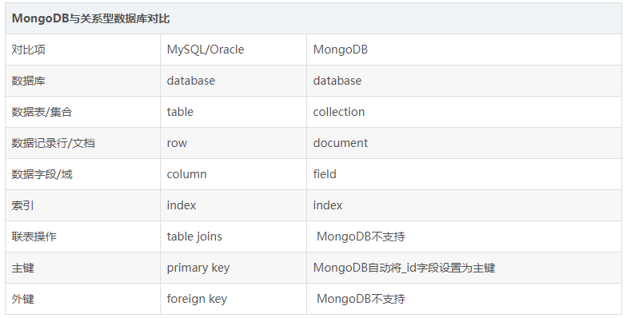
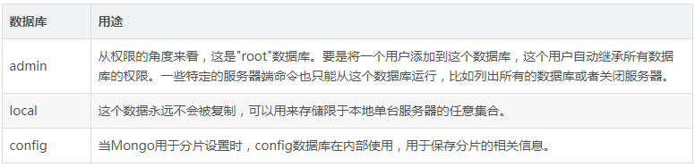
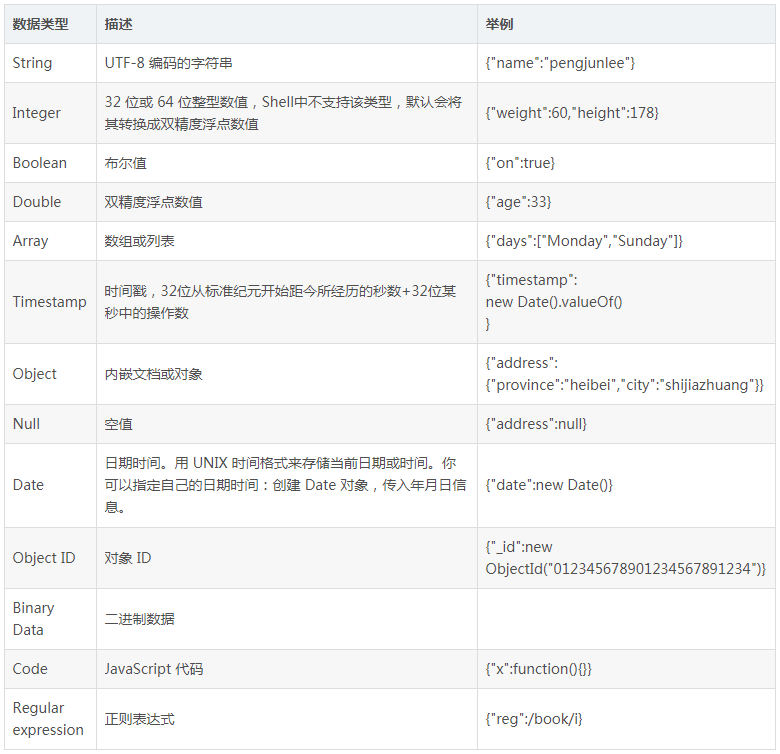

# NoSQL与MongoDB简介
**NoSQL**( `Not Only SQL`，不仅仅是SQL)，是对一类非关系型数据库的统称，多被应用于超大规模数据的存储，比较流行产品有：MongoDB、CouchDB、Redis、Neo4j、HBase、BigTable。

传统的关系型数据库在设计时遵循 ACID 规则----`A (Atomicity) 原子性`、`C (Consistency) 一致性`、`I (Isolation) 独立性`、`D (Durability) 持久性`。而NoSQL数据库通常对可用性及一致性遵循 BASE 弱要求原则----`Basically Available（基本可用）`、`Soft-state（软状态/柔性事务）`、`Eventually Consistent（最终一致性）`。

MongoDB是一个用C++语言编写的基于分布式文件存储的开源 NoSQL 数据库，其特点是高性能、易部署、易使用，存储数据十分灵活方便。

# MongoDB基本概念
## BSON
MongoDB 将数据存储为`BSON（Binary Serialized Document Format，二进制序列化文档格式）`文档，该文档类型类似于 JSON 对象（文档由键值对(key-value)组成，字段值可以包含其他文档，数组及文档数组）。

## 数据库
MongoDB的单个实例可以容纳多个独立的数据库，每一个都有自己的集合和权限，不同数据库的数据也会分别放置在不同的文件中。

使用"`show dbs`" 命令可以显示所有数据库的列表。

	> show dbs // 查看所有数据库
	admin 0.000GB
	config 0.000GB
	local 0.000GB

如上所示，在 MongoDB 3.0 以上版本中系统默认创建了三个有特殊用途的数据库：

## 数据类型
下表为 MongoDB 中常用的几种数据类型：

# MongoDB常用操作
## 连接MongoDB
命令语法：`mongo host:port[/dbName]`

	[root@hadoop40 ~]# mongo 172.16.250.240:27017/admin // 连接 admin 数据库
	MongoDB shell version v4.0.2
	connecting to: mongodb://172.16.250.240:27017/admin
	MongoDB server version: 4.0.2
	> db // 查看当前数据库
	admin

## 操作数据库
- 列出所有数据库：`show dbs`
- 列出当前数据库：`db`
- 隐式创建数据库：`use dbName`
- 删除当前数据库：`db.dropDatabase()`

	> show dbs // 查看所有数据库
	admin 0.000GB
	config 0.000GB
	local 0.000GB
	> db // 查看当前数据库
	admin
	> use test // 如果数据库不存在，则创建数据库，否则切换到指定数据库
	switched to db test
	> db // 查看当前数据库
	test
	// 创建数据库后，需要在其中创建一个集合或插入一个文档，数据库才会被真正创建
	> db.createCollection("user") // 显式创建集合
	{ "ok" : 1 }
	> show dbs // 查看所有数据库
	admin 0.000GB
	config 0.000GB
	local 0.000GB
	test 0.000GB
	> db.dropDatabase() // 删除当前所在数据库
	{ "dropped" : "test", "ok" : 1 }
	> show dbs // 查看所有数据库
	admin 0.000GB
	config 0.000GB
	local 0.000GB

## 操作集合
- 列出所有集合：`show collections` 或者 `show tables`
- 显式创建集合：`db.createCollection(collectionName, options)`
- 隐式创建集合：`db.collectionName.insert(document)`
- 删除当前集合：`db.collectionName.drop()`

	> show collections // 查看当前数据库中所有的集合
	> db.createCollection("customer") // 显式创建 customer 集合
	{ "ok" : 1 }
	> show tables // 查看当前数据库中所有的集合
	customer
	> db.customer.drop() // 删除 customer 集合
	true

## 操作文档
文档CRUD详解参见：<https://blog.csdn.net/pengjunlee/article/details/83472088>

下面仅列举了一些其他的统计、排序、分页相关示例：

	// 统计集合中文档的总数量
	> db.customer.count()        
	// 统计女性顾客的数量
	> db.customer.find({gender:"female"}).count()       
	// 将查询结果按照 age 字段升序排列
	> db.customer.find({},{name:1,age:1}).sort({age:1})
	// 将查询结果按照 age 字段降序排列，并跳过前两个文档，返回后面的 5 个文档
	> db.customer.find({},{name:1,age:1}).sort({age:-1}).skip(2).limit(5)
	// 统计分页前文档总数量
	> db.customer.find({},{name:1,age:1}).sort({age:-1}).skip(2).limit(5).count(0)
	10
	// 统计实际返回的文档总数量
	> db.customer.find({},{name:1,age:1}).sort({age:-1}).skip(2).limit(5).count(1)
	5
	 