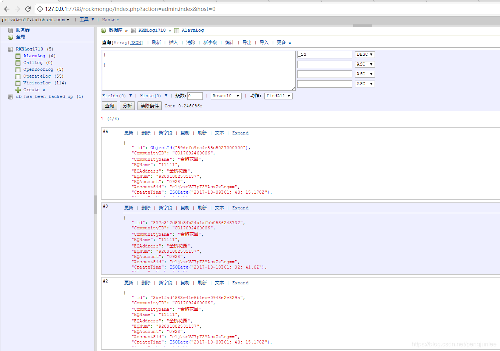
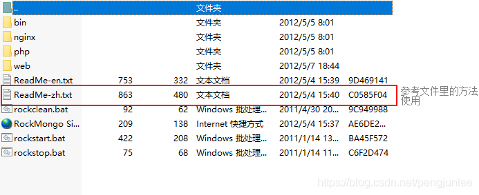
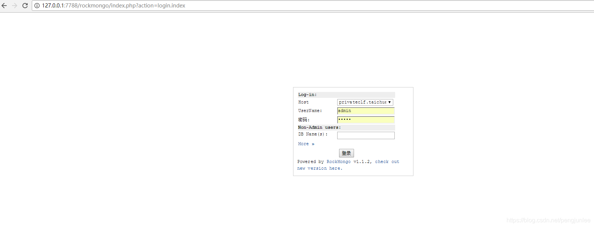

> 原文链接：<https://blog.csdn.net/sunshinegyan/article/details/78364003>

64位下载地址：链接:<https://pan.baidu.com/s/1uJhZLCizVr00xqfRIlj6nw>  提取码: `bpkf`

# RockMongo是什么？
RockMongo是由php开发的MongoDB可视化工具，是一个web服务。

# RockMongo如何使用？
解压即可按照里面的的文件的步骤使用（先在`web/rockmongo/config.php`文件里配置ip和端口再双击`rockstart.bat`启动服务即可），假如服务器没有设置密码，密码和用户名默认为admin 。

