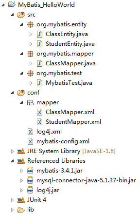

# MyBatis简介

MyBatis原是Apache的一个开源项目iBatis（“internet”和“abatis”的组合），2010年这个项目由Apache software foundation 迁移到了Google Code，并正式改名为MyBatis。项目代码于2013年11月迁移到Github，下载地址：

<https://github.com/mybatis/mybatis-3>

MyBatis 是一款非常优秀的持久化层框架，有以下几个特点：

- 支持定制化 SQL、存储过程以及高级映射；
- 避免了几乎所有的 JDBC 代码和手动设置参数以及获取结果集；
- 可以使用简单的 XML 或注解来配置和映射原生信息，将接口和 Java 的 POJO对象映射成数据库中的记录。 

# 搭建MyBatis环境

## 创建数据库表
在MySQL数据库中创建两张表：`tbl_student`（学生表）和`tbl_class`(班级表)。 
	
	/**创建学生表**/
	CREATE TABLE tbl_student 
	(
		STUDENT_ID         BIGINT PRIMARY KEY NOT NULL AUTO_INCREMENT,
		STUDENT_NAME       VARCHAR(10) NOT NULL,  
		STUDENT_GENDER     VARCHAR(10),  
		STUDENT_BIRTHDAY   DATE,
		STUDENT_AGE        INT,
		CLASS_ID           VARCHAR(255)  
	 );

	/**创建班级表**/
	CREATE TABLE tbl_class 
	(
		CLASS_ID           BIGINT PRIMARY KEY NOT NULL AUTO_INCREMENT,
		CLASS_NAME         VARCHAR(10) NOT NULL
	);
 
	/**插入班级数据**/  
	INSERT INTO tbl_class 
	(
		CLASS_ID,CLASS_NAME
	)  
	VALUES
	(
		201709,'三年二班'
	)  
	
	/**插入学生数据**/  
	INSERT INTO tbl_student 
	(
		STUDENT_ID,STUDENT_NAME,STUDENT_GENDER,  
		STUDENT_BIRTHDAY,STUDENT_AGE,CLASS_ID 
	)  
	VALUES
	(
		20060309,'苏沐寒','男','1988-08-01',25,201709
	),
	(
		20060321,'龙雨晴','女','1988-01-27',25,201709
	)

## 创建Java项目

### 导入Jar包
如果要在项目中使用 MyBatis， 只需将MyBatis的核心jar文件`mybatis-x.x.x.jar`添加到你的项目构建路径中即可。
如果使用 Maven 来构建项目，则需要在 pom.xml 文件中添加相应的依赖配置，配置内容如下： 

	<dependency>
	  <groupId>org.mybatis</groupId>
	  <artifactId>mybatis</artifactId>
	  <version>x.x.x</version>
	</dependency>

为了能够连接MySQL数据库，还需要导入`mysql-connector-java-x.x.x.jar`。

所需Jar包已上传至CSDN，资源地址：<http://download.csdn.net/download/pengjunlee/9992720> 

### 创建实体类
创建好的学生和班级实体类代码如下。  

	package org.mybatis.entity;
	 
	import java.util.Date;
	 
	public class StudentEntity {
	 
		private Long studentId;
	 
		private String studentName;
	 
		private String studentGender;
	 
		private Date studentBirthday;
	 
		private Integer studentAge;
	 
		private Long classId;
		
		private String className;
	 
		//此处省略get和set方法
	 
		@Override
		public String toString() {
			return "StudentEntity [studentId=" + studentId + ", studentName="
					+ studentName + ", studentGender=" + studentGender
					+ ", studentBirthday=" + studentBirthday + ", studentAge="
					+ studentAge + ", classId=" + classId + ", className="
					+ className + "]";
		}
	 
	}
 

	package org.mybatis.entity;
	 
	import java.util.List;
	 
	public class ClassEntity {
	 
		private Long classId;
	 
		private String className;
	 
		private List<StudentEntity> students;
	 
		//此处省略get和set方法
	 
		@Override
		public String toString() {
			return "ClassEntity [classId=" + classId + ", className=" + className
					+ ", students=" + students + "]";
		}
	 
	}

### 添加MyBatis全局配置
MyBatis全局配置文件用途很多，包括：数据源配置、事务管理配置、类型处理器配置、类别名配置等，此处不作详细介绍，为了示例仅对数据源和Mapper文件路径进行配置。  

	<?xml version="1.0" encoding="UTF-8" ?>
	<!DOCTYPE configuration
	  PUBLIC "-//mybatis.org//DTD Config 3.0//EN"
	  "http://mybatis.org/dtd/mybatis-3-config.dtd">
	<configuration>
	  <environments default="development">
	    <environment id="development">
	      <transactionManager type="JDBC"/>
	      <dataSource type="POOLED">
	        <property name="driver" value="com.mysql.jdbc.Driver"/>
	        <property name="url" value="jdbc:mysql://localhost:3306/mybatis"/>
	        <property name="username" value="用户名"/>
	        <property name="password" value="密码"/>
	      </dataSource>
	    </environment>
	  </environments>
	  <mappers>
	    <mapper resource="mapper/StudentMapper.xml"/>
	    <mapper resource="mapper/ClassMapper.xml"/>
	  </mappers>
	</configuration>

### 添加Mapper配置
创建好的StudentMapper.xml和ClassMapper.xml内容如下。 

	<?xml version="1.0" encoding="UTF-8" ?>
	<!DOCTYPE mapper
	  PUBLIC "-//mybatis.org//DTD Mapper 3.0//EN"
	  "http://mybatis.org/dtd/mybatis-3-mapper.dtd">
	<mapper namespace="StudentMapper">
		<select id="selectStudentById" resultType="org.mybatis.entity.StudentEntity">
			select STUDENT_ID
			studentId,STUDENT_NAME studentName,STUDENT_GENDER studentGender,
			STUDENT_BIRTHDAY studentBirthday,STUDENT_AGE studentAge,CLASS_ID
			classId from tbl_student where STUDENT_ID =
			#{studentId}
		</select>
	</mapper>
 
	
	<?xml version="1.0" encoding="UTF-8" ?>
	<!DOCTYPE mapper
	  PUBLIC "-//mybatis.org//DTD Mapper 3.0//EN"
	  "http://mybatis.org/dtd/mybatis-3-mapper.dtd">
	<!-- 名称空间与 org.mybatis.mapper.ClassMapper接口绑定 -->
	<mapper namespace="org.mybatis.mapper.ClassMapper">
		<!-- select标签的id属性与 ClassMapper接口中的方法名进行绑定 -->
		<select id="selectClassById" parameterType="long"
			resultType="org.mybatis.entity.ClassEntity">
			select CLASS_ID classId,CLASS_NAME className from tbl_class
			where
			CLASS_ID=#{classId}
		</select>
	</mapper>

### 创建ClassMapper接口
ClassMapper.xml的名称空间与ClassMapper接口进行绑定，可以通过接口调用的方式执行SQL，此种方式能够帮助我们进行安全类型检查，具有更高的安全性，推荐使用这种方式进行编程。

ClassMapper接口声明如下。 

	package org.mybatis.mapper;
	 
	import org.mybatis.entity.ClassEntity;
	 
	public interface ClassMapper {
	 
		
		public ClassEntity selectClassById(Long classId);
	}

### 编写测试代码
编写一个JUnit测试类进行测试。  

	package org.mybatis.test;
	 
	import java.io.IOException;
	import java.io.InputStream;
	 
	import org.apache.ibatis.io.Resources;
	import org.apache.ibatis.session.SqlSession;
	import org.apache.ibatis.session.SqlSessionFactory;
	import org.apache.ibatis.session.SqlSessionFactoryBuilder;
	import org.junit.Test;
	import org.mybatis.entity.ClassEntity;
	import org.mybatis.entity.StudentEntity;
	import org.mybatis.mapper.ClassMapper;
	 
	public class MybatisTest {
	 
		@Test
		public void test() throws IOException {
			
			// 指定mybatis全局配置文件路径
			String resource = "mybatis-config.xml";
			
			// 使用Resources工具类来获取classpath或其它位置的配置文件
			InputStream inputStream = Resources.getResourceAsStream(resource);
			
			// 由SqlSessionFactoryBuilder从 XML中构建 SqlSessionFactory
			SqlSessionFactory sqlSessionFactory = new SqlSessionFactoryBuilder()
					.build(inputStream);
			
			// 从 SqlSessionFactory 中获取 SqlSession
			SqlSession sqlSession = sqlSessionFactory.openSession();
	 
			try {
	 
				//通过 SqlSession 实例直接执行已映射的 SQL语句
				StudentEntity student = sqlSession.selectOne(
						"StudentMapper.selectStudentById", 20060309L);
				System.out.println(student);
				
				//通过 SqlSession 实例来获取接口的实现类，通过接口的实现类执行已映射的 SQL语句
				ClassMapper classMapper=sqlSession.getMapper(ClassMapper.class);
				ClassEntity clazz = classMapper.selectClassById(201709L);
				System.out.println(clazz);
				
			} finally {
				//用完记得关闭sqlSession
				if (null != sqlSession) {
					sqlSession.close();
				}
			}
	 
		}
	 
	}

执行结果如下：  

	StudentEntity [studentId=20060309, studentName=苏沐寒, studentGender=男, studentBirthday=Mon Aug 01 00:00:00 CDT 1988, studentAge=25, classId=201709, className=null]
	ClassEntity [classId=201709, className=三年二班, students=null]