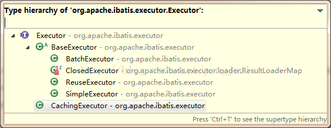
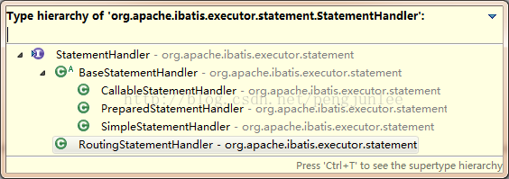

# 插件简介
MyBatis在四大对象（Executor、ParameterHandler、ResultSetHandler、StatementHandler）创建过程中，都会有插件介入，插件可以利用动态代理机制一层层的包装目标对象，从而实现在目标对象执行目标方法之前进行拦截。

在MyBatis中，借助于插件我们可以在SQL语句执行过程中的某一点进行拦截调用，这有点类似于Spring中的面向切面编程AOP。  

# 插件原理
MyBatis在创建四大对象（Executor、ParameterHandler、ResultSetHandler、StatementHandler）的时候，每一个创建出来的对象并不会被直接返回，而是会对创建好的对象再次调用InterceptorChain.pluginAll(target)方法，该方法会获取到所有的拦截器（Interceptor，所有插件都要实现该接口），并依次调用每一个拦截器的Interceptor.plugin(target)方法为目标对象创建一个代理对象进行返回。这样，通过插件我们可以为四大对象中的每一个都创建出代理对象，从而可以拦截到四大对象执行的方法。 

	public Object pluginAll(Object target) {
	    for (Interceptor interceptor : interceptors) {
	      target = interceptor.plugin(target);
	    }
	    return target;
	}

默认情况下，MyBatis允许使用插件来拦截的方法调用包括：
- Executor (update, query, flushStatements, commit, rollback, getTransaction, close, isClosed)
- ParameterHandler (getParameterObject, setParameters)
- ResultSetHandler (handleResultSets, handleOutputParameters)
- StatementHandler (prepare, parameterize, batch, update, query)  

# 插件编写
编写一个MyBatis插件类需要完成以下几个步骤：

1. 插件类需实现org.apache.ibatis.plugin.Interceptor接口。
2. 使用@Intercepts注解设置插件签名，指定该插件需要拦截哪些类的哪些方法。
3. 将编写好的插件类注册到MyBatis的全局配置文件中。  

# 插件示例源码

## ExecutorPlugin类
ExecutorPlugin插件用来拦截Executor类的query()方法。 

	package org.mybatis.plugin;
	 
	import java.util.Properties;
	 
	import org.apache.ibatis.cache.CacheKey;
	import org.apache.ibatis.executor.Executor;
	import org.apache.ibatis.mapping.BoundSql;
	import org.apache.ibatis.mapping.MappedStatement;
	import org.apache.ibatis.plugin.Interceptor;
	import org.apache.ibatis.plugin.Intercepts;
	import org.apache.ibatis.plugin.Invocation;
	import org.apache.ibatis.plugin.Plugin;
	import org.apache.ibatis.plugin.Signature;
	import org.apache.ibatis.reflection.MetaObject;
	import org.apache.ibatis.reflection.SystemMetaObject;
	import org.apache.ibatis.session.ResultHandler;
	import org.apache.ibatis.session.RowBounds;
	 
	@Intercepts({
			@Signature(type = Executor.class, method = "query", args = {
					MappedStatement.class, Object.class, RowBounds.class,
					ResultHandler.class, CacheKey.class, BoundSql.class }),
			@Signature(type = Executor.class, method = "query", args = {
					MappedStatement.class, Object.class, RowBounds.class,
					ResultHandler.class })
	 
	})
	public class ExecutorPlugin implements Interceptor {
	 
		@Override
		public Object intercept(Invocation invocation) throws Throwable {
	 
			Object target = invocation.getTarget();
	 
			System.out.println("所拦截的目标对象-->" + target);
			System.out.println("所拦截的目标方法-->" + invocation.getMethod());
			System.out.println("所拦截的目标参数-->" + invocation.getArgs());
			System.out.println("所拦截的目标类型-->" + invocation.getClass());
	 
			// 获取拦截对象的源数据信息
			MetaObject metaObject = SystemMetaObject.forObject(target);
	 
			/*
			 * 如果全局配置中cacheEnabled设置为true，获取到的源对象将会是一个CachingExecutor对象
			 * 需要通过该对象的delegate属性来获取真正的Executor对象
			 */
			// Executor executor=(Executor) metaObject.getValue("delegate");
			// System.out.println("获取源对象的delegate属性-->"+executor);
			// System.out.println("获取真正Executor对象的configuration属性-->"+metaObject.getValue("delegate.configuration"));
	 
			/*
			 * 实际的Executor对象的真正类型取决于取决于全局配置中defaultExecutorType的设置值
			 * SIMPLE(默认值)-->SimpleExecutor REUSE-->ReuseExecutor BATCH-->BatchExecutor
			 */
			System.out.println("获取源对象的configuration属性"
					+ metaObject.getValue("configuration"));
			
			//注意放行，否则将不会执行任何查询操作
			Object result = invocation.proceed();
			return result;
		}
	 
		@Override
		public Object plugin(Object target) {
			// 可以使用Plugin.wrap(target, this)方法，利用当前对象来包装目标对象
			Object wrapper = Plugin.wrap(target, this);
			return wrapper;
		}
	 
		@Override
		public void setProperties(Properties properties) {
			// 在<plugin/>标签中设置的property
			System.out.println(properties);
	 
		}
	 
	}

## ParameterHandlerPlugin类
ParameterHandlerPlugin插件用来拦截ParameterHandler类的getParameterObject()和setParameters(PreparedStatement ps)方法。 

	package org.mybatis.plugin;
	 
	import java.sql.PreparedStatement;
	import java.util.Properties;
	 
	import org.apache.ibatis.executor.parameter.ParameterHandler;
	import org.apache.ibatis.plugin.Interceptor;
	import org.apache.ibatis.plugin.Intercepts;
	import org.apache.ibatis.plugin.Invocation;
	import org.apache.ibatis.plugin.Plugin;
	import org.apache.ibatis.plugin.Signature;
	import org.apache.ibatis.reflection.MetaObject;
	import org.apache.ibatis.reflection.SystemMetaObject;
	 
	@Intercepts({
			@Signature(type = ParameterHandler.class, method = "getParameterObject", args = {}),
			@Signature(type = ParameterHandler.class, method = "setParameters", args = { PreparedStatement.class })
	 
	})
	public class ParameterHandlerPlugin implements Interceptor {
	 
		@Override
		public Object intercept(Invocation invocation) throws Throwable {
	 
			Object target = invocation.getTarget();
	 
			System.out.println("所拦截的目标对象-->" + target);
			System.out.println("所拦截的目标方法-->" + invocation.getMethod());
			System.out.println("所拦截的目标参数-->" + invocation.getArgs());
			System.out.println("所拦截的目标类型-->" + invocation.getClass());
	 
			// 获取目标对象的源数据信息
			MetaObject metaObject = SystemMetaObject.forObject(target);
	 
			/*
			 * 获取到的源对象是DefaultParameterHandler类型
			 */
			System.out.println("获取源对象的typeHandlerRegistry属性-->"
					+ metaObject.getValue("typeHandlerRegistry"));
			System.out.println("获取源对象的mappedStatement属性-->"
					+ metaObject.getValue("mappedStatement"));
			System.out.println("获取源对象的parameterObject属性-->"
					+ metaObject.getValue("parameterObject"));
			System.out.println("获取源对象的boundSql属性-->"
					+ metaObject.getValue("boundSql"));
			System.out.println("获取源对象的configuration属性-->"
					+ metaObject.getValue("configuration"));
	 
			// 注意放行，否则将不会执行任何查询操作
			Object result = invocation.proceed();
			return result;
		}
	 
		@Override
		public Object plugin(Object target) {
			// 可以使用Plugin.wrap(target, this)方法，利用当前对象来包装目标对象
			Object wrapper = Plugin.wrap(target, this);
			return wrapper;
		}
	 
		@Override
		public void setProperties(Properties properties) {
			// 在<plugin/>标签中设置的property
			System.out.println(properties);
	 
		}
	 
	}

## ResultSetHandlerPlugin类
ResultSetHandlerPlugin插件用来拦截ResultSetHandler类的handleResultSets(Statement stmt)方法。 

	package org.mybatis.plugin;
	 
	import java.sql.Statement;
	import java.util.Properties;
	 
	import org.apache.ibatis.executor.resultset.ResultSetHandler;
	import org.apache.ibatis.plugin.Interceptor;
	import org.apache.ibatis.plugin.Intercepts;
	import org.apache.ibatis.plugin.Invocation;
	import org.apache.ibatis.plugin.Plugin;
	import org.apache.ibatis.plugin.Signature;
	import org.apache.ibatis.reflection.MetaObject;
	import org.apache.ibatis.reflection.SystemMetaObject;
	 
	@Intercepts({ @Signature(type = ResultSetHandler.class, method = "handleResultSets", args = { Statement.class })
	 
	})
	public class ResultSetHandlerPlugin implements Interceptor {
	 
		@Override
		public Object intercept(Invocation invocation) throws Throwable {
	 
			Object target = invocation.getTarget();
	 
			System.out.println("所拦截的目标对象-->" + target);
			System.out.println("所拦截的目标方法-->" + invocation.getMethod());
			System.out.println("所拦截的目标参数-->" + invocation.getArgs());
			System.out.println("所拦截的目标类型-->" + invocation.getClass());
	 
			// 获取目标对象的源数据信息
			MetaObject metaObject = SystemMetaObject.forObject(target);
	 
			/*
			 * 获取到的源数据对象是DefaultResultSetHandler类型
			 */
			System.out.println("获取源对象的executor属性"
					+ metaObject.getValue("executor"));
			System.out.println("获取源对象的configuration属性"
					+ metaObject.getValue("configuration"));
			System.out.println("获取源对象的objectFactory属性"
					+ metaObject.getValue("objectFactory"));
			System.out.println("获取源对象的typeHandlerRegistry属性"
					+ metaObject.getValue("typeHandlerRegistry"));
			System.out.println("获取源对象的resultSetHandler属性"
					+ metaObject.getValue("resultHandler"));
			System.out.println("获取源对象的parameterHandler属性"
					+ metaObject.getValue("parameterHandler"));
			System.out.println("获取源对象的mappedStatement属性"
					+ metaObject.getValue("mappedStatement"));
			System.out.println("获取源对象的rowBounds属性"
					+ metaObject.getValue("rowBounds"));
			System.out.println("获取源对象的boundSql属性"
					+ metaObject.getValue("boundSql"));
			
			// 注意放行，否则将不会执行任何查询操作
			Object result = invocation.proceed();
			return result;
		}
	 
		@Override
		public Object plugin(Object target) {
	 
			// 可以使用Plugin.wrap(target, this)方法，利用当前对象来包装目标对象
			Object wrapper = Plugin.wrap(target, this);
			return wrapper;
		}
	 
		@Override
		public void setProperties(Properties properties) {
			// 在<plugin/>标签中设置的property
			System.out.println(properties);
	 
		}
	 
	}

## StatementHandlerPlugin类
StatementHandlerPlugin插件用来拦截StatementHandler类的query(Statement statement, ResultHandler resultHandler)方法。 

	package org.mybatis.plugin;
	 
	import java.sql.Statement;
	import java.util.Properties;
	 
	import org.apache.ibatis.executor.statement.StatementHandler;
	import org.apache.ibatis.plugin.Interceptor;
	import org.apache.ibatis.plugin.Intercepts;
	import org.apache.ibatis.plugin.Invocation;
	import org.apache.ibatis.plugin.Plugin;
	import org.apache.ibatis.plugin.Signature;
	import org.apache.ibatis.reflection.MetaObject;
	import org.apache.ibatis.reflection.SystemMetaObject;
	import org.apache.ibatis.session.ResultHandler;
	 
	@Intercepts({ @Signature(type = StatementHandler.class, method = "query", args = {
			Statement.class, ResultHandler.class })
	 
	})
	public class StatementHandlerPlugin implements Interceptor {
	 
		@Override
		public Object intercept(Invocation invocation) throws Throwable {
	 
			Object target = invocation.getTarget();
	 
			System.out.println("所拦截的目标对象-->" + target);
			System.out.println("所拦截的目标方法-->" + invocation.getMethod());
			System.out.println("所拦截的目标参数-->" + invocation.getArgs());
			System.out.println("所拦截的目标类型-->" + invocation.getClass());
	 
			// 获取目标对象的源数据信息
			MetaObject metaObject = SystemMetaObject.forObject(target);
	 
			/*
			 * 获取到的源数据对象是RoutingStatementHandler类型，这是一个包装类，
			 * 需要通过该对象的delegate属性来获取真正的StatementHandler对象。
			 * 真正的StatementHandler对象的类型取决于要处理的Statement的类型，
			 * 而Statement的类型又取决于Mapper中该增删改查标签的statementType属性的设置值：
			 * PREPARED(默认值)-->PreparedStatement STATEMENT-->Statement
			 * CALLABLE-->CallableStatement
			 */
	 
			System.out
					.println("获取源对象的delegate属性" + metaObject.getValue("delegate"));
			System.out.println("获取真正的StatementHandler对象的configuration属性"
					+ metaObject.getValue("delegate.configuration"));
			System.out.println("获取真正的StatementHandler对象的objectFactory属性"
					+ metaObject.getValue("delegate.objectFactory"));
			System.out.println("获取真正的StatementHandler对象的typeHandlerRegistry属性"
					+ metaObject.getValue("delegate.typeHandlerRegistry"));
			System.out.println("获取真正的StatementHandler对象的resultSetHandler属性"
					+ metaObject.getValue("delegate.resultSetHandler"));
			System.out.println("获取真正的StatementHandler对象的parameterHandler属性"
					+ metaObject.getValue("delegate.parameterHandler"));
			System.out.println("获取真正的StatementHandler对象的executor属性"
					+ metaObject.getValue("delegate.executor"));
			System.out.println("获取真正的StatementHandler对象的mappedStatement属性"
					+ metaObject.getValue("delegate.mappedStatement"));
			System.out.println("获取真正的StatementHandler对象的rowBounds属性"
					+ metaObject.getValue("delegate.rowBounds"));
			System.out.println("获取真正的StatementHandler对象的boundSql属性"
					+ metaObject.getValue("delegate.boundSql"));
	 
			// 注意放行，否则将不会执行任何查询操作
			Object result = invocation.proceed();
			return result;
		}
	 
		@Override
		public Object plugin(Object target) {
	 
			// 可以使用Plugin.wrap(target, this)方法，利用当前对象来包装目标对象
			Object wrapper = Plugin.wrap(target, this);
			return wrapper;
		}
	 
		@Override
		public void setProperties(Properties properties) {
			// 在<plugin/>标签中设置的property
			System.out.println(properties);
	 
		}
	 
	}

将编写好的插件类注册到MyBatis的全局配置文件中。 

	<plugins>
		<plugin interceptor="org.mybatis.plugin.ParameterHandlerPlugin">
			<property name="name" value="root" />
			<property name="password" value="123456" />
		</plugin>
		<plugin interceptor="org.mybatis.plugin.ExecutorPlugin">
		</plugin>
		<plugin interceptor="org.mybatis.plugin.StatementHandlerPlugin">
		</plugin>
		<plugin interceptor="org.mybatis.plugin.ResultSetHandlerPlugin">
		</plugin>
	</plugins>
  