# 写在前面的话
最近想梳理公司项目的表间关系，从项目后台管理系统的操作入手，以及代码的hibernate注解入手，都不算特别尽人意，于是最后还是鼓捣了一下PowerDesigner的逆向工程图，这样更直观一些。

想着以后不论项目切换或者接手的时候肯定是用得上的，所以在这里也记录一下，毕竟，好记性不如烂笔头，更何况我这还不是好记性。看网上有个哥们说他已经是三次忘了步骤了，所以我吸取教训赶紧第一次就记录下来。

#一、 MySQL数据库连接（JDBC方式）
JDBC的配置方式需要一些基础的环境和准备，但是也很简单，无非也就是JDK和mysql的连接jar包，这里不再展开阐述。

## 1.1 新建一个pdm，dbms选择mysql

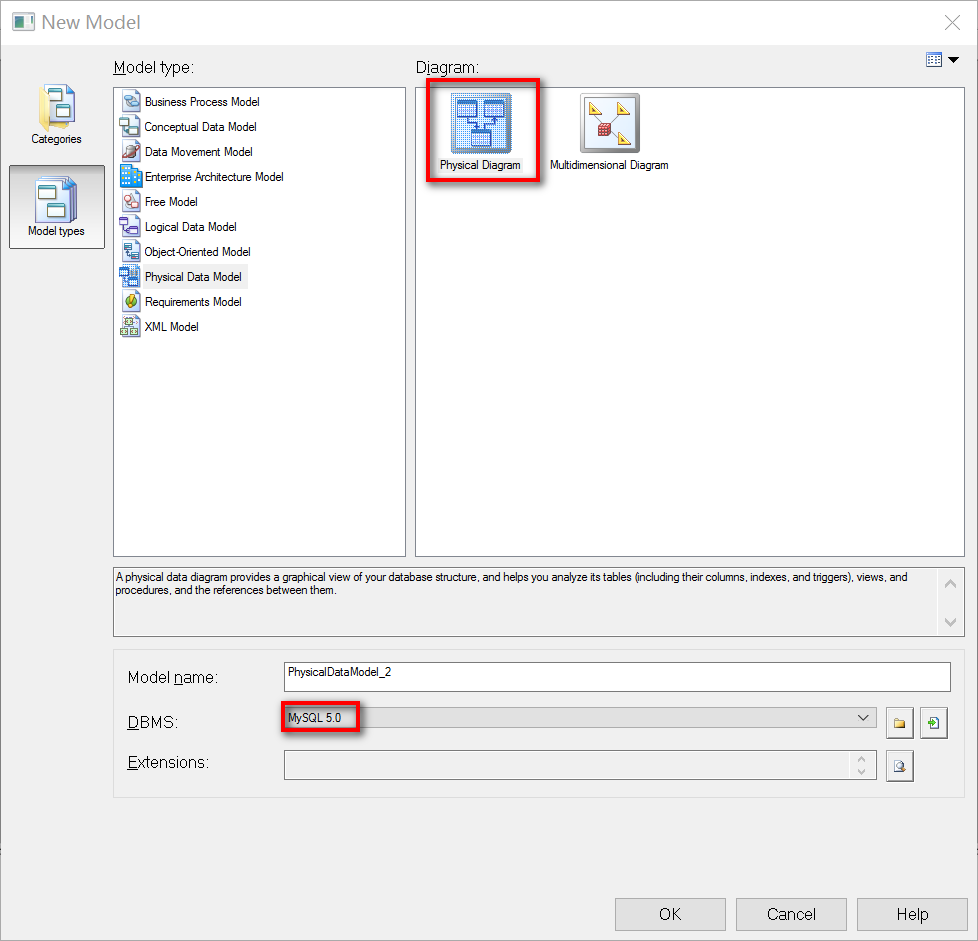

## 1.2 Database - Connect  选择数据库连接

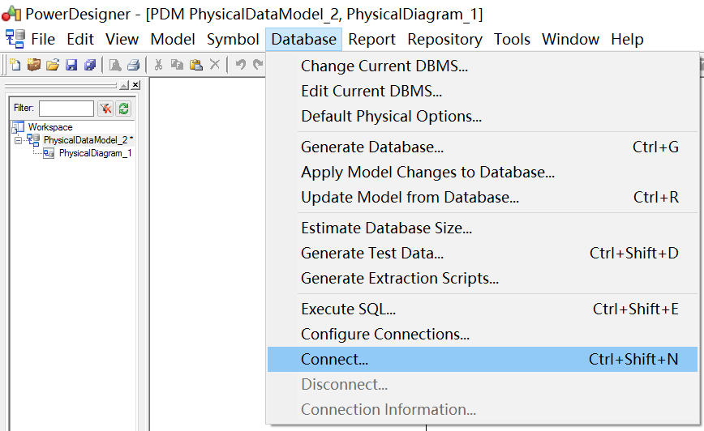

## 1.3 配置连接信息

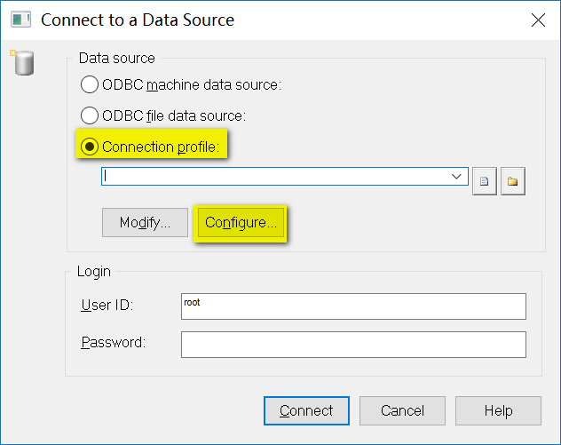

数据库连接这里是通过一个配置文件来获取连接信息的，首次的话因为没有，所以我们需要选择Configure进行配置。
## 1.4 填写配置信息

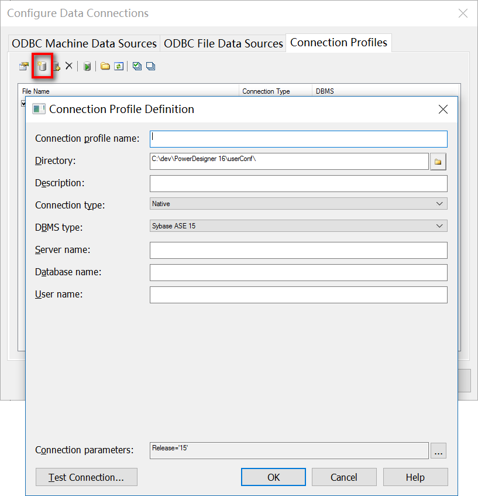

如图，选择添加数据库资源，出现如上，相关说明如下：

- Connection profile name：JDBC配置文件名称，可随意填写
- Directory：配置文件保存路径
- Description：配置文件描述，可根据实际用途填写
- Connection type：连接方式，这里我们选择JDBC
- DBMS type：数据库类型，提供大部分主流数据库选择，我们选择MySQL
- User name：登录数据库的用户名
- JDBC driver class：指定驱动类，使用默认的com.mysql.jdbc.Driver
- JDBC connection URL：连接URL，格式jdbc:mysql://ServerIP/Hostname:port/database
- JDBC driver jar files：指定连接的jar包路径

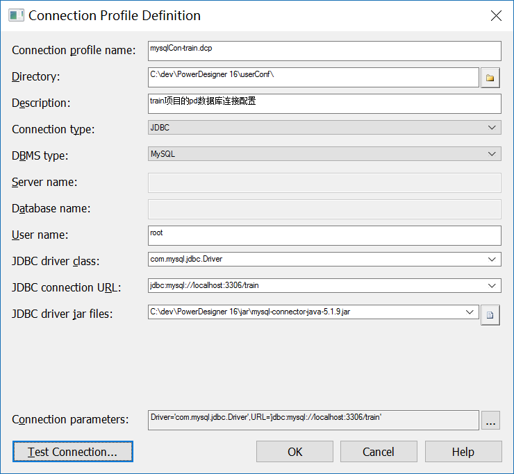

## 1.5 连接测试和配置保存
如图填写信息完成后，点击左下角的 Test Connection，出现成功提示则说明连接可行：

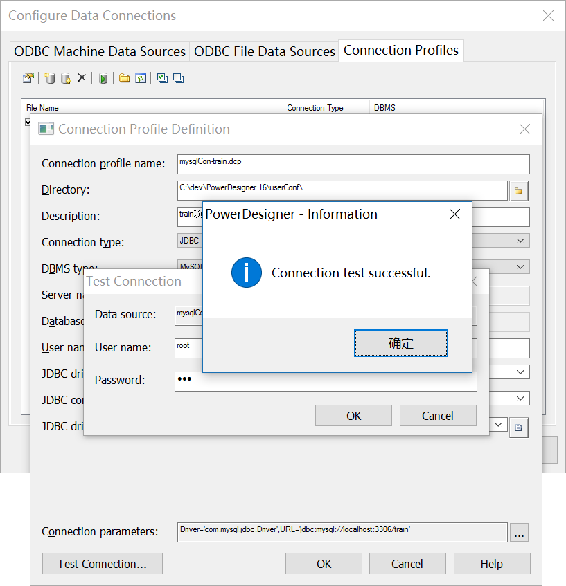

如果测试连接不通过，且出现 Non SQL Error : Could not load class com.mysql.jdbc.Drive 的错误，而指定的jar包没有问题，那么是因为PowerDesigner无法找到驱动所产生的。解决办法是配置系统的classpath路径，指定jar包路径就好了。

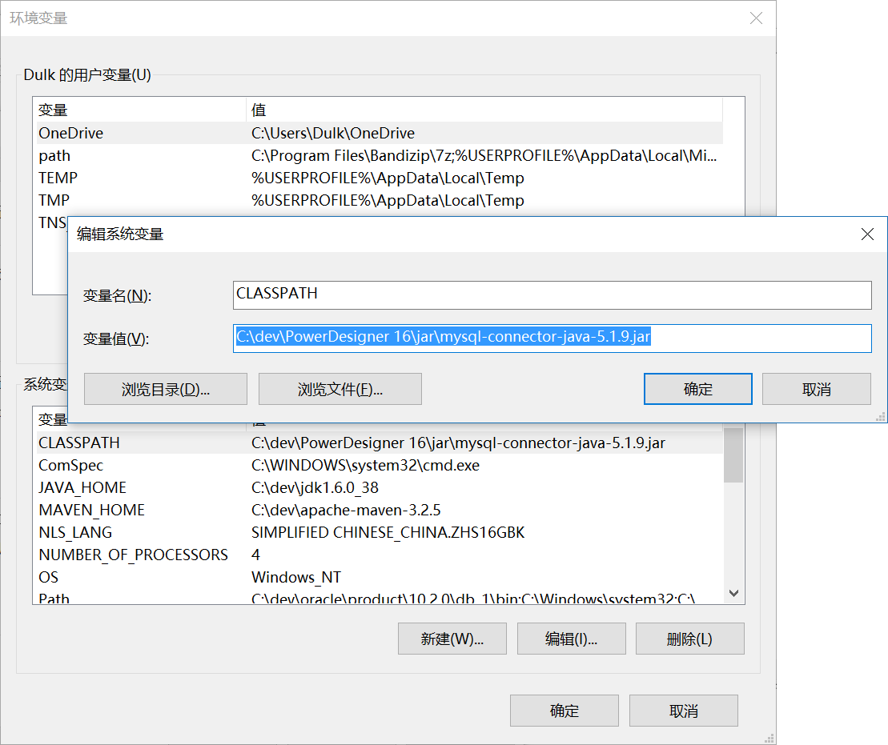

成功连接后，我们一路确定下去把这个配置文件进行保存，最终你可以在你指定的文件夹（该目录没有限制，自定义一个目录即可，此处我是建立在安装文件下的一个userConf文件夹内）中看到这个保存好的文件：

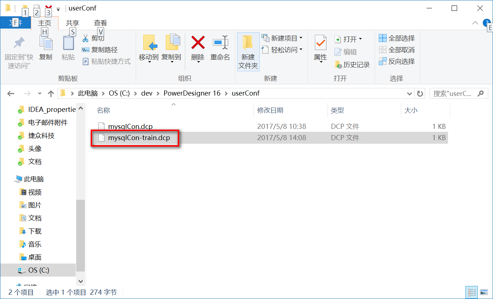

#二、 从已有数据库中的表进行逆向工程图
## 2.1 菜单选择，从数据库更新模型

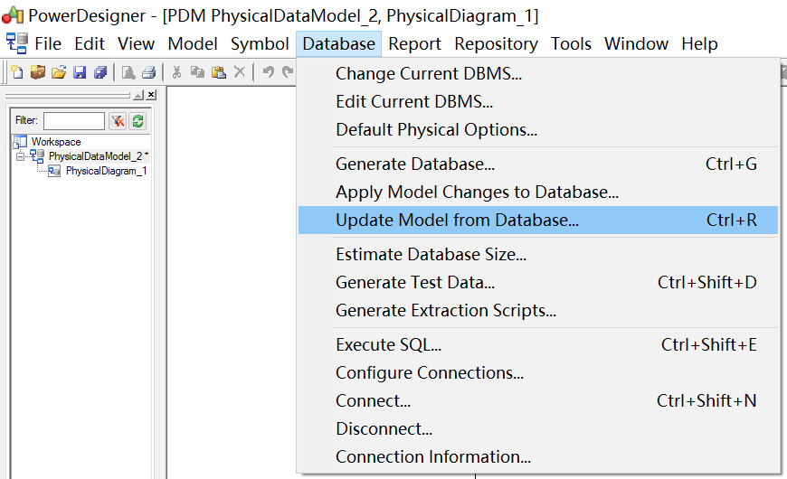

## 2.2 选择数据库连接配置文件 

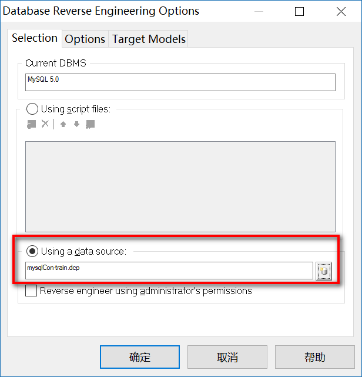

## 2.3 选择涉及的数据库和想要导出的表

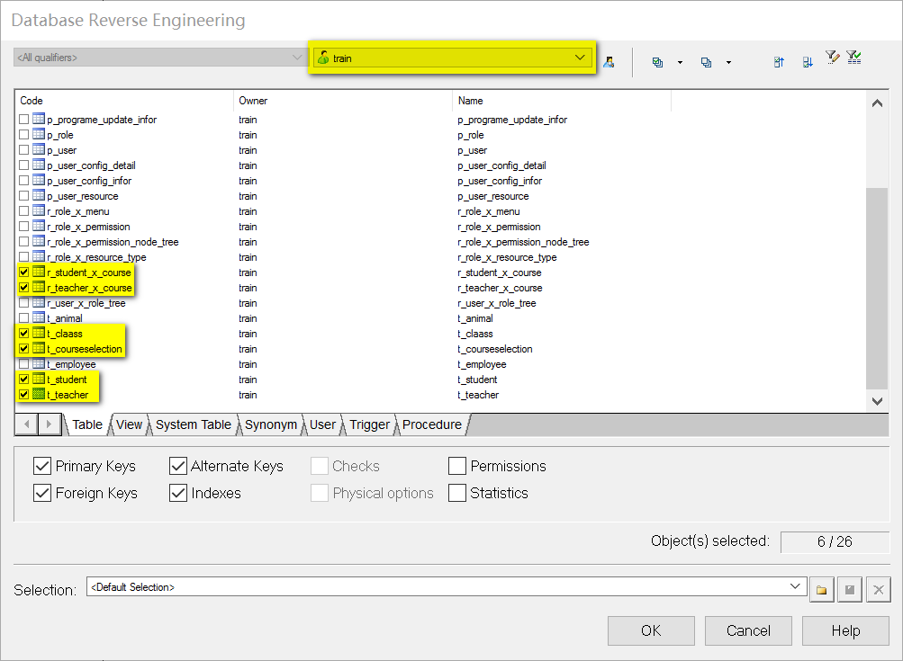

## 2.4 大功告成

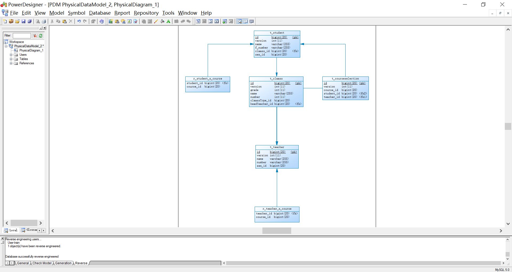

#三、 参考文章

  [PowerDesigner连接MySQL数据库](https://www.jianshu.com/p/015b0eddd6ed "PowerDesigner连接MySQL数据库")

  [powerdesigner16.5逆向工程，从远程oracle11g数据库导出PDM](http://blog.csdn.net/dragonpeng2008/article/details/52181207 "powerdesigner16.5逆向工程，从远程oracle11g数据库导出PDM")

  [使用powerdesigner连接数据库时出现Non SQL Error : Could not load class com.mysql.jdbc.Drive](http://uule.iteye.com/blog/895150 "使用powerdesigner连接数据库时出现Non SQL Error : Could not load class com.mysql.jdbc.Drive")