> 友情提示：Windows操作系统下安装MySQL 5.7版本时，经常会出现服务无法启动的情况，所以推荐安装MySQL 5.6或MySQL 5.5版本。

**（1）下载安装包文件。**

官网地址：<https://dev.mysql.com/downloads/mysql/>

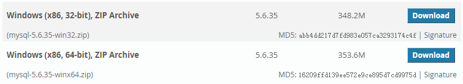

**（2）根据自己的操作系统位数下载合适的ZIP包。**

1. 以64位操作系统为例，选择下载mysql-5.6.35-winx64.zip。
2. 解压文件至安装目录，我的安装目录是“D:\Program Files\MySQL”。
安装目录中文件如下：

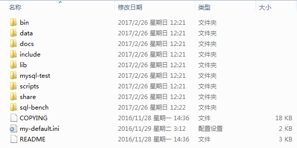

**（3）修改Windows环境变量。**
操作路径：电脑桌面-->计算机图标上点右键-->属性-->高级系统设置-->环境变量。
新建变量“MYSQL_HOME=MySQL 安装目录”。

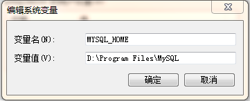

编辑Path变量，添加“%MYSQL_HOME%\bin;”，注意分号分隔。

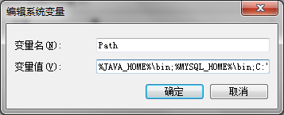

**（4）修改配置文件（安装目录下的my-default.ini）。**
内容如下：

	# For advice on how to change settings please see
	# http://dev.mysql.com/doc/refman/5.6/en/server-configuration-defaults.html
	# *** DO NOT EDIT THIS FILE. It's a template which will be copied to the
	# *** default location during install, and will be replaced if you
	# *** upgrade to a newer version of MySQL.
	 
	[mysqld]
	 
	# Remove leading # and set to the amount of RAM for the most important data
	# cache in MySQL. Start at 70% of total RAM for dedicated server, else 10%.
	# innodb_buffer_pool_size = 128M
	 
	# Remove leading # to turn on a very important data integrity option: logging
	# changes to the binary log between backups.
	# log_bin
	 
	# These are commonly set, remove the # and set as required.
	# basedir = .....
	# datadir = .....
	# port = .....
	# server_id = .....
	 
	#设置服务器字符集为utf8
	character_set_server=utf8
	collation-server=utf8_general_ci
	 
	 
	#设置mysql的安装目录
	basedir = D:/Program Files/MySQL
	 
	#设置mysql的数据文件存放目录
	datadir = D:/Program Files/MySQL/data
	 
	#设置mysql服务所绑定的端口
	port = 3306
	 
	#设置mysql允许的最大连接数
	max_connections=15
	 
	# Remove leading # to set options mainly useful for reporting servers.
	# The server defaults are faster for transactions and fast SELECTs.
	# Adjust sizes as needed, experiment to find the optimal values.
	# join_buffer_size = 128M
	# sort_buffer_size = 2M
	# read_rnd_buffer_size = 2M 
	 
	[client]    
	#设置客户端字符集
	default-character-set=utf8
	 
	    
	[WinMySQLadmin]
	Server = D:/Program Files/MySQL/bin/mysqld.exe
	 
	 
	sql_mode=NO_ENGINE_SUBSTITUTION,STRICT_TRANS_TABLES
 

**（5）将MySQL注册为Windows系统服务。**
使用命令：`mysqld install MySQL --defaults-file="配置文件路径"`
操作路径：`开始`-->`搜索程序和文件`，输入“cmd”-->在“cmd.exe”程序上点右键，"以管理员的身份运行"。

在命令行中输入如下命令：

	mysqld install MySQL --defaults-file="D:\Program Files\MySQL\my-default.ini"

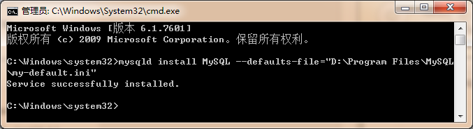

若要移除服务使用命令：`mysqld remove`

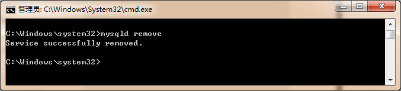

**（6）启动MySQL服务。**
使用命令：`net start mysql`

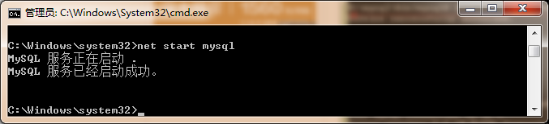

如果第一次使用“`net start mysql`”命令启动MySQL服务没有成功，我们需要先使用“`sc delete mysql`”命令清除已经注册的MySQL服务，再使用“`mysqld -install`”命令重新注册MySQL服务。

> 注：若启动过程中报错“发现系统错误2，系统找不到指定的文件。”，需修改注册表进行修复，注册表路径：`HKEY_LOCAL_MACHINE-SYSTEM`-->`CurrentControlSet`-->`mysql(服务名)`。将ImagePath更改为："D:\Program Files\MySQL\bin\mysqld" --defaults-file="D:\Program Files\MySQL\my-default.ini" mysql

**（7）修改root账户的密码。**

1.使用root账户登录。  
使用命令：`mysql –u root`

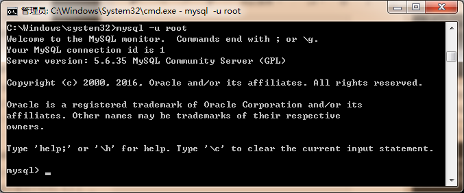

2.查看数据库。  
使用命令：`show databases;`

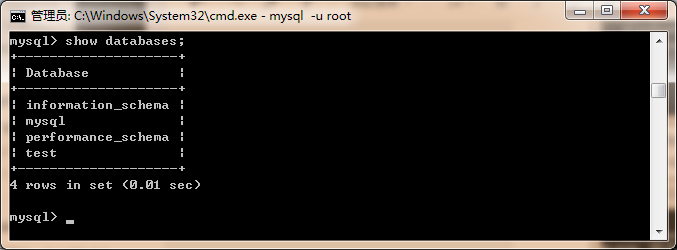

3.选定“mysql”数据库。  
使用命令：`use mysql;`

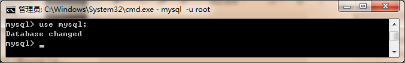

4.更改密码。  
使用命令：`UPDATE user SET password=PASSWORD("你的密码") WHERE user='root';`

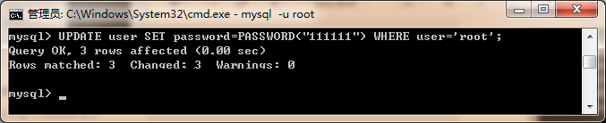

5.刷新MySQL的权限表，使修改生效。  
使用命令：`FLUSH PRIVILEGES;`

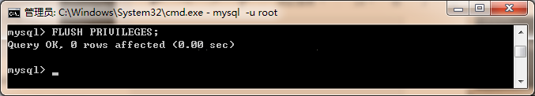

6.退出。  
使用命令：`QUIT;`

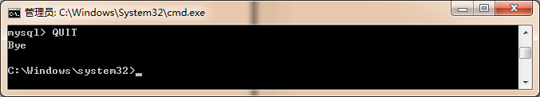

