**（1）下载安装包文件。**
官网地址：<https://dev.mysql.com/downloads/mysql/>

选择下载 mysql-8.0.19-winx64.zip。

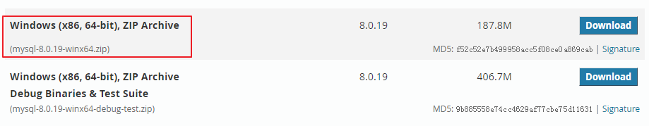

**（2）解压文件到安装目录。**
我的安装目录是 “`D:\Program Files\mysql-8.0.19-winx64`”。

解压后的安装目录中文件列出如下：

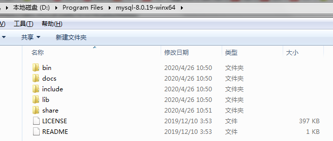

**（3）修改Windows环境变量。**
操作路径：电脑桌面-->计算机图标上点右键-->属性-->高级系统设置-->环境变量。

新建变量“MYSQL_HOME=MySQL 安装目录”。

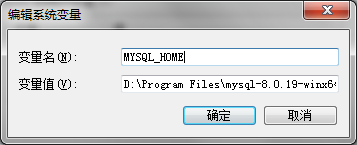

编辑Path变量，添加“%MYSQL_HOME%\bin;”，注意分号分隔。

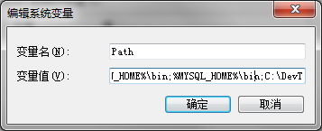

**（4）创建配置文件。**
在安装目录下新建一个my.ini文件（可以先创建一个my.txt文件，再将其扩展名类型改为 ini）。

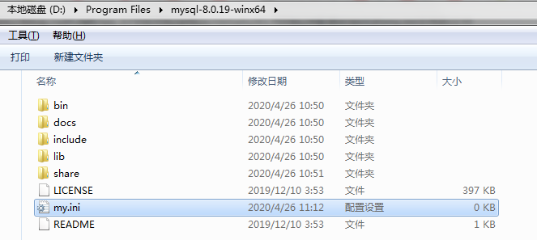

my.ini 配置如下：

	[mysqld]
	# 设置mysql的安装目录
	basedir=D:/Program Files/mysql-8.0.19-winx64
	 
	 
	# 设置mysql的数据文件存放目录
	datadir=D:/Program Files/mysql-8.0.19-winx64/data
	 
	# 设置服务器字符集为utf8
	character_set_server=utf8
	# 设置服务器默认排序
	collation_server=utf8_general_ci
	 
	# 设置3306端口
	port=3306
	 
	# 允许最大连接数
	max_connections=100
	 
	# 允许连接失败的次数。
	max_connect_errors=10
	 
	# 创建新表时将使用的默认存储引擎
	default_storage_engine=INNODB
	 
	# 默认使用“mysql_native_password”插件认证
	default_authentication_plugin=mysql_native_password
	 
	# 设置mysql不区分大小写
	lower_case_table_names=1
	 
	[mysql]
	# 设置mysql客户端默认字符集
	default_character_set=utf8
	 
	 
	[client]
	# 设置mysql客户端连接服务端时默认使用的端口
	port=3306
	 
	# 设置客户端字符集
	default_character_set=utf8
	 
	[WinMySQLadmin]
	Server=D:/Program Files/mysql-8.0.19-winx64/bin/mysqld.exe
	sql_mode=NO_ENGINE_SUBSTITUTION,STRICT_TRANS_TABLES

**（5）初始化MySQL。**
以管理员身份打开一个CMD命令行窗口，操作路径：开始-->搜索程序和文件，输入“cmd”-->在“cmd.exe”程序上点右键，"以管理员的身份运行"。

切换到MySQL的bin目录执行如下命令：`mysqld --initialize --console`

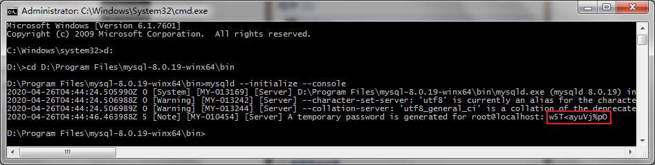

在这里会为root用户创建一个临时密码：`w5T<ayuVj%pO`，请记住该密码，后面会用到。

**（6）将MySQL 注册为Windows系统服务。**
使用命令：`mysqld install MySQL --defaults-file="配置文件路径"`

在命令行中输入如下命令：`mysqld install MySQL --defaults-file="D:\Program Files\mysql-8.0.19-winx64\my.ini"`

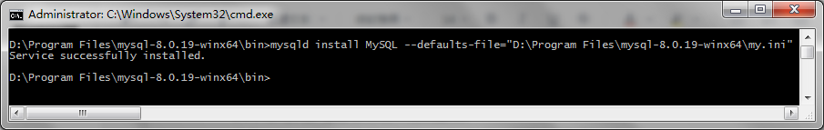

如果需要移除服务，可以使用命令：`mysqld remove`

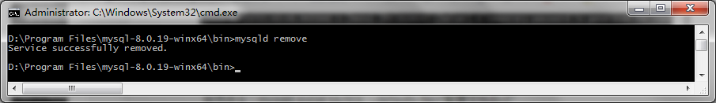

**（7）启动MySQL 服务。**
使用命令：`net start mysql`

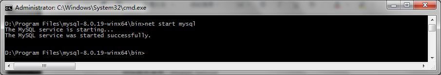

如果第一次使用“`net start mysql`”命令启动MySQL 服务没有成功，我们需要先使用“`sc delete mysql`”命令清除已经注册的MySQL 服务，再使用“`mysqld -install`”命令重新注册MySQL 服务。

**（8）修改root账户的密码。**
1.使用root账户登录。
使用命令：mysql -uroot -p

输入`mysqld --initialize --console`执行过程中为root自动生成的密码：`w5T<ayuVj%pO`

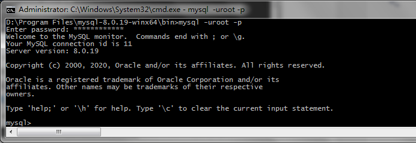

2.重置root账户密码。
使用命令：`alter user 'root'@'localhost' identified by '你的密码' password expire never;`

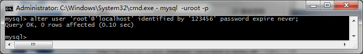

3.退出。
使用命令：QUIT;

4.客户端工具连接MySQL
使用SQLyog、Navicat等工具连接MySQL测试，成功！

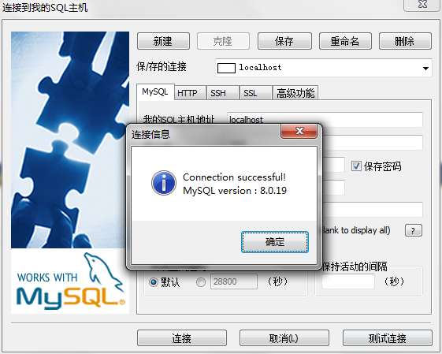

 