# 这篇文章讲什么
这是一篇介绍悲观锁和乐观锁的入门文章。旨在让那些不了解悲观锁和乐观锁的小白们弄清楚什么是悲观锁，什么是乐观锁。不同于其他文章，本文会配上相应的图解让大家更容易理解。通过该文，你会学习到如下的知识：

- 什么是悲观锁，什么是乐观锁；
- 怎么实现悲观锁，怎么实现乐观锁；
- 悲观锁和乐观锁的优缺点；
- 悲观锁和乐观锁的应用场景；

# 什么是悲观锁，什么是乐观锁？
## 锁（Lock）
在介绍悲观锁和乐观锁之前，让我们看一下锁。锁，在我们生活中随处可见，我们的门上有锁，我们存钱的保险柜上有锁，它们是用来保护我们财产安全的。程序中也有锁，当多个线程修改共享变量时，我们可以给修改操作上锁（syncronized）。当多个用户修改表中同一数据时，我们可以给该行数据上锁（行锁）。因此，锁其实是在并发情况下用来实现多个操作的顺序执行，以此来保证数据能够安全地进行变更。 并且，锁是一种保证数据安全的机制和手段，而并不是特定于某项技术的。悲观锁和乐观锁亦是如此。本篇介绍的悲观锁和乐观锁是基于数据库层面的。

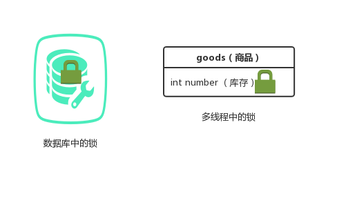

## 悲观锁（Pessimistic Concurrency Control）
乐观锁，第一眼看到它，相信每个人都会想到这是一个悲观的锁。没错，它就是一个悲观的锁。那这个悲观体现在什么地方呢？悲观是我们人类一种消极的情绪，对应到锁的悲观情绪，悲观锁认为被它保护的数据是极其不安全的，每时每刻都有可能发生变化，一个事务拿到悲观锁后（可以理解为一个用户），其他任何事务都不能对该数据进行修改，只能等待锁被释放才可以执行。数据库中的行锁，表锁，读锁，写锁，以及syncronized实现的锁均为悲观锁。

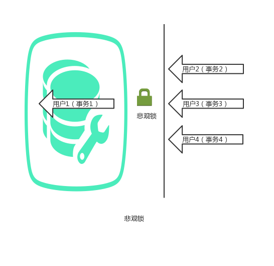

这里再介绍一下什么是数据库的表锁和行锁，以免有的同学对后面悲观锁的实现看不明白。我们经常使用的数据库是mysql，mysql中最常用的引擎是Innodb，Innodb默认使用的是行锁。而行锁是基于索引的，因此要想加上行锁，在加锁时必须命中索引，否则将使用表锁。

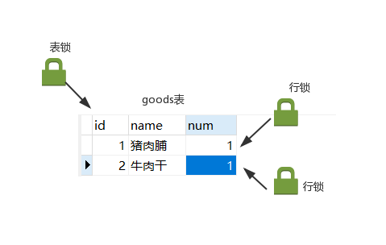

## 乐观锁（Optimistic Concurrency Control）
与悲观相对应，乐观是我们人类一种积极的情绪。乐观锁的“乐观情绪”体现在，它认为数据的变化不会太频繁。因此，它允许多个事务同时对数据进行变动。 但是，乐观不代表不负责，那么怎么去负责多个事务顺序对数据进行修改呢？乐观锁通常是通过在表中增加一个版本(version)或时间戳(timestamp)来实现，其中，版本最为常用。事务在从数据库中取数据时，会将该数据的版本也取出来(v1)，当事务对数据变动完毕想要将其更新到表中时，会将之前取出的版本v1与数据中最新的版本v2相对比，如果v1=v2，那么说明在数据变动期间，没有其他事务对数据进行修改，此时，就允许事务对表中的数据进行修改，并且修改时version会加1，以此来表明数据已被变动。如果，v1不等于v2，那么说明数据变动期间，数据被其他事务改动了，此时不允许数据更新到表中，一般的处理办法是通知用户让其重新操作。不同于悲观锁，乐观锁是人为控制的。

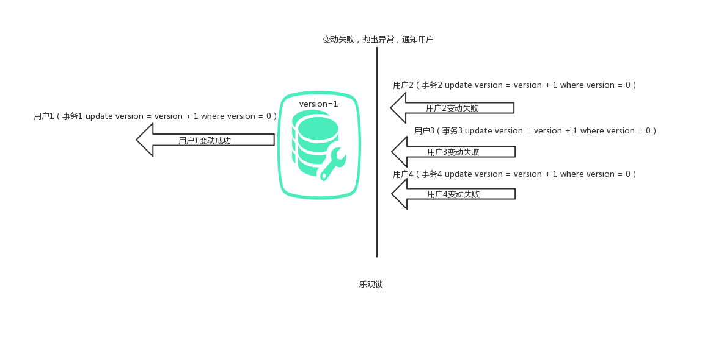

# 怎么实现悲观锁，怎么实现乐观锁？
经过上面的学习，我们知道悲观锁和乐观锁是用来控制并发下数据的顺序变动问题的。那么我们就模拟一个需要加锁的场景，来看不加锁会出什么问题，并且怎么利用悲观锁和乐观锁去解决。

场景：A和B用户最近都想吃猪肉脯，于是他们打开了购物网站，并且找到了同一家卖猪肉脯的店铺。下面是这个店铺的商品表goods结构和表中的数据。

| id| name | num |
|---|------|----|
| 1 | 猪肉脯 | 1 |
| 2 | 牛肉干 | 1 |

从表中可以看到猪肉脯目前的数量只有1个了。在不加锁的情况下，如果A，B同时下单，就会报错。

## 悲观锁解决
利用悲观锁的解决思路是，A下单前先给猪肉脯这行数据（id=1）加上悲观锁（行锁）。此时这行数据只能A来操作，也就是只有A能买。B想买就必须一直等待。当A买好后，B再想去买的时候会发现数量已经为0，那么B看到后就会放弃购买。
那么如何给猪肉脯也就是id=1这条数据加上悲观锁锁呢？我们可以通过以下语句给id=1的这行数据加上悲观锁。

	select num from goods where id = 1 for update;

下面是悲观锁的加锁图解。

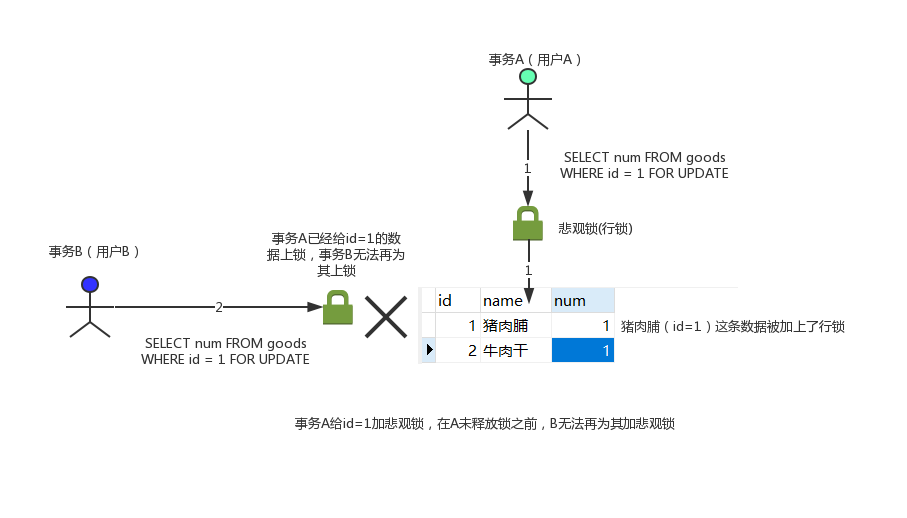

我们通过开启mysql的两个会话，也就是两个命令行来演示。

**1.事务A执行命令给id=1的数据上悲观锁准备更新数据。**

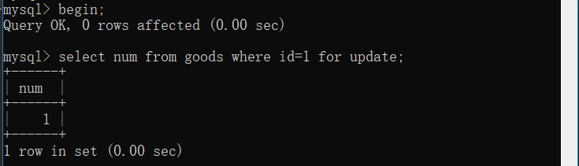

这里之所以要以begin开始，是因为mysql是自提交的，所以要以begin开启事务，否则所有修改将被mysql自动提交。

**2.事务B也去给id=1的数据上悲观锁准备更新数据。**

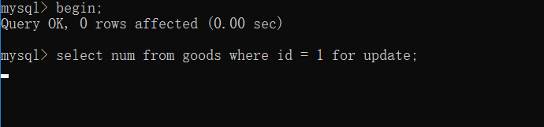

我们可以看到此时事务B再一直等待A释放锁。如果A长期不释放锁，那么最终事务B将会报错，这有兴趣的可以去尝试一下。

**3.接着我们让事务A执行命令去修改数据，让猪肉脯的数量减一，然后查看修改后的数据，最后commit,结束事务。**

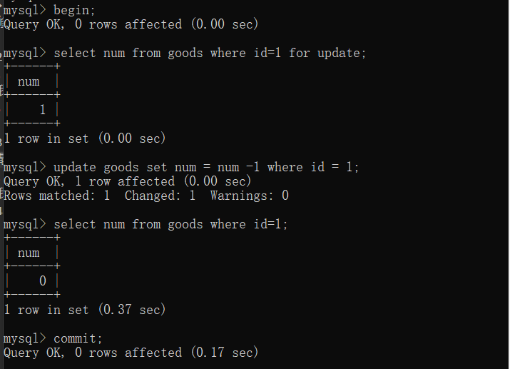

我们可以看到，此时最后一个猪肉脯被A买走，只剩0个了。

**4.当事务A执行完第3步后，我们看事务B中出现了什么。**

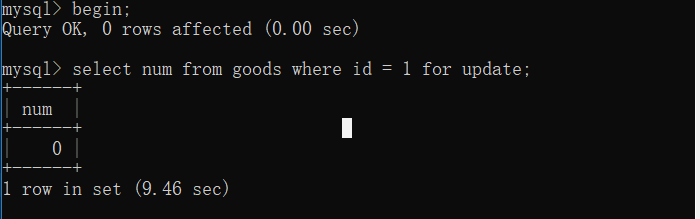

我们看到由于事务A释放了锁，事务B就结束了等待，拿到了锁，但是数据此时变成了0，那么B看到后就知道被买走了，就会放弃购买。

通过悲观锁，我们解决了猪肉脯购买的问题。

## 乐观锁解决
下面，我们利用乐观锁来解决该问题。上面乐观锁的介绍中，我们提到了，乐观锁是通过版本号version来实现的。 所以，我们需要给goods表加上version字段，表变动后的结构如下

| id| name | num | version |
|---|------|-----|---------|
| 1	|猪肉脯|	1 |	0 |
| 2	|牛肉干|	1 |	0 |

具体的解决思路是，A和B同时将猪肉脯(id=1下面都说是id=1)的数据查出来，然后A先买，A将id=1和version=0作为条件进行数据更新，即将数量减一，并且将版本号加一。此时版本号变为1。A此时就完成了商品的购买。最后B开始买，B也将id=1和version=0作为条件进行数据更新，但是更新完后，发现更新的数据行数为0，此时就说明已经有人改动过数据，此时就应该提示用户重新查看最新数据购买。

下面是乐观锁的加锁图解。

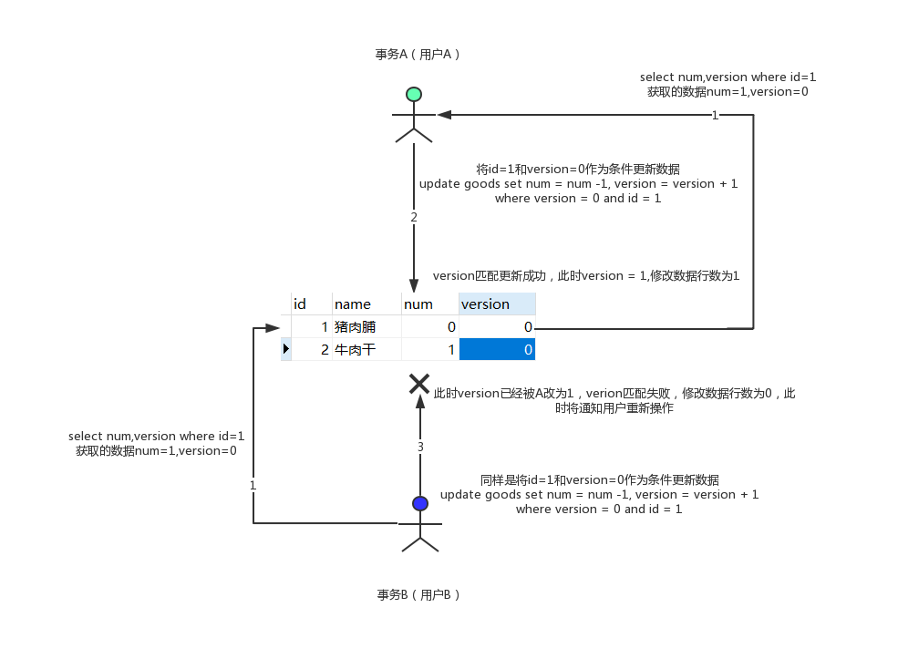

我们还是通过开启mysql的两个会话，也就是两个命令行来演示。

**1.事务A执行查询命令，事务B执行查询命令，因为两者查询的结果相同，所以下面我只列出一个截图。**

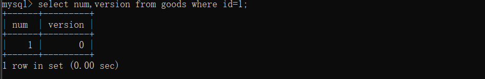

此时A和B均获取到相同的数据。

**2.事务A进行购买更新数据，然后再查询更新后的数据。**

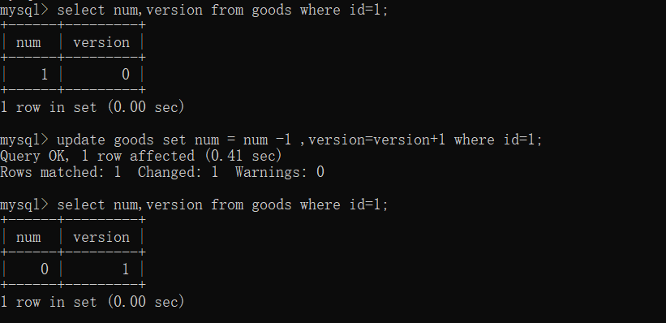

我们可以看到事务A成功更新了数据和版本号。

事务B再进行购买更新数据，然后我们看影响行数和更新后的数据。

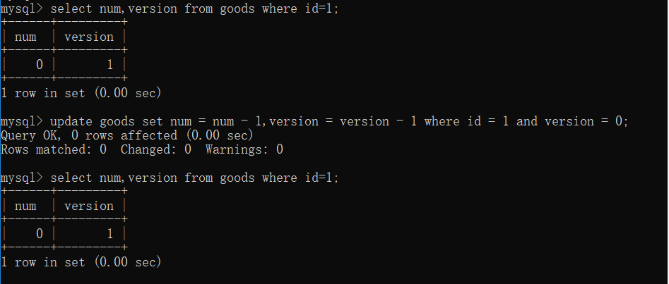

可以看到最终修改行数为0，数据没有改变。此时就需要我们告知用户重新处理。

# 乐观锁和悲观锁的优缺点
下面我们介绍下乐观锁和悲观锁的优缺点以便我们分析他们的应用场景，这里我只分析最重要的优缺点，也是我们要记住的。

## 悲观锁
**优点**：悲观锁利用数据库中的锁机制来实现数据变化的顺序执行，这是最有效的办法
**缺点**：一个事务用悲观锁对数据加锁之后，其他事务将不能对加锁的数据进行除了查询以外的所有操作，如果该事务执行时间很长，那么其他事务将一直等待，那势必影响我们系统的吞吐量。

## 乐观锁
**优点**：乐观锁不在数据库上加锁，任何事务都可以对数据进行操作，在更新时才进行校验，这样就避免了悲观锁造成的吞吐量下降的劣势。
**缺点**：乐观锁因为时通过我们人为实现的，它仅仅适用于我们自己业务中，如果有外来事务插入，那么就可能发生错误。

# 乐观锁和悲观锁的应用场景

- 悲观锁：悲观锁是数据库级层面的加锁，会影响系统吞吐的性能。
- 乐观锁：因为乐观锁就是为了避免悲观锁的弊端出现的，所以适合应用在读多写少的场景下，即冲突很少发生。

# 参考资料

<https://chenzhou123520.iteye.com/blog/1860954>