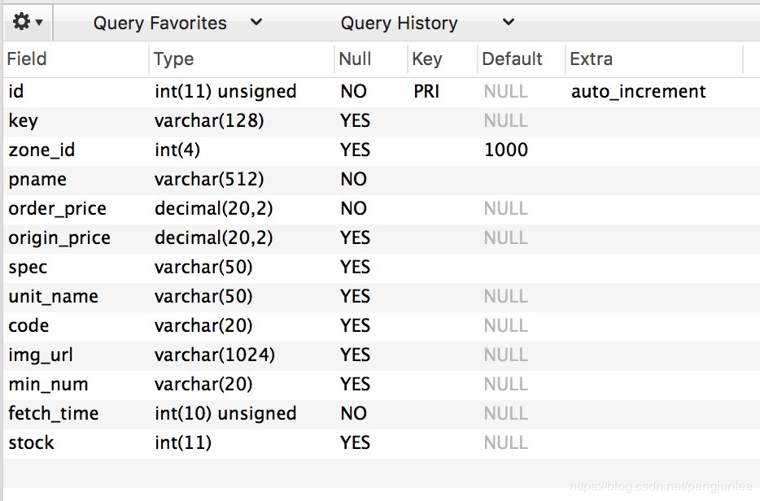
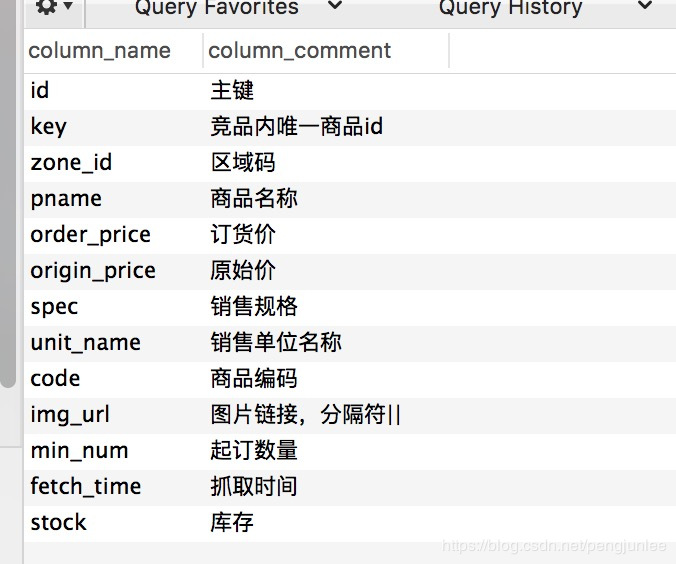
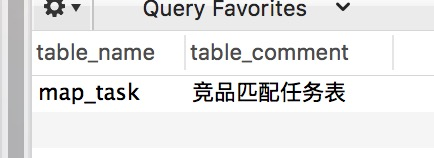

# 一、简单描述表结构，字段类型

	desc tabl_name;

显示表结构，字段类型，主键，是否为空等属性，但不显示外键。

例如：`desc table_name`

# 二、查询表中列的注释信息

	select * from information_schema.columns
	where table_schema = 'db' #表所在数据库
	and table_name = 'tablename' ; #你要查的表

例如：

可以自动选择你需要信息

# 三、只查询列名和注释

	select column_name, column_comment from information_schema.columns where table_schema ='db' and table_name = 'tablename' ;

例如：

# 四、查看表的注释

	select table_name,table_comment from information_schema.tables where table_schema = 'db' and table_name ='tablename'

例如：

# 五、查看表生成的DDL

	show create table table_name;

例如：

这个命令虽然显示起来不是太容易看， 这个不是问题可以用\G来结尾，使得结果容易阅读；该命令把创建表的DDL显示出来，于是表结构、类型，外键，备注全部显示出来了。

我比较喜欢这个命令：输入简单，显示结果全面。

补充一些可能用到的命令：

**建表命令**：

	CREATE TABLE `t_sold_order` (
	`id` int(11) NOT NULL AUTO_INCREMENT,
	`dt` date DEFAULT NULL COMMENT '日期',
	`hour` tinyint(2) DEFAULT '0' COMMENT '小时',
	`hour_order` int(11) DEFAULT '0' COMMENT '小时订单数',
	`total_order` int(11) DEFAULT '0' COMMENT '总的订单数',
	`prediction` int(11) DEFAULT '0' COMMENT '预测订单数',
	PRIMARY KEY (`id`),
	UNIQUE KEY `dt_hour` (`dt`,`hour`)
	) ENGINE=InnoDB AUTO_INCREMENT=1 DEFAULT CHARSET=utf8 COMMENT='实时订单数'

**表操作命令**：

	# 复制表结构：
	create table table1 like table;

	# 复制数据：
	insert into table1 select * from table;

	# 机器授权：
	grant select on *.* to 'reader'@'%' identified by '123456' WITH GRANT OPTION
	flush privileges;

	# 查询数据直接插入
	insert into t_visual_user_domain(`user_id`,`domain`,`group`) select id,'www.baidu.com' as domain,`group` from t_visual_user;

	# 修改表结构
	alter table competitor_goods add sku_id bigint(20) unsigned DEFAULT NULL COMMENT '商品销售码';
 