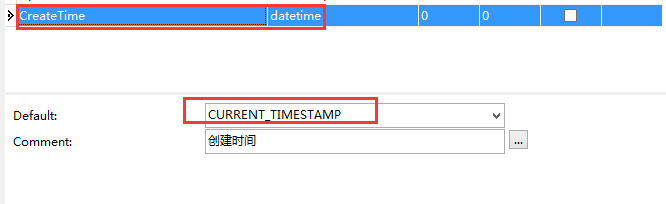
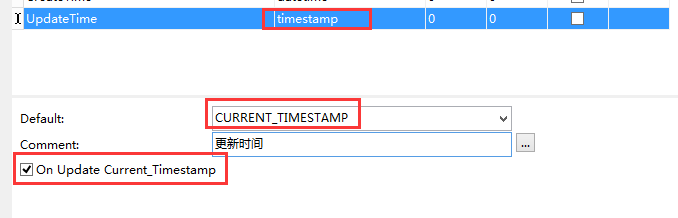

# 应用场景：
- 在数据表中，要记录每条数据是什么时候创建的，不需要应用程序去特意记录，而由数据数据库获取当前时间自动记录创建时间；
- 在数据库中，要记录每条数据是什么时候修改的，不需要应用程序去特意记录，而由数据数据库获取当前时间自动记录修改时间；

# 实现方式：
1. 将字段类型设为  TIMESTAMP 
2. 将默认值设为  CURRENT_TIMESTAMP

# 举例应用：
## MySQL 脚本实现用例
**添加CreateTime 设置默认时间 CURRENT_TIMESTAMP**

	ALTER TABLE `table_name`
	ADD COLUMN  `CreateTime` datetime NULL DEFAULT CURRENT_TIMESTAMP COMMENT '创建时间' ;

**修改CreateTime 设置默认时间 CURRENT_TIMESTAMP**

	ALTER TABLE `table_name`
	MODIFY COLUMN  `CreateTime` datetime NULL DEFAULT CURRENT_TIMESTAMP COMMENT '创建时间' ;

**添加UpdateTime 设置 默认时间 CURRENT_TIMESTAMP   设置更新时间为 ON UPDATE CURRENT_TIMESTAMP**

	ALTER TABLE `table_name`
	ADD COLUMN `UpdateTime` timestamp NULL DEFAULT CURRENT_TIMESTAMP ON UPDATE CURRENT_TIMESTAMP COMMENT '创建时间' ;

**修改 UpdateTime 设置 默认时间 CURRENT_TIMESTAMP   设置更新时间为 ON UPDATE CURRENT_TIMESTAMP**

	ALTER TABLE `table_name`
	MODIFY COLUMN `UpdateTime` timestamp NULL DEFAULT CURRENT_TIMESTAMP ON UPDATE CURRENT_TIMESTAMP COMMENT '创建时间' ;

## MySQL工具设置

 

# 总结
1. MySQL自动管理，保持和数据库时间一致性；
2. 简单高效，不需要应用程序开发支持，MySQL自动完成；