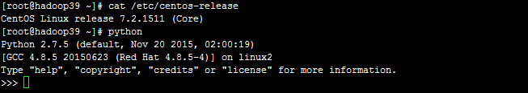
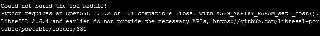
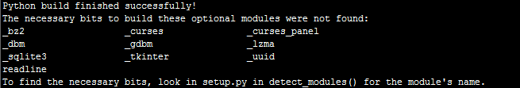

# 准备环境

- Linux：CentOS Linux release 7.2.1511 (Core)
- Python：Python-3.7.3

# Python的下载和安装
CentOS 7.2 自带了Python2.7.5，我们需要另行安装Python3.7.3。但是由于系统运行依赖于自带的Python2.7.5，因此千万不可删除系统自带的Python 版本。

首先，我们需要登陆Python官方网站 获取`Python-3.7.3.tgz`下载链接。

安装目标文件夹：`/usr/local/python3`

按照如下步骤进行操作：

	# 首先切换到下载目录 /usr/src/
	[root@hadoop39 src]# cd /usr/src/
	# 根据自己的实际需要下载相应版本的 Python 压缩包
	[root@hadoop39 src]# wget https://www.python.org/ftp/python/3.7.3/Python-3.7.3.tgz
	# 将下载好的 Python 压缩包解压到 /usr/src/
	[root@hadoop39 src]# tar -zxvf Python-3.7.3.tgz
	# 进入解压目录
	[root@hadoop39 src]# cd Python-3.7.3/
	# 指定编译安装的目标目录
	[root@hadoop39 Python-3.7.3]# ./configure --prefix=/usr/local/python3
	# 进行编译
	[root@hadoop39 Python-3.7.3]# make
	# 进行安装
	[root@hadoop39 Python-3.7.3]# make install
	# 为python3.7可执行文件创建软连接
	[root@hadoop39 Python-3.7.3]# ln /usr/local/python3/bin/python3.7 /usr/sbin/python3
	# 直接使用 python3 命令即可启动Python-3.7.3
	[root@hadoop39 python3]# python3
	# 为 pip3 可执行文件创建软连接
	[root@hadoop39 Python-3.7.3]# ln /usr/local/python3/bin/pip3 /usr/sbin/pip3
	# 使用 pip3 安装requests 模块
	[root@hadoop39 Python-3.7.3]# sudo  pip3 install requests

注意：如果编译出错，可以执行make clean清理编译产生的临时文件，放弃安装。

# 常见问题

**1） Could not build the ssl module!**

	Python requires an OpenSSL 1.0.2 or 1.1 compatible libssl with X509_VERIFY_PARAM_set1_host().
	
	LibreSSL 2.6.4 and earlier do not provide the necessary APIs, https://github.com/libressl-portable/portable/issues/381

原因分析：python3.7的_ssl模块依赖openssl1.0.2或者 libssl1.1以上版本，LibreSSL2.6.4以前的版本未提供必需的API，导致安装失败。

解决办法：安装新版本的LibreSSL替代系统自带的openssl，这里我们安装LibreSSL 2.8.3。

	# 首先切换到下载目录 /usr/src/
	[root@hadoop39 src]# cd /usr/src/
	# 根据自己的实际需要下载相应版本的 LibreSSL 压缩包
	[root@hadoop39 src]# wget https://ftp.openbsd.org/pub/OpenBSD/LibreSSL/libressl-2.8.3.tar.gz
	# 将下载好的 LibreSSL 压缩包解压到 /usr/src/
	[root@hadoop39 src]# tar -zxvf libressl-2.8.3.tar.gz
	# 进入解压目录
	[root@hadoop39 src]# cd libressl-2.8.3/
	# 指定编译安装的目标目录
	[root@hadoop39 libressl-2.8.3]# ./configure --prefix=/usr/local/libressl
	# 进行编译
	[root@hadoop39 libressl-2.8.3]# make
	# 进行安装
	[root@hadoop39 libressl-2.8.3]# make install
	# 将/usr/bin/中系统自带的openssl软链接备份
	[root@hadoop39 libressl-2.8.3]# mv /usr/bin/openssl /usr/bin/openssl.bak 
	[root@hadoop39 libressl-2.8.3]# mv /usr/include/openssl /usr/include/openssl.bak 
	# 使用libressl替换原有的openssl软链接
	[root@hadoop39 libressl-2.8.3]# ln -s /usr/local/libressl/bin/openssl /usr/bin/openssl 
	[root@hadoop39 libressl-2.8.3]# ln -s /usr/local/libressl/include/openssl /usr/include/openssl
	[root@hadoop39 libressl-2.8.3]# cd /etc/ld.so.conf.d
	# 新建一个文件 libressl-2.8.3.conf
	[root@localhost ld.so.conf.d]# touch libressl-2.8.3.conf
	[root@localhost ld.so.conf.d]# echo /usr/local/libressl/lib >> libressl-2.8.3.conf
	# 重新加载类库
	[root@localhost ld.so.conf.d]# ldconfig -v
	# 验证openssl 版本
	[root@localhost ld.so.conf.d]# openssl version
	LibreSSL 2.8.3

此外， 在编译python之前，需要做以下环境变量配置：

	export LDFLAGS="-L/usr/local/libressl/lib"
	export CPPFLAGS="-I/usr/local/libressl/include"
	export PKG_CONFIG_PATH="/usr/local/libressl/lib/pkgconfig"

**2） Python build finished successfully!**

	The necessary bits to build these optional modules were not found:
	
	_bz2 _curses _curses_panel
	
	_dbm _gdbm _lzma
	
	_sqlite3 _tkinter _uuid
	
	readline
	
	To find the necessary bits, look in setup.py in detect_modules() for the module's name.

解决办法：安装缺失的依赖。

	sudo yum -y install bzip2-devel ncurses-devel db4-devel gdbm gdbm-devel libpcap-devel xz xz-devel libffi-devel lzma sqlite sqlite-devel tk tk-devel libuuid-devel readline-devel zlib-devel
 

 