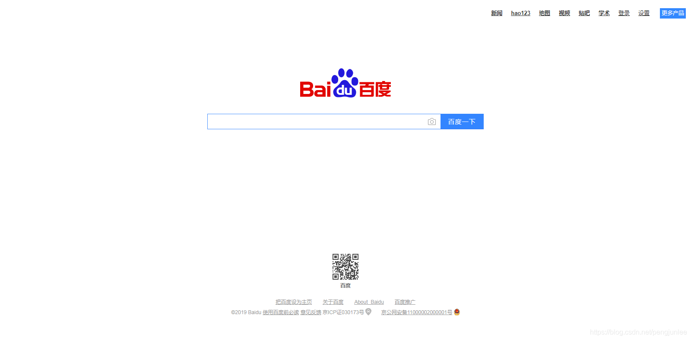

	# -*- coding: utf-8 -*-
	 
	from PIL import Image
	from selenium import webdriver
	from selenium.webdriver.common.by import By
	from selenium.webdriver.support.ui import WebDriverWait
	from selenium.webdriver.support import expected_conditions as EC
	 
	chromedriver_path = "C:\Program Files (x86)\Google\Chrome\Application\chromedriver.exe"  # chromedriver的路径
	 
	print("开始爬取")
	# 创建chrome参数对象
	options = webdriver.ChromeOptions()
	options.add_argument('--no-sandbox')  # 解决DevToolsActivePort文件不存在的报错
	# options.add_argument('--window-size=1920,1080')  # 指定浏览器窗口大小
	options.add_argument('--start-maximized')  # 浏览器窗口最大化
	options.add_argument('--disable-gpu')  # 谷歌文档提到需要加上这个属性来规避bug
	options.add_argument('--hide-scrollbars')  # 隐藏滚动条, 应对一些特殊页面
	# options.add_argument('--blink-settings=imagesEnabled=false')  # 不加载图片,加快访问速度
	# options.add_argument('--headless')  # 浏览器不提供可视化页面. linux下如果系统不支持可视化不加这条会启动失败
	options.add_argument('test-type')
	options.add_experimental_option("excludeSwitches", ["ignore-certificate-errors",
	                                                    "enable-automation"])  # 此步骤很重要，设置为开发者模式，防止被各大网站识别出来使用了Selenium
	# options.add_experimental_option("prefs", {"profile.managed_default_content_settings.images": 2})  # 不加载图片,加快访问速度
	 
	driver = webdriver.Chrome(options=options, executable_path=chromedriver_path)
	driver.get('http://www.baidu.com')
	print(driver.title)
	baidu_img = WebDriverWait(driver, 20).until(
	    EC.presence_of_element_located((By.CSS_SELECTOR, '.index-logo-src'))
	)
	driver.save_screenshot("screenshot.png")  # 对整个浏览器页面进行截图
	left = baidu_img.location['x']
	top = baidu_img.location['y']
	right = baidu_img.location['x'] + baidu_img.size['width']
	bottom = baidu_img.location['y'] + baidu_img.size['height']
	 
	im = Image.open('screenshot.png')
	im = im.crop((left, top, right, bottom))  # 对浏览器截图进行裁剪
	im.save('baidu.png')
	# driver.quit()
	print("爬取完成")

screenshot.png，整个浏览器页面截图：

baidu.png，百度Logo元素截图：

