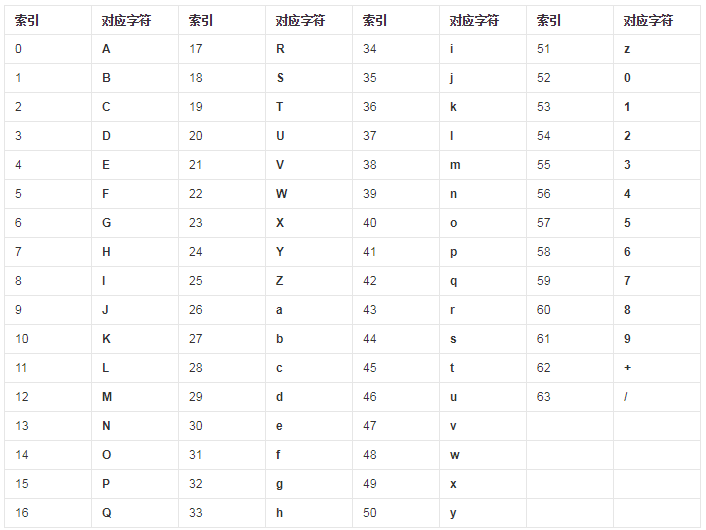

# Base64简介
Base64是网络上最常见的用于传输8Bit字节码的编码方式之一，Base64就是一种基于64个可打印字符（包括`a-z`、`A-Z`、`0-9`、`/`、`+`）来表示二进制数据的方法。Base64编码是从二进制到字符的过程，可用于在HTTP环境下传递较长的标识信息。

按照RFC2045的定义，Base64被定义为：Base64内容传送编码被设计用来把任意序列的8位字节描述为一种不易被人直接识别的形式。（**The Base64 Content-Transfer-Encoding is designed to represent arbitrary sequences of octets in a form that need not be humanly readable.**）  

# BASE64编码原理
Base64要求把每三个8Bit的字节转换为四个6Bit的字节（`3*8 = 4*6 = 24`），然后把6Bit再添两位高位0，组成四个8Bit的字节，也就是说，转换后的字符串理论上将要比原来的长1/3。

Base64编码遵循以下规则： 

- 把3个字符变成4个字符。 
- 每76个字符加一个换行符。 
- 最后的结束符也要处理。 

转码过程示例：

对照转换表：结果 c z E z

从严格意义上来说，BASE64编码算法并不算是真正的加密算法，它只是将源数据转码成为了一种不易阅读的形式，而转码的规则是公开的（解码很容易）。转码之后的数据具有不可读性，需要解码后才能阅读。 

注：BASE64加密后产生的字节位数是8的倍数，如果不够位数以`=`符号填充。

# Python中使用base64

	import base64
	import requests
	import json
	import os.path
	from io import BytesIO
	 
	# Python3 base64官方API：https://docs.python.org/3/library/base64.html
	 
	'''
	操作字符串
	'''
	test_str = 'hello world!'
	# 编码
	encode_str = base64.encodebytes(test_str.encode('utf8'))  # b'aGVsbG8gd29ybGQh\n'
	print(encode_str.decode())  # 默认以utf8解码，结果 aGVsbG8gd29ybGQh
	# 解码
	decode_str = base64.decodebytes(encode_str)  # b'hello world!'
	print(decode_str.decode())  # 默认以utf8解码，结果 hello world!
	 
	'''
	操作本地图片
	'''
	# 编码
	with open("D:\\redis.png", 'rb') as f:
	    encode_img = base64.b64encode(f.read())
	    file_ext = os.path.splitext("D:\\redis.png")[1]
	    print('data:image/{};base64,{}'.format(file_ext[1:], encode_img.decode()))
	    f.close()
	# 解码
	with open("D:\\redis2.png", 'wb') as f:
	    f.write(base64.b64decode(encode_img))
	    f.close()
	 
	'''
	操作网络图片
	'''
	# 编码
	response = requests.get("https://login.sina.com.cn/cgi/pin.php?r=24365533&s=0&p=gz-7c16232cd167e7a4a5ed764688cda14f06bf")
	encode_wimg = base64.b64encode(BytesIO(response.content).read())
	print('data:image/png;base64,%s'% encode_wimg.decode())
	# 解码
	with open("D:\\web.png", 'wb') as f:
	    f.write(base64.b64decode(encode_wimg))
	    f.close()
	 
	'''
	操作字典
	'''
	test_dict = {'hello': 'world', 'year': 2019}
	# 编码
	encode_dict = base64.encodebytes(json.dumps(test_dict, ensure_ascii=False).encode())
	print(encode_dict.decode())  # 结果 eyJoZWxsbyI6ICJ3b3JsZCIsICJ5ZWFyIjogMjAxOX0=
	# 解码
	decode_dict = base64.decodebytes(encode_dict)
	print(decode_dict.decode())  # 结果 {"hello": "world", "year": 2019}
	 
	'''
	操作URL
	'''
	test_url = 'https://docs.python.org/3/library/base64.htm?a=~'
	# 编码
	encode_url = base64.encodebytes(test_url.encode()) # 普通编码
	print(encode_url.decode())  # 结果 eyJoZWxsbyI6ICJ3b3JsZCIsICJ5ZWFyIjogMjAxOX0=
	 
	safe_encode_url = base64.urlsafe_b64encode(test_url.encode()) # URL安全编码
	print(safe_encode_url.decode())  # 结果 aHR0cHM6Ly9kb2NzLnB5dGhvbi5vcmcvMy9saWJyYXJ5L2Jhc2U2NC5odG0_YT1-
	 
	safe_encode_url = base64.b64encode(test_url.encode(),b'-_') # 编码时使用'-' 替换'+' 使用 '_'替换'/' ，效果与前例相同
	print(safe_encode_url.decode())  # 结果 aHR0cHM6Ly9kb2NzLnB5dGhvbi5vcmcvMy9saWJyYXJ5L2Jhc2U2NC5odG0_YT1-
	 