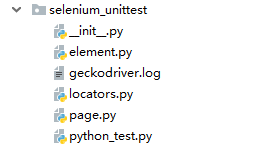

> 中文帮助：<https://selenium-python-zh.readthedocs.io/en/latest/>
> 
> 英文帮助：<https://selenium-python.readthedocs.io/>
> 
> 官方文档：<https://seleniumhq.github.io/selenium/docs/api/py/api.html>

# Selenium简介
Selenium是一个Web的自动化测试工具，最初是为网站自动化测试而开发的。Selenium可以直接运行在浏览器上，它支持所有主流的浏览器（包括PhantomJS这类无界面的浏览器，PhantomJS是一个基于Webkit的“无界面”（headless）浏览器，它会把网站加载到内存并执行页面上的Javascript。），可以接收指令，让浏览器自动加载页面，获取需要的数据，甚至页面截屏。

Selenium还为Python提供了一些非常简洁方便的API，让你能够使用像Firefox、 IE、 Chrome、 Remote 等 Selenium WebDrivers 来编写功能/校验测试。 通过Selenium的API，你可以非常直观的使用Selenium WebDriver的所有功能。当前支持的 Python 版本为 2.7, 3.2及以上。

# 安装Selenium-Python
下载地址：

- <https://pypi.python.org/pypi/selenium>
- <http://selenium-release.storage.googleapis.com/index.html>

你可以使用`pip`命令来安装Selenium：

	pip install selenium

或者，使用easy_install来安装Selenium：

	easy_install selenium

# Selenium-Server的安装与使用
如果你想使用远程WebDriver，你需要先安装一个Selenium-Server， Selenium-Server是一个JAVA工程，推荐在Java Runtime Environment (JRE) 1.6或者更高的版本上运行。

下载地址：<https://www.seleniumhq.org/>

你需要先安装好JDK或者JRE，然后，使用下面的命令运行Selenium-Server:

	java -jar selenium-server-standalone-2.x.x.jar

Selenium-Server成功启动后, 你会看到这样的提示信息：

	15:43:07.541 INFO - RemoteWebDriver instances should connect to: http://127.0.0.1:4444/wd/hub

你可以通过提示中给出的URL连接到远程WebDriver， 下面是一些例子：

	from selenium import webdriver
	from selenium.webdriver.common.desired_capabilities import DesiredCapabilities
	 
	driver = webdriver.Remote(
	    command_executor='http://127.0.0.1:4444/wd/hub',
	    desired_capabilities=DesiredCapabilities.CHROME)
	 
	driver = webdriver.Remote(
	    command_executor='http://127.0.0.1:4444/wd/hub',
	    desired_capabilities=DesiredCapabilities.OPERA)
	 
	driver = webdriver.Remote(
	    command_executor='http://127.0.0.1:4444/wd/hub',
	    desired_capabilities=DesiredCapabilities.HTMLUNITWITHJS)

desired_capabilities 是一个字典，如果你不想使用默认的字典，你可以明确指定它的值：

	driver = webdriver.Remote(
	    command_executor='http://127.0.0.1:4444/wd/hub',
	    desired_capabilities={'browserName': 'htmlunit',
	                          'version': '2',
	                          'javascriptEnabled': True})

# Selenium常用操作
## 请求一个页面
调用WebDriver的`get`方法打开一个链接，WebDriver将等待，直到页面完全加载完毕（`onload`方法执行完毕）， 然后才会继续执行get方法后面的代码。 值得注意的是，如果你的页面使用了大量的Ajax加载， WebDriver可能不知道什么时候页面才会完成加载。 如果你想确保这些页面被完全加载，可以使用Waits操作。

	from selenium import webdriver
	 
	driver = webdriver.Chrome()  # 打开谷歌浏览器
	driver.get("https://github.com") # 请求一个页面
	driver.close() # 关闭浏览器

## 查找元素
Selenium提供了下列方法用来定位一个元素：

	find_element_by_id
	find_element_by_name
	find_element_by_xpath
	find_element_by_link_text
	find_element_by_partial_link_text
	find_element_by_tag_name
	find_element_by_class_name
	find_element_by_css_selector

下列方法用来一次查找多个元素 (返回一个list列表)：

	find_elements_by_name
	find_elements_by_xpath
	find_elements_by_link_text
	find_elements_by_partial_link_text
	find_elements_by_tag_name
	find_elements_by_class_name
	find_elements_by_css_selector

除了上述的公共方法，下面还有两个私有方法`find_element`和`find_elements`：

	from selenium.webdriver.common.by import By
	 
	driver.find_element(By.XPATH, '//button[text()="Some text"]')
	driver.find_elements(By.XPATH, '//button')

下面是`By`类的一些可用属性:

	ID = "id"
	XPATH = "xpath"
	LINK_TEXT = "link text"
	PARTIAL_LINK_TEXT = "partial link text"
	NAME = "name"
	TAG_NAME = "tag name"
	CLASS_NAME = "class name"
	CSS_SELECTOR = "css selector"

## 填写表格

	element = driver.find_element_by_xpath("//select[@name='name']")
	all_options = element.find_elements_by_tag_name("option")
	for option in all_options:
	    print("Value is: %s" % option.get_attribute("value"))
	    option.click()

上面这段代码将会寻找页面第一个select元素, 并遍历他的每一个option元素， 打印它们的值，然后按顺序都选中一遍。
但这并不是处理select元素最好的方法。WebDriver的支持类包括一个叫做Select的类，他提供了一些更为便利的方法来处理这些内容：

	from selenium.webdriver.support.ui import Select
	 
	select = Select(driver.find_element_by_name('name'))
	select.select_by_index(index)
	select.select_by_visible_text("text")
	select.select_by_value(value)
	select.deselect_all()  # 取消选择已经选择的元素
	all_selected_options = select.all_selected_options # 获取所有被选中的选项
	all_options = select.options # 获取所有的选项
	driver.find_element_by_id("submit").click() # 点击提交按钮

或者，WebDriver对每一个元素都有一个叫做`submit`的方法，如果你在一个表单内的元素上使用该方法，WebDriver会在DOM树上就近找到最近的表单进行提交。 如果调用的元素不在表单内，将会抛出NoSuchElementException异常：

	element.submit()

## 拖放
你可以使用拖放，无论是移动一个元素，或放到另一个元素内:

	element = driver.find_element_by_name("source")
	target = driver.find_element_by_name("target")
	 
	from selenium.webdriver import ActionChains
	action_chains = ActionChains(driver)
	action_chains.drag_and_drop(element, target).perform()

## 在不同的窗口和框架之间移动
对于现在的web应用来说，没有任何frames或者只包含一个window窗口是比较罕见的。 WebDriver支持在不同的窗口之间移动，只需要调用switch_to_window方法即可：

	driver.switch_to.window("windowName")

所有的driver将会指向当前窗口，但是你怎么知道当前窗口的名字呢，查看打开他的javascript或者连接代码:

	<a href="somewhere.html" target="windowName">Click here to open a new window</a>

你还可以在`switch_to_window()`中使用窗口句柄来打开它，你也可以使用窗口句柄迭代所有已经打开的窗口:

	for handle in driver.window_handles:
	    driver.switch_to.window(handle)

WebDriver也支持在不同的frame中切换，例如：

	driver.switch_to.frame("frameName")
	driver.switch_to.frame("frameName.0.child") # 切换到frameName的第一个子frame中名称为child的frame
	driver.switch_to.default_content() # 返回父frame
	 
	element = driver.switch_to.active_element 
	alert = driver.switch_to.alert # 切换到弹出对话框
	driver.switch_to.parent_frame()

## 访问浏览器历史记录
在浏览历史中前进和后退你可以使用:

	driver.forward()
	driver.back()

## 操作Cookies

	# 打开一个页面
	driver.get("http://www.example.com")
	 
	# 现在设置Cookies，这个cookie在域名根目录下（”/”）生效
	cookie = {"name" : "foo", "value" : "bar"}
	driver.add_cookie(cookie)
	 
	# 现在获取所有当前URL下可获得的Cookies
	driver.get_cookies()

## 等待页面加载完成
现在的大多数的Web应用程序都使用Ajax技术。当一个页面被加载到浏览器时， 该页面内的元素可以在不同的时间点被加载。这使得定位元素变得困难， 如果元素不在页面之中，会抛出`ElementNotVisibleException`异常。 使用Waits, 我们可以解决这个问题。Waits提供了一些操作之间的时间间隔- 主要是定位元素或针对该元素的任何其他操作。

Selenium Webdriver提供两种类型的`Waits`-`隐式和显式`。 显式等待会让WebDriver等待满足一定的条件以后再继续执行。 而隐式等待让Webdriver等待一定的时间后才开始查找某元素。

### 显式等待
显式等待是你在代码中定义等待，直到满足一定的条件后再继续执行后面的代码。 最糟糕的案例是使用time.sleep()，它将条件设置为等待一个确切的时间段。 这里有一些方便的方法让你只等待需要的时间。WebDriverWait结合ExpectedCondition是实现的一种方式。

	from selenium import webdriver
	from selenium.webdriver.common.by import By
	from selenium.webdriver.support.ui import WebDriverWait
	from selenium.webdriver.support import expected_conditions as EC
	 
	driver = webdriver.Firefox()
	driver.get("http://somedomain/url_that_delays_loading")
	try:
	    element = WebDriverWait(driver, 10).until(
	        EC.presence_of_element_located((By.ID, "myDynamicElement"))
	    )
	finally:
	    driver.quit()

在抛出TimeoutException异常之前将等待10秒或者在10秒内发现了查找的元素。 WebDriverWait 默认情况下会每500毫秒调用一次ExpectedCondition直到结果成功返回。 ExpectedCondition成功的返回结果是一个布尔类型的true或是不为null的返回值。

自动化的Web浏览器中一些常用的预期条件，下面列出的是每一个实现， Selenium Python binding都提供了一些方便的方法，这样你就不用去编写`expected_condition`类或是创建至今的工具包去实现他们。

	title_is、title_contains、presence_of_element_located、visibility_of_element_located、visibility_of、presence_of_all_elements_located、text_to_be_present_in_element、text_to_be_present_in_element_value、frame_to_be_available_and_switch_to_it、invisibility_of_element_located、element_to_be_clickable、staleness_of、element_to_be_selected、element_located_to_be_selected、element_selection_state_to_be、element_located_selection_state_to_be、alert_is_present

 

	from selenium.webdriver.support import expected_conditions as EC
	 
	wait = WebDriverWait(driver, 10)
	element = wait.until(EC.element_to_be_clickable((By.ID,'someid')))

expected_conditions 模块提供了一组预定义的条件供WebDriverWait使用。

### 隐式等待
如果某些元素不是立即可用的，隐式等待是告诉WebDriver去等待一定的时间后去查找元素。 默认等待时间是0秒，一旦设置该值，隐式等待是设置该WebDriver的实例的生命周期。

	from selenium import webdriver
	 
	driver = webdriver.Firefox()
	driver.implicitly_wait(10) # seconds
	driver.get("http://somedomain/url_that_delays_loading")
	myDynamicElement = driver.find_element_by_id("myDynamicElement")

## 页面对象
一个页面对象表示在你测试的WEB应用程序的用户界面上的区域。

使用页面对象模式的好处：

- 创建可复用的代码以便于在多个测试用例间共享
- 减少重复的代码量
- 如果用户界面变化，只需要修改一处

下面是一个在python.org网站搜索一个词并保证一些结果可以找到的测试用例。 

### python_test.py

	import unittest
	from selenium import webdriver
	import page
	 
	 
	class PythonOrgSearch(unittest.TestCase):
	    """A sample test class to show how page object works"""
	 
	    def setUp(self):
	        self.driver = webdriver.Chrome()
	        self.driver.get("http://www.python.org")
	 
	    def test_search_in_python_org(self):
	        """
	        Tests python.org search feature. Searches for the word "pycon" then verified that some results show up.
	        Note that it does not look for any particular text in search results page. This test verifies that
	        the results were not empty.
	        """
	 
	        # Load the main page. In this case the home page of Python.org.
	        main_page = page.MainPage(self.driver)
	        # Checks if the word "Python" is in title
	        assert main_page.is_title_matches(), "python.org title doesn't match."
	        # Sets the text of search textbox to "pycon"
	        main_page.search_text_element = "pycon"
	        main_page.click_go_button()
	        search_results_page = page.SearchResultsPage(self.driver)
	        # Verifies that the results page is not empty
	        assert search_results_page.is_results_found(), "No results found."
	 
	    def tearDown(self):
	        self.driver.close()
	 
	 
	if __name__ == "__main__":
	    unittest.main()

### page.py
页面对象模式意图通过为每一个页面创建一个对象来实现测试代码和技术实现之间的分层解耦。 

	from element import BasePageElement
	from locators import MainPageLocators
	 
	 
	class SearchTextElement(BasePageElement):
	    """This class gets the search text from the specified locator"""
	 
	    # The locator for search box where search string is entered
	    locator = 'q'
	 
	 
	class BasePage(object):
	    """Base class to initialize the base page that will be called from all pages"""
	 
	    def __init__(self, driver):
	        self.driver = driver
	 
	 
	class MainPage(BasePage):
	    """Home page action methods come here. I.e. Python.org"""
	 
	    # Declares a variable that will contain the retrieved text
	    search_text_element = SearchTextElement()
	 
	    def is_title_matches(self):
	        """Verifies that the hardcoded text "Python" appears in page title"""
	        return "Python" in self.driver.title
	 
	    def click_go_button(self):
	        """Triggers the search"""
	        element = self.driver.find_element(*MainPageLocators.GO_BUTTON)
	        element.click()
	 
	 
	class SearchResultsPage(BasePage):
	    """Search results page action methods come here"""
	 
	    def is_results_found(self):
	        # Probably should search for this text in the specific page
	        # element, but as for now it works fine
	        return "No results found." not in self.driver.page_source

### element.py 

	from selenium.webdriver.support.ui import WebDriverWait
	 
	 
	class BasePageElement(object):
	    """Base page class that is initialized on every page object class."""
	 
	    def __set__(self, obj, value):
	        """Sets the text to the value supplied"""
	        driver = obj.driver
	        WebDriverWait(driver, 100).until(
	            lambda driver: driver.find_element_by_name(self.locator))
	        driver.find_element_by_name(self.locator).send_keys(value)
	 
	    def __get__(self, obj, owner):
	        """Gets the text of the specified object"""
	        driver = obj.driver
	        WebDriverWait(driver, 100).until(
	            lambda driver: driver.find_element_by_name(self.locator))
	        element = driver.find_element_by_name(self.locator)
	        return element.get_attribute("value")

### locators.py

	from selenium.webdriver.common.by import By
	 
	class MainPageLocators(object):
	    """A class for main page locators. All main page locators should come here"""
	    GO_BUTTON = (By.ID, 'submit')
	 
	class SearchResultsPageLocators(object):
	    """A class for search results locators. All search results locators should come here"""
	    pass
 