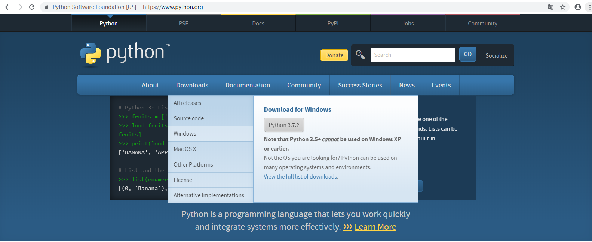

# Python的下载和安装
首先，我们需要通过Python[官方网站](Python官方网站 "https://www.python.org/")下载Python安装包，目前最新的版本是`3.7.2`。在官网首页的导航条上找到`Downloads`按钮，鼠标悬停在上面时会出现一个下拉菜单，如下图所示。

在下拉菜单中，根据自己的操作系统选择对应的Python版本，本文将以Windows为例进行讲解。

注意：苹果的`MAC OS`自带了`Python 2.7.X`，需要另行安装`Python 3.7.2`。但是由于系统运行依赖于自带的`Python 2.7.X`，因此请务必不要删除系统自带的版本。

单击上图中所示的`Windows`按钮之后，将进入下载页面，在这里选择和自己系统匹配的安装文件。为了方便起见，我们选择`executable installer`（可执行的安装程序），如果你的操作系统是`32`位的，请选择`Windows x86 executable installer`；如果操作系统是`64`位的，请选择`Windows x86-64 executable installer`。

下载完成后，双击安装文件，在打开的软件安装界面中选择`Install Now`即可进行默认安装，而选择`Customize installation`可以对安装目录和功能进行自定义。记得勾选`Add Python 3.7 to PATH`选项，以便把安装路径添加到 `PATH`环境变量中，这样就可以在系统各种环境中直接运行Python了。

Python文档下载地址：<https://www.python.org/doc/>

在安装好Python后，使用其自带的`IDLE`编辑器就可以完成代码编写的功能了。但是自带的编辑器功能比较简单，所以可以考虑安装一些其他的编辑器或者IDE，本文推荐使用`Jupyter Notebook`和`PyCharm`。

# Jupyter Notebook的安装与启动

`Jupyter Notebook`是一款开源的Web应用，支持四十余种编程语言，包括在数据科学领域非常流行的`Python`、`R`、`Julia`以及`Scala`，用户可以使用它编写代码、公式、解释性文本和绘图，并且可以把创建好的文档进行分享。

在开始使用Jupyter Notebook之前，我们需要先安装它，安装方法很简单，以管理员身份运行Windows系统自带的命令提示符，或者是MAC OS X的终端，输入下方的命令。

	pip3 install jupyter

稍等片刻，Jupyter Notebook就会自动安装完成。

Jupyter Notebook安装完成之后，在Windows的命令提示符或者是MAC OS X的终端中输入`jupyter notebook`，就可以启动Jupyter Notebook。

这时电脑会自动打开默认的浏览器，并进入Jupyter Notebook的初始界面。

# PyCharm的下载与安装
PyCharm是一款非常好用的Python IDE，提供专业版和社区版，就像eclipse和myeclipse一样，专业版是收费的，而社区版是免费的但功能就没有专业版的功能强大。

首先，我们需要通过PyCharm[官方网站](官方网站 "https://www.jetbrains.com/pycharm/")下载PyCharm安装包。

点击图中的`DOWNLOAD NOW`按钮，进入下载页面。根据自己的操作系统选择对应的PyCharm版本，在这里我们直接下载Windows专业版。

下载完成后，双击安装文件，根据自己的操作系统情况选择安装目录，并设置创建的快捷方式的位数。

接下来我们要对安装好的PyCharm进行激活，启动程序进入到激活界面，选择第二个`Activation code`，在文本域中输入以下激活码即可完成激活。

	MTW881U3Z5-eyJsaWNlbnNlSWQiOiJNVFc4ODFVM1o1IiwibGljZW5zZWVOYW1lIjoiTnNzIEltIiwiYXNzaWduZWVOYW1lIjoiIiwiYXNzaWduZWVFbWFpbCI6IiIsImxpY2Vuc2VSZXN0cmljdGlvbiI6IkZvciBlZHVjYXRpb25hbCB1c2Ugb25seSIsImNoZWNrQ29uY3VycmVudFVzZSI6ZmFsc2UsInByb2R1Y3RzIjpbeyJjb2RlIjoiSUkiLCJwYWlkVXBUbyI6IjIwMTktMTEtMDYifSx7ImNvZGUiOiJBQyIsInBhaWRVcFRvIjoiMjAxOS0xMS0wNiJ9LHsiY29kZSI6IkRQTiIsInBhaWRVcFRvIjoiMjAxOS0xMS0wNiJ9LHsiY29kZSI6IlBTIiwicGFpZFVwVG8iOiIyMDE5LTExLTA2In0seyJjb2RlIjoiR08iLCJwYWlkVXBUbyI6IjIwMTktMTEtMDYifSx7ImNvZGUiOiJETSIsInBhaWRVcFRvIjoiMjAxOS0xMS0wNiJ9LHsiY29kZSI6IkNMIiwicGFpZFVwVG8iOiIyMDE5LTExLTA2In0seyJjb2RlIjoiUlMwIiwicGFpZFVwVG8iOiIyMDE5LTExLTA2In0seyJjb2RlIjoiUkMiLCJwYWlkVXBUbyI6IjIwMTktMTEtMDYifSx7ImNvZGUiOiJSRCIsInBhaWRVcFRvIjoiMjAxOS0xMS0wNiJ9LHsiY29kZSI6IlBDIiwicGFpZFVwVG8iOiIyMDE5LTExLTA2In0seyJjb2RlIjoiUk0iLCJwYWlkVXBUbyI6IjIwMTktMTEtMDYifSx7ImNvZGUiOiJXUyIsInBhaWRVcFRvIjoiMjAxOS0xMS0wNiJ9LHsiY29kZSI6IkRCIiwicGFpZFVwVG8iOiIyMDE5LTExLTA2In0seyJjb2RlIjoiREMiLCJwYWlkVXBUbyI6IjIwMTktMTEtMDYifSx7ImNvZGUiOiJSU1UiLCJwYWlkVXBUbyI6IjIwMTktMTEtMDYifV0sImhhc2giOiIxMDgyODE0Ni8wIiwiZ3JhY2VQZXJpb2REYXlzIjowLCJhdXRvUHJvbG9uZ2F0ZWQiOmZhbHNlLCJpc0F1dG9Qcm9sb25nYXRlZCI6ZmFsc2V9-aKyalfjUfiV5UXfhaMGgOqrMzTYy2rnsmobL47k8tTpR/jvG6HeL3FxxleetI+W+Anw3ZSe8QAMsSxqVS4podwlQgIe7f+3w7zyAT1j8HMVlfl2h96KzygdGpDSbwTbwOkJ6/5TQOPgAP86mkaSiM97KgvkZV/2nXQHRz1yhm+MT+OsioTwxDhd/22sSGq6KuIztZ03UvSciEmyrPdl2ueJw1WuT9YmFjdtTm9G7LuXvCM6eav+BgCRm+wwtUeDfoQqigbp0t6FQgkdQrcjoWvLSB0IUgp/f4qGf254fA7lXskT2VCFdDvi0jgxLyMVct1cKnPdM6fkHnbdSXKYDWw==-MIIElTCCAn2gAwIBAgIBCTANBgkqhkiG9w0BAQsFADAYMRYwFAYDVQQDDA1KZXRQcm9maWxlIENBMB4XDTE4MTEwMTEyMjk0NloXDTIwMTEwMjEyMjk0NlowaDELMAkGA1UEBhMCQ1oxDjAMBgNVBAgMBU51c2xlMQ8wDQYDVQQHDAZQcmFndWUxGTAXBgNVBAoMEEpldEJyYWlucyBzLnIuby4xHTAbBgNVBAMMFHByb2QzeS1mcm9tLTIwMTgxMTAxMIIBIjANBgkqhkiG9w0BAQEFAAOCAQ8AMIIBCgKCAQEAxcQkq+zdxlR2mmRYBPzGbUNdMN6OaXiXzxIWtMEkrJMO/5oUfQJbLLuMSMK0QHFmaI37WShyxZcfRCidwXjot4zmNBKnlyHodDij/78TmVqFl8nOeD5+07B8VEaIu7c3E1N+e1doC6wht4I4+IEmtsPAdoaj5WCQVQbrI8KeT8M9VcBIWX7fD0fhexfg3ZRt0xqwMcXGNp3DdJHiO0rCdU+Itv7EmtnSVq9jBG1usMSFvMowR25mju2JcPFp1+I4ZI+FqgR8gyG8oiNDyNEoAbsR3lOpI7grUYSvkB/xVy/VoklPCK2h0f0GJxFjnye8NT1PAywoyl7RmiAVRE/EKwIDAQABo4GZMIGWMAkGA1UdEwQCMAAwHQYDVR0OBBYEFGEpG9oZGcfLMGNBkY7SgHiMGgTcMEgGA1UdIwRBMD+AFKOetkhnQhI2Qb1t4Lm0oFKLl/GzoRykGjAYMRYwFAYDVQQDDA1KZXRQcm9maWxlIENBggkA0myxg7KDeeEwEwYDVR0lBAwwCgYIKwYBBQUHAwEwCwYDVR0PBAQDAgWgMA0GCSqGSIb3DQEBCwUAA4ICAQAF8uc+YJOHHwOFcPzmbjcxNDuGoOUIP+2h1R75Lecswb7ru2LWWSUMtXVKQzChLNPn/72W0k+oI056tgiwuG7M49LXp4zQVlQnFmWU1wwGvVhq5R63Rpjx1zjGUhcXgayu7+9zMUW596Lbomsg8qVve6euqsrFicYkIIuUu4zYPndJwfe0YkS5nY72SHnNdbPhEnN8wcB2Kz+OIG0lih3yz5EqFhld03bGp222ZQCIghCTVL6QBNadGsiN/lWLl4JdR3lJkZzlpFdiHijoVRdWeSWqM4y0t23c92HXKrgppoSV18XMxrWVdoSM3nuMHwxGhFyde05OdDtLpCv+jlWf5REAHHA201pAU6bJSZINyHDUTB+Beo28rRXSwSh3OUIvYwKNVeoBY+KwOJ7WnuTCUq1meE6GkKc4D/cXmgpOyW/1SmBz3XjVIi/zprZ0zf3qH5mkphtg6ksjKgKjmx1cXfZAAX6wcDBNaCL+Ortep1Dh8xDUbqbBVNBL4jbiL3i3xsfNiyJgaZ5sX7i8tmStEpLbPwvHcByuf59qJhV/bZOl8KqJBETCDJcY6O2aqhTUy+9x93ThKs1GKrRPePrWPluud7ttlgtRveit/pcBrnQcXOl1rHq7ByB8CFAxNotRUYL9IF5n3wJOgkPojMy6jetQA5Ogc8Sm7RG6vg1yow==

注意：以上激活码的激活有效期到`2019-11-07`截止，若失效可百度新的激活码重新激活。

# 常用库的安装及功能简介
Python有一些非常常用的工具库，这些库包括`Numpy`、`Scipy`、`matplotlib`、`pandas`、`IPython`，以及非常核心的`scikit-learn`。下面我们一起来安装这些库。

首先，如果你用的是MAC OS X，那安装的过程会令人很舒服，你只需要在MAC的终端中输入一行命令：

	sudo pip3 install numpy scipy matplotlib ipython pandas scikit-learn

然后安静地等待计算机把这些库逐一下载并安装好就可以了。

但如果是Windows系统，你可能会在安装Scipy这一步时遇到一些问题，解决办法是在下面这个链接中手动下载`Numpy+MKL` 的安装文件和`Scipy`的安装文件。

	https://www.lfd.uci.edu/~gohlke/pythonlibs/

我的系统是Windows 64位，Python版本为`3.7.2`，下载好的Numpy+MKL和Scipy安装文件如下：

然后以管理员身份运行Windows命令提示符，在命令提示符中进入两个安装文件所在的目录，输入命令如下：

	pip install numpy-1.16.2+mkl-cp37-cp37m-win_amd64.whl
	pip install scipy-1.2.1-cp37-cp37m-win_amd64.whl

 

注意：一定要先安装`Numpy+MKL`安装包，再安装`Scipy`才能成功。

安装完成之后，在Python IDLE中输入`import scipy`来验证Scipy是否安装成功，如果没有报错，则说明Scipy安装成功。

 