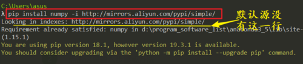
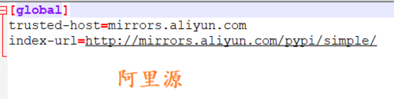
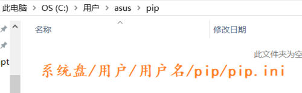
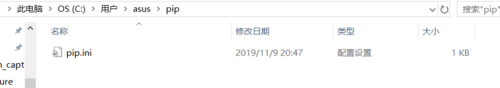
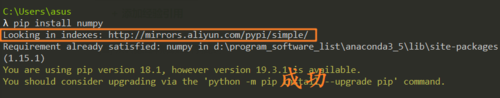

> 原文链接：<https://jingyan.baidu.com/article/b24f6c8296b507c6bee5da4f.html>

python默认的pip源在国外，如果下载比较大的第三方库时可能会非常非常慢，甚至会报错，所以为了有一个更加友好的python使用体验，建议为python的pip换一下源。

# 命令行加参数的方法

	# 用默认源下载 
	pip install 库名==版本
	 
	# 使用特定源下载 
	pip install 库名==版本 -i  源地址

推荐第二种方法，比如我用阿里云的pip源

# 持久化配置（配置文件）
## Windows系统
windows上要在用户主目录加上一个pip文件夹，里面增加一个`pip.ini`文件。

pip.ini中填上如图内容：

用户主目录即：`系统盘/用户/[用户名]/`

(建立ini文件时可以先建立记事本文件然后编辑后再重名为pip.ini)

windows上我已经做过了如上的配置，看下效果：成功

## OSX／Linux系统
在当前用户目录下创建`.pip`文件夹:`mkdir ~/.pip`，然后在该目录下创建`pip.conf`文件填写(类似windows)：

	[global]
	trusted-host=[主机名]
	index-url=[镜像源的url]

例如，使用阿里云提供的pip源： 

	[global]
	trusted-host=mirrors.aliyun.com
	index-url=http://mirrors.aliyun.com/pypi/simple/

也可以使用pip的命令行参数的方法【通用】

 

 