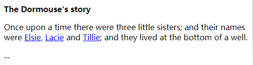

`Beautiful Soup`是一个用来从HTML或XML文件中提取数据的Python库，它利用大家所喜欢的解析器提供了许多惯用方法用来对文档树进行导航、查找和修改。

帮助文档英文版：<https://www.crummy.com/software/BeautifulSoup/bs4/doc/>

帮助文档中文版：<https://www.crummy.com/software/BeautifulSoup/bs4/doc.zh/>

# 入门示例
以下是电影《爱丽丝梦游仙境》中的一段HTML内容：

我们以此为例，对如何使用BeautifulSoup解析HTML页面内容进行简单入门示例：

	from bs4 import BeautifulSoup
	 
	# 《爱丽丝梦游仙境》故事片段
	html_doc = """
	<html>
	<head><title>The Dormouse's story</title></head>
	<body>
	
<b>The Dormouse's story</b>

	
Once upon a time there were three little sisters; and their names were
	<a href="http://example.com/elsie" class="sister" id="link1">Elsie</a>,
	<a href="http://example.com/lacie" class="sister" id="link2">Lacie</a> and
	<a href="http://example.com/tillie" class="sister" id="link3">Tillie</a>;
	and they lived at the bottom of a well.

	
...

	</body>
	</html>
	"""
	 
	# 构造解析树
	soup = BeautifulSoup(html_doc, "html.parser")
	 
	# 美化输出
	#soup.prettify())
	 
	# 获取第一个 title 标签
	soup.title
	# <title>The Dormouse's story</title>
	 
	# 获取第一个 title 标签的名称
	soup.title.name
	# title
	 
	# 获取第一个 title 标签的文本内容
	soup.title.string
	# The Dormouse's story
	 
	# 获取第一个 title 标签的父标签的名称
	soup.title.parent.name
	# head
	 
	# 获取第一个 p 标签
	soup.p
	# 
<b>The Dormouse's story</b>

	 
	# 获取第一个 p 标签的 class 属性
	soup.p['class']
	# ['title']
	 
	# 获取第一个 a 标签
	soup.a
	# <a class="sister" href="http://example.com/elsie" id="link1">Elsie</a>
	 
	# 查找所有的 a 标签
	soup.find_all('a')
	# [<a class="sister" href="http://example.com/elsie" id="link1">Elsie</a>,
	#  <a class="sister" href="http://example.com/lacie" id="link2">Lacie</a>,
	#  <a class="sister" href="http://example.com/tillie" id="link3">Tillie</a>]
	 
	# 获取所有的 a 标签的 href 属性
	for link in soup.find_all('a'):
	    print(link.get('href'))
	# http://example.com/elsie
	# http://example.com/lacie
	# http://example.com/tillie
	 
	# 查找 id = link3 的 a 标签
	soup.find(id="link3")
	# <a class="sister" href="http://example.com/tillie" id="link3">Tillie</a>
	 
	# 获取解析树的文本内容
	print(soup.get_text())
	# The Dormouse's story
	# 
	# The Dormouse's story
	# Once upon a time there were three little sisters; and their names were
	# Elsie,
	# Lacie and
	# Tillie;
	# and they lived at the bottom of a well.
	# ...

# 解析器
`Beautiful Soup`除了支持Python标准库中的HTML解析器外，还支持一些第三方的解析器，其中一个就是`lxml`。

下表列出了主要的解析器，以及它们的优缺点：
<table><tbody><tr><td> 
解析器
 </td><td> 
使用方法
 </td><td> 
优势
 </td><td> 
劣势
 </td></tr><tr><td> 
Python标准库
 </td><td> 
BeautifulSoup(markup, "html.parser")
 </td><td> 
Python的内置标准库
 
执行速度适中
 
文档容错能力强
 </td><td> 
Python 2.7.3 or 3.2.2)前 的版本中文档容错能力差
 </td></tr><tr><td> 
lxml HTML 解析器
 </td><td> 
BeautifulSoup(markup, "lxml")
 </td><td> 
速度快
 
文档容错能力强
 </td><td> 
需要安装C语言库
 </td></tr><tr><td> 
lxml XML 解析器
 </td><td> 
BeautifulSoup(markup, ["lxml", "xml"])
 
BeautifulSoup(markup, "xml")
 </td><td> 
速度快
 
唯一支持XML的解析器
 </td><td> 
需要安装C语言库
 </td></tr><tr><td> 
html5lib
 </td><td> 
BeautifulSoup(markup, "html5lib")
 </td><td> 
最好的容错性
 
以浏览器的方式解析文档
 
生成HTML5格式的文档
 </td><td> 
速度慢
 
不依赖外部扩展
 </td></tr></tbody></table>

推荐使用lxml作为解析器，因为效率更高。 在Python2.7.3之前的版本和Python3中3.2.2之前的版本，必须安装lxml或html5lib， 因为那些Python版本的标准库中内置的HTML解析方法不够稳定。

注意： 如果一段HTML或XML文档格式不正确的话，那么在不同的解析器中返回的结果可能是不一样的。

## 解析器之间的区别
`Beautiful Soup`为不同的解析器提供了相同的接口，但解析器本身是有区别的，同一篇文档被不同的解析器解析后可能会生成不同结构的树型文档，区别最大的是HTML解析器和XML解析器，看下面片段被解析成HTML结构：

	html_soup = BeautifulSoup("<a><b/></a>", "lxml")
	print(html_soup)
	# <html><body><a><b></b></a></body></html>

因为空标签`<b/>`不符合HTML标准，所以解析器把它解析成`<b></b>`。

同样的文档使用XML解析如下(解析XML需要安装lxml库)。**注意**，空标签`<b/>`依然被保留，并且文档前添加了XML头，而不是被包含在`<html>`标签内：

	xml_soup = BeautifulSoup("<a><b/></a>", "xml")
	print(xml_soup)
	# <?xml version="1.0" encoding="utf-8"?>
	# <a><b/></a>

HTML解析器之间也有区别，如果被解析的HTML文档是标准格式，那么解析器之间没有任何差别，只是解析速度不同，结果都会返回正确的文档树。

但是如果被解析文档不是标准格式，那么不同的解析器返回结果可能不同。下面例子中，使用lxml解析错误格式的文档，结果`
`标签被直接忽略掉了：

	soup = BeautifulSoup("<a>
", "lxml")
	print(soup)
	# <html><body></body></html>

使用html5lib库解析相同文档会得到不同的结果：

	soup = BeautifulSoup("<a>
", "html5lib")
	print(soup)
	# <html><head></head><body><a>

</a></body></html>

html5lib库没有忽略掉`
`标签，而是自动补全了标签，还给文档树添加了`<head>`标签。

使用pyhton内置库解析结果如下:

	soup = BeautifulSoup("<a>
", "html.parser")
	print(soup)
	# 

与lxml库类似的，Python内置库忽略掉了`
`标签，与html5lib库不同的是标准库没有尝试创建符合标准的文档格式或将文档片段包含在`<body>`标签内，与lxml不同的是标准库甚至连`<html>`标签都没有尝试去添加。

因为文档片段`<a>
`是错误格式，所以以上解析方式都能算作`正确`，html5lib库使用的是HTML5的部分标准，所以最接近`正确`，不过所有解析器的结构都能够被认为是`正常`的。

不同的解析器可能影响代码执行结果，如果在分发给别人的代码中使用了BeautifulSoup，那么最好注明使用了哪种解析器，以减少不必要的麻烦。

# 创建文档对象
将一段文档传入BeautifulSoup的构造方法，就能得到一个文档的对象， 可以传入一段字符串或一个文件句柄。

	from bs4 import BeautifulSoup
	 
	soup = BeautifulSoup(open("index.html"))
	soup = BeautifulSoup("<html>data</html>")

首先，文档被转换成Unicode，并且HTML的实例都被转换成Unicode编码。

	soup = BeautifulSoup("Sacr&eacute; bleu!")
	print(soup)
	# <html><body>
Sacré bleu!
</body></html>

然后，Beautiful Soup选择最合适的解析器来解析这段文档，如果手动指定解析器那么Beautiful Soup会选择指定的解析器来解析文档。

# 对象的种类
Beautiful Soup将复杂HTML文档转换成一个复杂的树形结构，每个节点都是Python对象，所有对象可以归纳为4种：`Tag`、`NavigableString`、`BeautifulSoup、Comment`。

## Tag
Tag对象与XML或HTML原生文档中的tag相同：

	from bs4 import BeautifulSoup
	 
	soup = BeautifulSoup('<b class="boldest">Extremely bold</b>',"html.parser")
	 
	# 获取第一个 b 标签
	tag = soup.b
	 
	# 获取对象类型
	type(tag)
	# <class 'bs4.element.Tag'>
	 
	# 获取标签的名称
	tag.name
	# b
	 
	# 修改标签的名称
	tag.name = "blockquote"
	tag
	# <blockquote class="boldest">Extremely bold</blockquote>
	 
	# 查看标签的 class 属性
	tag['class']
	# ['boldest']
	 
	# 修改标签的 class 属性
	tag['class'] = 'verybold'
	 
	# 查看标签的 class 属性内容
	tag.get('class')
	# verybold
	 
	# 为标签新增 id 属性
	tag['id'] = 'title'
	tag
	# <blockquote class="verybold" id="title">Extremely bold</blockquote>
	 
	# 查看标签的所有属性
	tag.attrs
	# {'class': ['verybold'], 'id': 'title'}
	 
	# 删除标签的 id 属性
	del tag['id']
	tag
	# <blockquote class="verybold">Extremely bold</blockquote>

## 可遍历字符串
字符串常被包含在tag内，Beautiful Soup用`NavigableString`类来包装tag中的字符串：

	from bs4 import BeautifulSoup
	 
	soup = BeautifulSoup('<b class="boldest">Extremely bold</b>', "html.parser")
	 
	# 获取第一个 b 标签
	tag = soup.b
	 
	# 获取标签的文本内容
	tag.string
	# Extremely bold
	 
	# 获取标签的文本内容的类型
	type(tag.string)
	# <class 'bs4.element.NavigableString'>

## BeautifulSoup
`BeautifulSoup`对象表示的是一个文档的全部内容，大部分时候，可以把它当作Tag对象，它支持`遍历文档树`和`搜索文档树`中描述的大部分的方法。

因为BeautifulSoup对象并不是真正的HTML或XML的tag，所以它没有name和attribute属性。但有时查看它的`.name`属性是很方便的，所以BeautifulSoup对象包含了一个值为`[document]`的特殊属性`.name`。

	soup = BeautifulSoup('<b class="boldest">Extremely bold</b>',"html.parser")
	soup.name
	# [document]

## 注释及特殊字符串
Tag、NavigableString、BeautifulSoup几乎覆盖了html和xml中的所有内容，但是还有一些特殊对象，容易让人担心的内容是文档的注释部分：

	markup = "<b><!--Hey, buddy. Want to buy a used parser?--></b>"
	soup = BeautifulSoup(markup)
	comment = soup.b.string
	type(comment)
	# <class 'bs4.element.Comment'>

Comment对象是一个特殊类型的`NavigableString`对象：

	comment
	# Hey, buddy. Want to buy a used parser?

但是当它出现在HTML文档中时， Comment 对象会使用特殊的格式输出：

	soup.b.prettify()
	# <b>
	# <!--Hey, buddy. Want to buy a used parser?-->
	# </b>

Beautiful Soup中定义的其它类型都可能会出现在XML的文档中：`CData`，`ProcessingInstruction`， `Declaration`，`Doctype`。与`Comment`对象类似。这些类都是`NavigableString`的子类，只是添加了一些额外的方法的字符串独享。下面是用CDATA来替代注释的例子：

	from bs4 import CData
	 
	cdata = CData("A CDATA block")
	comment.replace_with(cdata)
	 
	print(soup.b.prettify())
	# <b>
	# <![CDATA[A CDATA block]]>
	# </b>

## 子节点
一个Tag可能包含多个字符串或其它的Tag，这些都是这个Tag的子节点。`Beautiful Soup`提供了许多操作和遍历子节点的属性。

注意： `Beautiful Soup`中字符串节点不支持这些属性,因为字符串没有子节点。

继续拿上面的《爱丽丝梦游仙境》的文档来做示例：

	from bs4 import BeautifulSoup
	 
	# 《爱丽丝梦游仙境》故事片段
	html_doc = """
	<html>
	<head><title>The Dormouse's story</title></head>
	<body>
	
<b>The Dormouse's story</b>

	
Once upon a time there were three little sisters; and their names were
	<a href="http://example.com/elsie" class="sister" id="link1">Elsie</a>,
	<a href="http://example.com/lacie" class="sister" id="link2">Lacie</a> and
	<a href="http://example.com/tillie" class="sister" id="link3">Tillie</a>;
	and they lived at the bottom of a well.

	
...

	</body>
	</html>
	"""
	 
	# 构造解析树
	soup = BeautifulSoup(html_doc, "html.parser")
	 
	# 通过点取属性的方式获得当前名字的第一个tag
	soup.body.p.b
	# <b>The Dormouse's story</b>
	 
	# 查找所有的 a 标签
	soup.find_all('a')
	# [<a class="sister" href="http://example.com/elsie" id="link1">Elsie</a>,
	#  <a class="sister" href="http://example.com/lacie" id="link2">Lacie</a>,
	#  <a class="sister" href="http://example.com/tillie" id="link3">Tillie</a>]
	 
	# 通过 .contents 属性获取tag 的子节点列表
	soup.head.contents
	# [<title>The Dormouse's story</title>]
	 
	# 通过 .children 生成器对tag的子节点进行遍历
	for child in soup.head.children:
	    print(child)
	# <title>The Dormouse's story</title>
	 
	# 通过 .descendants 生成器对tag的后代节点进行遍历
	for descendant in soup.head.descendants:
	    print(descendant)
	# <title>The Dormouse's story</title>
	# The Dormouse's story
	 
	# 通过 .string 属性获取唯一  NavigableString 类型子节点
	soup.head.title.string
	# The Dormouse's story
	 
	# 通过 .string 属性获取唯一子节点的NavigableString 类型子节点
	soup.head.string
	# The Dormouse's story
	 
	# 通过 .strings 属性获取 tag 中的多个字符串
	for string in soup.strings:
	    print(repr(string))
	    
	# 通过 .stripped_strings 属性获取 tag 中去除多余空白内容的多个字符串
	for string in soup.stripped_strings:
	    print(repr(string))

注意：如果tag包含了多个子节点，tag就无法确定`.string`方法应该调用哪个子节点的内容，`.string`的输出结果是`None`。

## 父节点
每个tag或字符串都有父节点，还是以上面的《爱丽丝梦游仙境》的文档来举例：

	from bs4 import BeautifulSoup
	 
	# 《爱丽丝梦游仙境》故事片段
	html_doc = """
	<html>
	<head><title>The Dormouse's story</title></head>
	<body>
	
<b>The Dormouse's story</b>

	
Once upon a time there were three little sisters; and their names were
	<a href="http://example.com/elsie" class="sister" id="link1">Elsie</a>,
	<a href="http://example.com/lacie" class="sister" id="link2">Lacie</a> and
	<a href="http://example.com/tillie" class="sister" id="link3">Tillie</a>;
	and they lived at the bottom of a well.

	
...

	</body>
	</html>
	"""
	 
	# 构造解析树
	soup = BeautifulSoup(html_doc, "html.parser")
	 
	# 通过 .parent 属性来获取 title 标签的父节点
	soup.title.parent
	# <head><title>The Dormouse's story</title></head>
	 
	# 通过 .parent 属性来获取 title 标签的内字符串的父节点
	soup.title.string.parent
	# <title>The Dormouse's story</title>
	 
	# 文档的顶层节点 <html> 的父节点是 BeautifulSoup 对象
	type(soup.html.parent)
	# <class 'bs4.BeautifulSoup'>
	 
	# BeautifulSoup 对象的 .parent 是None
	soup.parent
	 
	for parent in soup.a.parents:
	    print(parent.name)
	# p
	# body
	# html
	# [document]

## 兄弟节点
为了示例如何使用BeautifulSoup来查找兄弟节点，需要对上例中的《爱丽丝梦游仙境》文档进行修改，删掉一些换行符、字符串和标签。具体示例代码如下：

	from bs4 import BeautifulSoup
	 
	# 《爱丽丝梦游仙境》故事片段
	html_doc = """
	<html>
	<body>
	
<b>Schindler's List</b>

	
<a href="http://example.com/Oskar" id="name1">Oskar Schindler</a><a href="http://example.com/Itzhak" id="name2">Itzhak Stern</a><a href="http://example.com/Helen" id="name3">Helen Hirsch</a>

	</body>
	</html>
	"""
	 
	# 构造解析树
	soup = BeautifulSoup(html_doc, "html.parser")
	 
	# 获取 ID = name2 的 a 标签
	name2 = soup.find("a", {"id":{"name2"}})
	# <a href="http://example.com/Itzhak" id="name2">Itzhak Stern</a>
	 
	# 获取前一个兄弟节点
	name1 = name2.previous_sibling
	# <a href="http://example.com/Oskar" id="name1">Oskar Schindler</a>
	 
	# 获取前一个兄弟节点
	name3 = name2.next_sibling
	# <a href="http://example.com/Helen" id="name3">Helen Hirsch</a>
	 
	name1.previous_sibling
	# None
	 
	name3.next_sibling
	# None
	 
	# 通过 .next_siblings 属性对当前节点的兄弟节点进行遍历
	for sibling in soup.find("a", {"id":{"name1"}}).next_siblings:
	    print(repr(sibling))
	# <a href="http://example.com/Itzhak" id="name2">Itzhak Stern</a>
	# <a href="http://example.com/Helen" id="name3">Helen Hirsch</a>
	 
	# 通过  .previous_siblings 属性对当前节点的兄弟节点进行遍历
	for sibling in soup.find("a", {"id":{"name3"}}).previous_siblings:
	    print(repr(sibling))
	# <a href="http://example.com/Itzhak" id="name2">Itzhak Stern</a>
	# <a href="http://example.com/Oskar" id="name1">Oskar Schindler</a>

注意：标签之间包含的字符串、字符或者换行符等内容均会被看作节点。

## 回退和前进
继续用上一章节`兄弟节点`中的HTML文档进行回退和前进示例：

	from bs4 import BeautifulSoup
	 
	# 《爱丽丝梦游仙境》故事片段
	html_doc = """
	<html>
	<body>
	
<b>Schindler's List</b>

	
<a href="http://example.com/Oskar" id="name1">Oskar Schindler</a><a href="http://example.com/Itzhak" id="name2">Itzhak Stern</a><a href="http://example.com/Helen" id="name3">Helen Hirsch</a>

	</body>
	</html>
	"""
	 
	# 构造解析树
	soup = BeautifulSoup(html_doc, "html.parser")
	 
	# 获取 ID = name2 的 a 标签
	name2 = soup.find("a", {"id":{"name2"}})
	# <a href="http://example.com/Itzhak" id="name2">Itzhak Stern</a>
	 
	# 获取前一个节点
	name2.previous_element
	# Oskar Schindler
	 
	# 获取前一个节点的前一个节点
	name2.previous_element.previous_element
	# <a href="http://example.com/Oskar" id="name1">Oskar Schindler</a>
	 
	# 获取后一个节点
	name2.next_element
	# Itzhak Stern
	 
	 
	# 获取后一个节点的后一个节点
	name2.next_element.next_element
	# <a href="http://example.com/Helen" id="name3">Helen Hirsch</a>
	 
	# 通过 .next_elements 属性对当前节点的后面节点进行遍历
	for element in soup.find("a", {"id":{"name1"}}).next_elements:
	   print(repr(element))
	# 'Oskar Schindler'
	# <a href="http://example.com/Itzhak" id="name2">Itzhak Stern</a>
	# 'Itzhak Stern'
	# <a href="http://example.com/Helen" id="name3">Helen Hirsch</a>
	# 'Helen Hirsch'
	# '\n'
	# '\n'
	# '\n'
	 
	# 通过 .previous_elements 属性对当前节点的前面节点进行遍历
	for element in soup.find("a", {"id":{"name1"}}).previous_elements:
	   print(repr(element))
	# 
<a href="http://example.com/Oskar" id="name1">Oskar Schindler</a><a href="http://example.com/Itzhak" id="name2">Itzhak Stern</a><a href="http://example.com/Helen" id="name3">Helen Hirsch</a>

	# '\n'
	# "Schindler's List"
	# <b>Schindler's List</b>
	# 
<b>Schindler's List</b>

	# '\n'
	# <body>
	# 
<b>Schindler's List</b>

	# 
<a href="http://example.com/Oskar" id="name1">Oskar Schindler</a><a href="http://example.com/Itzhak" id="name2">Itzhak Stern</a><a href="http://example.com/Helen" id="name3">Helen Hirsch</a>

	# </body>
	# '\n'
	# <html>
	# <body>
	# 
<b>Schindler's List</b>

	# 
<a href="http://example.com/Oskar" id="name1">Oskar Schindler</a><a href="http://example.com/Itzhak" id="name2">Itzhak Stern</a><a href="http://example.com/Helen" id="name3">Helen Hirsch</a>

	# </body>
	# </html>
	# '\n'

# 搜索文档树

	find_all( name , attrs , recursive , text , **kwargs )
	find( name , attrs , recursive , text , **kwargs )
	find_parents( name , attrs , recursive , text , **kwargs )
	find_parent( name , attrs , recursive , text , **kwargs )
	find_next_siblings( name , attrs , recursive , text , **kwargs )
	find_next_sibling( name , attrs , recursive , text , **kwargs )
	find_previous_siblings( name , attrs , recursive , text , **kwargs )
	find_previous_sibling( name , attrs , recursive , text , **kwargs )
	find_all_next( name , attrs , recursive , text , **kwargs )
	find_next( name , attrs , recursive , text , **kwargs )
	find_all_previous( name , attrs , recursive , text , **kwargs )
	find_previous( name , attrs , recursive , text , **kwargs )
	Beautiful Soup定义了很多搜索方法，这里着重对 find_all() 的用法进行举例。
	
	from bs4 import BeautifulSoup
	from bs4 import NavigableString
	import re
	 
	# 《爱丽丝梦游仙境》故事片段
	html_doc = """
	<html>
	<head><title>The Dormouse's story</title></head>
	<body>
	
<b>The Dormouse's story</b>

	
Once upon a time there were three little sisters; and their names were
	<a href="http://example.com/elsie" class="sister" id="link1">Elsie</a>,
	<a href="http://example.com/lacie" class="sister" id="link2">Lacie</a> and
	<a href="http://example.com/tillie" class="sister" id="link3">Tillie</a>;
	and they lived at the bottom of a well.

	
...

	</body>
	</html>
	"""
	 
	# 构造解析树
	soup = BeautifulSoup(html_doc, "html.parser")
	 
	# 传入字符串，根据标签名称查找(b)标签
	soup.find_all('b')
	# [<b>The Dormouse's story</b>]
	 
	# 传入两个字符串参数，返回 class = title 的 p 标签
	soup.find_all("p", "title")
	# [
<b>The Dormouse's story</b>
]
	 
	# 返回 id = link2 的标签
	soup.find_all(id='link2')
	# [<a class="sister" href="http://example.com/lacie" id="link2">Lacie</a>]
	 
	# href 匹配 elsie 并且 id = link1 的标签
	soup.find_all(href=re.compile("elsie"), id='link1')
	# [<a class="sister" href="http://example.com/elsie" id="link1">three</a>]
	 
	# 返回 id = link1 的标签
	print(soup.find_all(attrs={"id": "link1"}))
	# [<a class="sister" href="http://example.com/elsie" id="link1">Elsie</a>]
	 
	# 返回 class = sister 的 a 标签
	soup.find_all("a", class_="sister")
	# [<a class="sister" href="http://example.com/elsie" id="link1">Elsie</a>,
	# <a class="sister" href="http://example.com/lacie" id="link2">Lacie</a>,
	# <a class="sister" href="http://example.com/tillie" id="link3">Tillie</a>]
	 
	def has_six_characters(css_class):
	    return css_class is not None and len(css_class) == 6
	 
	# 返回 class 属性为6个字符的 标签
	soup.find_all(class_=has_six_characters)
	# [<a class="sister" href="http://example.com/elsie" id="link1">Elsie</a>,
	#  <a class="sister" href="http://example.com/lacie" id="link2">Lacie</a>,
	#  <a class="sister" href="http://example.com/tillie" id="link3">Tillie</a>]
	 
	# 返回字符串
	soup.find_all(text=["Tillie", "Elsie", "Lacie"])
	 
	# 返回前两个 a 标签
	soup.find_all("a", limit=2)
	 
	# 返回 title 标签,不级联查询
	soup.html.find_all("title", recursive=False)
	 
	# 使用 CSS 选择器进行过滤
	soup.select("head > title")
	 
	# 传入正则表达式，根据标签名称查找匹配(以字母 b 开头)标签
	for tag in soup.find_all(re.compile("^b")):
	    print(tag.name)
	# body
	# b
	 
	# 传入正则表达式，根据标签名称查找匹配(包含字母 t)标签
	for tag in soup.find_all(re.compile("t")):
	    print(tag.name)
	# html
	# title
	 
	# 传入列表，根据标签名称查找(a和b)标签
	soup.find_all(["a", "b"])
	# [<b>The Dormouse's story</b>, 
	# <a class="sister" href="http://example.com/elsie" id="link1">Elsie</a>, 
	# <a class="sister" href="http://example.com/lacie" id="link2">Lacie</a>, 
	# <a class="sister" href="http://example.com/tillie" id="link3">Tillie</a>]
	 
	# 传入True，返回除字符串节点外的所有标签
	for tag in soup.find_all(True):
	    print(tag.name)
	 
	def has_class_but_no_id(tag):
	    return tag.has_attr('class') and not tag.has_attr('id')
	 
	# 传入自定义方法，返回仅包含 class 属性但不包含 id 属性的所有标签
	soup.find_all(has_class_but_no_id)
 