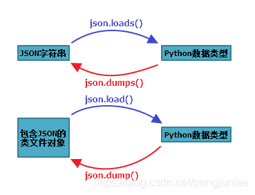

JSON (JavaScript Object Notation) 是一种轻量级的数据交换格式。Python3 中可以使用 json 模块来对 JSON 数据进行编解码，主要包含了下面4个操作函数：

提示：所谓类文件对象指那些具有`read()`或者`write()`方法的对象，例如，`f = open('a.txt','r')`，其中的`f`有`read()`方法，所以`f`就是类文件对象。 

在json的编解码过程中，python的原始类型与JSON类型会相互转换，具体的转化对照如下：

Python 编码为 JSON 类型转换对应表：

<table border="1" cellpadding="0" cellspacing="0" style="width:658px;"><tbody><tr><td style="width:384px;">Python</td><td style="width:271px;">JSON</td></tr><tr><td style="width:384px;">dict</td><td style="width:271px;">object</td></tr><tr><td style="width:384px;">list, tuple</td><td style="width:271px;">array</td></tr><tr><td style="width:384px;">str</td><td style="width:271px;">string</td></tr><tr><td style="width:384px;">int, float, int- &amp; float-derived Enums</td><td style="width:271px;">number</td></tr><tr><td style="width:384px;">True</td><td style="width:271px;">true</td></tr><tr><td style="width:384px;">False</td><td style="width:271px;">false</td></tr><tr><td style="width:384px;">None</td><td style="width:271px;">null</td></tr></tbody></table>

JSON 解码为 Python 类型转换对应表：

<table border="1" cellpadding="0" cellspacing="0" style="width:663px;"><tbody><tr><td style="width:389px;">JSON</td><td style="width:271px;">Python</td></tr><tr><td style="width:389px;">object</td><td style="width:271px;">dict</td></tr><tr><td style="width:389px;">array</td><td style="width:271px;">list</td></tr><tr><td style="width:389px;">string</td><td style="width:271px;">str</td></tr><tr><td style="width:389px;">number (int)</td><td style="width:271px;">int</td></tr><tr><td style="width:389px;">number (real)</td><td style="width:271px;">float</td></tr><tr><td style="width:389px;">true</td><td style="width:271px;">True</td></tr><tr><td style="width:389px;">false</td><td style="width:271px;">False</td></tr><tr><td style="width:389px;">null</td><td style="width:271px;">None</td></tr></tbody></table>

操作示例 ：

	import json
	 
	data = {
	    'name': 'pengjunlee',
	    'age': 32,
	    'vip': True,
	    'address': {'province': 'GuangDong', 'city': 'ShenZhen'}
	}
	# 将 Python 字典类型转换为 JSON 对象
	json_str = json.dumps(data)
	print(json_str) # 结果 {"name": "pengjunlee", "age": 32, "vip": true, "address": {"province": "GuangDong", "city": "ShenZhen"}}
	 
	# 将 JSON 对象类型转换为 Python 字典
	user_dic = json.loads(json_str)
	print(user_dic['address']) # 结果 {'province': 'GuangDong', 'city': 'ShenZhen'}
	 
	# 将 Python 字典直接输出到文件
	with open('pengjunlee.json', 'w', encoding='utf-8') as f:
	    json.dump(user_dic, f, ensure_ascii=False, indent=4)
	 
	# 将类文件对象中的JSON字符串直接转换成 Python 字典
	with open('pengjunlee.json', 'r', encoding='utf-8') as f:
	    ret_dic = json.load(f)
	    print(type(ret_dic)) # 结果 <class 'dict'>
	    print(ret_dic['name']) # 结果 pengjunlee

注意：使用`eval()`能够实现简单的字符串和Python类型的转化。 

	user1 = eval('{"name":"pengjunlee"}')
	print(user1['name']) # 结果 pengjunlee
 