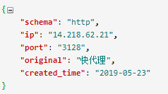
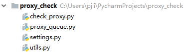

在《基于Scrapy的IP代理池搭建》一文中，我们将从网页爬取到的免费代理IP按照如下格式保存到了Redis的 `proxies:unchecked:list`队列中。

同时，为了避免同一代理IP被重复存储，在将代理保存到·proxies:unchecked:list·队列之前，会先将其URL（例如：<https://39.98.254.72:3128>）保存到`proxies:unchecked:set`集合中用来进行去重校验。

众所周知，代理IP都是有时效性的。不可避免地，你会发现爬取到`proxies:unchecked:list`队列中的代理大部分都是不可用的，所以在使用代理IP之前还需要对代理IP的可用性进行验证，验证的方法就是：`使用代理IP去请求指定URL，根据返回的响应判断代理IP是否可用`。

废话到此为止，接下来呈上验证代理IP可用性的代码，项目完整目录如下。

# 项目代码  
## utils.py
`utils.py`是一个工具类，包含了一些常用操作，比如：剔除字符串的首位空白，获取代理IP的URL，更新代理IP的信息。

	# -*- coding: utf-8 -*-
	import logging
	from settings import PROXY_URL_FORMATTER
	 
	# 设置日志的输出样式
	logging.basicConfig(level=logging.INFO,
	                    format='[%(asctime)-15s] [%(levelname)8s] [%(name)10s ] - %(message)s (%(filename)s:%(lineno)s)',
	                    datefmt='%Y-%m-%d %T'
	                    )
	logger = logging.getLogger(__name__)
	 
	 
	# 剔除字符串的首位空格
	def strip(data):
	    if data is not None:
	        return data.strip()
	    return data
	 
	# 获取代理IP的url地址
	def _get_url(proxy):
	    return PROXY_URL_FORMATTER % {'schema': proxy['schema'], 'ip': proxy['ip'], 'port': proxy['port']}
	 
	# 根据请求结果更新代理IP的字段信息
	def _update(proxy, successed=False):
	    proxy['used_total'] = proxy['used_total'] + 1
	    if successed:
	        proxy['continuous_failed'] = 0
	        proxy['success_times'] = proxy['success_times'] + 1
	    else:
	        proxy['continuous_failed'] = proxy['continuous_failed'] + 1

## settings.py
`settings.py`汇聚了整个项目的配置信息。 

	# 指定Redis的主机名和端口
	REDIS_HOST = '172.16.250.238'
	REDIS_PORT = 6379
	REDIS_PASSWORD = 123456
	 
	# 保存已经检验的代理的 Redis key 格式化字符串
	PROXIES_REDIS_FORMATTER = 'proxies::{}'
	 
	# 保存已经检验的代理
	PROXIES_REDIS_EXISTED = 'proxies::existed'
	 
	# 保存未检验代理的Redis key
	PROXIES_UNCHECKED_LIST = 'proxies:unchecked:list'
	 
	# 已经存在的未检验HTTP代理和HTTPS代理集合
	PROXIES_UNCHECKED_SET = 'proxies:unchecked:set'
	 
	# 最多连续失败几次
	MAX_FAILURE_TIMES = 2
	 
	# 代理地址的格式化字符串
	PROXY_URL_FORMATTER = '%(schema)s://%(ip)s:%(port)s'
	 
	BASE_HEADERS = {
	    'Connection': 'close',
	    'Accept': '*/*',
	    'Accept-Encoding': 'gzip, deflate, sdch',
	    'Accept-Language': 'en-US,en;q=0.9,zh-CN;q=0.8,zh;q=0.7'
	}
	 
	USER_AGENT_LIST = [
	    "Mozilla/5.0 (Windows NT 6.1; WOW64) AppleWebKit/537.1 (KHTML, like Gecko) Chrome/22.0.1207.1 Safari/537.1",
	    "Mozilla/5.0 (X11; CrOS i686 2268.111.0) AppleWebKit/536.11 (KHTML, like Gecko) Chrome/20.0.1132.57 Safari/536.11",
	    "Mozilla/5.0 (Windows NT 6.1; WOW64) AppleWebKit/536.6 (KHTML, like Gecko) Chrome/20.0.1092.0 Safari/536.6",
	    "Mozilla/5.0 (Windows NT 6.2) AppleWebKit/536.6 (KHTML, like Gecko) Chrome/20.0.1090.0 Safari/536.6",
	    "Mozilla/5.0 (Windows NT 6.2; WOW64) AppleWebKit/537.1 (KHTML, like Gecko) Chrome/19.77.34.5 Safari/537.1",
	    "Mozilla/5.0 (X11; Linux x86_64) AppleWebKit/536.5 (KHTML, like Gecko) Chrome/19.0.1084.9 Safari/536.5",
	    "Mozilla/5.0 (Windows NT 6.0) AppleWebKit/536.5 (KHTML, like Gecko) Chrome/19.0.1084.36 Safari/536.5",
	    "Mozilla/5.0 (Windows NT 6.1; WOW64) AppleWebKit/536.3 (KHTML, like Gecko) Chrome/19.0.1063.0 Safari/536.3",
	    "Mozilla/5.0 (Windows NT 5.1) AppleWebKit/536.3 (KHTML, like Gecko) Chrome/19.0.1063.0 Safari/536.3",
	    "Mozilla/5.0 (Macintosh; Intel Mac OS X 10_8_0) AppleWebKit/536.3 (KHTML, like Gecko) Chrome/19.0.1063.0 Safari/536.3",
	    "Mozilla/5.0 (Windows NT 6.2) AppleWebKit/536.3 (KHTML, like Gecko) Chrome/19.0.1062.0 Safari/536.3",
	    "Mozilla/5.0 (Windows NT 6.1; WOW64) AppleWebKit/536.3 (KHTML, like Gecko) Chrome/19.0.1062.0 Safari/536.3",
	    "Mozilla/5.0 (Windows NT 6.2) AppleWebKit/536.3 (KHTML, like Gecko) Chrome/19.0.1061.1 Safari/536.3",
	    "Mozilla/5.0 (Windows NT 6.1; WOW64) AppleWebKit/536.3 (KHTML, like Gecko) Chrome/19.0.1061.1 Safari/536.3",
	    "Mozilla/5.0 (Windows NT 6.1) AppleWebKit/536.3 (KHTML, like Gecko) Chrome/19.0.1061.1 Safari/536.3",
	    "Mozilla/5.0 (Windows NT 6.2) AppleWebKit/536.3 (KHTML, like Gecko) Chrome/19.0.1061.0 Safari/536.3",
	    "Mozilla/5.0 (X11; Linux x86_64) AppleWebKit/535.24 (KHTML, like Gecko) Chrome/19.0.1055.1 Safari/535.24",
	    "Mozilla/5.0 (Windows NT 6.2; WOW64) AppleWebKit/535.24 (KHTML, like Gecko) Chrome/19.0.1055.1 Safari/535.24"
	]
	 
	# 检验代理可用性的请求地址
	PROXY_CHECK_URLS = {'https': ['https://blog.csdn.net/pengjunlee/article/details/81212250',
	                              'https://blog.csdn.net/pengjunlee/article/details/54974260', 'https://icanhazip.com'],
	                    'http': ['http://blog.csdn.net/pengjunlee/article/details/80919833',
	                             'http://blog.csdn.net/pengjunlee/article/details/81589972', 'http://icanhazip.com']}
## proxy_queue.py
`proxy_queue.py`定义了两个代理存储队列类：刚刚爬取到的尚未检测过可用性的代理IP队列（UncheckQueue）和已经检测过可用性的代理IP队列（CheckQueue，该队列中的代理IP也需要定时反复检测可用性）。

	# -*- coding: utf-8 -*-
	import json
	from utils import _get_url
	from settings import PROXIES_REDIS_EXISTED, PROXIES_REDIS_FORMATTER, PROXIES_UNCHECKED_LIST, PROXIES_UNCHECKED_SET, \
	    MAX_FAILURE_TIMES
	 
	"""
	Proxy Queue Base Class
	"""
	class BaseQueue(object):
	 
	    def __init__(self, server):
	        """Initialize the proxy queue instance
	        Parameters
	        ----------
	        server : StrictRedis
	            Redis client instance
	        """
	        self.server = server
	 
	    def _is_existed(self, proxy):
	        """判断当前代理是否已经存在"""
	        added = self.server.sadd(PROXIES_REDIS_EXISTED, _get_url(proxy))
	        return added == 0
	 
	    def push(self, proxy):
	        """根据检验结果，将代理放入相应队列"""
	        if not self._is_existed(proxy) and proxy['continuous_failed'] < MAX_FAILURE_TIMES:
	            key = PROXIES_REDIS_FORMATTER.format(proxy['schema'])
	            self.server.rpush(key, json.dumps(proxy, ensure_ascii=False))
	 
	    def pop(self, schema, timeout=0):
	        """Pop a proxy"""
	        raise NotImplementedError
	 
	    def __len__(self, schema):
	        """Return the length of the queue"""
	        raise NotImplementedError
	 
	 
	class CheckedQueue(BaseQueue):
	    """待检测的代理队列"""
	 
	    def __len__(self, schema):
	        """Return the length of the queue"""
	        return self.server.llen(PROXIES_REDIS_FORMATTER.format(schema))
	 
	    def pop(self, schema, timeout=0):
	        """从未检测列表弹出一个待检测的代理"""
	        if timeout > 0:
	            p = self.server.blpop(PROXIES_REDIS_FORMATTER.format(schema), timeout)
	            if isinstance(p, tuple):
	                p = p[1]
	        else:
	            p = self.server.lpop(PROXIES_REDIS_FORMATTER.format(schema))
	        if p:
	            p = eval(p)
	            self.server.srem(PROXIES_REDIS_EXISTED, _get_url(p))
	            return p
	 
	 
	class UncheckedQueue(BaseQueue):
	    """已检测的代理队列"""
	 
	    def __len__(self, schema=None):
	        """Return the length of the queue"""
	        return self.server.llen(PROXIES_UNCHECKED_LIST)
	 
	    def pop(self, schema=None, timeout=0):
	        """从未检测列表弹出一个待检测的代理"""
	        if timeout > 0:
	            p = self.server.blpop(PROXIES_UNCHECKED_LIST, timeout)
	            if isinstance(p, tuple):
	                p = p[1]
	        else:
	            p = self.server.lpop(PROXIES_UNCHECKED_LIST)
	        if p:
	            p = eval(p)
	            self.server.srem(PROXIES_UNCHECKED_SET, _get_url(p))
	            return p

## check_proxy.py
使用`OptionParser`模块，通过从命令终端传入不同参数来控制检测不同代理队列的可用性。 

	# encoding=utf-8
	import redis
	from optparse import OptionParser
	import random
	import requests
	from utils import logger, _get_url, _update
	from proxy_queue import CheckedQueue, UncheckedQueue
	from settings import USER_AGENT_LIST, BASE_HEADERS, REDIS_HOST, REDIS_PORT, REDIS_PASSWORD, PROXY_CHECK_URLS
	 
	USAGE = "usage: python check_proxy.py [ -c -s <schema>] or [-u]"
	 
	parser = OptionParser(USAGE)
	parser.add_option("-c", "--checked", action="store_true", dest="checked", help="check the proxies already checked")
	parser.add_option("-u", "--unchecked", action="store_false", dest="checked", help="check the proxies to be checked")
	parser.add_option("-s", "--schema", action="store", dest="schema", type="choice", choices=['http', 'https'],
	                  help="the schema of the proxies to be checked")
	options, args = parser.parse_args()
	 
	r = redis.StrictRedis(host=REDIS_HOST, port=REDIS_PORT, password=REDIS_PASSWORD)
	if options.checked:
	    schema = options.schema
	    if schema is None:
	        logger.error("使用 -c 参数时，需要指定 -s 参数！！！")
	    proxy_queue = CheckedQueue(r)
	else:
	    schema = None
	    proxy_queue = UncheckedQueue(r)
	 
	# 获取当前待检测队列中代理的数量
	count = proxy_queue.__len__(schema=schema)
	while count > 0:
	 
	    logger.info("待检测代理数量： " + str(count))
	    count = count - 1
	 
	    # 获取代理
	    proxy = proxy_queue.pop(schema=options.schema)
	    proxies = {proxy['schema']: _get_url(proxy)}
	 
	    # 初始化计数字段值
	    if "used_total" not in proxy:
	        proxy['used_total'] = 0
	    if "success_times" not in proxy:
	        proxy['success_times'] = 0
	    if "continuous_failed" not in proxy:
	        proxy['continuous_failed'] = 0
	    # 构造请求头
	    headers = dict(BASE_HEADERS)
	    if 'User-Agent' not in headers.keys():
	        headers['User-Agent'] = random.choice(USER_AGENT_LIST)
	 
	    for url in PROXY_CHECK_URLS[proxy['schema']]:
	        try:
	            # 使用代理发送请求，获取响应
	            response = requests.get(url, headers=headers, proxies=proxies, timeout=5)
	        except BaseException:
	            logger.info("使用代理< " + _get_url(proxy) + " > 请求 < " + url + " > 结果： 失败 ")
	            successed = False
	        else:
	            if (response.status_code == 200):
	                logger.info("使用代理< " + _get_url(proxy) + " > 请求 < " + url + " > 结果： 成功 ")
	                successed = True
	                break
	            else:
	                logger.info("使用代理< " + _get_url(proxy) + " > 请求 < " + url + " > 结果： 失败 ")
	                successed = False
	 
	    if options.checked:
	        # 已检测过的代理，根据检测结果更新代理信息
	        _update(proxy, successed=successed)
	        # 将代理返还给队列
	        proxy_queue.push(proxy)
	    elif successed:
	        # 首次检测的代理，如果可用直接放入可用队列
	        proxy_queue.push(proxy)

# 运行方法
打开命令行终端，执行如下命令开始检测代理IP的可用性：

	python check_proxy.py -u # 检测 proxies:unchecked:list 队列中代理的可用性
	python check_proxy.py -c -s http # 检测 proxies::http 队列中代理的可用性
	python check_proxy.py -c -s https # 检测 proxies::https 队列中代理的可用性

例如：

	[root@localhost proxy_check]# python3 /usr/local/src/python_projects/proxy_check/check_proxy.py -c -s http
	[2019-05-23 20:15:18] [    INFO] [     utils ] - 待检测代理数量： 437 (check_proxy.py:33)
	[2019-05-23 20:15:23] [    INFO] [     utils ] - 使用代理< http://5.202.192.146:8080 > 请求 < http://blog.csdn.net/pengjunlee/article/details/80919833 > 结果： 失败  (check_proxy.py:58)
	[2019-05-23 20:15:28] [    INFO] [     utils ] - 使用代理< http://5.202.192.146:8080 > 请求 < http://blog.csdn.net/pengjunlee/article/details/81589972 > 结果： 失败  (check_proxy.py:58)
	[2019-05-23 20:15:34] [    INFO] [     utils ] - 使用代理< http://5.202.192.146:8080 > 请求 < http://icanhazip.com > 结果： 失败  (check_proxy.py:58)
	[2019-05-23 20:15:34] [    INFO] [     utils ] - 待检测代理数量： 436 (check_proxy.py:33)
	[2019-05-23 20:15:35] [    INFO] [     utils ] - 使用代理< http://60.217.137.22:8060 > 请求 < http://blog.csdn.net/pengjunlee/article/details/80919833 > 结果： 成功  (check_proxy.py:63)

Github地址：<https://github.com/pengjunlee/proxy_check>