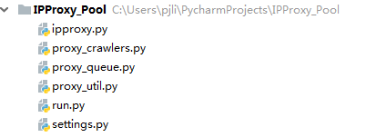
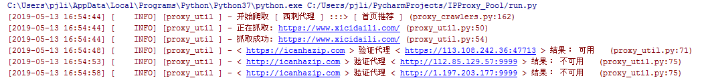
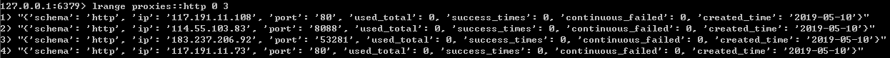
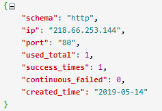

# 为什么要搭建爬虫代理池
在众多的网站防爬措施中，有一种是根据ip的访问频率进行限制，即在某一时间段内，当某个ip的访问次数达到一定的阀值时，该ip就会被拉黑、在一段时间内禁止访问。

应对的方法有两种：

- 降低爬虫的爬取频率，避免IP被限制访问，缺点显而易见：会大大降低爬取的效率。
- 搭建一个IP代理池，使用不同的IP轮流进行爬取。

# 搭建思路

1. 从代理网站(如：西刺代理、快代理、云代理、无忧代理)爬取代理IP；
2. 验证代理IP的可用性（使用代理IP去请求指定URL，根据响应验证代理IP是否生效）；
3. 将可用的代理IP保存到数据库；

常用代理网站：[西刺代理](西刺代理 "https://www.xicidaili.com/") 、[云代理](云代理 "http://www.ip3366.net/") 、[IP海](IP海 "http://www.iphai.com/") 、[无忧代理](无忧代理 "http://www.data5u.com/") 、[飞蚁代理](飞蚁代理 "http://www.feiyiproxy.com/") 、[快代理](快代理 "https://www.kuaidaili.com/")。

# 代码实现

工程结构如下：

## ipproxy.py
IPProxy代理类定义了要爬取的IP代理的字段信息和一些基础方法。

	# -*- coding: utf-8 -*-
	import re
	import time
	from settings import PROXY_URL_FORMATTER
	 
	schema_pattern = re.compile(r'http|https$', re.I)
	ip_pattern = re.compile(r'^([0-9]{1,3}.){3}[0-9]{1,3}$', re.I)
	port_pattern = re.compile(r'^[0-9]{2,5}$', re.I)
	 
	class IPProxy:
	    '''
	    {
	        "schema": "http", # 代理的类型
	        "ip": "127.0.0.1", # 代理的IP地址
	        "port": "8050", # 代理的端口号
	        "used_total": 11, # 代理的使用次数
	        "success_times": 5, # 代理请求成功的次数
	        "continuous_failed": 3, # 使用代理发送请求，连续失败的次数
	        "created_time": "2018-05-02" # 代理的爬取时间
	    }
	    '''
	 
	    def __init__(self, schema, ip, port, used_total=0, success_times=0, continuous_failed=0,
	                 created_time=None):
	        """Initialize the proxy instance"""
	        if schema == "" or schema is None:
	            schema = "http"
	        self.schema = schema.lower()
	        self.ip = ip
	        self.port = port
	        self.used_total = used_total
	        self.success_times = success_times
	        self.continuous_failed = continuous_failed
	        if created_time is None:
	            created_time = time.strftime('%Y-%m-%d', time.localtime(time.time()))
	        self.created_time = created_time
	 
	    def _get_url(self):
	        ''' Return the proxy url'''
	        return PROXY_URL_FORMATTER % {'schema': self.schema, 'ip': self.ip, 'port': self.port}
	 
	    def _check_format(self):
	        ''' Return True if the proxy fields are well-formed,otherwise return False'''
	        if self.schema is not None and self.ip is not None and self.port is not None:
	            if schema_pattern.match(self.schema) and ip_pattern.match(self.ip) and port_pattern.match(self.port):
	                return True
	        return False
	 
	    def _is_https(self):
	        ''' Return True if the proxy is https,otherwise return False'''
	        return self.schema == 'https'
	 
	    def _update(self, successed=False):
	        ''' Update proxy based on the result of the request's response'''
	        self.used_total = self.used_total + 1
	        if successed:
	            self.continuous_failed = 0
	            self.success_times = self.success_times + 1
	        else:
	            print(self.continuous_failed)
	            self.continuous_failed = self.continuous_failed + 1
	 
	if __name__ == '__main__':
	    proxy = IPProxy('HTTPS', '192.168.2.25', "8080")
	    print(proxy._get_url())
	    print(proxy._check_format())
	    print(proxy._is_https())

## settings.py
settings.py中汇聚了工程所需要的配置信息。

	# 指定Redis的主机名和端口
	REDIS_HOST = 'localhost'
	REDIS_PORT = 6379
	 
	# 代理保存到Redis key 格式化字符串
	PROXIES_REDIS_FORMATTER = 'proxies::{}'
	# 已经存在的HTTP代理和HTTPS代理集合
	PROXIES_REDIS_EXISTED = 'proxies::existed'
	 
	# 最多连续失败几次
	MAX_CONTINUOUS_TIMES = 3
	# 代理地址的格式化字符串
	PROXY_URL_FORMATTER = '%(schema)s://%(ip)s:%(port)s'
	 
	USER_AGENT_LIST = [
	    "Mozilla/5.0 (Windows NT 6.1; WOW64) AppleWebKit/537.1 (KHTML, like Gecko) Chrome/22.0.1207.1 Safari/537.1",
	    "Mozilla/5.0 (X11; CrOS i686 2268.111.0) AppleWebKit/536.11 (KHTML, like Gecko) Chrome/20.0.1132.57 Safari/536.11",
	    "Mozilla/5.0 (Windows NT 6.1; WOW64) AppleWebKit/536.6 (KHTML, like Gecko) Chrome/20.0.1092.0 Safari/536.6",
	    "Mozilla/5.0 (Windows NT 6.2) AppleWebKit/536.6 (KHTML, like Gecko) Chrome/20.0.1090.0 Safari/536.6",
	    "Mozilla/5.0 (Windows NT 6.2; WOW64) AppleWebKit/537.1 (KHTML, like Gecko) Chrome/19.77.34.5 Safari/537.1",
	    "Mozilla/5.0 (X11; Linux x86_64) AppleWebKit/536.5 (KHTML, like Gecko) Chrome/19.0.1084.9 Safari/536.5",
	    "Mozilla/5.0 (Windows NT 6.0) AppleWebKit/536.5 (KHTML, like Gecko) Chrome/19.0.1084.36 Safari/536.5",
	    "Mozilla/5.0 (Windows NT 6.1; WOW64) AppleWebKit/536.3 (KHTML, like Gecko) Chrome/19.0.1063.0 Safari/536.3",
	    "Mozilla/5.0 (Windows NT 5.1) AppleWebKit/536.3 (KHTML, like Gecko) Chrome/19.0.1063.0 Safari/536.3",
	    "Mozilla/5.0 (Macintosh; Intel Mac OS X 10_8_0) AppleWebKit/536.3 (KHTML, like Gecko) Chrome/19.0.1063.0 Safari/536.3",
	    "Mozilla/5.0 (Windows NT 6.2) AppleWebKit/536.3 (KHTML, like Gecko) Chrome/19.0.1062.0 Safari/536.3",
	    "Mozilla/5.0 (Windows NT 6.1; WOW64) AppleWebKit/536.3 (KHTML, like Gecko) Chrome/19.0.1062.0 Safari/536.3",
	    "Mozilla/5.0 (Windows NT 6.2) AppleWebKit/536.3 (KHTML, like Gecko) Chrome/19.0.1061.1 Safari/536.3",
	    "Mozilla/5.0 (Windows NT 6.1; WOW64) AppleWebKit/536.3 (KHTML, like Gecko) Chrome/19.0.1061.1 Safari/536.3",
	    "Mozilla/5.0 (Windows NT 6.1) AppleWebKit/536.3 (KHTML, like Gecko) Chrome/19.0.1061.1 Safari/536.3",
	    "Mozilla/5.0 (Windows NT 6.2) AppleWebKit/536.3 (KHTML, like Gecko) Chrome/19.0.1061.0 Safari/536.3",
	    "Mozilla/5.0 (X11; Linux x86_64) AppleWebKit/535.24 (KHTML, like Gecko) Chrome/19.0.1055.1 Safari/535.24",
	    "Mozilla/5.0 (Windows NT 6.2; WOW64) AppleWebKit/535.24 (KHTML, like Gecko) Chrome/19.0.1055.1 Safari/535.24"
	]
	# 爬取到的代理保存前先检验是否可用，默认True
	PROXY_CHECK_BEFOREADD = True
	# 检验代理可用性的请求地址，支持多个
	PROXY_CHECK_URLS = {'https':['https://icanhazip.com'],'http':['http://icanhazip.com']}

## proxy_util.py
proxy_util.py中主要定义了一些实用方法，例如：proxy_to_dict(proxy)用来将IPProxy代理实例转换成字典；proxy_from_dict(d)用来将字典转换为IPProxy实例；request_page()用来发送请求；_is_proxy_available()用来校验代理IP是否可用。

	# -*- coding: utf-8 -*-
	import random
	import logging
	import requests
	from ipproxy import IPProxy
	from settings import USER_AGENT_LIST, PROXY_CHECK_URLS
	 
	# Setting logger output format
	logging.basicConfig(level=logging.INFO,
	                    format='[%(asctime)-15s] [%(levelname)8s] [%(name)10s ] - %(message)s (%(filename)s:%(lineno)s)',
	                    datefmt='%Y-%m-%d %T'
	                    )
	logger = logging.getLogger(__name__)
	 
	 
	def proxy_to_dict(proxy):
	    d = {
	        "schema": proxy.schema,
	        "ip": proxy.ip,
	        "port": proxy.port,
	        "used_total": proxy.used_total,
	        "success_times": proxy.success_times,
	        "continuous_failed": proxy.continuous_failed,
	        "created_time": proxy.created_time
	    }
	    return d
	 
	 
	def proxy_from_dict(d):
	    return IPProxy(schema=d['schema'], ip=d['ip'], port=d['port'], used_total=d['used_total'],
	                   success_times=d['success_times'], continuous_failed=d['continuous_failed'],
	                   created_time=d['created_time'])
	 
	 
	# Truncate header and tailer blanks
	def strip(data):
	    if data is not None:
	        return data.strip()
	    return data
	 
	 
	base_headers = {
	    'Accept-Encoding': 'gzip, deflate, br',
	    'Accept-Language': 'en-US,en;q=0.9,zh-CN;q=0.8,zh;q=0.7'
	}
	 
	 
	def request_page(url, options={}, encoding='utf-8'):
	    """send a request,get response"""
	    headers = dict(base_headers, **options)
	    if 'User-Agent' not in headers.keys():
	        headers['User-Agent'] = random.choice(USER_AGENT_LIST)
	 
	    logger.info('正在抓取: ' + url)
	    try:
	        response = requests.get(url, headers=headers)
	        if response.status_code == 200:
	            logger.info('抓取成功: ' + url)
	            return response.content.decode(encoding=encoding)
	    except ConnectionError:
	        logger.error('抓取失败' + url)
	        return None
	 
	def _is_proxy_available(proxy, options={}):
	    """Check whether the Proxy is available or not"""
	    headers = dict(base_headers, **options)
	    if 'User-Agent' not in headers.keys():
	        headers['User-Agent'] = random.choice(USER_AGENT_LIST)
	    proxies = {proxy.schema: proxy._get_url()}
	    check_urls = PROXY_CHECK_URLS[proxy.schema]
	    for url in check_urls:
	        try:
	            response = requests.get(url=url, proxies=proxies, headers=headers, timeout=5)
	        except BaseException:
	            logger.info("< " + url + " > 验证代理 < " + proxy._get_url() + " > 结果： 不可用  ")
	        else:
	            if response.status_code == 200:
	                logger.info("< " + url + " > 验证代理 < " + proxy._get_url() + " > 结果： 可用  ")
	                return True
	            else:
	                logger.info("< " + url + " > 验证代理 < " + proxy._get_url() + " > 结果： 不可用  ")
	    return False
	 
	 
	if __name__ == '__main__':
	    headers = dict(base_headers)
	    if 'User-Agent' not in headers.keys():
	        headers['User-Agent'] = random.choice(USER_AGENT_LIST)
	    proxies = {"https": "https://163.125.255.154:9797"}
	    response = requests.get("https://www.baidu.com", headers=headers, proxies=proxies, timeout=3)
	    print(response.content)

## proxy_queue.py
代理队列用来保存并对外提供 IP代理，不同的代理队列内代理IP的保存和提取策略可以不同。在这里，`BaseQueue`是所有代理队列的基类，其中声明了所有代理队列都需要实现的保存代理IP、提取代理IP、查看代理IP数量等接口。示例的 `FifoQueue`是一个先进先出队列，底层使用Redis列表实现，为了确保同一个代理IP只能被放入队列一次，这里使用了一个Redis`proxies::existed`集合进行入队前重复校验。

	# -*- coding: utf-8 -*-
	from proxy_util import logger
	import json
	import redis
	from ipproxy import IPProxy
	from proxy_util import proxy_to_dict, proxy_from_dict, _is_proxy_available
	from settings import PROXIES_REDIS_EXISTED, PROXIES_REDIS_FORMATTER, MAX_CONTINUOUS_TIMES, PROXY_CHECK_BEFOREADD
	 
	"""
	Proxy Queue Base Class
	"""
	class BaseQueue(object):
	 
	    def __init__(self, server):
	        """Initialize the proxy queue instance
	        Parameters
	        ----------
	        server : StrictRedis
	            Redis client instance
	        """
	        self.server = server
	 
	    def _serialize_proxy(self, proxy):
	        """Serialize proxy instance"""
	        return proxy_to_dict(proxy)
	 
	    def _deserialize_proxy(self, serialized_proxy):
	        """deserialize proxy instance"""
	        return proxy_from_dict(eval(serialized_proxy))
	 
	    def __len__(self, schema='http'):
	        """Return the length of the queue"""
	        raise NotImplementedError
	 
	    def push(self, proxy, need_check):
	        """Push a proxy"""
	        raise NotImplementedError
	 
	    def pop(self, schema='http', timeout=0):
	        """Pop a proxy"""
	        raise NotImplementedError
	 
	 
	class FifoQueue(BaseQueue):
	    """First in first out queue"""
	 
	    def __len__(self, schema='http'):
	        """Return the length of the queue"""
	        return self.server.llen(PROXIES_REDIS_FORMATTER.format(schema))
	 
	    def push(self, proxy, need_check=PROXY_CHECK_BEFOREADD):
	        """Push a proxy"""
	        if need_check and not _is_proxy_available(proxy):
	            return
	        elif proxy.continuous_failed < MAX_CONTINUOUS_TIMES and not self._is_existed(proxy):
	            key = PROXIES_REDIS_FORMATTER.format(proxy.schema)
	            self.server.rpush(key, json.dumps(self._serialize_proxy(proxy),ensure_ascii=False))
	 
	    def pop(self, schema='http', timeout=0):
	        """Pop a proxy"""
	        if timeout > 0:
	            p = self.server.blpop(PROXIES_REDIS_FORMATTER.format(schema.lower()), timeout)
	            if isinstance(p, tuple):
	                p = p[1]
	        else:
	            p = self.server.lpop(PROXIES_REDIS_FORMATTER.format(schema.lower()))
	        if p:
	            p = self._deserialize_proxy(p)
	            self.server.srem(PROXIES_REDIS_EXISTED, p._get_url())
	            return p
	 
	    def _is_existed(self, proxy):
	        added = self.server.sadd(PROXIES_REDIS_EXISTED, proxy._get_url())
	        return added == 0
	 
	 
	if __name__ == '__main__':
	    r = redis.StrictRedis(host='localhost', port=6379)
	    queue = FifoQueue(r)
	    proxy = IPProxy('http', '218.66.253.144', '80')
	    queue.push(proxy)
	    proxy = queue.pop(schema='http')
	    print(proxy._get_url())

## proxy_crawlers.py

ProxyBaseCrawler是所有代理爬虫的基类，其中只定义了一个`_start_crawl()`方法用来从搜集到的代理网站爬取代理IP。

	# -*- coding: utf-8 -*-
	from lxml import etree
	from ipproxy import IPProxy
	from proxy_util import strip, request_page, logger
	 
	 
	class ProxyBaseCrawler(object):
	 
	    def __init__(self, queue=None, website=None, urls=[]):
	        self.queue = queue
	        self.website = website
	        self.urls = urls
	 
	    def _start_crawl(self):
	        raise NotImplementedError
	 
	 
	class KuaiDailiCrawler(ProxyBaseCrawler):  # 快代理
	    def _start_crawl(self):
	        for url_dict in self.urls:
	            logger.info("开始爬取 [ " + self.website + " ] :::> [ " + url_dict['type'] + " ]")
	            has_more = True
	            url = None
	            while has_more:
	                if 'page' in url_dict.keys() and str.find(url_dict['url'], '{}') != -1:
	                    url = url_dict['url'].format(str(url_dict['page']))
	                    url_dict['page'] = url_dict['page'] + 1
	                else:
	                    url = url_dict['url']
	                    has_more = False
	                html = etree.HTML(request_page(url))
	                tr_list = html.xpath("//table[@class='table table-bordered table-striped']/tbody/tr")
	                for tr in tr_list:
	                    ip = tr.xpath("./td[@data-title='IP']/text()")[0] if len(
	                        tr.xpath("./td[@data-title='IP']/text()")) else None
	                    port = tr.xpath("./td[@data-title='PORT']/text()")[0] if len(
	                        tr.xpath("./td[@data-title='PORT']/text()")) else None
	                    schema = tr.xpath("./td[@data-title='类型']/text()")[0] if len(
	                        tr.xpath("./td[@data-title='类型']/text()")) else None
	                    proxy = IPProxy(schema=strip(schema), ip=strip(ip), port=strip(port))
	                    if proxy._check_format():
	                        self.queue.push(proxy)
	                if tr_list is None:
	                    has_more = False
	 
	 
	class FeiyiDailiCrawler(ProxyBaseCrawler):  # 飞蚁代理
	    def _start_crawl(self):
	        for url_dict in self.urls:
	            logger.info("开始爬取 [ " + self.website + " ] :::> [ " + url_dict['type'] + " ]")
	            has_more = True
	            url = None
	            while has_more:
	                if 'page' in url_dict.keys() and str.find(url_dict['url'], '{}') != -1:
	                    url = url_dict['url'].format(str(url_dict['page']))
	                    url_dict['page'] = url_dict['page'] + 1
	                else:
	                    url = url_dict['url']
	                    has_more = False
	                html = etree.HTML(request_page(url))
	                tr_list = html.xpath("//div[@id='main-content']//table/tr[position()>1]")
	                for tr in tr_list:
	                    ip = tr.xpath("./td[1]/text()")[0] if len(tr.xpath("./td[1]/text()")) else None
	                    port = tr.xpath("./td[2]/text()")[0] if len(tr.xpath("./td[2]/text()")) else None
	                    schema = tr.xpath("./td[4]/text()")[0] if len(tr.xpath("./td[4]/text()")) else None
	                    proxy = IPProxy(schema=strip(schema), ip=strip(ip), port=strip(port))
	                    if proxy._check_format():
	                        self.queue.push(proxy)
	                if tr_list is None:
	                    has_more = False
	 
	 
	class WuyouDailiCrawler(ProxyBaseCrawler):  # 无忧代理
	    def _start_crawl(self):
	        for url_dict in self.urls:
	            logger.info("开始爬取 [ " + self.website + " ] :::> [ " + url_dict['type'] + " ]")
	            has_more = True
	            url = None
	            while has_more:
	                if 'page' in url_dict.keys() and str.find(url_dict['url'], '{}') != -1:
	                    url = url_dict['url'].format(str(url_dict['page']))
	                    url_dict['page'] = url_dict['page'] + 1
	                else:
	                    url = url_dict['url']
	                    has_more = False
	                html = etree.HTML(request_page(url))
	                ul_list = html.xpath("//div[@class='wlist'][2]//ul[@class='l2']")
	                for ul in ul_list:
	                    ip = ul.xpath("./span[1]/li/text()")[0] if len(ul.xpath("./span[1]/li/text()")) else None
	                    port = ul.xpath("./span[2]/li/text()")[0] if len(ul.xpath("./span[2]/li/text()")) else None
	                    schema = ul.xpath("./span[4]/li/text()")[0] if len(ul.xpath("./span[4]/li/text()")) else None
	                    proxy = IPProxy(schema=strip(schema), ip=strip(ip), port=strip(port))
	                    if proxy._check_format():
	                        self.queue.push(proxy)
	                if ul_list is None:
	                    has_more = False
	 
	 
	class IPhaiDailiCrawler(ProxyBaseCrawler):  # IP海代理
	    def _start_crawl(self):
	        for url_dict in self.urls:
	            logger.info("开始爬取 [ " + self.website + " ] :::> [ " + url_dict['type'] + " ]")
	            has_more = True
	            url = None
	            while has_more:
	                if 'page' in url_dict.keys() and str.find(url_dict['url'], '{}') != -1:
	                    url = url_dict['url'].format(str(url_dict['page']))
	                    url_dict['page'] = url_dict['page'] + 1
	                else:
	                    url = url_dict['url']
	                    has_more = False
	                html = etree.HTML(request_page(url))
	                tr_list = html.xpath("//table//tr[position()>1]")
	                for tr in tr_list:
	                    ip = tr.xpath("./td[1]/text()")[0] if len(tr.xpath("./td[1]/text()")) else None
	                    port = tr.xpath("./td[2]/text()")[0] if len(tr.xpath("./td[2]/text()")) else None
	                    schema = tr.xpath("./td[4]/text()")[0] if len(tr.xpath("./td[4]/text()")) else None
	                    proxy = IPProxy(schema=strip(schema), ip=strip(ip), port=strip(port))
	                    if proxy._check_format():
	                        self.queue.push(proxy)
	                if tr_list is None:
	                    has_more = False
	 
	 
	class YunDailiCrawler(ProxyBaseCrawler):  # 云代理
	    def _start_crawl(self):
	        for url_dict in self.urls:
	            logger.info("开始爬取 [ " + self.website + " ] :::> [ " + url_dict['type'] + " ]")
	            has_more = True
	            url = None
	            while has_more:
	                if 'page' in url_dict.keys() and str.find(url_dict['url'], '{}') != -1:
	                    url = url_dict['url'].format(str(url_dict['page']))
	                    url_dict['page'] = url_dict['page'] + 1
	                else:
	                    url = url_dict['url']
	                    has_more = False
	                html = etree.HTML(request_page(url, encoding='gbk'))
	                tr_list = html.xpath("//table/tbody/tr")
	                for tr in tr_list:
	                    ip = tr.xpath("./td[1]/text()")[0] if len(tr.xpath("./td[1]/text()")) else None
	                    port = tr.xpath("./td[2]/text()")[0] if len(tr.xpath("./td[2]/text()")) else None
	                    schema = tr.xpath("./td[4]/text()")[0] if len(tr.xpath("./td[4]/text()")) else None
	                    proxy = IPProxy(schema=strip(schema), ip=strip(ip), port=strip(port))
	                    if proxy._check_format():
	                        self.queue.push(proxy)
	                if tr_list is None:
	                    has_more = False
	 
	 
	class XiCiDailiCrawler(ProxyBaseCrawler):  # 西刺代理
	    def _start_crawl(self):
	        for url_dict in self.urls:
	            logger.info("开始爬取 [ " + self.website + " ] :::> [ " + url_dict['type'] + " ]")
	            has_more = True
	            url = None
	            while has_more:
	                if 'page' in url_dict.keys() and str.find(url_dict['url'], '{}') != -1:
	                    url = url_dict['url'].format(str(url_dict['page']))
	                    url_dict['page'] = url_dict['page'] + 1
	                else:
	                    url = url_dict['url']
	                    has_more = False
	                html = etree.HTML(request_page(url))
	                tr_list = html.xpath("//table[@id='ip_list']//tr[@class!='subtitle']")
	                for tr in tr_list:
	                    ip = tr.xpath("./td[2]/text()")[0] if len(tr.xpath("./td[2]/text()")) else None
	                    port = tr.xpath("./td[3]/text()")[0] if len(tr.xpath("./td[3]/text()")) else None
	                    schema = tr.xpath("./td[6]/text()")[0] if len(tr.xpath("./td[6]/text()")) else None
	                    if schema.lower() == "http" or schema.lower() == "https":
	                        proxy = IPProxy(schema=strip(schema), ip=strip(ip), port=strip(port))
	                        if proxy._check_format():
	                            self.queue.push(proxy)
	                if tr_list is None:
	                    has_more = False

## run.py
通过run.py启动各个代理网站爬虫。

	# -*- coding: utf-8 -*-
	import redis
	from proxy_queue import FifoQueue
	from settings import REDIS_HOST, REDIS_PORT
	from proxy_crawlers import WuyouDailiCrawler, FeiyiDailiCrawler, KuaiDailiCrawler, IPhaiDailiCrawler, YunDailiCrawler, \
	    XiCiDailiCrawler
	 
	r = redis.StrictRedis(host=REDIS_HOST, port=REDIS_PORT)
	fifo_queue = FifoQueue(r)
	 
	 
	def run_kuai():
	    kuaidailiCrawler = KuaiDailiCrawler(queue=fifo_queue, website='快代理[国内高匿]',
	                                        urls=[{'url': 'https://www.kuaidaili.com/free/inha/{}/', 'type': '国内高匿',
	                                               'page': 1},
	                                              {'url': 'https://www.kuaidaili.com/free/intr/{}/', 'type': '国内普通',
	                                               'page': 1}])
	    kuaidailiCrawler._start_crawl()
	 
	 
	def run_feiyi():
	    feiyidailiCrawler = FeiyiDailiCrawler(queue=fifo_queue, website='飞蚁代理',
	                                          urls=[{'url': 'http://www.feiyiproxy.com/?page_id=1457', 'type': '首页推荐'}])
	    feiyidailiCrawler._start_crawl()
	 
	 
	def run_wuyou():
	    wuyoudailiCrawler = WuyouDailiCrawler(queue=fifo_queue, website='无忧代理',
	                                          urls=[{'url': 'http://www.data5u.com/free/index.html', 'type': '首页推荐'},
	                                                {'url': 'http://www.data5u.com/free/gngn/index.shtml', 'type': '国内高匿'},
	                                                {'url': 'http://www.data5u.com/free/gnpt/index.shtml', 'type': '国内普通'}])
	    wuyoudailiCrawler._start_crawl()
	 
	 
	def run_iphai():
	    crawler = IPhaiDailiCrawler(queue=fifo_queue, website='IP海代理',
	                                urls=[{'url': 'http://www.iphai.com/free/ng', 'type': '国内高匿'},
	                                      {'url': 'http://www.iphai.com/free/np', 'type': '国内普通'},
	                                      {'url': 'http://www.iphai.com/free/wg', 'type': '国外高匿'},
	                                      {'url': 'http://www.iphai.com/free/wp', 'type': '国外普通'}])
	    crawler._start_crawl()
	 
	 
	def run_yun():
	    crawler = YunDailiCrawler(queue=fifo_queue, website='云代理',
	                              urls=[{'url': 'http://www.ip3366.net/free/?stype=1&page={}', 'type': '国内高匿', 'page': 1},
	                                    {'url': 'http://www.ip3366.net/free/?stype=2&page={}', 'type': '国内普通', 'page': 1},
	                                    {'url': 'http://www.ip3366.net/free/?stype=3&page={}', 'type': '国外高匿', 'page': 1},
	                                    {'url': 'http://www.ip3366.net/free/?stype=4&page={}', 'type': '国外普通', 'page': 1}])
	    crawler._start_crawl()
	 
	 
	def run_xici():
	    crawler = XiCiDailiCrawler(queue=fifo_queue, website='西刺代理',
	                               urls=[{'url': 'https://www.xicidaili.com/', 'type': '首页推荐'},
	                                     {'url': 'https://www.xicidaili.com/nn/{}', 'type': '国内高匿', 'page': 1},
	                                     {'url': 'https://www.xicidaili.com/nt/{}', 'type': '国内普通', 'page': 1},
	                                     {'url': 'https://www.xicidaili.com/wn/{}', 'type': '国外高匿', 'page': 1},
	                                     {'url': 'https://www.xicidaili.com/wt/{}', 'type': '国外普通', 'page': 1}])
	    crawler._start_crawl()
	 
	 
	if __name__ == '__main__':
	    run_xici()
	    run_iphai()
	    run_kuai()
	    run_feiyi()
	    run_yun()
	    run_wuyou()

爬取西刺代理时，后台日志示例如下：

Redis数据库中爬取到的代理IP的数据结构如下:

# 代理测试
接下来，使用爬取好的代理来请求<http://icanhazip.com>进行测试，代码如下：

	# -*- coding: utf-8 -*-
	import random
	import requests
	from proxy_util import logger
	from run import fifo_queue
	from settings import USER_AGENT_LIST
	from proxy_util import base_headers
	 
	# 测试地址
	url = 'http://icanhazip.com'
	 
	# 获取代理
	proxy = fifo_queue.pop(schema='http')
	proxies = {proxy.schema:proxy._get_url()}
	 
	# 构造请求头
	headers = dict(base_headers)
	if 'User-Agent' not in headers.keys():
	    headers['User-Agent'] = random.choice(USER_AGENT_LIST)
	 
	response = None
	successed = False
	try:
	    response = requests.get(url,headers=headers,proxies = proxies,timeout=5)
	except BaseException:
	    logger.error("使用代理< "+proxy._get_url()+" > 请求 < "+url+" > 结果： 失败 ")
	else:
	    if (response.status_code == 200):
	        logger.info(response.content.decode())
	        successed = True
	        logger.info("使用代理< " + proxy._get_url() + " > 请求 < " + url + " > 结果： 成功 ")
	    else:
	        logger.info(response.content.decode())
	        logger.info("使用代理< " + proxy._get_url() + " > 请求 < " + url + " > 结果： 失败 ")
	 
	# 根据请求的响应结果更新代理
	proxy._update(successed)
	# 将代理返还给队列，返还时不校验可用性
	fifo_queue.push(proxy,need_check=False)

使用<http://218.66.253.144:80>代理请求成功后将代理重新放回队列，并将Redis中该代理的`used_total`、`success_times`、`continuous_failed`三个字段信息进行了相应的更新。

项目地址：<https://github.com/pengjunlee/ipproxy_pool.git>