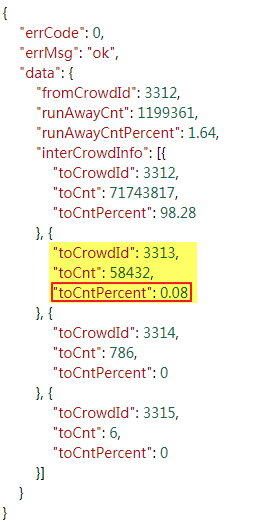
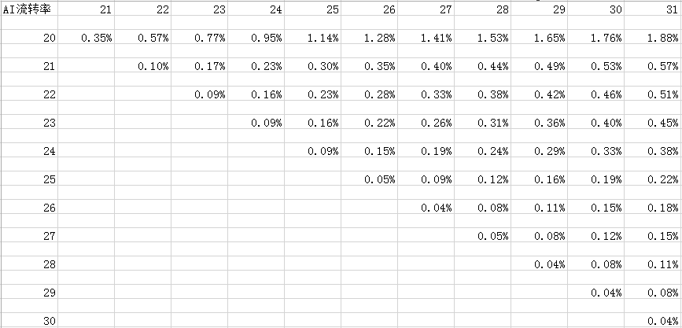

一年一度的双十一即将来临，临时接到了一个任务：统计某品牌数据银行中自己品牌分别在2017和2018的10月20日至10月31日之间不同时间段的**AIPL**（`认知`(Aware)、`兴趣`(Interest)、`购买`(Purchase)、`忠诚`(Loyalty)）流转率。

使用Fiddler获取到目标地址为：

<https://databank.yushanfang.com/api/ecapi?path=/databank/crowdFullLink/flowInfo&fromCrowdId=3312&beginTheDate=20181020&endTheDate=20181031&toCrowdIdList[0]=3312&toCrowdIdList[1]=3313&toCrowdIdList[2]=3314&toCrowdIdList[3]=3315>

本文中以爬取其中的AI流转率数据为例。

该地址返回的响应内容为Json类型，其中红框标记的项即为AI流转率值：

实现代码如下：

	import requests
	import json
	import csv
	 
	# 爬虫地址
	url = 'https://databank.yushanfang.com/api/ecapi?path=/databank/crowdFullLink/flowInfo&fromCrowdId=3312&beginTheDate=201810{}&endTheDate=201810{}&toCrowdIdList[0]=3312&toCrowdIdList[1]=3313&toCrowdIdList[2]=3314&toCrowdIdList[3]=3315'
	 
	# 携带cookie进行访问
	headers = {
	'Host':'databank.yushanfang.com',
	'Referer':'https://databank.yushanfang.com/',
	'Connection':'keep-alive',
	'User-Agent':'Mozilla/5.0 (Windows NT 10.0; WOW64) AppleWebKit/537.36 (KHTML, like Gecko) Chrome/63.0.3239.84 Safari/537.36',
	'Cookie':'_tb_token_=iNkDeJLdM3MgvKjhsfdW; bs_n_lang=zh_CN; cna=aaj1EViI7x0CATo9kTKvjzgS; ck2=072de851f1c02d5c7bac555f64c5c66d; c_token=c74594b486f8de731e2608cb9526a3f2; an=5YWo5qOJ5pe25Luj5a6Y5pa55peX6Iiw5bqXOnpmeA%3D%3D; lg=true; sg=\"=19\"; lvc=sAhojs49PcqHQQ%3D%3D; isg=BPT0Md7dE_ic5Ie3Oa85RxaMxbLK3UqJMMiN6o5VjH8C-ZRDtt7aRXb3fXGEAVAP',
	}
	 
	rows = []
	for n in range(20, 31):
	    row = []
	    row.append(n)
	    for m in range (21, 32):
	        if m < n + 1:
	            row.append("")
	        else:
	            
	            # 格式化请求地址，更换请求参数
	            reqUrl = url.format(n, m)
	            
	            # 打印本次请求地址
	            print(url)
	            
	            # 发送请求，获取响应结果
	            response = requests.get(url=reqUrl, headers=headers, verify=False)
	            text = response.text
	            
	            # 打印本次请求响应内容
	            print(text)
	            
	            # 将响应内容转换为Json对象
	            jsonobj = json.loads(text)
	            
	            # 从Json对象获取想要的内容
	            toCntPercent = jsonobj['data']['interCrowdInfo'][1]['toCntPercent']
	            
	            # 生成行数据
	            row.append(str(toCntPercent)+"%")
	            
	    # 保存行数据        
	    rows.append(row)
	    
	# 生成Excel表头
	header = ['AI流转率', '21', '22', '23', '24', '25', '26', '27', '28', '29', '30', '31']
	 
	# 将表头数据和爬虫数据导出到Excel文件
	with open('D:\\res\\pachong\\tmall.csv', 'w', encoding='gb18030') as f :
	    f_csv = csv.writer(f)
	    f_csv.writerow(header)
	    f_csv.writerows(rows)
 

	import csv
	import json
	import ssl
	import urllib.request
	 
	# 爬虫地址
	url = 'https://databank.yushanfang.com/api/ecapi?path=/databank/crowdFullLink/flowInfo&fromCrowdId=3312&beginTheDate=201810{}&endTheDate=201810{}&toCrowdIdList[0]=3312&toCrowdIdList[1]=3313&toCrowdIdList[2]=3314&toCrowdIdList[3]=3315'
	 
	# 不校验证书
	ssl._create_default_https_context = ssl._create_unverified_context
	 
	# 携带cookie进行访问
	headers = {
	'Host':'databank.yushanfang.com',
	'Referer':'https://databank.yushanfang.com/',
	'Connection':'keep-alive',
	'User-Agent':'Mozilla/5.0 (Windows NT 10.0; WOW64) AppleWebKit/537.36 (KHTML, like Gecko) Chrome/63.0.3239.84 Safari/537.36',
	'Cookie':'_tb_token_=iNkDeJLdM3MgvKjhsfdW; bs_n_lang=zh_CN; cna=aaj1EViI7x0CATo9kTKvjzgS; ck2=072de851f1c02d5c7bac555f64c5c66d; c_token=c74594b486f8de731e2608cb9526a3f2; an=5YWo5qOJ5pe25Luj5a6Y5pa55peX6Iiw5bqXOnpmeA%3D%3D; lg=true; sg=\"=19\"; lvc=sAhojs49PcqHQQ%3D%3D; isg=BPT0Md7dE_ic5Ie3Oa85RxaMxbLK3UqJMMiN6o5VjH8C-ZRDtt7aRXb3fXGEAVAP',
	}
	 
	rows = []
	n = 20
	while n <31:
	    row = []
	    row.append(n)
	    
	    m =21
	    while m <32:
	        
	        if m < n + 1:
	            row.append("")
	        else:
	            
	            # 格式化请求地址，更换请求参数
	            reqUrl = url.format(n, m)
	            
	            # 打印本次请求地址
	            print(reqUrl)
	            
	            # 发送请求，获取响应结果
	            request = urllib.request.Request(url=reqUrl, headers=headers)
	            response = urllib.request.urlopen(request)
	            text = response.read().decode('utf8')
	            
	            # 打印本次请求响应内容
	            print(text)
	            
	            # 将响应内容转换为Json对象
	            jsonobj = json.loads(text)
	            
	            # 从Json对象获取想要的内容
	            toCntPercent = jsonobj['data']['interCrowdInfo'][1]['toCntPercent']
	            
	            # 生成行数据
	            row.append(str(toCntPercent) + "%")
	            
	        m = m+1
	        
	    rows.append(row)       
	    n = n+1
	    
	# 生成Excel表头
	header = ['AI流转率', '21', '22', '23', '24', '25', '26', '27', '28', '29', '30', '31']
	 
	# 将表头数据和爬虫数据导出到Excel文件
	with open('D:\\res\\pachong\\tmall.csv', 'w', encoding='gb18030') as f :
	    f_csv = csv.writer(f)
	    f_csv.writerow(header)
	    f_csv.writerows(rows)

导出内容如下：

 