> 转载自：https://maimai.cn/article/detail?fid=1493947048&efid=2JUVtNUPGDpVD20tnIfwSg&use_rn=1

# 面试场景
面试官：Redis有哪些数据类型？
我：String，List，set，zset，hash
面试官：没了？
我：哦哦哦，还有HyperLogLog，bitMap，GeoHash，BloomFilter
面试官：就这？回家等通知吧。

# 前言
我敢肯定，第一个回答，100%的人都能说上来，但是第二个回答能回答上来的人可能就不多了，但是这也不是我今天探讨的话题。

我就从我自己的去面试的回答思路，以及作为一个面试官他想听到的标准答案来给大家出一期，Redis基础类型的文章（系列文章），写这个的时候我还是很有心得的，不知道大家有多少人跟我最开始一样，面试官问有哪些类型，就回答出那五种就结束了，如果你是这样的可以在评论区留言，让我看看有多少人是这样的。

但是，一场面试少说都是半小时起步上不封顶，你这样一句话就回答了这么重要的五个知识点，这个结果是你想要的么？是面试官想要的么？

我再问你一个问题，你可能就懵逼了：String在Redis底层是怎么存储的？这些数据类型在Redis中是怎么存放的？Redis快的原因就只有单线程和基于内存么？

宝贝，触及知识盲区没？不慌，我以前也是这样的，我以为我背出那五种就完事了，结果被面试官安排了一波，后面我苦心修炼，总算是好了一点，现在对缓存也是非常熟悉了，你不会没事，有我嘛，乖。

# 正文
Redis是C语言开发的，C语言自己就有字符类型，但是Redis却没直接采用C语言的字符串类型，而是自己构建了 动态字符串（SDS） 的抽象类型。

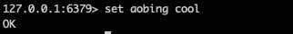

就好比这样的一个命令，其实我是在Redis创建了两个SDS，一个是名为 aobing 的Key SDS，另一个是名为 cool 的Value SDS，就算是字符类型的List，也是由很多的SDS构成的Key和Value罢了。

SDS在Redis中除了用作字符串，还用作缓冲区（buffer），那到这里大家都还是有点疑惑的，C语言的字符串不好么为啥用SDS？SDS长啥样？有什么优点呢?

为此我去找到了Redis的源码，可以看到SDS值的结果大概是这样的，源码的在GitHub上是开源的大家一搜就有了。

	struct sdshdr{
	    int len;
	    int free;
	    char buf[];
	}

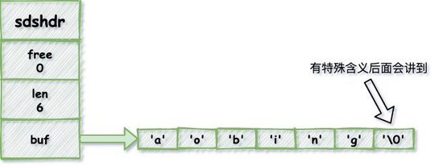

回到最初的问题，为什么Redis用了自己新开发的SDS，而不用C语言的字符串？那好我们去看看他们的区别。

# SDS与C字符串的区别
## 计数方式不同
C语言对字符串长度的统计，就完全来自遍历，从头遍历到末尾，直到发现空字符就停止，以此统计出字符串的长度，这样获取长度的时间复杂度来说是0（n），大概就像下面这样：

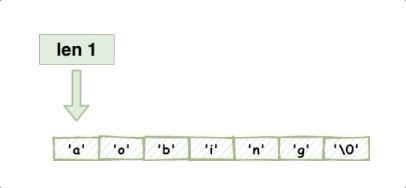

但是这样的计数方式会留下隐患，所以Redis没有采用C的字符串，我后面会提到。

而Redis我在上面已经给大家看过结构了，他自己本身就保存了长度的信息，所以我们获取长度的时间复杂度为0（1），是不是发现了Redis快的一点小细节了？还没完，不止这些。

## 杜绝缓冲区溢出
字符串拼接是我们经常做的操作，在C和Redis中一样，也是很常见的操作，但是问题就来了，C是不记录字符串长度的，一旦我们调用了拼接的函数，如果没有提前计算好内存，是会产生缓存区溢出的。

比如本来字符串长这样：

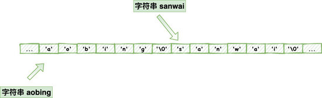

你现在需要在后面拼接 ，但是你没计算好内存，结果就可能这样了：

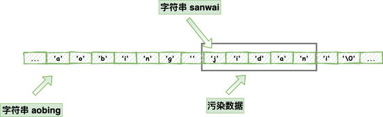

这是你要的结果么？很显然，不是，你的结果意外的被修改了，这要是放在线上的系统，这不是完了？那Redis是怎么避免这样的情况的？

我们都知道，他结构存储了当前长度，还有free未使用的长度，那简单呀，你现在做了拼接操作，我去判断一些是否可以放得下，如果长度够就直接执行，如果不够，那我就进行扩容。

这些大家在Redis源码里面都是可以看到对应的API的，后面我就不一一贴源码了，有兴趣的可以自己去看一波，需要一点C语言的基础。

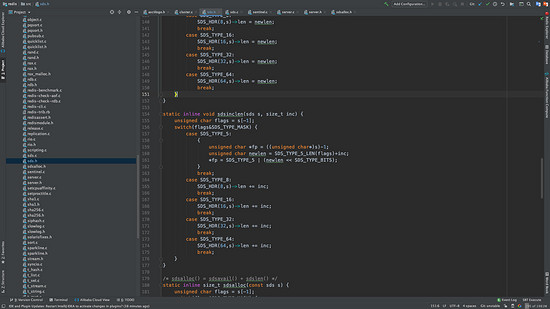

## 减少修改字符串时带来的内存重分配次数
C语言字符串底层也是一个数组，每次创建的时候就创建一个N+1长度的字符，多的那个1，就是为了保存空字符的，这个空字符也是个坑，但是不是这个环节探讨的内容。

Redis是个高速缓存数据库，如果我们需要对字符串进行频繁的拼接和截断操作，如果我们写代码忘记了重新分配内存，就可能造成缓冲区溢出，以及内存泄露。

内存分配算法很耗时，且不说你会不会忘记重新分配内存，就算你全部记得，对于一个高速缓存数据库来说，这样的开销也是我们应该要避免的。

Redis为了避免C字符串这样的缺陷，就分别采用了两种解决方案，去达到性能最大化，空间利用最大化：

**空间预分配**：当我们对SDS进行扩展操作的时候，Redis会为SDS分配好内存，并且根据特定的公式，分配多余的free空间，还有多余的1byte空间（这1byte也是为了存空字符），这样就可以避免我们连续执行字符串添加所带来的内存分配消耗。

比如现在有这样的一个字符：

我们调用了拼接函数，字符串边长了，Redis还会根据算法计算出一个free值给他备用：

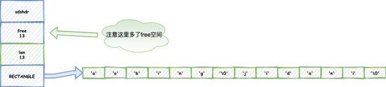

我们再继续拼接，你会发现，备用的free用上了，省去了这次的内存重分配：

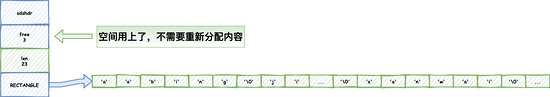

**惰性空间释放**：刚才提到了会预分配多余的空间，很多小伙伴会担心带来内存的泄露或者浪费，别担心，Redis大佬一样帮我们想到了，当我们执行完一个字符串缩减的操作，redis并不会马上收回我们的空间，因为可以预防你继续添加的操作，这样可以减少分配空间带来的消耗，但是当你再次操作还是没用到多余空间的时候，Redis也还是会收回对于的空间，防止内存的浪费的。

还是一样的字符串：

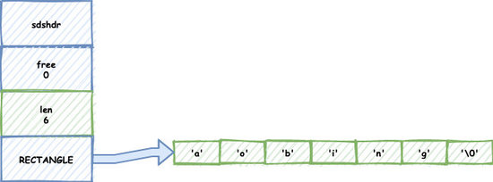

当我们调用了删减的函数，并不会马上释放掉free空间：

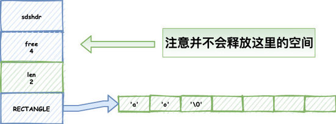

如果我们需要继续添加这个空间就能用上了，减少了内存的重分配，如果空间不需要了，调用函数删掉就好了：

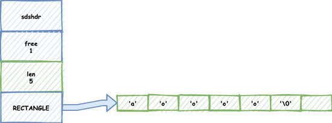

## 二进制安全
仔细看的仔肯定看到上面我不止一次提到了空字符也就是’0‘，C语言是判断空字符去判断一个字符的长度的，但是有很多数据结构经常会穿插空字符在中间，比如图片，音频，视频，压缩文件的二进制数据，就比如下面这个单词，他只能识别前面的 不能识别后面的字符，那对于我们开发者而言，这样的结果显然不是我们想要的对不对。

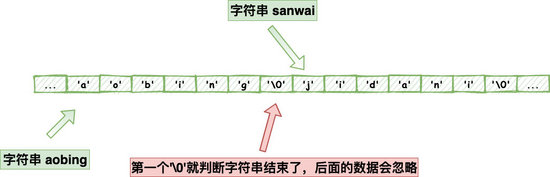

Redis就不存在这个问题了，他不是保存了字符串的长度嘛，他不判断空字符，他就判断长度对不对就好了，所以redis也经常被我们拿来保存各种二进制数据，我反正是用的很high，经常用来保存小文件的二进制。

资料参考：Redis设计与实现

# 总结
大家是不是发现，一个小小的SDS居然有这么多道理在这？

以前就知道Redis快，最多说个Redis是单线程的，说个多路IO复用，说个基于内存的操作就完了，现在是不是还可以展开说说了？

本文是系列文的第一章，后续会陆续更新的，不知道这样的类型大家是否喜欢，可以留言给我反馈。

大家一同去面试，一样的问题，就是有人能过，有人不能过，大家经常归咎于自己学历，自己过往经历的原因，但是你可以问一下自己，底层的细节字节是否有深究呢？细节往往才是最重要的，也是最少人知道的，如何和别的仔拉开差距拿到offer，我想就是这样些细节决定的吧，背谁不会呢？