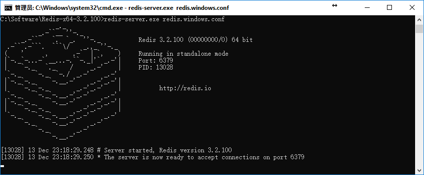
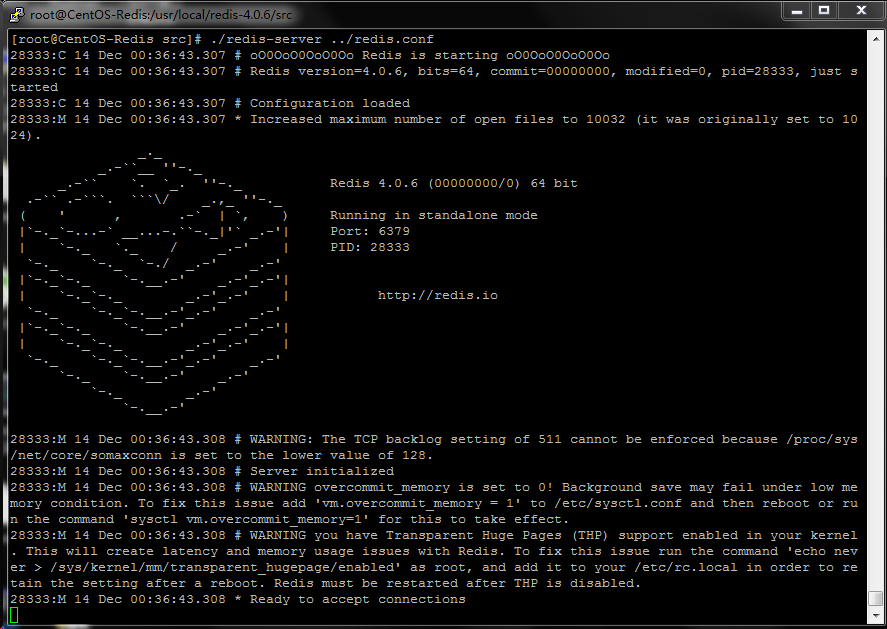
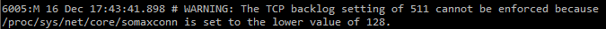

# Redis简介
`Redis(REmote DIctionary Server)`是一个使用ANSI C语言编写的开源键值型数据库，它通常又被称为数据结构服务器，支持存储的值类型包括：string(字符串)、list(链表)、set(集合)、zset(sorted set 有序集合)和hash（哈希）。

近年来，凭借其在稳定性、灵活性方面的优异表现及其强大的功能，Redis正受到越来越多的编程爱好者的青睐，被越来越多的公司所广泛地使用。

Redis 与其他键值型缓存产品相比，具有以下几个特点：

- 操作原子性——Redis的所有操作都是原子性的，意思就是要么成功执行要么失败完全不执行。单个操作是原子性的，多个操作也支持事务，即原子性，将需要添加事务的多个操作通过MULTI和EXEC指令包起来。
- 数据持久化——Redis可以将内存中的数据保存在磁盘中，启动的时候从磁盘进行加载并使用。
- 丰富的数据类型——Redis除了支持存储string类型的数据，同时还提供list，set，zset，hash等数据结构的存储。
- 数据备份——Redis支持master-slave模式的数据备份。
- 性能极高——Redis的读取速度是110000次/s,写入速度是81000次/s 。
- 丰富的特性——Redis还支持 publish/subscribe, 通知, key 过期等等特性。 

# Redis 安装
## Window 下安装
github下载地址：<https://github.com/MSOpenTech/redis/releases>

Redis 支持 32 位和 64 位，需要根据操作系统的实际情况进行选择，以64位操作系统为例,需下载Redis-x64-x.x.xxx.zip压缩包。压缩包内包含了被编译好的Redis可执行程序和配置文件等，解压缩即可使用，无须安装。

以Redis-x64-3.2.100.zip压缩包为例，解压后的文件目录如下。

### 启动Redis服务端
上图中的`redis-server.exe`即为Redis服务端的启动程序，双击执行该文件便会通过加载默认配置来启动Redis服务。当然，我们也可以在Windows的CMD命令窗口中输入以下命令，通过加载指定的配置文件来启动Redis服务。 

	redis-server.exe redis.windows.conf //执行该命令需先将工作目录切换至Redis目录下

Redis启动成功之后，会出现以下界面：

### 启动Redis客户端
Redis服务端启动后，不要关闭Redis服务端窗口，双击执行`redis-cli.exe`或者在新打开的CMD命令窗口中执行以下命令来启动Redis客户端。

	redis-cli.exe -h 127.0.0.1 -p 6379 //执行该命令需将工作目录切换至Redis目录下
 

## Linux 下安装
官网地址：<http://redis.io/download>

### 安装GCC编译器

	//查看是否安装gcc编译器
	rpm -q gcc 
	//安装gcc编译器 
	yum -y install gcc

### 安装Redis

	//切换到/usr/local/src/目录
	cd /usr/local/src/
	//下载源码包
	wget http://download.redis.io/releases/redis-4.0.6.tar.gz
	//将下载的源码包进行解压缩
	 tar zxvf redis-4.0.6.tar.gz
	//进入解压缩目录
	 cd redis-4.0.6
	//编译源程序
	make
	//切换到redis的src目录并进行编译安装
	cd src && make install

### 启动Redis服务 

	//使用默认配置启动Redis服务
	./redis-server
	//使用redis.conf配置启动Redis服务
	./redis-server ../redis.conf
 

如果需要将redis服务作为守护进程（daemon）来运行，须将redis.conf启动配置中的daemonize  no修改daemonize  yes 。  

### 启动Redis客户端

	//启动Redis客户端
	./redis-cli
 

### 停止Redis服务

	// 停止Redis服务
	./redis-cli shutdown
	 pkill redis-server

# Linux安装常见问题
## 执行make时提示如下错误：

    zmalloc.h:50:31: error: jemalloc/jemalloc.h: No such file or directory
    zmalloc.h:55:2: error: #error "Newer version of jemalloc required" 

**解决办法**：参照Redis中README文件给出的提示，使用 make MALLOC=libc 命令。 

## 执行make test时提示如下错误：

	You need tcl 8.5 or newer in order to run the Redis test 

**解决办法**：安装tcl。
           
方式一：源码安装。 

	//下载tcl源码包
	wget http://downloads.sourceforge.net/tcl/tcl8.6.1-src.tar.gz
	//将下载的tcl源码包进行解压缩
	tar zxvf tcl8.6.1-src.tar.gz
	//切换到解压缩目录下的unix目录
	 cd tcl8.6.1/unix/
	//编译前准备
	./configure  
	//编译源程序
	make
	//编译安装
	 make install

方式二：yum安装。 

	//搜索服务器上所有和tcl相关的包  
	yum search tcl
	//安装tcl.x86_64
	yum -y install tcl.x86_64

## 启动过程中提示如下警告：

	WARNING: The TCP backlog setting of 511 cannot be enforced because /proc/sys/net/core/somaxconn is set to the lower value of 128.  

临时解决办法：修改`/proc/sys/net/core/somaxconn`文件中的设定值为`511`。

	echo 511 > /proc/sys/net/core/somaxconn

永久解决办法：将以上命令写入`/etc/rc.local`文件中，使其开机启动时自动执行。

## 启动过程中提示如下警告：

	WARNING overcommit_memory is set to 0! Background save may fail under low memory condition. To fix this issue add 'vm.overcommit_memory = 1' to /etc/sysctl.conf and then reboot or run the command 'sysctl vm.overcommit_memory=1' for this to take effect. 

解决办法：编辑 /etc/sysctl.conf，增加 vm.overcommit_memory=1 配置项。  

添加完`vm.overcommit_memory=1` 配置项之后需要重启计算机或者执行以下命令使配置生效。 

	sysctl vm.overcommit_memory=1

## 启动过程中提示如下警告：

	WARNING you have Transparent Huge Pages (THP) support enabled in your kernel. This will create latency and memory usage issues with Redis. To fix this issue run the command 'echo never > /sys/kernel/mm/transparent_hugepage/enabled' as root, and add it to your /etc/rc.local in order to retain the setting after a reboot. Redis must be restarted after THP is disabled.  

临时解决办法：修改`/sys/kernel/mm/transparent_hugepage/enabled`文件中的设定值为`never`。 

	echo never > /sys/kernel/mm/transparent_hugepage/enabled

永久解决方法： 

将以上命令写入`/etc/rc.local`文件中，使其开机启动时自动执行。  

## GCC安装时提示如下错误：

	Error downloading packages: glibc-2.17-260.el7_6.4.x86_64: [Errno 256] No more mirrors to try.

临时解决办法：执行如下命令，然后重试。

	yum clean all
	yum makecache