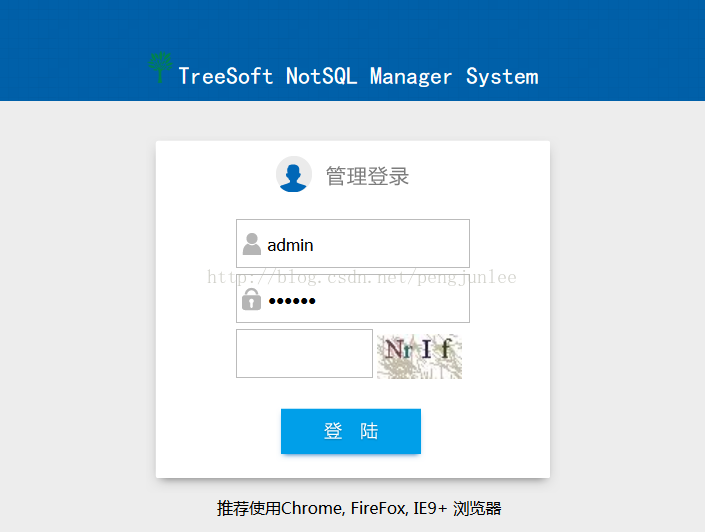
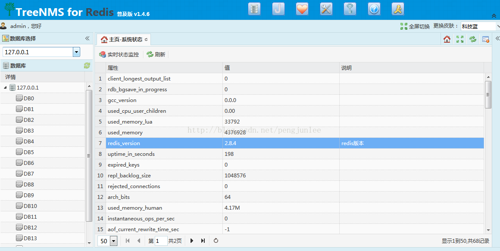
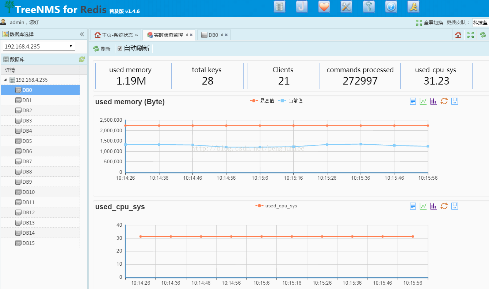
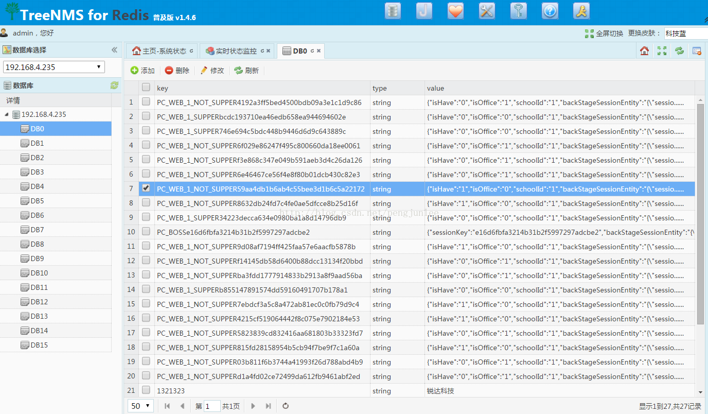
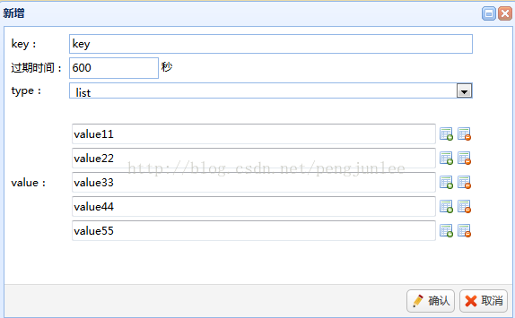
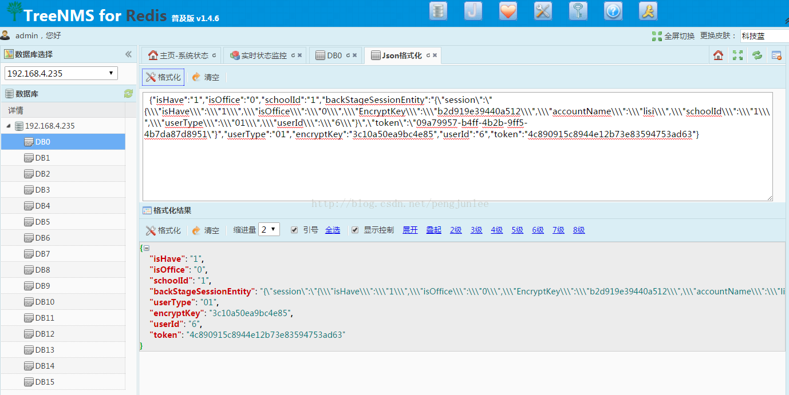
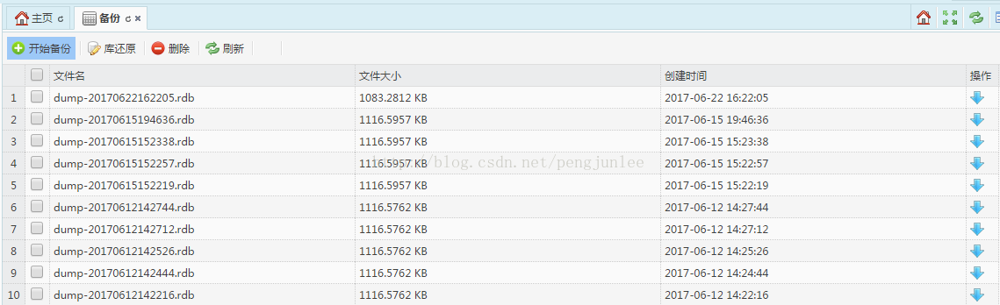

Redis做为现在web应用开发的黄金搭担组合，大量的被应用，广泛用于存储session信息,权限信息，交易作业等热数据。做为一名有10年以上JAVA开发经验的程序员，工作中项目也是广泛使用了Redis，工作中也遇到了Redis的数据可视化不便、Redis的数据查看维护困难、Redis状态监控运维不易等问题。

相信大家在工作中也会遇到我说的这些问题，在工作中大家可能都装过一些可视化的工具，客户端工具，状态监控工具。例如Redis Desktop Manager，Redis Live,Redis browser等，这些工具开发语言也五花八门，php, ruby,python, qt等，安装前置条件也一堆，安装过程的痛苦，装过就知道了。

由于我也是一线的开发，也深切的感受到了没有顺手Redis管理工具带来的不便，经过一段时间的加班加点，挑灯开发，一款用JAVA语言开发的Redis管理及监控工具treeNMS横空出世了。

下面我就详细给大家介绍一下treeNMS的安装及各项功能。

# 1、安装
相信大家windows下安装工具都得心应手，但Linux中安装就头大了吧，treeNMS管理工具，直接到[treesoft](http://www.treesoft.cn/dms.html "treesoft")下载，是用JAVA开发的，基于WEB方式对Redis管理，windows环境下载解压即可使用，Linux环境中也只需将软件复制过去，配置JAVA环境就可以使用了。MAC系统中也可以直接复制过去用，前提是有JAVA运行环境。

因为是基于WEB方式的，所以可以直接在服务器上布署一份，那么大家都可以用浏览器直接访问操作，避免了每个开发人员都要安装工具软件的麻烦，工作效率大大提高。

# 2、运行及参数初始化
按说明运行startup.bat文件，软件就运行起来了show一下后台主页。
主面右上角有一个参数配置按钮，点击后直接进行连接信息的填写及连接测试。直接在线编辑连接信息的好处是，无需访问远程服务器，直接就完成修改连接信息。

# 3、状态监控

Redis做为缓存数据库，对内存占用率等指标很有必要定期监控，目前市面上多是国外的Redis监控软件，并且大部分功能较单一，例如Redis Live, 展示的指标有限，而treeNMS提供了详细的Redis状态值 ，达68项之多，并且有状态实时监控。

# 4、 Redis数据的查看，编辑，维护
说到数据查看，之前我也用过Redis Desktop Manager，这是单机版本的，也是国人用JAVA开发的，挺好的，就是数据大时，不稳定。单机版的问题就是团队中相关人员都要安装，服务器远程管理Redis不便，treeNMS就解决了这些问题。

详细数据的展示，查看，编辑，新增，删除等，支持string,list ,set,zset,hash等数据类型。

有些情况会看到展示的数据是乱码，这是由于存入的数据已压缩或序列化处理过，这种类型的数据是展示时就会变成乱码是正常现象。

# 5、json数据格式化
JSON格式的数据具有占用空间小，更易解析等优点，大量数据会以JSON格式存入Redis中。

treeNMS提供了JSON数据格式化的功能，支持格式化，缩进，层级控制，查看，方便数据分析。 做开发，测试都会用到这个功能的。 

# 6、在线数据备份及还原
Redis是支持数据存储及持久化的，treeNMS 支持在线redis数据备份及下载，有个细节：程序要与redis安装在同一台电脑中，才能备份哦。

> 总结：有了这款treeNMS软件，就可以轻松驾驭redis了，也希望国产软件能引领技术革新，走向世界！