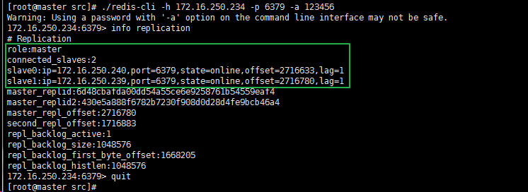
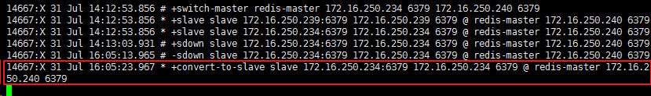

# 概述
Redis-Sentinel哨兵机制为Redis提供了高可用性，这意味着你可以使用哨兵模式创建一个可以不用人为干预而能够自动地应对各种故障的Redis部署。与此同时，Redis-Sentinel哨兵机制还为Redis提供了如下功能：

- 监控：哨兵不断地检查master和slave是否正常运行。
- 通知：当被监控的某台Redis实例出现故障时，哨兵可以通过API通知系统管理员和其他的应用程序。
- 自动故障转移：如果一个master不正常运行了，哨兵可以启动一个故障转移进程，将一个slave升级成为master，其他的 slave被重新配置使用新的master，并且应用程序使用Redis服务端通知的新地址。
- 配置提供者：哨兵作为Redis客户端发现的权威来源：客户端连接到哨兵请求当前可靠的master的地址。如果发生故障，哨兵将报告新地址。

# 哨兵的分布式特性
Redis哨兵是一个分布式系统，哨兵自身被设计成和多个哨兵进程一起合作运行，有多个哨兵进程合作的好处有：

- 当多个哨兵对一个master不再可用达成一致时才会执行故障转移，这会降低错误判断的概率。
- 即使在不是所有的哨兵都工作时哨兵也会工作，使系统健壮的抵抗故障，毕竟在故障系统里单点故障没有什么意义。

对Redis-Sentinel哨兵机制和主从复制策略不太了解的，可以参考以下文章。

Redis Sentinel机制与用法（一）  
Redis Sentinel机制与用法（二）  
主从Replication的配置

# 安装Redis-Sentinel集群
Redis官网地址：<https://redis.io/>

Redis安装参考：[Redis介绍与安装](https://blog.csdn.net/pengjunlee/article/details/78777508 "Redis介绍与安装")

## Redis-Sentinel集群配置

## redis.conf配置
Master主节点（172.16.250.234）的 redis.conf 配置如下：

	#后台启动
	daemonize yes
	pidfile "/var/run/redis_6379.pid"
	port 6379
	timeout 0
	tcp-keepalive 300
	loglevel notice
	logfile "/usr/local/redis-4.0.10/logs/redis.log"
	databases 16
	save 900 1
	save 300 10
	save 60 10000
	stop-writes-on-bgsave-error yes
	rdbcompression yes
	rdbchecksum yes
	dbfilename "dump.rdb"
	dir "/usr/local/redis-4.0.10/rdbs"
	#如果做故障切换，不论主从节点都要填写密码且要保持一致
	masterauth "123456"
	slave-serve-stale-data yes
	slave-read-only yes
	repl-disable-tcp-nodelay no
	slave-priority 99
	#当前redis密码
	requirepass "123456"
	appendonly yes
	appendfilename "appendonly.aof"
	#appendfsync always
	#appendfsync everysec
	appendfsync no
	no-appendfsync-on-rewrite no
	auto-aof-rewrite-percentage 100
	auto-aof-rewrite-min-size 64mb
	lua-time-limit 5000
	slowlog-log-slower-than 10000
	slowlog-max-len 128
	notify-keyspace-events ""
	hash-max-ziplist-entries 512
	hash-max-ziplist-value 64
	list-max-ziplist-entries 512
	list-max-ziplist-value 64
	set-max-intset-entries 512
	zset-max-ziplist-entries 128
	zset-max-ziplist-value -2
	activerehashing yes
	client-output-buffer-limit normal 0 0 0
	client-output-buffer-limit slave 256mb 64mb 60
	client-output-buffer-limit pubsub 32mb 8mb 60
	hz 10
	aof-rewrite-incremental-fsync yes

Slave从节点（172.16.250.239，172.16.250.240）与Master主节点（172.16.250.234）的 redis.conf 配置内容基本相同，只是额外增加了一行主节点的配置信息。

	#配置主节点信息（只在从节点中添加）
	slaveof 172.16.250.234 6379

## sentinel.conf配置
Master主节点（172.16.250.234）和Slave从节点（172.16.250.239，172.16.250.240）的 sentinel.conf 配置相同，内容如下：

	# 哨兵sentinel实例运行的端口 默认26379
	daemonize yes
	port 26379
	protected-mode no
	# 哨兵sentinel的工作目录
	dir "/usr/local/redis-4.0.10/sentinel-tmp"
	# sentinel monitor <master-name> <ip> <redis-port> <quorum>
	# master-name 可以自己命名的主节点名字 只能由字母A-z、数字0-9 、这三个字符".-_"组成。
	# quorum 当这些quorum个数sentinel哨兵认为master主节点失联 那么这时客观上认为主节点失联了
	sentinel monitor redis-master 172.16.250.234 6379 2
	# sentinel auth-pass <master-name> <password>
	# 当在Redis实例中开启了requirepass foobared 授权密码 这样所有连接Redis实例的客户端都要提供密码
	# 设置哨兵sentinel 连接主从的密码 注意必须为主从设置一样的验证密码
	sentinel auth-pass redis-master 123456
	# sentinel down-after-milliseconds <master-name> <milliseconds>
	# 指定多少毫秒之后 主节点没有应答哨兵sentinel 此时哨兵主观上认为主节点下线 默认30秒
	sentinel down-after-milliseconds redis-master 30000
	# sentinel failover-timeout <master-name> <milliseconds>
	# 故障转移的超时时间 failover-timeout 可以用在以下这些方面：
	# 1. 同一个sentinel对同一个master两次failover之间的间隔时间。
	# 2. 当一个slave从一个错误的master那里同步数据开始计算时间。直到slave被纠正为向正确的master那里同步数据时。
	# 3.当想要取消一个正在进行的failover所需要的时间。
	# 4.当进行failover时，配置所有slaves指向新的master所需的最大时间。不过，即使过了这个超时，slaves依然会被正确配置为指向master，但是就不按parallel-syncs所配置的规则来了
	# 默认三分钟
	sentinel failover-timeout redis-master 180000
	# sentinel parallel-syncs <master-name> <numslaves>
	# 指定在发生failover主备切换时最多可以有多少个slave同时对新的master进行同步，
	# 这个数字越小，完成failover所需的时间就越长，
	# 但是如果这个数字越大，就意味着越多的slave因为replication而不可用。
	# 可以通过将这个值设为 1 来保证每次只有一个slave 处于不能处理命令请求的状态。
	sentinel parallel-syncs redis-master 1
	# 配置当某一事件发生时所需要执行的脚本，可以通过脚本来通知管理员，例如当系统运行不正常时发邮件通知相关人员。
	# 对于脚本的运行结果有以下规则：
	# 若脚本执行后返回1，那么该脚本稍后将会被再次执行，重复次数目前默认为10
	# 若脚本执行后返回2，或者比2更高的一个返回值，脚本将不会重复执行。
	# 如果脚本在执行过程中由于收到系统中断信号被终止了，则同返回值为1时的行为相同。
	# 一个脚本的最大执行时间为60s，如果超过这个时间，脚本将会被一个SIGKILL信号终止，之后重新执行。
	#
	# 通知型脚本:当sentinel有任何警告级别的事件发生时（比如说redis实例的主观失效和客观失效等等），将会去调用这个脚本，
	# 这时这个脚本应该通过邮件，SMS等方式去通知系统管理员关于系统不正常运行的信息。调用该脚本时，将传给脚本两个参数，
	# 一个是事件的类型，
	# 一个是事件的描述。
	# 如果sentinel.conf配置文件中配置了这个脚本路径，那么必须保证这个脚本存在于这个路径，并且是可执行的，否则sentinel无法正常启动成功。
	# #通知脚本
	# sentinel notification-script <master-name> <script-path>
	# sentinel notification-script redis-master /var/redis/notify.sh
	#
	# 客户端重新配置主节点参数脚本
	# 当一个master由于failover而发生改变时，这个脚本将会被调用，通知相关的客户端关于master地址已经发生改变的信息。
	# 以下参数将会在调用脚本时传给脚本:
	# <master-name> <role> <state> <from-ip> <from-port> <to-ip> <to-port>
	# 目前<state>总是“failover”,
	# <role>是“leader”或者“observer”中的一个。
	# 参数 from-ip, from-port, to-ip, to-port是用来和旧的master和新的master(即旧的slave)通信的
	# 这个脚本应该是通用的，能被多次调用，不是针对性的。
	# sentinel client-reconfig-script <master-name> <script-path>
	# sentinel client-reconfig-script redis-master /var/redis/reconfig.sh

配置完成之后，先创建好相应目录，并使用如下命令分别启动Redis和Sentinel集群：

	[root@master src]# mkdir ../logs
	[root@master src]# mkdir ../rdbs
	[root@master src]# mkdir ../sentinel-tmp
	[root@master src]# ./redis-server ../redis.conf
	[root@master src]# ./redis-sentinel ../sentinel.conf

停止服务使用如下命令：

	[root@master src]# pkill ./redis-server
	[root@master src]# pkill ./redis-sentinel

集群启动成功之后，登录 Redis 客户端查看节点的复制信息。

使用如下命令：

	[root@master src]# redis-cli -h 172.16.250.234 -p 6379 -a 123456
	172.16.250.234:6379> info replication

Master 主节点（172.16.250.234）节点复制信息截图如下。

Slave从节点（172.16.250.239）节点复制信息截图如下。

# 场景测试
## 场景一：Master宕机
在Master 主节点（172.16.250.234）上执行 pkill redis-server 命令来模拟Master宕机的情况，哨兵们的处理流程如下：

	==> 单个哨兵主观认为 Master 宕机
	==> 当主观认为 Master 宕机的哨兵个数达到 quorum 设定值时，哨兵集群客观认为 Master 宕机
	==> 开始 failover
	==> 收集候选节点列表
	==> 根据候选节点的优先级和运行状态综合判断，选择一个 Slave 并将其提拔为新的 Master
	==> 将新的 Master 主节点信息通知到其他节点，并更新各节点的配置文件

Slave从节点（172.16.250.240）被选拔为新的 Master ，且仅有一个 Slave 从节点 172.16.250.239。

## 场景二：Master恢复
重新启动 172.16.250.234 上的 Redis 服务，查看其节点复制信息，发现其已成为新 Master 的从节点了。

在 Sentinel 中打印日志信息如下。

## 场景三：Slave宕机
当前的 Master 是 172.16.250.240 ， 172.16.250.234 和 172.16.250.239 是 Slave 。

在 172.16.250.239 上执行 pkill redis-server 命令来模拟 Slave 宕机的情况，此时在 Sentinel 中打印如下信息。

再次查看 Master 主节点（172.16.250.240）的节点复制信息，发现 172.16.250.239 已经从 Master 的 Slave 列表中被移除。

## 场景四：Slave恢复
重新启动 172.16.250.239 上的 Redis 服务，查看其节点复制信息，发现其已成为 Master 的从节点了。

在 Sentinel 中打印日志信息如下。

