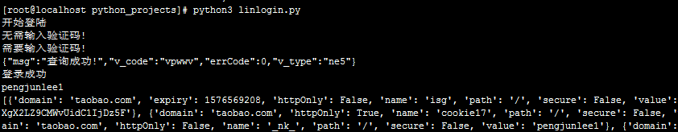

	# -*- coding: utf-8 -*-
	 
	import json
	import base64
	import requests
	from io import BytesIO
	from selenium import webdriver
	from selenium.webdriver.common.by import By
	from selenium.webdriver.support.ui import WebDriverWait
	from selenium.webdriver.support import expected_conditions as EC
	from selenium.common.exceptions import WebDriverException, ElementClickInterceptedException
	 
	chromedriver_path = "./chromedriver"  # 改成你的chromedriver的完整路径地址
	weibo_username = "你的微博账号"  # 改成你的微博账号
	weibo_password = "你的微博密码"  # 改成你的微博密码
	 
	 
	class LinuxWeiboLogin:
	 
	    def __init__(self):
	        self.browser = self.init_browser()
	 
	    def init_browser(self):
	        # 创建chrome参数对象
	        options = webdriver.ChromeOptions()
	        options.add_argument('--no-sandbox')  # 解决DevToolsActivePort文件不存在的报错
	        # options.add_argument('--window-size=1920,1080')  # 指定浏览器窗口大小
	        options.add_argument('--start-maximized')  # 浏览器窗口最大化
	        options.add_argument('--disable-gpu')  # 谷歌文档提到需要加上这个属性来规避bug
	        options.add_argument('--hide-scrollbars')  # 隐藏滚动条, 应对一些特殊页面
	        # options.add_argument('--blink-settings=imagesEnabled=false')  # 不加载图片,加快访问速度
	        options.add_argument('--headless')  # 浏览器不提供可视化页面. linux下如果系统不支持可视化不加这条会启动失败
	        options.add_argument('test-type')
	        options.add_experimental_option("excludeSwitches", ["ignore-certificate-errors",
	                                                            "enable-automation"])  # 此步骤很重要，设置为开发者模式，防止被各大网站识别出来使用了Selenium
	        # options.add_experimental_option("prefs", {"profile.managed_default_content_settings.images": 2})  # 不加载图片,加快访问速度
	        return webdriver.Chrome(options=options, executable_path=chromedriver_path)
	 
	    def remote_verifycode(self, img_url=None):
	        if img_url is not None:
	            response = requests.get(img_url)
	            encode_wimg = base64.b64encode(BytesIO(response.content).read())
	            verify_data = {'v_type': 'ne5'}
	            verify_data['v_pic'] = 'data:image/png;base64,{}'.format(encode_wimg.decode())
	            verify_url = 'http://apigateway.jianjiaoshuju.com/api/v_1/yzm.html'  # 验证码请求页地址
	            headers = {'appCode': 'E9267AA8E80341B582CA4974FF43D77B', 'appKey': 'AKIDfa4d3b27fc2019acb3ea516c9437dbc2',
	                       'appSecret': '417e838716611fa70697d0b5308a0ffc',
	                       'Content-Type': 'application/x-www-form-urlencoded; charset=UTF-8'}
	            verify_response = requests.post(verify_url, data=verify_data, headers=headers)
	            print(verify_response.content.decode())
	            verify_dict = json.loads(verify_response.content.decode())
	            if verify_dict['errCode'] == 0:
	                return verify_dict['v_code']
	            else:
	                return None;
	 
	    def login(self):
	        print("开始登陆")
	 
	        # 打开淘宝登录页面
	        self.browser.get('https://login.taobao.com/member/login.jhtml')
	 
	        # 等待密码登录选项出现
	        password_login = WebDriverWait(self.browser, 10).until(
	            EC.presence_of_element_located((By.XPATH, "//node()[@id='J_Quick2Static']")))
	        if password_login.is_displayed():
	            password_login.click()
	        self.browser.save_screenshot('pre_login.png')  # 截取账号密码登录的图片
	 
	        # 等待微博登录按钮出现
	        weibo_login = WebDriverWait(self.browser, 10).until(
	            EC.presence_of_element_located((By.XPATH, "//node()[@id='J_OtherLogin']/*[@class='weibo-login']")))
	        weibo_login.click()
	 
	        # 保存微博登录页面内容
	        with open('./login.html', 'w', encoding='utf8') as f:
	            f.write(self.browser.page_source)
	 
	        # 等待微博账号出现
	        username_input = WebDriverWait(self.browser, 10).until(EC.presence_of_element_located(
	            (By.XPATH, "//div[@class='W_login_form']/div[@node-type='username_box']//input[@name='username']")))
	        username_input.clear()
	        # Linux环境下使用 send_keys() 方法输入内容无效 改用 JS 脚本输入内容
	        username_js = 'document.getElementsByName("%s")[0].value = "%s"' % ("username", weibo_username)
	        self.browser.execute_script(username_js)
	 
	        # 等待 微博密码 出现
	        weibo_pwd = WebDriverWait(self.browser, 10).until(
	            EC.presence_of_element_located((By.XPATH, "//node()[@name='password']")))
	        weibo_pwd.clear()
	 
	        # Linux环境下使用 send_keys() 方法输入内容无效 改用 JS 脚本输入内容
	        password_js = 'document.getElementsByName("%s")[0].value = "%s"' % ("password", weibo_password)
	        self.browser.execute_script(password_js)
	 
	        # 等待 登录按钮 出现
	        submit = WebDriverWait(self.browser, 10).until(
	            EC.presence_of_element_located((By.XPATH, "//div[@class='btn_tip']/a/span[@node-type='submitStates']")))
	        submit.click()
	 
	        verifycode_box = WebDriverWait(self.browser, 10).until(
	            EC.presence_of_element_located((By.CSS_SELECTOR, 'div[node-type="verifycode_box"]')))
	 
	        try_times = 5
	        while try_times > 0:
	            try_times = try_times - 1
	            self.browser.save_screenshot('post_login.png')  # 截取账号密码登录的图片
	            if verifycode_box.is_displayed():
	                print("需要输入验证码!")
	                verifycode_img = verifycode_box.find_element_by_css_selector(' img')
	                verifycode = None
	                while verifycode is None:
	                    verifycode = self.remote_verifycode(verifycode_img.get_attribute('src'))
	                vcode_js = 'document.getElementsByName("%s")[0].value = "%s"' % (
	                    "verifycode", verifycode)
	                self.browser.execute_script(vcode_js)
	            else:
	                print("无需输入验证码!")
	            submit.click()
	            try:
	                # 直到获取到淘宝会员昵称才能确定是登录成功
	                taobao_name = WebDriverWait(self.browser, 10).until(EC.presence_of_element_located((By.CSS_SELECTOR,
	                                                                                                    '.site-nav-bd > ul.site-nav-bd-l > li#J_SiteNavLogin > div.site-nav-menu-hd > div.site-nav-user > a.site-nav-login-info-nick ')))
	            except WebDriverException:
	                "登录失败，稍后重试！"
	            else:
	                # 输出淘宝昵称
	                print("登录成功")
	                print(taobao_name.text)
	                break
	        b_cookies = self.browser.get_cookies()
	        self.browser.quit()
	        return b_cookies
	 
	 
	if __name__ == '__main__':
	    weibo = WindowsWeiboLogin()
	    b_cookies = weibo.login()
	    print(b_cookies)
	    cookies = {i['name']: i['value'] for i in b_cookies}
	    print(cookies)

登陆成功，控制台输出示例：

