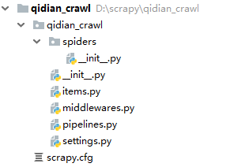
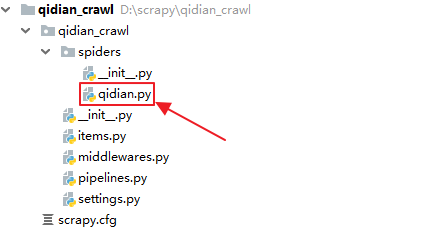
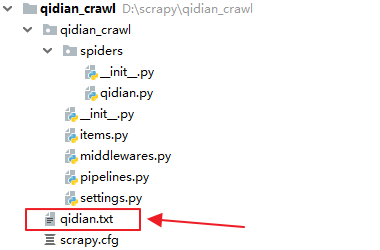
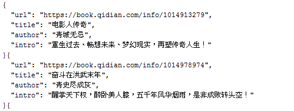

# CrawlSpider简介

	class scrapy.spiders.CrawlSpider

`CrawlSpider`是`Spider`的一个子类，不仅天生就继承了Spider的所有特性，还在Spider的基础上提供了一些扩展能力：允许用户定义一些规则(Rule)来跟进那些需要继续爬取的URL(链接)。

除了从Spider继承过来的属性外，CrawlSpider还提供了一个新的属性:

## rules
一个包含一个(或多个)`Rule`对象的集合(list)。 每个Rule对爬取网站的一类URL链接定义了特定表现。 如果多个Rule匹配了相同的链接，则根据他们在本属性中被定义的顺序，第一个会被使用。

CrawlSpider也提供了一个可复写(overrideable)的方法.

## parse_start_url(response)
当`start_url`的请求返回时，该方法被调用。 该方法分析最初的返回值并必须返回一个Item对象或者一个Request对象或者一个可迭代的包含二者对象。

## Rule(爬取规则)

	class scrapy.spiders.Rule(link_extractor, callback=None, cb_kwargs=None, follow=None, process_links=None, process_request=None)

`scrapy.spiders.Rule`各项参数：

- link_extractor 是一个 Link Extractor 对象，用于定义需要提取的链接。
- callback 是一个callable 或 string ( 该spider 中同名的函数将作为回调函数被调用)。 从link_extractor中每获取到匹配的链接时将会调用该函数。该回调函数接受一个response作为其第一个参数， 并返回一个包含 Item 以及(或) Request 对象(或者这两者的子类)的列表(list)。
- cb_kwargs 包含传递给回调函数的参数(keyword argument)的字典。
- follow 是一个布尔(boolean)值，指定了根据该规则从response提取的链接是否需要跟进。 如果 callback 为 None， follow 默认设置为 True ，否则默认为 False 。
- process_links 是一个callable或string(该spider 中同名的函数将作为回调函数被调用)。 从link_extractor 中获取到链接列表时将会调用该函数。该方法主要用来过滤。
- process_request 是一个callable或string(该spider 中同名的函数将作为回调函数被调用)。 该规则提取到每个- request时都会调用该函数。该函数必须返回一个request或者None。 (用来过滤request)

警告：当编写爬虫规则时，请避免使用`parse`作为回调函数。 由于CrawlSpider使用 `parse`方法来实现其逻辑，如果您覆盖了`parse`方法，`crawl spider`将会运行失败。 

## Link Extractors

	class scrapy.linkextractors.LinkExtractor

`Link Extractors`用来从网页(`scrapy.http.Response`对象)中抽取最终将会被`follow`的链接｡

Link Extractors常用参数：

- `allow`满足括号中`正则表达式`的URL会被提取，如果为空，则全部匹配
- `deny`满足括号中`正则表达式`的URL一定不提取（优先级高于allow）
- `allow_domains`会被提取的链接的domains
- `deny_domains`一定不会被提取链接的domains
- `restrict_xpaths`使用xpath表达式，和`allow`共同作用过滤链接，即xpath满足范围内的URL会被提取

Scrapy提供了`scrapy.linkextractors import LinkExtractor`， 但你可以通过实现一个简单的接口创建自己定制的Link Extractor来满足需求｡

每个link extractor有唯一的公共方法是`extract_links`，它接收一个`Response`对象，并返回一个 `scrapy.link.Link`对象｡Link Extractors，要实例化一次并且`extract_links`方法会根据不同的response调用多次提取链接｡

# CrawlSpider实战
本文将以爬取起点中文网中所有的免费文章（标题、简介、作者、文章地址）为例对CrawlSpider的用法进行示例。

## 创建项目
打开一个 Windows命令行窗口，切换到你打算存储代码的目录中（本例中是 D:\scrapy），运行下列命令： 

	d:\scrapy>scrapy startproject qidian_crawl

执行完该命令后，将会创建包含下列内容的`qidian_crawl`目录：

## 定义Item
在`items.py`中定义所需爬取的文章字段（标题、简介、作者、文章地址）。

	import scrapy
	 
	class QidianCrawlItem(scrapy.Item):
	    title = scrapy.Field() # 标题
	    intro = scrapy.Field() # 简介
	    author = scrapy.Field() # 作者
	    url = scrapy.Field() # 文章地址

## 创建CrawlSpider
CrawlSpider的创建方法跟普通的Spider类似，在Windows命令行执行如下命令完成创建：

	d:\scrapy>cd qidian_crawl
	d:\scrapy\qidian_crawl>scrapy genspider -t crawl qidian qidian.com

执行完该命令后，将会在`qidian_crawl`的`spiders`目录下生成一个`qidian.py`文件：

我们要在`qidian.py`文件中编写爬取网站的链接URL提取和处理规则。

	# -*- coding: utf-8 -*-
	import scrapy
	from scrapy.linkextractors import LinkExtractor
	from scrapy.spiders import CrawlSpider, Rule
	from qidian_crawl.items import QidianCrawlItem
	 
	 
	class QidianSpider(CrawlSpider):  # 继承自 class CrawlSpider(Spider)
	    name = 'qidian'  # 爬虫名称，启动爬虫时使用：scrapy crawl <爬虫名称>
	    allowed_domains = ['qidian.com']  # 允许爬取的范围
	    '''
	    爬虫的起始地址，其响应可使用 parse_start_url(response) 进行专门处理。
	    '''
	    start_urls = [
	        'https://www.qidian.com/free/all?orderId=&vip=hidden&style=1&pageSize=20&siteid=1&pubflag=0&hiddenField=1&page=1']
	 
	    def start_requests(self):  # 启动时设置 Cookies ，Spider 的特性
	        cookies = 'e1=%7B%22pid%22%3A%22qd_P_xiangqing%22%2C%22eid%22%3A%22%22%7D; e2=%7B%22pid%22%3A%22qd_P_xiangqing%22%2C%22eid%22%3A%22%22%2C%22l1%22%3A4%7D; _csrfToken=0oIxR8Di1jdqyiUCGJAhBLcm6a0kyMuvmrq0vyjI; newstatisticUUID=1556264399_358226677; e2=%7B%22pid%22%3A%22qd_P_free%22%2C%22eid%22%3A%22qd_C44%22%7D; e1=%7B%22pid%22%3A%22qd_P_limitfree%22%2C%22eid%22%3A%22qd_E01%22%2C%22l1%22%3A4%7D'
	        cookies = {i.split('=')[0]: i.split('=')[1] for i in cookies.split('; ')}
	        yield scrapy.Request(self.start_urls[0], cookies=cookies)
	 
	    '''
	    链接URL的提取和处理规则
	    '''
	    rules = (
	        Rule(LinkExtractor(allow=r'//book.qidian.com/info/\d+'), callback='parse_item', follow=False),
	        Rule(LinkExtractor(
	            allow=r'//www\.qidian\.com/free/all\?orderId=&vip=hidden&style=1&pageSize=20&siteid=1&pubflag=0&hiddenField=1&page=\d+'),
	            follow=True),
	    )
	 
	    def parse_item(self, response):  # 回调函数
	        item = QidianCrawlItem()
	        item['url'] = response.request._url
	        item['title'] = response.xpath("//div[@class='book-info ']/h1/em/text()").extract_first()
	        item['author'] = response.xpath("//div[@class='book-info ']/h1/span/a/text()").extract_first()
	        item['intro'] = response.xpath("//div[@class='book-info ']//p[@class='intro']/text()").extract_first()
	        yield item

## 编写Pipeline
CrawlSpider中收集的Item将会被传递到Item Pipeline中再次进行处理，在这里我们将提取到的QidianCrawlItem数据保存到文件中。

	# -*- coding: utf-8 -*-
	 
	from qidian_crawl.items import QidianCrawlItem
	import json
	 
	class QidianCrawlPipeline(object):
	    def process_item(self, item, spider):
	        if isinstance(item, QidianCrawlItem):  # 仅处理 QidianCrawlItem ，其他Item不予处理，直接返回
	            # 将文章数据保存到文件
	            with open('qidian.txt', 'a', encoding='utf-8') as f:
	                json.dump(dict(item), f, ensure_ascii=False, indent=2)
	        return item

在`settings.py`中激活Pipeline，并设置好User-Agent。

	# Configure item pipelines
	# See https://doc.scrapy.org/en/latest/topics/item-pipeline.html
	ITEM_PIPELINES = {
	   'qidian_crawl.pipelines.QidianCrawlPipeline': 300,
	}
	 
	# Crawl responsibly by identifying yourself (and your website) on the user-agent
	USER_AGENT = 'Mozilla/5.0 (Windows NT 6.1; Win64; x64) AppleWebKit/537.36 (KHTML, like Gecko) Chrome/71.0.3578.98 Safari/537.36'
	 
	# Obey robots.txt rules
	ROBOTSTXT_OBEY = False

## 启动爬虫
至此示例项目就算配置完成了，在Windows命令行执行如下命令来启动爬虫：

	d:\scrapy\qidian_crawl>scrapy crawl qidian

待程序执行完成后，会在Scrapy项目的根目录下生成一个`qidian.txt`文本文件。

`qidian.txt`中的前两条帖子内容如下：

 

 