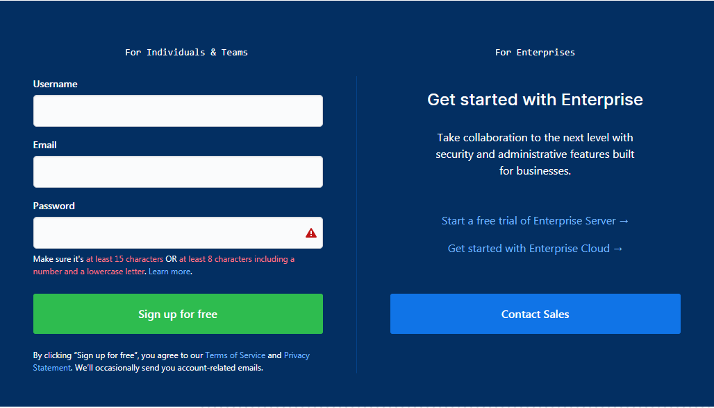
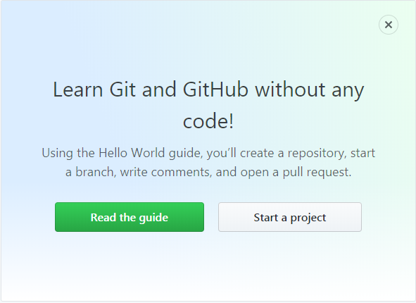
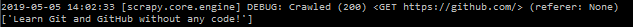
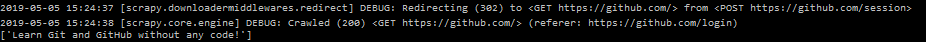

为什么要模拟登录
有些网站是需要登录之后才能访问的，即便是同一个网站，在用户登录前后页面所展示的内容也可能会大不相同，例如，未登录时访问Github首页将会是以下的注册页面：

然而，登录后访问Github首页将包含如下页面内容：

如果我们要爬取的是一些需要登录之后才能访问的页面数据就需要模拟登录了。通常我们都是利用的`Cookies`来实现模拟登录，在Scrapy中，模拟登陆网站一般有如下两种实现方式：

- 请求时携带Cookies
- 发送Post请求获取Cookies

# 请求时携带Cookies
对于一些Cookies过期时间很长的不规范网站，如果我们能够在Cookies过期之前爬取到所有我们想要的数据，可以考虑在请求时直接将Cookies信息带上来模拟用户登录。

以下是模拟登录Github的示例代码：

	# -*- coding: utf-8 -*-
	import scrapy
	import re
	 
	class TmallLoginSpider(scrapy.Spider):
	    name = 'github_login3'
	    allowed_domains = ['github.com']
	    start_urls = ['https://github.com/']
	 
	    def start_requests(self):  # 请求时携带Cookies
	        cookies = '_ga=GA1.2.363045452.1554860671; tz=Asia%2FShanghai; _octo=GH1.1.1405577398.1554860677; _device_id=ee3ff12512668a1f9dc6fb33e388ea20; ignored_unsupported_browser_notice=false; has_recent_activity=1; user_session=5oxrsfsZCor1iJFCgRXXyeAXd8hcmzEUGh70-xHWLjQkT62Q; __Host-user_session_same_site=5oxrsfsZCor1iJFCgRXXyeAXd8hcmzEUGh70-xHWLjQkT62Q; logged_in=yes; dotcom_user=pengjunlee; _gat=1'
	        cookies = {i.split('=')[0]: i.split('=')[1] for i in cookies.split('; ')}
	        yield scrapy.Request(self.start_urls[0], cookies=cookies)
	        
	    def parse(self, response):  # 验证是否请求成功
	        print(re.findall('Learn Git and GitHub without any code!',response.body.decode()))

执行爬虫后，后台部分日志截图如下：

# 发送Post请求模拟登录
Scrapy还提供了两种通过发送Post请求来获取Cookies的方法。

## scrapy.FormRequest()

使用`scrapy.FormRequest()`发送Post请求实现模拟登陆，需要人为找出登录请求的地址以及构造出登录时所需的请求数据。

使用`scrapy.FormRequest()`模拟登录Github的示例代码： 

	# -*- coding: utf-8 -*-
	import scrapy
	import re
	 
	class GithubLoginSpider(scrapy.Spider):
	    name = 'github_login'
	    allowed_domains = ['github.com']
	    start_urls = ['https://github.com/login']
	 
	    def parse(self, response): # 发送Post请求获取Cookies
	        authenticity_token = response.xpath('//input[@name="authenticity_token"]/@value').extract_first()
	        utf8 = response.xpath('//input[@name="utf8"]/@value').extract_first()
	        commit = response.xpath('//input[@name="commit"]/@value').extract_first()
	        form_data = {
	            'login': 'pengjunlee@163.com',
	            'password': '123456',
	            'webauthn-support': 'supported',
	            'authenticity_token': authenticity_token,
	            'utf8': utf8,
	            'commit': commit}
	        yield scrapy.FormRequest("https://github.com/session", formdata=form_data, callback=self.after_login)
	 
	    def after_login(self, response): # 验证是否请求成功
	        print(re.findall('Learn Git and GitHub without any code!', response.body.decode()))

从后台日志不难看出，Scrapy在请求完<https://github.com/session>后,自动帮我们重定向到了Github首页。

## scrapy.FormRequest.from_response()
`scrapy.FormRequest.from_response()`使用起来比`scrapy.FormRequest()`更加简单方便，我们通常只需要提供用户相关信息（账户和密码）即可，`scrapy.FormRequest.from_response()`将通过模拟点击为我们填充好其他的表单字段并提交表单。

使用`scrapy.FormRequest.from_response()`模拟登录Github的示例代码： 

	# -*- coding: utf-8 -*-
	import scrapy
	import re
	 
	class GithubLogin2Spider(scrapy.Spider):
	    name = 'github_login2'
	    allowed_domains = ['github.com']
	    start_urls = ['https://github.com/login']
	 
	    def parse(self, response): # 发送Post请求获取Cookies
	        form_data = {
	            'login': 'pengjunlee@163.com',
	            'password': '123456'
	        }
	        yield scrapy.FormRequest.from_response(response,formdata=form_data,callback=self.after_login)
	 
	    def after_login(self,response):  # 验证是否请求成功
	        print(re.findall('Learn Git and GitHub without any code!',response.body.decode()))

`scrapy.FormRequest.from_response()`方法还可以传入其他参数来帮我们更加精确的指定表单元素：

	'''
	response (Response object) – 包含表单HTML的响应，将用来对表单的字段进行预填充
	formname (string) – 如果设置了该值，name 等于该值的表单将被使用
	formid (string) – 如果设置了该值，id 等于该值的表单将被使用
	formxpath (string) – 如果设置了该值，匹配该 xpath 的第一个表单将被使用
	formcss (string) – 如果设置了该值，匹配该 css选择器的第一个表单将被使用
	formnumber (integer) – 索引值等于该值的表单将被使用，默认第一个（索引值为 0 ）
	formdata (dict) – 传入的表单数据，将覆盖form 元素中已经存在的值
	clickdata (dict) – 用于查找可点击控件的属性值
	dont_click (boolean) – 如果设置为 True，将不点击任何元素，直接提交表单数据
	'''

# 参考文章

<https://doc.scrapy.org/en/latest/topics/request-response.html>