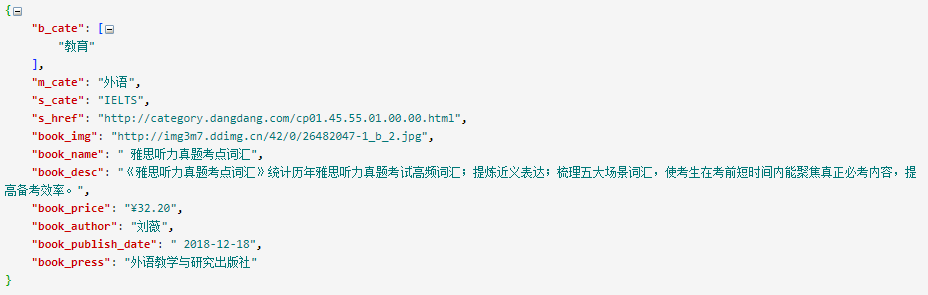
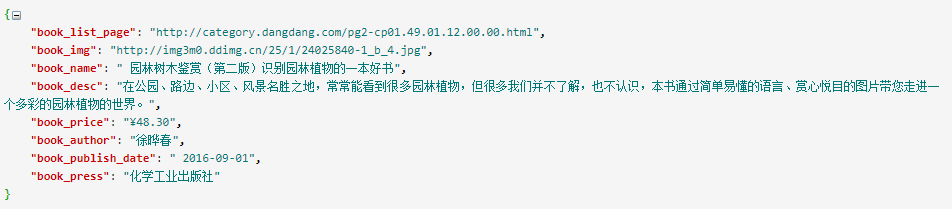

在上一章《Scrapy-Redis入门实战》中我们利用scrapy-redis实现了京东图书爬虫的分布式部署和数据爬取。但存在以下问题：

每个爬虫实例在启动的时候，都必须从start_urls开始爬取，即每个爬虫实例都会请求start_urls中的地址，属重复请求，浪费系统资源。

为了解决这一问题，Scrapy-Redis提供了RedisSpider与RedisCrawlSpider两个爬虫类，继承自这两个类的Spider在启动的时候能够从指定的Redis列表中去获取start_urls；任意爬虫实例从Redis列表中获取某一url时会将其从列表中弹出，因此其他爬虫实例将不能重复读取该url；对于那些未从Redis列表获取到初始url的爬虫实例将一直处于阻塞状态，直到start_urls列表中被插入新的起始地址或者Redis的Requests列表中出现待处理的请求。

在这里，我们以爬取当当网图书信息为例对这两个Spider的用法进行简单示例。

`settings.py`配置如下：

	# -*- coding: utf-8 -*-
	 
	BOT_NAME = 'dang_dang'
	 
	SPIDER_MODULES = ['dang_dang.spiders']
	NEWSPIDER_MODULE = 'dang_dang.spiders'
	 
	 
	# Crawl responsibly by identifying yourself (and your website) on the user-agent
	USER_AGENT = 'Mozilla/5.0 (Windows NT 6.1; Win64; x64) AppleWebKit/537.36 (KHTML, like Gecko) Chrome/71.0.3578.98 Safari/537.36'
	 
	# Obey robots.txt rules
	ROBOTSTXT_OBEY = False
	 
	 
	######################################################
	##############下面是Scrapy-Redis相关配置################
	######################################################
	 
	# 指定Redis的主机名和端口
	REDIS_HOST = 'localhost'
	REDIS_PORT = 6379
	 
	# 调度器启用Redis存储Requests队列
	SCHEDULER = "scrapy_redis.scheduler.Scheduler"
	 
	# 确保所有的爬虫实例使用Redis进行重复过滤
	DUPEFILTER_CLASS = "scrapy_redis.dupefilter.RFPDupeFilter"
	 
	# 将Requests队列持久化到Redis，可支持暂停或重启爬虫
	SCHEDULER_PERSIST = True
	 
	# Requests的调度策略，默认优先级队列
	SCHEDULER_QUEUE_CLASS = 'scrapy_redis.queue.PriorityQueue'
	 
	# 将爬取到的items保存到Redis 以便进行后续处理
	ITEM_PIPELINES = {
	    'scrapy_redis.pipelines.RedisPipeline': 300
	}

RedisSpider代码示例

	# -*- coding: utf-8 -*-
	import scrapy
	import re
	import urllib
	from copy import deepcopy
	from scrapy_redis.spiders import RedisSpider
	 
	 
	class DangdangSpider(RedisSpider):
	    name = 'dangdang'
	    allowed_domains = ['dangdang.com']
	    redis_key = 'dangdang:book'
	    pattern = re.compile(r"(http|https)://category.dangdang.com/cp(.*?).html", re.I)
	 
	    # def __init__(self, *args, **kwargs):
	    #     # 动态定义可爬取的域范围
	    #     domain = kwargs.pop('domain', '')
	    #     self.allowed_domains = filter(None, domain.split(','))
	    #     super(DangdangSpider, self).__init__(*args, **kwargs)
	 
	    def parse(self, response):  # 从首页提取图书分类信息
	        # 提取一级分类元素
	        div_list = response.xpath("//div[@class='con flq_body']/div")
	        for div in div_list:
	            item = {}
	            item["b_cate"] = div.xpath("./dl/dt//text()").extract()
	            item["b_cate"] = [i.strip() for i in item["b_cate"] if len(i.strip()) > 0]
	            # 提取二级分类元素
	            dl_list = div.xpath("./div//dl[@class='inner_dl']")
	            for dl in dl_list:
	                item["m_cate"] = dl.xpath(".//dt/a/@title").extract_first()
	                # 提取三级分类元素
	                a_list = dl.xpath("./dd/a")
	                for a in a_list:
	                    item["s_cate"] = a.xpath("./text()").extract_first()
	                    item["s_href"] = a.xpath("./@href").extract_first()
	                    if item["s_href"] is not None and self.pattern.match(item["s_href"]) is not None:
	                        yield scrapy.Request(item["s_href"], callback=self.parse_book_list,
	                                             meta={"item": deepcopy(item)})
	 
	    def parse_book_list(self, response):  # 从图书列表页提取数据
	        item = response.meta['item']
	        li_list = response.xpath("//ul[@class='bigimg']/li")
	        for li in li_list:
	            item["book_img"] = li.xpath("./a[@class='pic']/img/@src").extract_first()
	            if item["book_img"] == "images/model/guan/url_none.png":
	                item["book_img"] = li.xpath("./a[@class='pic']/img/@data-original").extract_first()
	            item["book_name"] = li.xpath("./p[@class='name']/a/@title").extract_first()
	            item["book_desc"] = li.xpath("./p[@class='detail']/text()").extract_first()
	            item["book_price"] = li.xpath(".//span[@class='search_now_price']/text()").extract_first()
	            item["book_author"] = li.xpath("./p[@class='search_book_author']/span[1]/a/text()").extract_first()
	            item["book_publish_date"] = li.xpath("./p[@class='search_book_author']/span[2]/text()").extract_first()
	            if item["book_publish_date"] is not None:
	                item["book_publish_date"] = item["book_publish_date"].replace('/', '')
	            item["book_press"] = li.xpath("./p[@class='search_book_author']/span[3]/a/text()").extract_first()
	            yield deepcopy(item)
	 
	        # 提取下一页地址
	        next_url = response.xpath("//li[@class='next']/a/@href").extract_first()
	        if next_url is not None:
	            next_url = urllib.parse.urljoin(response.url, next_url)
	            yield scrapy.Request(next_url, callback=self.parse_book_list, meta={"item": item})

当Redis的`dangdang:book`键所对应的`start_urls`列表为空时，启动DangdangSpider爬虫会进入到阻塞状态等待列表中被插入数据，控制台提示内容类似下面这样：

	2019-05-08 14:02:53 [scrapy.core.engine] INFO: Spider opened
	2019-05-08 14:02:53 [scrapy.extensions.logstats] INFO: Crawled 0 pages (at 0 pages/min), scraped 0 items (at 0 items/min)
	2019-05-08 14:02:53 [scrapy.extensions.telnet] DEBUG: Telnet console listening on 127.0.0.1:6023

此时需要向start_urls列表中插入爬虫的初始爬取地址，向Redis列表中插入数据可使用如下命令：

	lpush dangdang:book http://book.dangdang.com/

命令执行完后稍等片刻DangdangSpider便会开始爬取数据，爬取到的数据结构如下图所示：

RedisCrawlSpider代码示例
	# -*- coding: utf-8 -*-
	import scrapy
	import re
	import urllib
	from copy import deepcopy
	from scrapy.spiders import CrawlSpider, Rule
	from scrapy.linkextractors import LinkExtractor
	from scrapy_redis.spiders import RedisCrawlSpider
	 
	 
	class DangdangCrawler(RedisCrawlSpider):
	    name = 'dangdang2'
	    allowed_domains = ['dangdang.com']
	    redis_key = 'dangdang:book'
	    pattern = re.compile(r"(http|https)://category.dangdang.com/cp(.*?).html", re.I)
	 
	    rules = (
	        Rule(LinkExtractor(allow=r'(http|https)://category.dangdang.com/cp(.*?).html'), callback='parse_book_list',
	             follow=False),
	    )
	 
	    def parse_book_list(self, response):  # 从图书列表页提取数据
	        item = {}
	        item['book_list_page'] = response._url
	        li_list = response.xpath("//ul[@class='bigimg']/li")
	        for li in li_list:
	            item["book_img"] = li.xpath("./a[@class='pic']/img/@src").extract_first()
	            if item["book_img"] == "images/model/guan/url_none.png":
	                item["book_img"] = li.xpath("./a[@class='pic']/img/@data-original").extract_first()
	            item["book_name"] = li.xpath("./p[@class='name']/a/@title").extract_first()
	            item["book_desc"] = li.xpath("./p[@class='detail']/text()").extract_first()
	            item["book_price"] = li.xpath(".//span[@class='search_now_price']/text()").extract_first()
	            item["book_author"] = li.xpath("./p[@class='search_book_author']/span[1]/a/text()").extract_first()
	            item["book_publish_date"] = li.xpath("./p[@class='search_book_author']/span[2]/text()").extract_first()
	            if item["book_publish_date"] is not None:
	                item["book_publish_date"] = item["book_publish_date"].replace('/', '')
	            item["book_press"] = li.xpath("./p[@class='search_book_author']/span[3]/a/text()").extract_first()
	            yield deepcopy(item)
	 
	        # 提取下一页地址
	        next_url = response.xpath("//li[@class='next']/a/@href").extract_first()
	        if next_url is not None:
	            next_url = urllib.parse.urljoin(response.url, next_url)
	            yield scrapy.Request(next_url, callback=self.parse_book_list)

与DangdangSpider爬虫类似，DangdangCrawler在获取不到初始爬取地址时也会阻塞在等待状态，当start_urls列表中有地址即开始爬取，爬取到的数据结构如下图所示：

 