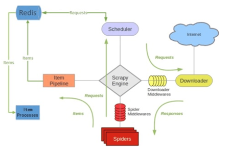
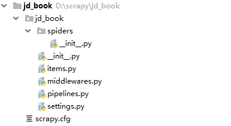
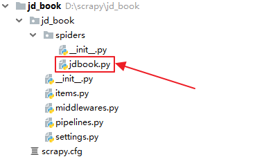
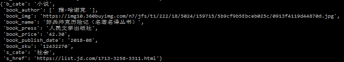
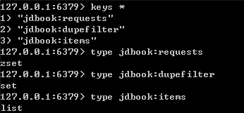

# 简介
scrapy-redis是一个基于redis的scrapy组件，用于快速实现scrapy项目的分布式部署和数据爬取，其运行原理如下图所示。

# Scrapy-Redis特性
## 分布式爬取

你可以启动多个共享同一redis队列的爬虫实例，多个爬虫实例将各自提取到或者已请求的Requests在队列中统一进行登记，使得Scheduler在请求调度时能够对重复Requests进行过滤，即保证已经由某一个爬虫实例请求过的Request将不会再被其他的爬虫实例重复请求。

## 分布式数据处理

将scrapy爬取到的items汇聚到同一个redis队列中，意味着你可以根据你的需要启动尽可能多的共享这个items队列的后处理程序。

## Scrapy即插即用组件

Scheduler调度器 + Duplication重复过滤器、Item Pipeline、基础Spider爬虫

# Scrapy-Redis示例
本文将以爬取京东所有图书分类下的图书信息为例对Scrapy-Redis的用法进行示例。

## 开发环境

	Python 3.7
	Redis 3.2.100

下面列举出了Python中Scrapy-Redis所需要的各个模块及其版本：

	redis 2.10.6
	redis-py-cluster 1.3.6
	scrapy-redis 0.6.8
	scrapy-redis-cluster 0.4

在开发之前需要先安装好以上模块，以scrapy-redis-cluster模块为例，使用pip进行安装的命令如下：

	pip install scrapy-redis-cluster # 安装模块
	pip install scrapy-redis-cluster==0.4 # 安装模块时指定版本
	pip install --upgrade scrapy-redis-cluster # 升级模块版本

## 创建项目
在Windows命令行执行如下命令完成项目创建：

	d:\scrapy>scrapy startproject jd_book

执行完该命令后，将会在当前目录下创建包含下列内容的`jd_book`目录：

## 定义Item
在`items.py`中把我们将要爬取的图书字段预先定义好。

	# -*- coding: utf-8 -*-
	 
	import scrapy
	 
	class JdBookItem(scrapy.Item):
	    b_cate = scrapy.Field() # 图书所属一级分类名称
	    s_cate = scrapy.Field() # 图书所属二级分类名称
	    s_href = scrapy.Field() # 图书所属二级分类地址
	    book_name = scrapy.Field() # 名称
	    book_img = scrapy.Field() # 封面图片地址
	    book_author = scrapy.Field() # 作者
	    book_press = scrapy.Field() # 出版社
	    book_publish_date = scrapy.Field() # 出版日期
	    book_sku = scrapy.Field() # 商品编号
	    book_price = scrapy.Field() # 价格

## 创建Spider
在Windows命令行执行如下命令完成Spider创建：

	d:\scrapy\jd_book>cd jd_book
	d:\scrapy\jd_book>scrapy genspider jdbook jd.com

执行完该命令后，将会在`jd_book`的`spiders`目录下生成一个`jdbook.py`文件 ：

`jdbook.py`的完整爬虫代码如下。

	# -*- coding: utf-8 -*-
	import scrapy
	import json
	import urllib
	from copy import deepcopy
	from jd_book.items import JdBookItem
	 
	class JdbookSpider(scrapy.Spider):
	    name = 'jdbook'
	    allowed_domains = ['jd.com','3.cn']
	    start_urls = ['https://book.jd.com/booksort.html']
	 
	    def parse(self, response): # 处理图书分类页
	        dt_list = response.xpath("//div[@class='mc']/dl/dt") # 提取一级分类元素
	        for dt in dt_list:
	            item = JdBookItem()
	            item["b_cate"] = dt.xpath("./a/text()").extract_first() # 提取一级分类名称
	            em_list = dt.xpath("./following-sibling::dd[1]/em") # 提取二级分类元素
	            for em in em_list:
	                item["s_cate"] = em.xpath("./a/text()").extract_first() # 提取二级分类名称
	                item["s_href"] = em.xpath("./a/@href").extract_first() # 提取二级分类地址
	                if item["s_href"] is not None:
	                    item['s_href'] = "https:" + item['s_href'] # 补全二级分类地址
	                    yield scrapy.Request(item['s_href'], callback=self.parse_book_list, meta={"item": deepcopy(item)})
	 
	    def parse_book_list(self, response): # 处理二级分类下图书列表页
	        item = response.meta['item']
	        li_list = response.xpath("//div[@id='plist']/ul/li") # 提取所有的图书元素
	        for li in li_list:
	            item["book_img"] = li.xpath(".//div[@class='p-img']//img/@data-lazy-img").extract_first()
	            if item["book_img"] is None:
	                item["book_img"] = li.xpath(".//div[@class='p-img']//img/@src").extract_first()
	            if item["book_img"] is not None:
	                item["book_img"] = "https:"+item["book_img"]
	            item["book_name"] = li.xpath(".//div[@class='p-name']/a/em/text()").extract_first().strip()
	            item["book_author"] = li.xpath(".//span[@class='author_type_1']/a/text()").extract()
	            item["book_press"] = li.xpath(".//span[@class='p-bi-store']/a/@title").extract_first()
	            item["book_publish_date"] = li.xpath(".//span[@class='p-bi-date']/text()").extract_first().strip()
	            item["book_sku"] = li.xpath("./div/@data-sku").extract_first()
	            price_url = "https://p.3.cn/prices/mgets?skuIds=j_{}".format(item["book_sku"]) # 提取图书价格请求地址
	            yield scrapy.Request(price_url, callback=self.parse_book_price, meta={"item": deepcopy(item)})
	 
	        # 提取列表页下一页地址
	        next_url = response.xpath("//a[@class='pn-next']/@href").extract_first()
	        if next_url is not None:
	            next_url = urllib.parse.urljoin(response.url, next_url)
	            # yield scrapy.Request(next_url,callback=self.parse_book_list,meta={"item":item})
	 
	    def parse_book_price(self, response):
	        item = response.meta['item']
	        item["book_price"] = json.loads(response.body.decode())[0]["op"]
	        yield item

## 修改配置
在`settings.py`中增加Scrapy-Redis相关配置。

	# -*- coding: utf-8 -*-
	 
	BOT_NAME = 'jd_book'
	 
	SPIDER_MODULES = ['jd_book.spiders']
	NEWSPIDER_MODULE = 'jd_book.spiders'
	 
	# Crawl responsibly by identifying yourself (and your website) on the user-agent
	USER_AGENT = 'Mozilla/5.0 (Windows NT 6.1; Win64; x64) AppleWebKit/537.36 (KHTML, like Gecko) Chrome/71.0.3578.98 Safari/537.36'
	 
	# Obey robots.txt rules
	ROBOTSTXT_OBEY = False
	 
	 
	######################################################
	##############下面是Scrapy-Redis相关配置################
	######################################################
	 
	# 指定Redis的主机名和端口
	REDIS_HOST = 'localhost'
	REDIS_PORT = 6379
	 
	# 调度器启用Redis存储Requests队列
	SCHEDULER = "scrapy_redis.scheduler.Scheduler"
	 
	# 确保所有的爬虫实例使用Redis进行重复过滤
	DUPEFILTER_CLASS = "scrapy_redis.dupefilter.RFPDupeFilter"
	 
	# 将Requests队列持久化到Redis，可支持暂停或重启爬虫
	SCHEDULER_PERSIST = True
	 
	# Requests的调度策略，默认优先级队列
	SCHEDULER_QUEUE_CLASS = 'scrapy_redis.queue.PriorityQueue'
	 
	# 将爬取到的items保存到Redis 以便进行后续处理
	ITEM_PIPELINES = {
	    'scrapy_redis.pipelines.RedisPipeline': 300
	}

## 启动爬虫
至此京东图书项目就算配置完成了，你可以将项目部署到多台服务器中去，并使用如下命令来启动爬虫：
 
	d:\scrapy\jd_book>scrapy crawl jdbook

爬取到的图书数据结构如下：

相应地，在Redis数据库中同时生成了如下3个键：

其中，`jdbook:requests`中保存了待爬取的Request对象；`jdbook:dupefilter`中保存了已经爬取过的Request对象的指纹；`jdbook:items`中保存了爬取到的Item对象。

通过上述京东图书项目不难看出，scrapy-redis项目与普通的scrapy项目相比，除了在settings.py配置时额外增加了一些scrapy-redis的专属配置外，其他环节完全相同。

# 参考文章

<https://scrapy-redis.readthedocs.io/en/stable/index.html>