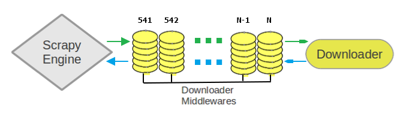

# 下载器中间件简介
下载器中间件(Downloader Middleware)是介于Scrapy的`request`/`response`处理的钩子框架。 是用于全局修改Scrapy`request`和`response`的一个轻量、底层的系统。

# 自定义下载器中间件
每个下载器中间件是一个定义了以下一个或多个方法的Python类：

    def process_request(self, request, spider):
        # 每一个Requests 从引擎传递给下载器之前,该方法被调用
 
        # 必须返回下述值之一:
        # - None: Scrapy将继续处理该request，由其他的下载器中间件（按照顺序编号由小到大）或者下载器处理；
        # - Response: 其将返回该response ；
        #             其他下载器中间件的 process_request() 或 process_exception() 方法 以及 下载器的下载函数将不会被调用；
        #             已经激活的下载器中间件将按照顺序编号由大到小依次调用 process_response() 方法对该response进行处理；
        # - Request: Scrapy 将停止调用 process_request() 方法并重新调度返回的request
        # - raise IgnoreRequest: 声明忽略该request；
        #                        已经激活的下载器中间件将按照顺序编号由大到小依次调用 process_exception() 方法对该异常进行处理；
        #                        如果没有任何一个方法处理该异常， 则request的errback(Request.errback)方法会被调用；
        #                        如果没有代码处理抛出的异常， 则该异常被忽略且不记录(不同于其他异常那样)。
        return None
 
    def process_response(self, request, response, spider):
        # 每一个Responses 从下载器返回给引擎之前,该方法被调用
 
        # 必须返回下述值之一:
        # - Response: 可以与传入的response相同，也可以是全新的对象 ；
        #             已经激活的比当前中间件顺序编号小的下载器中间件将按照顺序编号由大到小依次调用 process_response() 方法对该response进行处理；
        # - Request: Scrapy 将停止调用 process_request() 方法并重新调度返回的request
        # - raise IgnoreRequest: 声明忽略该request；
        #                        则调用request的errback(Request.errback)。 如果没有代码处理抛出的异常，则该异常被忽略且不记录(不同于其他异常那样)；
        return response
 
    def process_exception(self, request, exception, spider):
        # 当下载器或者下载器中间件执行 process_request() 方法抛出异常时,该方法被调用
 
        # 必须返回下述值之一:
        # - None: Scrapy将继续处理该异常；
        #         已经激活的下载器中间件将按照顺序编号由大到小依次调用 process_exception() 方法对该异常进行处理；
        #         直到所有下载器中间件都被调用完毕，则调用默认的异常处理；
        # - Response:  已经激活的下载器中间件将按照顺序编号由大到小依次调用 process_response() 方法对该response进行处理；
        # - Request: Scrapy 将停止异常处理并重新调度返回的request
        pass

## RandomUserAgentMiddleware
`RandomUserAgentMiddleware`能够从我们预先定义好的User-Agent列表中随机选择一个添加到Request的请求头中。

	import random
	 
	# 随机选择 User-Agent 下载器中间件
	class RandomUserAgentMiddleware(object):
	 
	    def process_request(self, request, spider):
	        # 从 settings 的 USER_AGENTS 列表中随机选择一个作为 User-Agent
	        user_agent = random.choice(spider.settings['USER_AGENTS'])
	        request.headers['User-Agent'] = user_agent
	        return None
	 
	    def process_response(self, request, response, spider):
	        # 验证 User-Agent 设置是否生效
	        print(request.headers['User-Agent'])
	        return response
	 settings.py 中配置的 USER_AGENTS 列表内容格式如下：
	
	USER_AGENTS = [
	    "Mozilla/5.0 (Windows NT 6.1; Win64; x64) AppleWebKit/537.36 (KHTML, like Gecko) Chrome/71.0.3578.98 Safari/537.36",
	    "Mozilla/5.0 (Windows NT 6.0) AppleWebKit/535.2 (KHTML, like Gecko) Chrome/15.0.874.120 Safari/535.2"
	]

## RandomProxyMiddleware
在网络爬虫过程中，经常会碰到 IP地址被限制访问的情况，我们通常都会通过设置代理来解决。

RandomProxyMiddleware就是这样一个下载器中间件，能够从我们预先定义好的IP代理列表中随机选择一个来发送请求。

	import random
	 
	# 随机选择 IP 代理下载器中间件
	class RandomProxyMiddleware(object):
	 
	    # 从 settings 的 PROXIES 列表中随机选择一个作为代理
	    def process_request(self, request, spider):
	        proxy = random.choice(spider.settings['PROXIES'])
	        request.meta['proxy'] = proxy
	        return None
	 settings.py 中配置的 PROXIES 列表内容格式如下：
	
	PROXIES = [
	    "https://171.13.92.212:9797",
	    "https://164.163.234.210:8080",
	    "https://143.202.73.219:8080",
	    "https://103.75.166.15:8080"
	]

## 激活下载器中间件
要激活下载器中间件，需要将其加入到`DOWNLOADER_MIDDLEWARES`设置中。 该设置是一个字典(dict)，键为中间件类的路径，值为其中间件的顺序(order)。

激活`RandomUserAgentMiddleware`和`RandomProxyMiddleware`两个下载器中间件的配置如下：

	# Enable or disable downloader middlewares
	# See https://doc.scrapy.org/en/latest/topics/downloader-middleware.html
	DOWNLOADER_MIDDLEWARES = {
	    'baidu_tieba.middlewares.RandomUserAgentMiddleware': 541,
	    'baidu_tieba.middlewares.RandomProxyMiddleware': 542
	}

`DOWNLOADER_MIDDLEWARES`设置会与Scrapy定义的`DOWNLOADER_MIDDLEWARES_BASE`设置合并(但不是覆盖)， 而后根据顺序(order)进行排序，最后得到启用中间件的有序列表: 第一个中间件是最靠近引擎的，最后一个中间件是最靠近下载器的。

关于如何分配中间件的顺序请查看`DOWNLOADER_MIDDLEWARES_BASE`设置，而后为你的中间件选择一个合适的顺序（order）值。 由于每个中间件执行不同的动作，你的中间件可能会依赖于之前(或者之后)执行的中间件，因此顺序是很重要的。

以下是`DOWNLOADER_MIDDLEWARES_BASE`的默认配置：

	DOWNLOADER_MIDDLEWARES_BASE = {
	    'scrapy.downloadermiddlewares.robotstxt.RobotsTxtMiddleware': 100,
	    'scrapy.downloadermiddlewares.httpauth.HttpAuthMiddleware': 300,
	    'scrapy.downloadermiddlewares.downloadtimeout.DownloadTimeoutMiddleware': 350,
	    'scrapy.downloadermiddlewares.useragent.UserAgentMiddleware': 400,
	    'scrapy.downloadermiddlewares.retry.RetryMiddleware': 500,
	    'scrapy.downloadermiddlewares.defaultheaders.DefaultHeadersMiddleware': 550,
	    'scrapy.downloadermiddlewares.redirect.MetaRefreshMiddleware': 580,
	    'scrapy.downloadermiddlewares.httpcompression.HttpCompressionMiddleware': 590,
	    'scrapy.downloadermiddlewares.redirect.RedirectMiddleware': 600,
	    'scrapy.downloadermiddlewares.cookies.CookiesMiddleware': 700,
	    'scrapy.downloadermiddlewares.httpproxy.HttpProxyMiddleware': 750,
	    'scrapy.downloadermiddlewares.chunked.ChunkedTransferMiddleware': 830,
	    'scrapy.downloadermiddlewares.stats.DownloaderStats': 850,
	    'scrapy.downloadermiddlewares.httpcache.HttpCacheMiddleware': 900,
	}

如果你想禁止内置的(在`DOWNLOADER_MIDDLEWARES_BASE`中设置并默认启用的)中间件， 你可以在项目的 `DOWNLOADER_MIDDLEWARES`设置中定义该中间件，并将其值赋为`None`。 例如，关闭内置的`UserAgentMiddleware` 中间件：

	DOWNLOADER_MIDDLEWARES = {
	    'scrapy.downloadermiddlewares.useragent.UserAgentMiddleware': None
	}

最后，请注意，有些中间件需要通过特定的设置来启用。更多内容请查看相关中间件文档。

# 内置下载器中间件
接下来将对几个常用的内置下载器中间件进行简单介绍。 

## CookiesMiddleware

	class scrapy.downloadermiddlewares.cookies.CookiesMiddleware

内置的`CookiesMiddleware`下载器中间件使得爬取需要cookie(例如使用session)的网站成为了可能。 其追踪了web server发送的cookie，并在之后的request中发送回去， 就如浏览器所做的那样。

以下设置可以用来配置CookiesMiddleware中间件:

	COOKIES_ENABLED = True # 是否启用 CookiesMiddleware ，默认 True
	COOKIES_DEBUG = False # 是否启用 Cookies 调试，默认 False

如果启用`Cookies`调试，Scrapy将记录所有在request(Cookie 请求头)发送的cookies及response接收到的cookies(Set-Cookie 接收头)。

下边是启用`COOKIES_DEBUG`的记录的样例:

	2011-04-06 14:35:10-0300 [scrapy] INFO: Spider opened
	2011-04-06 14:35:10-0300 [scrapy] DEBUG: Sending cookies to: <GET http://www.diningcity.com/netherlands/index.html>
	        Cookie: clientlanguage_nl=en_EN
	2011-04-06 14:35:14-0300 [scrapy] DEBUG: Received cookies from: <200 http://www.diningcity.com/netherlands/index.html>
	        Set-Cookie: JSESSIONID=B~FA4DC0C496C8762AE4F1A620EAB34F38; Path=/
	        Set-Cookie: ip_isocode=US
	        Set-Cookie: clientlanguage_nl=en_EN; Expires=Thu, 07-Apr-2011 21:21:34 GMT; Path=/
	2011-04-06 14:49:50-0300 [scrapy] DEBUG: Crawled (200) <GET http://www.diningcity.com/netherlands/index.html> (referer: None)
	[...]

## DefaultHeadersMiddleware

	class scrapy.downloadermiddlewares.defaultheaders.DefaultHeadersMiddleware

该中间件设置`DEFAULT_REQUEST_HEADERS`指定的默认request header。

	# Override the default request headers:
	DEFAULT_REQUEST_HEADERS = {
	    'Accept': 'text/html,application/xhtml+xml,application/xml;q=0.9,*/*;q=0.8',
	    'Accept-Language': 'en',
	}

## DownloadTimeoutMiddleware

	class scrapy.downloadermiddlewares.downloadtimeout.DownloadTimeoutMiddleware

该中间件设置`DOWNLOAD_TIMEOUT`指定的request下载超时时间。

	# 下载器超时时间(单位: 秒)，默认 180
	DOWNLOAD_TIMEOUT = 180

## HttpProxyMiddleware

	class scrapy.downloadermiddlewares.httpproxy.HttpProxyMiddleware

该中间件提供了对request设置HTTP代理的支持。你可以通过在Request对象中设置proxy元数据来开启代理。

类似于Python标准库模块`urllib`及`urllib2`，其使用了下列环境变量：

- http_proxy
- https_proxy
- no_proxy

你也可以针对每个请求设置proxy元数据, 其形式类似于<http://some_proxy_server:port>。

## RedirectMiddleware

	class scrapy.downloadermiddlewares.redirect.RedirectMiddleware

该中间件根据response的状态处理重定向的request。

通过该中间件的(被重定向的)request的url可以通过`Request.meta`的`redirect_urls`键找到。

RedirectMiddleware可以通过下列设置进行配置(更多内容请参考设置文档)：

	REDIRECT_ENABLED # 是否启用RedirectMiddleware中间件，默认: True
	REDIRECT_MAX_TIMES # 单个request被重定向的最大次数，默认: 20

如果`Request.meta`包含`dont_redirect`键，则该request将会被此中间件忽略。

## RetryMiddleware

	class scrapy.downloadermiddlewares.retry.RetryMiddleware

该中间件将重试可能由于临时的问题，例如连接超时或者HTTP 500错误导致失败的页面。

爬取进程会收集失败的页面并在最后，spider爬取完所有正常(不失败)的页面后重新调度。 一旦没有更多需要重试的失败页面，该中间件将会发送一个信号(retry_complete)， 其他插件可以监听该信号。

RetryMiddleware可以通过下列设定进行配置 (更多内容请参考设置文档)：

	RETRY_ENABLED # 是否启用 RetryMiddleware ，默认: True
	RETRY_TIMES # 包括第一次下载，最多的重试次数，默认: 2
	RETRY_HTTP_CODES # 重试的response 返回值(code)，默认: [500, 502, 503, 504, 400, 408]

关于HTTP错误的考虑：

如果根据HTTP协议，您可能想要在设定`RETRY_HTTP_CODES`中移除`400`错误。 该错误被默认包括是由于这个代码经常被用来指示服务器过载(overload)了。而在这种情况下，我们想进行重试。

如果`Request.meta`包含`dont_retry`键， 该request将会被本中间件忽略。

## RobotsTxtMiddleware

	class scrapy.downloadermiddlewares.robotstxt.RobotsTxtMiddleware

该中间件过滤所有`robots.txt eclusion standard`中禁止的request。

确认该中间件及`ROBOTSTXT_OBEY`设置被启用以确保Scrapy尊重`robots.txt`。

	# Obey robots.txt rules，默认 True
	ROBOTSTXT_OBEY = False

## UserAgentMiddleware

	class scrapy.downloadermiddlewares.useragent.UserAgentMiddleware

用于覆盖spider的默认`User-Agent`的中间件。

要使得spider能覆盖默认的User-Agent，其`USER_AGENT`属性必须被设置。

	# Crawl responsibly by identifying yourself (and your website) on the user-agent
	USER_AGENT = 'Mozilla/5.0 (Windows NT 6.1; Win64; x64) AppleWebKit/537.36 (KHTML, like Gecko) Chrome/71.0.3578.98 Safari/537.36'

# 参考文章

<https://scrapy-chs.readthedocs.io/zh_CN/1.0/topics/downloader-middleware.html>

 