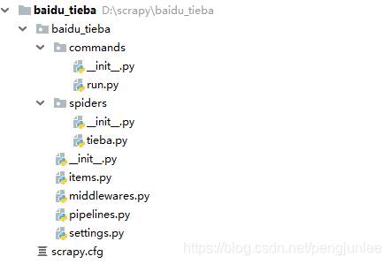
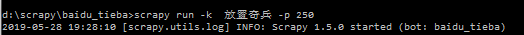

在使用Scrapy爬取数据时，有时会碰到需要根据传递给Spider的参数来决定爬取哪些Url或者爬取哪些页的情况。

例如，百度贴吧的放置奇兵吧的地址如下，其中`kw`参数用来指定贴吧名称、`pn`参数用来对帖子进行翻页。

	https://tieba.baidu.com/f?kw=放置奇兵&ie=utf-8&pn=250

如果我们希望通过参数传递的方式将贴吧名称和页数等参数传给Spider，来控制我们要爬取哪一个贴吧、爬取哪些页。遇到这种情况，有以下两种方法向Spider传递参数。

# 方式一
通过`scrapy crawl`命令的`-a`参数向`spider`传递参数。

	# -*- coding: utf-8 -*-
	import scrapy
	 
	class TiebaSpider(scrapy.Spider):
	    name = 'tieba'  # 贴吧爬虫
	    allowed_domains = ['tieba.baidu.com']  # 允许爬取的范围
	    start_urls = []  # 爬虫起始地址
	 
	    # 命令格式： scrapy crawl tieba -a tiebaName=放置奇兵 -a pn=250
	    def __init__(self, tiebaName=None, pn=None, *args, **kwargs):
	        print('< 贴吧名称 >： ' + tiebaName)
	        super(eval(self.__class__.__name__), self).__init__(*args, **kwargs)
	        self.start_urls = ['https://tieba.baidu.com/f?kw=%s&ie=utf-8&pn=%s' % (tiebaName,pn)]
	 
	    def parse(self, response):
	        print(response.request.url) # 结果：https://tieba.baidu.com/f?kw=%E6%94%BE%E7%BD%AE%E5%A5%87%E5%85%B5&ie=utf-8&pn=250

# 方式二
仿照`scrapy`的`crawl`命令的源代码，重新自定义一个专用命令。

## settings.py
首先，需要在`settings.py`文件中增加如下配置来指定自定义`scrapy`命令的存放目录。

	# 指定 Scrapy 命令存放目录
	COMMANDS_MODULE = 'baidu_tieba.commands'

## run.py
在指定的命令存放目录中创建命令文件，在这里我们创建的命令文件为`run.py`，将来执行的命令格式为：
`scrapy run [ -option option_value]`。

	import scrapy.commands.crawl as crawl
	from scrapy.exceptions import UsageError
	from scrapy.commands import ScrapyCommand
	 
	 
	class Command(crawl.Command):
	 
	    def add_options(self, parser):
	        # 为命令添加选项
	        ScrapyCommand.add_options(self, parser)
	        parser.add_option("-k", "--keyword", type="str", dest="keyword", default="",
	                          help="set the tieba's name you want to crawl")
	        parser.add_option("-p", "--pageNum", type="int", action="store", dest="pageNum", default=0,
	                          help="set the page number you want to crawl")
	 
	    def process_options(self, args, opts):
	        # 处理从命令行中传入的选项参数
	        ScrapyCommand.process_options(self, args, opts)
	        if opts.keyword:
	            tiebaName = opts.keyword.strip()
	            if tiebaName != '':
	                self.settings.set('TIEBA_NAME', tiebaName, priority='cmdline')
	        else:
	            raise UsageError("U must specify the tieba's name to crawl,use -kw TIEBA_NAME!")
	        self.settings.set('PAGE_NUM', opts.pageNum, priority='cmdline')
	 
	    def run(self, args, opts):
	        # 启动爬虫
	        self.crawler_process.crawl('tieba')
	        self.crawler_process.start()

## pipelines.py
在`BaiduTiebaPipeline`的`open_spider()`方法中利用`run`命令传入的参数对TiebaSpider进行初始化，在这里示例设置了一下start_urls。

	# -*- coding: utf-8 -*-
	import json
	 
	class BaiduTiebaPipeline(object):
	 
	    @classmethod
	    def from_settings(cls, settings):
	        return cls(settings)
	 
	    def __init__(self, settings):
	        self.settings = settings
	 
	    def open_spider(self, spider):
	        # 开启爬虫
	        spider.start_urls = [
	            'https://tieba.baidu.com/f?kw=%s&ie=utf-8&pn=%s' % (self.settings['TIEBA_NAME'], self.settings['PAGE_NUM'])]
	 
	    def close_spider(self, spider):
	        # 关闭爬虫
	        pass
	 
	    def process_item(self, item, spider):
	        # 将帖子内容保存到文件
	        with open('tieba.txt', 'a', encoding='utf-8') as f:
	            json.dump(dict(item), f, ensure_ascii=False, indent=2)
	        return item

设置完成后，别忘了在`settings.py`中启用BaiduTiebaPipeline。 

	ITEM_PIPELINES = {
	    'baidu_tieba.pipelines.BaiduTiebaPipeline': 50,
	}

## 启动示例
大功告成，参照如下命令格式启动贴吧爬虫。 

	scrapy run -k  放置奇兵 -p 250

# 参考文章

<https://blog.csdn.net/c0411034/article/details/81750028>

<https://blog.csdn.net/qq_24760381/article/details/80361400>

<https://blog.csdn.net/qq_38282706/article/details/80991196>