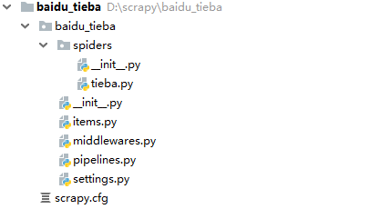

# Scrapy简介
Scrapy是一个为了爬取网站数据，提取结构性数据而编写的应用框架。 可以应用在包括数据挖掘，信息处理或存储历史数据等一系列的程序中。其最初是为了网络抓取所设计的，也可以应用在获取API所返回的数据(例如：`Amazon Associates Web Services`) 或者通用的网络爬虫。

由于Scrapy使用了`Twisted [ˈtwɪstɪd]`异步网络框架，可以加快数据的下载速度。借助Scrapy我们只需要编写少量的代码，就能够实现数据的快速抓取。

# 安装Scrapy
在使用Scrapy之前需要先进行安装，推荐使用`pip`安装Scrapy:

	pip install scrapy

常见错误：

	building 'twisted.test.raiser' extension
	error: Microsoft Visual C++ 14.0 is required. Get it with "Microsoft Visual C++ Build Tools": 

分析原因：

由错误提示可知是由于安装twisted导致的这个错误的发生，所以需要先安装twisted,不能使用`pip install twisted`，这会导致这个错误继续发生。

解决办法：

在下面的地址中下载相应的whl版本信息其中`cp`后面就是依赖的Python版本。 amd64表示`64`位操作系统。下载后将文件放到D盘下，使用`pip install d:\Twisted-17.1.0-cp36-cp36m-win_amd64.whl`安装。

<http://www.lfd.uci.edu/~gohlke/pythonlibs/#twisted>

# Scrapy工作流程

如图所示，Scrapy框架主要包括以下几个模块：

- `Scrapy Engine`（引擎）：任务调度的总指挥，负责数据和信号在不同模块间的传递。
- `Scheduler`（调度器）：内部包含一个队列，用来存放由引擎传递过来的Requests请求。
- `Downloader`（下载器）：处理引擎传递过来的Requests请求，发送请求并将Response响应返回给引擎。
- `Spider`（爬虫）：处理引擎传递过来的Response响应，从中提取数据，并将需要继续爬取的URL封装成Requests对象发送给引擎，由引擎再传递给调度器。
- `Item Pipeline`（管道）：处理引擎转发过来的在Spider中提取到的数据，比如存储数据。
- `Downloader Middlewares`（下载器中间件）：可以自定义的下载扩展，比如设置代理。
- `Spider Middlewares`（爬虫中间件）：可以自定义requests请求和进行response过滤。 

# Scrapy实战
使用Scrapy来进行数据抓取一般需要执行以下几个步骤：

1. 创建一个`Scrapy`项目
2. 定义要提取的数据`Item`
3. 编写爬取逻辑`Spider`并提取`Item`
4. 编写后期处理`Item Pipeline`来处理或存储提取到的`Item`

本文将以爬取百度贴吧中某吧内的帖子（标题、内容、链接地址、发帖日期、回复数）为例对Scrapy的用法进行示例。

## 创建项目
打开一个Windows命令行窗口，切换到你打算存储代码的目录中（本例中是`D:\scrapy`），运行下列命令:

	d:\scrapy>scrapy startproject baidu_tieba

执行完该命令后，将会创建包含下列内容的`baidu_tieba`目录：

常见错误：首次执行scrapy命令，提示以下错误

    import win32api
	ModuleNotFoundError: No module named 'win32api'

解决办法：

出现错误的原因是因为Python没有自带访问windows系统API的pywin32库，需要先进行安装，下载地址：

<https://github.com/mhammond/pywin32/releases>

## 定义Item
在Item中，我们可以把想要爬取的数据所包含的字段预先定义好，其使用方法和python中的字典类似，并且Item还提供了额外的字段检查机制来避免由于拼写错误导致的未定义字段错误。

编辑`items.py`，定义好的`BaiduTiebaItem`内容如下：

	import scrapy
	 
	class BaiduTiebaItem(scrapy.Item):
	    title = scrapy.Field() # 帖子标题
	    url= scrapy.Field() # 帖子地址
	    content = scrapy.Field() # 帖子内容
	    post_date = scrapy.Field() # 发帖日期
	    reply_count = scrapy.Field() # 回复数

## 创建Spider
Spider类定义了如何爬取某个(或某些)网站。包括了爬取的动作(例如:是否跟进链接)以及如何从网页的响应中提取结构化数据(爬取item)。

对spider来说，爬取的循环类似下文：

1. 以初始的URL初始化Request，并设置回调函数。 当该request下载完毕并返回时，将生成response，并作为参数传给该回调函数。
2. spider中初始的request是通过调用`start_requests()`来获取的。`start_requests()`读取`start_urls`中的URL， 并以`parse`为回调函数生成`Request`。
3. 在回调函数内分析返回的(网页)内容，返回`Item`对象、`dict`、`Reques`或者一个包括三者的可迭代容器。 返回的Request对象之后会经过Scrapy处理，下载相应的内容，并调用设置的callback函数(函数可相同)。
4. 在回调函数内，您可以使用`选择器(Selectors)` (您也可以使用BeautifulSoup, lxml 或者您想用的任何解析器) 来分析网页内容，并根据分析的数据生成item。
5. 最后，由spider返回的item将被存到数据库(由某些`Item Pipeline`处理)或使用`Feed exports`存入到文件中。

在创建Spider之前记得先切换到`baidu_tieba`项目的根目录，默认`scrapy.cfg`存放的目录是项目的根目录，在Windows命令行执行如下命令：

	d:\scrapy>cd baidu_tieba
	d:\scrapy\baidu_tieba>scrapy genspider tieba tieba.baidu.com

执行完该命令后，将会在项目的`spiders`目录下生成一个`tieba.py`文件 ：

我们要在`tieba.py`文件中编写数据提取的代码：

	# -*- coding: utf-8 -*-
	import scrapy
	import re
	from lxml import etree
	from baidu_tieba.items import BaiduTiebaItem
	 
	 
	class TiebaSpider(scrapy.Spider):  # 贴吧爬虫类，继承自scrapy.Spider
	    name = 'tieba'  # 爬虫名称，启动爬虫时使用：scrapy crawl <爬虫名称>
	    allowed_domains = ['tieba.baidu.com']  # 允许爬取的范围
	    start_urls = ['https://tieba.baidu.com/f?kw=%E5%85%A8%E6%A3%89%E6%97%B6%E4%BB%A3']  # 爬虫的起始地址
	 
	    def parse(self, response):  # 提取帖子列表页数据
	 
	        # 由于目前帖子列表位于注释中，不能直接使用xpath，在此先使用正则进行提取
	        pattern = re.compile(
	            '<!--\n\n(<ul id="thread_list" class="threadlist_bright j_threadlist_bright">.*?)--></code>', re.S)
	        html_str = pattern.search(response.body.decode())
	 
	        # 将提取的字符串内容转化成 Element 对象
	        html = etree.HTML(html_str.group(1))
	        # 提取到所有的帖子<li></li>元素，不包括广告
	        li_list = html.xpath(
	            "//ul[@id='thread_list']//li[@class=' j_thread_list clearfix']|//ul[@id='thread_list']//li[@class='thread_top_list_folder']")
	 
	        for li in li_list:
	            item = BaiduTiebaItem()
	            item['reply_count'] = li.xpath("./node()//span[@title='回复']/text()")[0]
	            item['title'] = li.xpath("./node()//a[@class='j_th_tit ']/@title")[0]
	            item['url'] = li.xpath("./node()//a[@class='j_th_tit ']/@href")[0]
	            item['url'] = 'https://tieba.baidu.com' + item['url']
	            # 重新构造请求获取帖子详情页
	            yield scrapy.Request(
	                item['url'],
	                callback=self.parse_detail,
	                meta={'item': item}
	            )
	        # 获取帖子列表的下一页URL
	        next_url = html.xpath("./node()//a[@class='next pagination-item ']/@href")[0] if len(
	            html.xpath("./node()//a[@class='next pagination-item ']/@href")) > 0 else None
	        if next_url is not None:
	            # 重新构造请求获取下一页帖子列表
	            yield scrapy.Request('https:' + next_url, callback=self.parse)
	 
	    def parse_detail(self, response): # 提取帖子详情页数据
	        item = response.meta['item']
	        item['content'] = response.xpath("//div[@class='d_post_content j_d_post_content ']/text()").extract_first()
	        item['post_date'] = response.xpath(
	            "//div[@class='post-tail-wrap'][1]/span[@class='tail-info'][last()]/text()").extract_first()
	        yield item

## 编写Pipeline
当Item在Spider中被收集之后，它将会被传递到Item Pipeline中再次进行处理，以下是item pipeline的一些典型应用：

- 清理HTML数据
- 验证爬取的数据(检查item包含某些字段)
- 查重(并丢弃)
- 将爬取结果保存到数据库中

编辑`pipelines.py`，完整的`BaiduTiebaPipeline`定义代码如下：

	# -*- coding: utf-8 -*-
	 
	import json
	from baidu_tieba.items import BaiduTiebaItem
	 
	 
	class BaiduTiebaPipeline(object):  # 处理百度贴吧Item 的Pipeline
	 
	    def process_item(self, item, spider):
	        if isinstance(item, BaiduTiebaItem):  # 仅处理 BaiduTiebaItem ，其他Item不予处理，直接返回
	            item['content'] = item['content'].strip()  # 截取帖子内容的前后空格
	            # 将帖子内容保存到文件
	            with open('quanmian.txt', 'a', encoding='utf-8') as f:
	                json.dump(dict(item), f, ensure_ascii=False, indent=2)
	        return item

完成`BaiduTiebaPipeline`定义后，还需要在`settings.py`中启用`Pipeline`，它才会生效。

	# Configure item pipelines
	# See https://doc.scrapy.org/en/latest/topics/item-pipeline.html
	ITEM_PIPELINES = {
	   'baidu_tieba.pipelines.BaiduTiebaPipeline': 300,
	}
	 
	# Crawl responsibly by identifying yourself (and your website) on the user-agent
	USER_AGENT = 'Mozilla/5.0 (Windows NT 6.1; Win64; x64) AppleWebKit/537.36 (KHTML, like Gecko) Chrome/71.0.3578.98 Safari/537.36'
	 
	# Obey robots.txt rules
	ROBOTSTXT_OBEY = False

从上面`ITEM_PIPELINES`配置项的定义形式来看，`Pipeline`允许定义多个，序号越小的Pipeline越先执行。

一般情况下一个Scrapy项目中可能会有多个Spider，每一个Spider的Item可能要做不同的处理，因此建议使用不同的Pipeline来处理不同的Item的内容。

## 启动爬虫
至此百度贴吧项目就算配置完成了，在Windows命令行执行如下命令来启动爬虫：

	d:\scrapy\baidu_tieba>scrapy crawl tieba

待程序执行完成后，会在Scrapy项目的根目录下生成一个`quanmian.txt`文本文件。

`quanmian.txt`中的前两条帖子内容如下：

# 参考文章

<https://blog.csdn.net/seven_zhao/article/details/72877713>

<https://scrapy-chs.readthedocs.io/zh_CN/1.0/intro/overview.html>