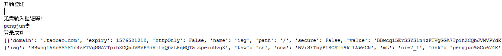

	# -*- coding: utf-8 -*-
	import time
	import json
	import base64
	import requests
	from PIL import Image
	from selenium import webdriver
	from selenium.webdriver.common.by import By
	from selenium.webdriver.support.ui import WebDriverWait
	from selenium.webdriver.support import expected_conditions as EC
	from selenium.common.exceptions import WebDriverException, ElementClickInterceptedException
	 
	chromedriver_path = "C:\Program Files (x86)\Google\Chrome\Application\chromedriver.exe"  # 改成你的chromedriver的完整路径地址
	pay_username = "pengjunlee@163.com"  # 改成你的支付宝账号
	pay_password = "PlumLegend2019"  # 改成你的支付宝密码
	 
	 
	class WindowsPayLogin:
	 
	    def __init__(self):
	        self.browser = self.init_browser()
	 
	    def init_browser(self):
	        # 创建chrome参数对象
	        options = webdriver.ChromeOptions()
	        options.add_argument('--no-sandbox')  # 解决DevToolsActivePort文件不存在的报错
	        # options.add_argument('--window-size=1920,1080')  # 指定浏览器窗口大小
	        options.add_argument('--start-maximized')  # 浏览器窗口最大化
	        options.add_argument('--disable-gpu')  # 谷歌文档提到需要加上这个属性来规避bug
	        options.add_argument('--hide-scrollbars')  # 隐藏滚动条, 应对一些特殊页面
	        # options.add_argument('--blink-settings=imagesEnabled=false')  # 不加载图片,加快访问速度
	        # options.add_argument('--headless')  # 浏览器不提供可视化页面. linux下如果系统不支持可视化不加这条会启动失败
	        options.add_argument('test-type')
	        options.add_experimental_option("excludeSwitches", ["ignore-certificate-errors",
	                                                            "enable-automation"])  # 此步骤很重要，设置为开发者模式，防止被各大网站识别出来使用了Selenium
	        # options.add_experimental_option("prefs", {"profile.managed_default_content_settings.images": 2})  # 不加载图片,加快访问速度
	        return webdriver.Chrome(options=options, executable_path=chromedriver_path)
	 
	    def local_verifycode(self, img_element=None):  # 识别验证码
	        if img_element is not None:
	            self.browser.save_screenshot("screenshot.png")
	            left = img_element.location['x']
	            top = img_element.location['y']
	            right = img_element.location['x'] + img_element.size['width']
	            bottom = img_element.location['y'] + img_element.size['height']
	            im = Image.open('screenshot.png')
	            im = im.crop((left, top, right, bottom))
	            im.save('verifycode.png')
	            # 图片转换为字节
	            with open(r'verifycode.png', 'rb') as f:
	                encode_wimg = base64.b64encode(f.read())
	            verify_data = {'v_type': 'ne4'}
	            verify_data['v_pic'] = 'data:image/png;base64,{}'.format(encode_wimg.decode())
	            verify_url = 'http://apigateway.jianjiaoshuju.com/api/v_1/yzm.html'  # 验证码请求页地址
	            headers = {'appCode': 'E9267AA8E80341B582CA4974FF43D77B', 'appKey': 'AKIDfa4d3b27fc2019acb3ea516c9437dbc2',
	                       'appSecret': '417e838716611fa70697d0b5308a0ffc',
	                       'Content-Type': 'application/x-www-form-urlencoded; charset=UTF-8'}
	            verify_response = requests.post(verify_url, data=verify_data, headers=headers)
	            print(verify_response.content.decode())
	            verify_dict = json.loads(verify_response.content.decode())
	            if verify_dict['errCode'] == 0:
	                return verify_dict['v_code']
	            else:
	                return None
	 
	    def login(self):
	 
	        print("开始登陆")
	 
	        # 打开淘宝登录页面
	        self.browser.get('https://login.taobao.com/member/login.jhtml')
	 
	        # 等待密码登录选项出现
	        password_login = WebDriverWait(self.browser, 10).until(
	            EC.presence_of_element_located((By.XPATH, "//node()[@id='J_Quick2Static']")))
	        if password_login.is_displayed():
	            password_login.click()
	        self.browser.save_screenshot('pre_login.png')  # 截取账号密码登录的图片
	 
	        # 等待支付宝登录按钮出现
	        alipay_login = WebDriverWait(self.browser, 10).until(
	            EC.presence_of_element_located((By.XPATH, "//node()[@id='J_OtherLogin']/*[@class='alipay-login']")))
	        alipay_login.click()
	 
	        # 保存支付宝登录页面内容
	        with open('./alipay.html', 'w', encoding='utf8') as f:
	            f.write(self.browser.page_source)
	 
	        # 若不是账号密码登录，需进行切换
	        user_password = WebDriverWait(self.browser, 10).until(
	            EC.presence_of_element_located(
	                (By.XPATH, "//node()[@id='J-loginMethod-tabs']/*[@data-status='show_login']")))
	        print(user_password.get_attribute('class'))
	        if user_password.get_attribute('class') == '':
	            user_password.click()
	 
	        # 等待支付宝账号输入框出现
	        username_input = WebDriverWait(self.browser, 10).until(EC.presence_of_element_located(
	            (By.XPATH, "//form[@name='loginForm']//input[@name='logonId']")))
	        username_input.clear()
	        # 使用 send_keys() 方法输入内容会被检测出来，改用 JS 脚本输入内容
	        username_js = 'document.getElementsByName("%s")[0].value ="%s"' % ("logonId", pay_username)
	        self.browser.execute_script(username_js)
	        time.sleep(2)
	        # 等待微博密码输入框出现
	        password_input = WebDriverWait(self.browser, 10).until(
	            EC.presence_of_element_located((By.CSS_SELECTOR, "#password_rsainput")))
	        password_input.clear()
	 
	        # 使用 send_keys() 方法输入内容会被检测出来，改用 JS 脚本输入内容
	        password_js = 'document.getElementById("%s").value ="%s"' % ("password_rsainput", pay_password)
	        self.browser.execute_script(password_js)
	 
	        # 等待登录按钮出现
	        login_btn = WebDriverWait(self.browser, 10).until(
	            EC.presence_of_element_located((By.CSS_SELECTOR, "#J-login-btn")))
	        time.sleep(2)
	        verifycode_div = WebDriverWait(self.browser, 10).until(
	            EC.presence_of_element_located((By.CSS_SELECTOR, '#J-checkcode')))
	        verifycode = None
	        try_times = 3
	        while try_times > 0:
	            try_times = try_times - 1
	            if verifycode_div.is_displayed():
	                print("需要输入验证码!")
	                if verifycode is None:
	                    verifycode_img = self.browser.find_element_by_css_selector('#J-checkcode-img')
	                    verifycode = self.local_verifycode(img_element=verifycode_img)
	                vcode_js = 'document.getElementById("%s").value = "%s"' % (
	                    "J-input-checkcode", verifycode)
	                self.browser.execute_script(vcode_js)
	            else:
	                print("无需输入验证码!")
	            if password_input.text == '':
	                password_js = 'document.getElementById("%s").value ="%s"' % ("password_rsainput", pay_password)
	                self.browser.execute_script(password_js)
	            login_btn.click()
	            try:
	                # 直到获取到淘宝会员昵称才能确定是登录成功
	                taobao_name = WebDriverWait(self.browser, 10).until(EC.presence_of_element_located((By.CSS_SELECTOR,
	                                                                                                    '.site-nav-bd > ul.site-nav-bd-l > li#J_SiteNavLogin > div.site-nav-menu-hd > div.site-nav-user > a.site-nav-login-info-nick ')))
	            except WebDriverException:
	                "登录失败，稍后重试！"
	            else:
	                # 输出淘宝昵称
	                print(taobao_name.text)
	                print("登录成功")
	                break
	        b_cookies = self.browser.get_cookies()
	        self.browser.quit()
	        return b_cookies
	 
	 
	if __name__ == '__main__':
	    alipay = WindowsPayLogin()
	    b_cookies = alipay.login()
	    print(b_cookies)
	    cookies = {i['name']: i['value'] for i in b_cookies}
	    print(cookies)

登陆成功，控制台输出示例：

