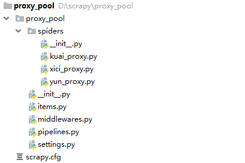

# 为什么要搭建爬虫代理池
在众多的网站防爬措施中，有一种是根据ip的访问频率进行限制，即在某一时间段内，当某个ip的访问次数达到一定的阀值时，该ip就会被拉黑、在一段时间内禁止访问。

应对的方法有两种：

1. 降低爬虫的爬取频率，避免IP被限制访问，缺点显而易见：会大大降低爬取的效率。
2. 搭建一个IP代理池，使用不同的IP轮流进行爬取。

# 搭建思路

1. 从代理网站(如：西刺代理、快代理、云代理、无忧代理)爬取代理IP；
2. 验证代理IP的可用性（使用代理IP去请求指定URL，根据响应验证代理IP是否生效）；
3. 将可用的代理IP保存到数据库；

在《Python爬虫代理池搭建》一文中我们已经使用Python的`requests`模块简单实现了一个IP代理池搭建，但是爬取速度较慢。由于西刺代理、快代理和云代理等网站需要爬取的IP代理列表页多达上千页，使用此种方法来爬取其实并不适合。

本文将以快代理网站的IP代理爬取为例，示例如何使用`Scrapy-Redis`来爬取代理IP。

# 搭建代理池
scrapy项目的目录结构如下：

## items.py

	# -*- coding: utf-8 -*-
	import re
	import scrapy
	from proxy_pool.settings import PROXY_URL_FORMATTER
	 
	schema_pattern = re.compile(r'http|https$', re.I)
	ip_pattern = re.compile(r'^([0-9]{1,3}.){3}[0-9]{1,3}$', re.I)
	port_pattern = re.compile(r'^[0-9]{2,5}$', re.I)
	 
	 
	class ProxyPoolItem(scrapy.Item):
	    # define the fields for your item here like:
	    # name = scrapy.Field()
	    '''
	        {
	            "schema": "http", # 代理的类型
	            "ip": "127.0.0.1", # 代理的IP地址
	            "port": "8050", # 代理的端口号
	            "original":"西刺代理",
	            "used_total": 11, # 代理的使用次数
	            "success_times": 5, # 代理请求成功的次数
	            "continuous_failed": 3, # 使用代理发送请求，连续失败的次数
	            "created_time": "2018-05-02" # 代理的爬取时间
	        }
	    '''
	    schema = scrapy.Field()
	    ip = scrapy.Field()
	    port = scrapy.Field()
	    original = scrapy.Field()
	    used_total = scrapy.Field()
	    success_times = scrapy.Field()
	    continuous_failed = scrapy.Field()
	    created_time = scrapy.Field()
	 
	    # 检查IP代理的格式是否正确
	    def _check_format(self):
	        if self['schema'] is not None and self['ip'] is not None and self['port'] is not None:
	            if schema_pattern.match(self['schema']) and ip_pattern.match(self['ip']) and port_pattern.match(
	                    self['port']):
	                return True
	        return False
	 
	    # 获取IP代理的url
	    def _get_url(self):
	        return PROXY_URL_FORMATTER % {'schema': self['schema'], 'ip': self['ip'], 'port': self['port']}

## kuai_proxy.py

	# -*- coding: utf-8 -*-
	import re
	import time
	import scrapy
	from proxy_pool.utils import strip, logger
	from proxy_pool.items import ProxyPoolItem
	 
	 
	class KuaiProxySpider(scrapy.Spider):
	    name = 'kuai_proxy'
	    allowed_domains = ['kuaidaili.com']
	    start_urls = ['https://www.kuaidaili.com/free/inha/1/', 'https://www.kuaidaili.com/free/intr/1/']
	 
	    def parse(self, response):
	        logger.info('正在爬取：< ' + response.request.url + ' >')
	        tr_list = response.css("div#list>table>tbody tr")
	        for tr in tr_list:
	            ip = tr.css("td[data-title='IP']::text").get()
	            port = tr.css("td[data-title='PORT']::text").get()
	            schema = tr.css("td[data-title='类型']::text").get()
	            if schema.lower() == "http" or schema.lower() == "https":
	                item = ProxyPoolItem()
	                item['schema'] = strip(schema).lower()
	                item['ip'] = strip(ip)
	                item['port'] = strip(port)
	                item['original'] = '快代理'
	                item['created_time'] = time.strftime('%Y-%m-%d', time.localtime(time.time()))
	                if item._check_format():
	                    yield item
	        next_page = response.xpath("//a[@class='active']/../following-sibling::li/a/@href").get()
	        if next_page is not None:
	            next_url = 'https://www.kuaidaili.com' + next_page
	            yield scrapy.Request(next_url)

## middlewares.py

	# -*- coding: utf-8 -*-
	 
	import random
	from proxy_pool.utils import logger
	 
	 
	# 随机选择 IP 代理下载器中间件
	class RandomProxyMiddleware(object):
	 
	    # 从 settings 的 PROXIES 列表中随机选择一个作为代理
	    def process_request(self, request, spider):
	        proxy = random.choice(spider.settings['PROXIES'])
	        request.meta['proxy'] = proxy
	        return None
	 
	 
	# 随机选择 User-Agent 的下载器中间件
	class RandomUserAgentMiddleware(object):
	    def process_request(self, request, spider):
	        # 从 settings 的 USER_AGENTS 列表中随机选择一个作为 User-Agent
	        user_agent = random.choice(spider.settings['USER_AGENT_LIST'])
	        request.headers['User-Agent'] = user_agent
	        return None
	 
	    def process_response(self, request, response, spider):
	        # 验证 User-Agent 设置是否生效
	        logger.info("headers ::> User-Agent = " + str(request.headers['User-Agent'], encoding="utf8"))
	        return response

## pipelines.py

	# -*- coding: utf-8 -*-
	 
	import json
	import redis
	from proxy_pool.settings import REDIS_HOST,REDIS_PORT,REDIS_PARAMS,PROXIES_UNCHECKED_LIST,PROXIES_UNCHECKED_SET
	 
	server = redis.StrictRedis(host=REDIS_HOST, port=REDIS_PORT,password=REDIS_PARAMS['password'])
	 
	class ProxyPoolPipeline(object):
	 
	    # 将可用的IP代理添加到代理池队列
	    def process_item(self, item, spider):
	        if not self._is_existed(item):
	            server.rpush(PROXIES_UNCHECKED_LIST, json.dumps(dict(item),ensure_ascii=False))
	 
	    # 检查IP代理是否已经存在
	    def _is_existed(self,item):
	        added = server.sadd(PROXIES_UNCHECKED_SET, item._get_url())
	        return added == 0

## settings.py

	# -*- coding: utf-8 -*-
	BOT_NAME = 'proxy_pool'
	 
	SPIDER_MODULES = ['proxy_pool.spiders']
	NEWSPIDER_MODULE = 'proxy_pool.spiders'
	 
	# 保存未检验代理的Redis key
	PROXIES_UNCHECKED_LIST = 'proxies:unchecked:list'
	 
	# 已经存在的未检验HTTP代理和HTTPS代理集合
	PROXIES_UNCHECKED_SET = 'proxies:unchecked:set'
	 
	# 代理地址的格式化字符串
	PROXY_URL_FORMATTER = '%(schema)s://%(ip)s:%(port)s'
	 
	# 通用请求头字段
	DEFAULT_REQUEST_HEADERS = {
	    'Accept': 'text/html,application/xhtml+xml,application/xml;q=0.9,image/webp,image/apng,*/*;q=0.8',
	    'Accept-Encoding': 'gzip, deflate, br',
	    'Accept-Language': 'zh-CN,zh;q=0.9,en;q=0.8,zh-TW;q=0.7',
	    'Connection': 'keep-alive'
	}
	 
	# 请求太频繁会导致 503 ,在此设置 5 秒请求一次
	DOWNLOAD_DELAY = 5  # 250 ms of delay
	 
	USER_AGENT_LIST = [
	    "Mozilla/5.0 (Windows NT 6.1; WOW64) AppleWebKit/537.1 (KHTML, like Gecko) Chrome/22.0.1207.1 Safari/537.1",
	    "Mozilla/5.0 (X11; CrOS i686 2268.111.0) AppleWebKit/536.11 (KHTML, like Gecko) Chrome/20.0.1132.57 Safari/536.11",
	    "Mozilla/5.0 (Windows NT 6.1; WOW64) AppleWebKit/536.6 (KHTML, like Gecko) Chrome/20.0.1092.0 Safari/536.6",
	    "Mozilla/5.0 (Windows NT 6.2) AppleWebKit/536.6 (KHTML, like Gecko) Chrome/20.0.1090.0 Safari/536.6",
	    "Mozilla/5.0 (Windows NT 6.2; WOW64) AppleWebKit/537.1 (KHTML, like Gecko) Chrome/19.77.34.5 Safari/537.1",
	    "Mozilla/5.0 (X11; Linux x86_64) AppleWebKit/536.5 (KHTML, like Gecko) Chrome/19.0.1084.9 Safari/536.5",
	    "Mozilla/5.0 (Windows NT 6.0) AppleWebKit/536.5 (KHTML, like Gecko) Chrome/19.0.1084.36 Safari/536.5",
	    "Mozilla/5.0 (Windows NT 6.1; WOW64) AppleWebKit/536.3 (KHTML, like Gecko) Chrome/19.0.1063.0 Safari/536.3",
	    "Mozilla/5.0 (Windows NT 5.1) AppleWebKit/536.3 (KHTML, like Gecko) Chrome/19.0.1063.0 Safari/536.3",
	    "Mozilla/5.0 (Macintosh; Intel Mac OS X 10_8_0) AppleWebKit/536.3 (KHTML, like Gecko) Chrome/19.0.1063.0 Safari/536.3",
	    "Mozilla/5.0 (Windows NT 6.2) AppleWebKit/536.3 (KHTML, like Gecko) Chrome/19.0.1062.0 Safari/536.3",
	    "Mozilla/5.0 (Windows NT 6.1; WOW64) AppleWebKit/536.3 (KHTML, like Gecko) Chrome/19.0.1062.0 Safari/536.3",
	    "Mozilla/5.0 (Windows NT 6.2) AppleWebKit/536.3 (KHTML, like Gecko) Chrome/19.0.1061.1 Safari/536.3",
	    "Mozilla/5.0 (Windows NT 6.1; WOW64) AppleWebKit/536.3 (KHTML, like Gecko) Chrome/19.0.1061.1 Safari/536.3",
	    "Mozilla/5.0 (Windows NT 6.1) AppleWebKit/536.3 (KHTML, like Gecko) Chrome/19.0.1061.1 Safari/536.3",
	    "Mozilla/5.0 (Windows NT 6.2) AppleWebKit/536.3 (KHTML, like Gecko) Chrome/19.0.1061.0 Safari/536.3",
	    "Mozilla/5.0 (X11; Linux x86_64) AppleWebKit/535.24 (KHTML, like Gecko) Chrome/19.0.1055.1 Safari/535.24",
	    "Mozilla/5.0 (Windows NT 6.2; WOW64) AppleWebKit/535.24 (KHTML, like Gecko) Chrome/19.0.1055.1 Safari/535.24"
	]
	 
	# Obey robots.txt rules
	ROBOTSTXT_OBEY = False
	 
	# Enable or disable downloader middlewares
	# See https://doc.scrapy.org/en/latest/topics/downloader-middleware.html
	DOWNLOADER_MIDDLEWARES = {
	    'proxy_pool.middlewares.RandomUserAgentMiddleware': 543,
	    #   'proxy_pool.middlewares.RandomProxyMiddleware': 544,
	}
	 
	ITEM_PIPELINES = {
	    'proxy_pool.pipelines.ProxyPoolPipeline': 300,
	}
	 
	PROXIES = [
	    "https://171.13.92.212:9797",
	    "https://164.163.234.210:8080",
	    "https://143.202.73.219:8080",
	    "https://103.75.166.15:8080"
	]
	 
	######################################################
	##############下面是Scrapy-Redis相关配置################
	######################################################
	 
	# 指定Redis的主机名和端口
	REDIS_HOST = '172.16.250.238'
	REDIS_PORT = 6379
	REDIS_PARAMS = {'password': '123456'}
	 
	# 调度器启用Redis存储Requests队列
	SCHEDULER = "scrapy_redis.scheduler.Scheduler"
	 
	# 确保所有的爬虫实例使用Redis进行重复过滤
	DUPEFILTER_CLASS = "scrapy_redis.dupefilter.RFPDupeFilter"
	 
	# 将Requests队列持久化到Redis，可支持暂停或重启爬虫
	SCHEDULER_PERSIST = True
	 
	# Requests的调度策略，默认优先级队列
	SCHEDULER_QUEUE_CLASS = 'scrapy_redis.queue.PriorityQueue'

## utils.py

	# -*- coding: utf-8 -*-
	import logging
	 
	# 设置日志输出格式
	logging.basicConfig(level=logging.INFO,
	                    format='[%(asctime)-15s] [%(levelname)8s] [%(name)10s ] - %(message)s (%(filename)s:%(lineno)s)',
	                    datefmt='%Y-%m-%d %T'
	                    )
	logger = logging.getLogger(__name__)
	 
	# Truncate header and tailer blanks
	def strip(data):
	    if data is not None:
	        return data.strip()
	    return data
	 