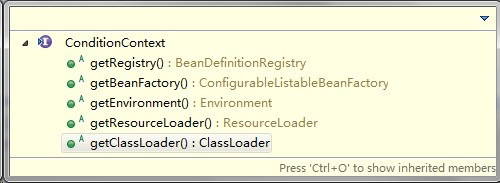
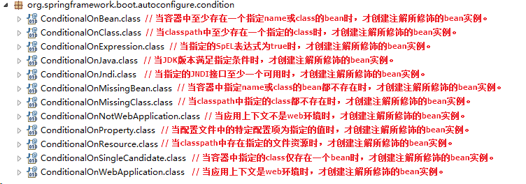

在上一章 《SpringBoot系列之--配置文件》中曾简单介绍过如何利用 `@Profile` 注解来根据指定 profile 是否被激活动态地决定是否要创建某一个 Bean 。

在这一章，我们将介绍另一种根据条件来装配 Bean 的新方法：使用 `@Conditional` 注解，根据是否满足指定的条件来决定是否装配 Bean 。

# @Conditional注解

`Conditional` 是由 SpringFramework 提供的一个注解，位于 `org.springframework.context.annotation` 包内，定义如下。

	package org.springframework.context.annotation;
	 
	import java.lang.annotation.ElementType;
	import java.lang.annotation.Retention;
	import java.lang.annotation.RetentionPolicy;
	import java.lang.annotation.Target;
	@Retention(RetentionPolicy.RUNTIME)
	@Target({ElementType.TYPE, ElementType.METHOD})
	public @interface Conditional {
	 
		Class<? extends Condition>[] value();
	 
	}

Conditional 注解类里只有一个 value 属性，需传入一个 `Condition` 类型的数组，我们先来看看这个 Condition 接口长什么样。

	package org.springframework.context.annotation;
	 
	import org.springframework.beans.factory.config.BeanFactoryPostProcessor;
	import org.springframework.core.type.AnnotatedTypeMetadata;
	public interface Condition {
	 
		boolean matches(ConditionContext context, AnnotatedTypeMetadata metadata);
	 
	}

其中，matches() 方法传入的参数 ConditionContext 是专门为 Condition 而设计的一个接口类，可以从中获取到Spring容器的以下对象信息。

当一个 Bean 被 Conditional 注解修饰时，Spring容器会对数组中所有 Condition 接口的 matches() 方法进行判断，只有当其中所有 Condition 接口的 matches()方法都为 ture 时，才会创建 Bean 。

# 自定义Conditional

接下来，我们将以一个国际化 I18n Bean 动态创建为例（根据配置中的 i18n.lang 属性值来动态地创建国际化 I18n Bean），对如何使用 Conditional 注解进行简单举例：

- 当 i18n.lang=zh_CN 就创建中文 I18nChs Bean， 
- 当 i18n.lang=en_US 就创建英文 I18nEng Bean。  

创建好的两个 Condition 实现类 **I18nChsCondition** 和 **I18nEngCondition** 代码如下。

	public class I18nChsCondition extends SpringBootCondition {
	 
		@Override
		public ConditionOutcome getMatchOutcome(ConditionContext context, AnnotatedTypeMetadata metadata) {
			String lang = context.getEnvironment().getProperty("i18n.lang");
			ConditionOutcome outCome = new ConditionOutcome("zh_CN".equals(lang), "i18n.lang=" + lang);
			return outCome;
		}
	}
 

	public class I18nEngCondition extends SpringBootCondition {
	 
		@Override
		public ConditionOutcome getMatchOutcome(ConditionContext context, AnnotatedTypeMetadata metadata) {
			String lang = context.getEnvironment().getProperty("i18n.lang");
			ConditionOutcome outCome = new ConditionOutcome("en_US".equals(lang), "i18n.lang=" + lang);
			return outCome;
		}
	 
	}

I18n 接口定义如下。

	public interface I18n {
	 
		// 获取 name 属性的值
		String i18n(String name);
	 
	}

I18n 接口的两个实现类 I18nChs 和 I18nEng 定义如下。

	@Component
	@Conditional(I18nChsCondition.class)
	public class I18nChsImpl implements I18n {
	 
		Map<String, String> map = new HashMap<String, String>() {
	 
			private static final long serialVersionUID = 1L;
	 
			{
				put("lang", "中文");
			}
		};
	 
		@Override
		public String i18n(String name) {
			return map.get(name);
		}
	}
 

	@Component
	@Conditional(I18nEngCondition.class)
	public class I18nEngImpl implements I18n {
	 
		Map<String, String> map = new HashMap<String, String>() {
	 
			private static final long serialVersionUID = 1L;
	 
			{
				put("lang", "English");
			}
		};
	 
		@Override
		public String i18n(String name) {
			return map.get(name);
		}
	 
	}

在启动类中添加测试代码代码如下。

	@SpringBootApplication
	public class App 
	{
	    public static void main( String[] args )
	    {
	        ConfigurableApplicationContext context = SpringApplication.run(App.class, args);
	        I18n i18n = context.getBean(I18n.class);
	        System.out.println(i18n.getClass().getName());
	        System.out.println(i18n.i18n("lang"));
	        context.close();
	    }
	}

配置 application.properties 内容如下：

	# language : zh_CN/Chinese,en_US/America
	i18n.lang=zh_CN

运行程序，打印结果：

`com.pengjunlee.condition.I18nChsImpl`  
`中文`

配置 application.properties 内容如下：

	# language : zh_CN/Chinese,en_US/America
	i18n.lang=en_US

再次运行程序，打印结果：

`com.pengjunlee.condition.I18nEngImpl`  
`English`  

为了书写和调用方便，我们还可以把上面的条件定义成注解，以 I18nChsCondition 为例，定义代码如下。

	@Target({ ElementType.TYPE, ElementType.METHOD })
	@Retention(RetentionPolicy.RUNTIME)
	@Documented
	@Conditional(I18nChsCondition.class)
	public @interface I18nChs {
	 
	}

将 I18nChs 注解添加到 I18nChsImpl 上。

	@Component
	@I18nEng
	public class I18nChsImpl implements I18n {//内容同上，此处省略}

# SpringBoot 扩展注解

从上面的示例不难看出，如果要使用我们自定义条件类实现起来还是有点小麻烦的，不过比较庆幸的是， SpringBoot 在  Conditional 注解的基础上已经提前为我们定义好了一系列功能丰富的注解，我们可以直接使用。

接下来我们使用  ConditionalOnProperty 注解来实现上面的国际化示例。

仅需修改 I18nChsImpl 和 I18nEngImpl 两个实现组件类，其他代码不变，程序执行结果与之前相同。

	@Component
	@ConditionalOnProperty(name = "i18n.lang", havingValue = "zh_CN", matchIfMissing = true)
	public class I18nChsImpl implements I18n {//内容同上，此处省略}
 

	@Component
	@ConditionalOnProperty(name = "i18n.lang", havingValue = "en_US", matchIfMissing = false)
	public class I18nEngImpl implements I18n {//内容同上，此处省略}

本项目源码已上传至CSDN，资源地址： <https://download.csdn.net/download/pengjunlee/10310020>