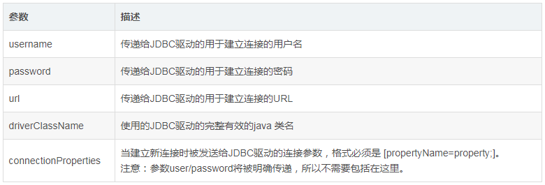
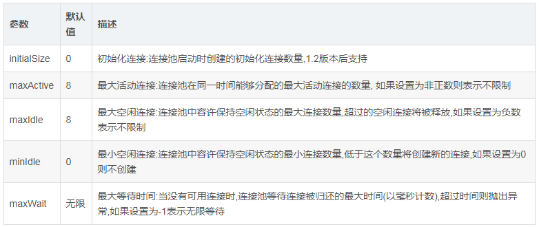
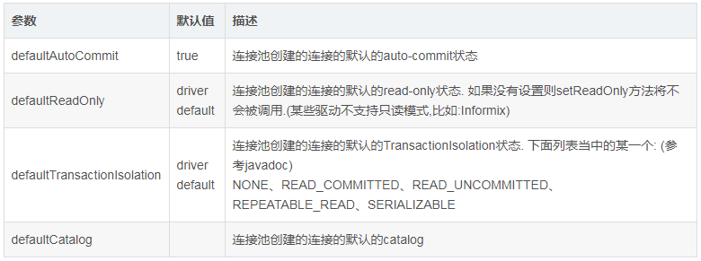
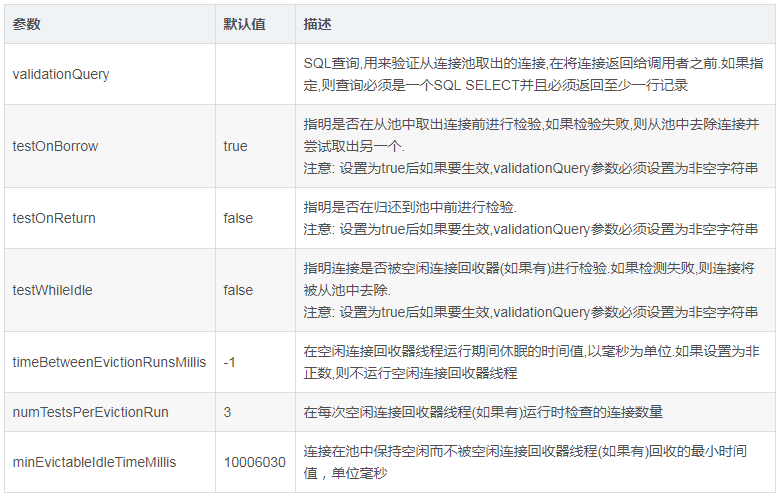
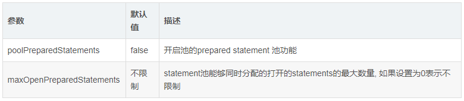
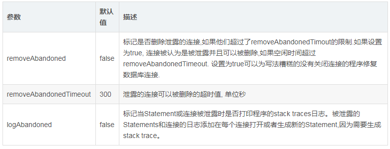

# DBCP2详细的配置表

## 常用链接配置

## 数据源连接数量配置

## 事务属性配置

## 数据源连接健康状况检查

## 缓存语句

## 连接泄露回收

**注意**：

- Java数据库连接有“8小时问题”，所以`destroy-method="close"`一定要加上。“8小时问题”是指一个连接空闲8小时数据库会自动关闭，而数据源并不知道。  
- 高并发下，可以`testOnBorrow`设置`false`，`testWhileIdle`设置为`true`，这样就会定时对后台空链接进行检测发现无用连接就会清除掉，不会每次都去都去检测是否8小时的空链接。

参考： <http://blog.csdn.net/initphp/article/details/8255793>