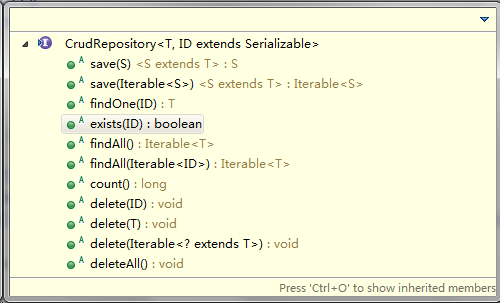
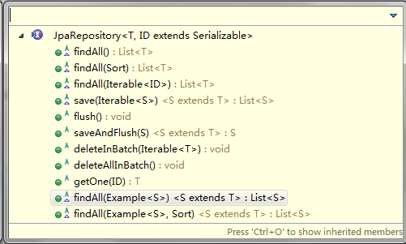
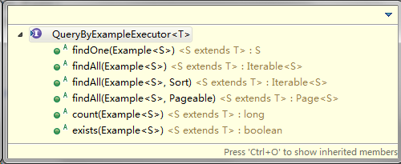
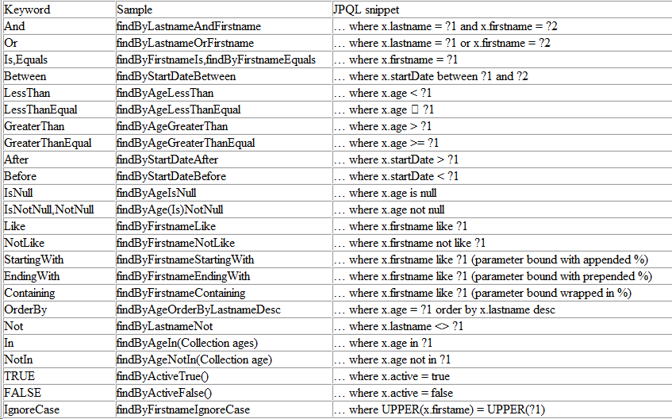

使用数据库是开发基本应用的基础，借助于开发框架，我们已经不用编写原始的访问数据库的代码，也不用调用`JDBC（Java Data Base Connectivity）`或者`连接池`等诸如此类的被称作底层的代码，我们将从更高的层次上访问数据库，这在Springboot中更是如此，本章我们将详细介绍在Springboot中使用 `Spring Data JPA` 来实现对数据库的操作。  

# JPA & Spring Data JPA

**JPA**是`Java Persistence API`的简称，中文名`Java持久层API`，是Sun官方提出的Java持久化规范，其设计目标主要是为了简化现有的持久化开发工作和整合ORM技术。JPA使用XML文件或注解（JDK 5.0或更高版本）来描述对象-关联表的映射关系，能够将运行期的实体对象持久化到数据库，它为Java开发人员提供了一种ORM工具来管理Java应用中的关系数据。 简单地说，JPA就是为`POJO（Plain Ordinary Java Object）`提供持久化的标准规范，即将Java的普通对象通过对象关系映射（`Object-Relational Mapping，ORM`）持久化到数据库中。由于JPA是在充分吸收了现有Hibernate，TopLink，JDO等ORM框架的基础上发展而来的，因而具有易于使用、伸缩性强等优点。

Spring Data JPA 是 Spring 基于 Spring Data 框架、在JPA 规范的基础上开发的一个框架，使用 Spring Data JPA 可以极大地简化JPA 的写法，可以在几乎不用写实现的情况下实现对数据库的访问和操作，除了CRUD外，还包括分页和排序等一些常用的功能。  

# 配置Maven依赖

以MySQL数据库为例，为了使用JPA和MySQL，首先在工程中引入它们的Maven依赖。 

	<parent>
		<groupId>org.springframework.boot</groupId>
		<artifactId>spring-boot-starter-parent</artifactId>
		<version>1.5.1.RELEASE</version>
	</parent>
	<dependencies>
		<dependency>
			<groupId>mysql</groupId>
			<artifactId>mysql-connector-java</artifactId>
		</dependency>
		<dependency>
			<groupId>org.springframework.boot</groupId>
			<artifactId>spring-boot-starter-data-jpa</artifactId>
		</dependency>
		<dependency>
			<groupId>org.springframework</groupId>
			<artifactId>spring-test</artifactId>
		</dependency>
	</dependencies>

# 配置数据源和JPA

在Springboot核心配置文件 `application.properties` 中配置MySQL数据源和JPA。 

	########################################################
	### Spring datasource -- Datasource configuration.
	########################################################
	spring.datasource.url = jdbc:mysql://localhost:3306/mybatis?characterEncoding=UTF-8
	spring.datasource.username = root
	spring.datasource.password = 123456
	spring.datasource.driverClassName = com.mysql.jdbc.Driver
	spring.datasource.type = org.apache.tomcat.jdbc.pool.DataSource
	 
	########################################################
	### Java Persistence Api --  Spring jpa configuration.
	########################################################
	# Specify the DBMS
	spring.jpa.database = MYSQL
	# Show or not log for each sql query
	spring.jpa.show-sql = true
	# Hibernate ddl auto (create, create-drop, update, validate, none)
	spring.jpa.hibernate.ddl-auto = update
	# Naming strategy
	#[org.hibernate.cfg.ImprovedNamingStrategy  #org.hibernate.cfg.DefaultNamingStrategy]
	spring.jpa.hibernate.naming-strategy = org.hibernate.cfg.ImprovedNamingStrategy
	# stripped before adding them to the entity manager)
	spring.jpa.properties.hibernate.dialect = org.hibernate.dialect.MySQL5Dialect

其中，`spring.jpa.hibernate.ddl-auto` 参数用来配置是否开启自动更新数据库表结构，可取`create`、`create-drop`、`update`、`validate`、`none`五个值。 

- create 每次加载hibernate时，先删除已存在的数据库表结构再重新生成；
- create-drop 每次加载hibernate时，先删除已存在的数据库表结构再重新生成，并且当 sessionFactory关闭时自动删除生成的数据库表结构；
- update 只在第一次加载hibernate时自动生成数据库表结构，以后再次加载hibernate时根据model类自动更新表结构；
- validate 每次加载hibernate时，验证数据库表结构，只会和数据库中的表进行比较，不会创建新表，但是会插入新值。
- none 关闭自动更新 

# 创建POJO实体

首先创建一些普通对象，用来与数据库的表建立映射关系，在此我们只定义了员工和部门两个实体来进行示例。 

	@Entity
	@Table(name = "tbl_employee") // 指定关联的数据库的表名
	public class Employee implements Serializable {
	 
		private static final long serialVersionUID = 1L;
	 
		@Id
		@GeneratedValue(strategy = GenerationType.IDENTITY)
		private Long id; // 主键ID
	 
		private String name; // 姓名
	 
		@ManyToOne
		@JoinColumn(name = "department_id")
		private Department department; // 部门
	 
		public Long getId() {
			return id;
		}
	 
		public void setId(Long id) {
			this.id = id;
		}
	 
		public String getName() {
			return name;
		}
	 
		public void setName(String name) {
			this.name = name;
		}
	 
		public Department getDepartment() {
			return department;
		}
	 
		public void setDepartment(Department department) {
			this.department = department;
		}
	 
	}
 

	@Entity
	@Table(name = "tbl_department")
	public class Department  implements Serializable{
	 
		private static final long serialVersionUID = 1L;
	 
		@Id
		@GeneratedValue(strategy = GenerationType.IDENTITY)
		private Long id; // 主键ID
	 
		private String name; // 部门名称
	 
		public Long getId() {
			return id;
		}
	 
		public void setId(Long id) {
			this.id = id;
		}
	 
		public String getName() {
			return name;
		}
	 
		public void setName(String name) {
			this.name = name;
		}
	 
	}

其中，注解`@Entity`用来标记该类是一个JPA实体类，并使用了注解`@Table指定关联的数据库的表名`；注解`@Id用来定义记录的唯一标识`，并结合注解`@GeneratedValue`将其设置为自动生成。  

# 数据持久化

使用 JPA 进行数据持久化有两种实现方式。

- 使用Spring Data JPA 提供的接口默认实现,
- 自定义符合Spring Data JPA规则的查询方法，由框架将其自动解析为SQL。

## 使用Spring Data JPA接口
Spring Data JPA提供了一些实现了基本的数据库操作的接口类，如下图所示。 

### CrudRepository

CrudRepository提供了一些简单的增删查改功能，接口定义如下。 

	package org.springframework.data.repository;
	 
	import java.io.Serializable;
	 
	@NoRepositoryBean
	public interface CrudRepository<T, ID extends Serializable> extends Repository<T, ID> {
	 
		<S extends T> S save(S entity); // 保存并返回（修改后的）实体
	 
		<S extends T> Iterable<S> save(Iterable<S> entities); // 保存并返回（修改后的）实体集合
	 
		T findOne(ID id); // 根据ID获取实体
	 
		boolean exists(ID id); // 判断指定ID的实体是否存在
	 
		Iterable<T> findAll(); // 查询所有实体
	 
		Iterable<T> findAll(Iterable<ID> ids); // 根据ID集合查询实体
	 
		long count(); // 获取实体的数量
	 
		void delete(ID id); // 删除指定ID的实体
	 
		void delete(T entity); // 删除实体
	 
		void delete(Iterable<? extends T> entities); // 删除实体集合
	 
		void deleteAll(); // 删除所有实体
	}

### PagingAndSortingRepository

PagingAndSortingRepository继承于CrudRepository，除了具有CrudRepository接口的能力外，还新增了分页和排序的功能，接口定义如下。 

	package org.springframework.data.repository;
	 
	import java.io.Serializable;
	 
	import org.springframework.data.domain.Page;
	import org.springframework.data.domain.Pageable;
	import org.springframework.data.domain.Sort;
	 
	@NoRepositoryBean
	public interface PagingAndSortingRepository<T, ID extends Serializable> extends CrudRepository<T, ID> {
	 
		Iterable<T> findAll(Sort sort); // 查询所有实体并排序
	 
		Page<T> findAll(Pageable pageable); // 分页查询实体
	}

### JpaRepository

JpaRepository继承于PagingAndSortingRepository，所以它传递性地拥有了以上接口的所有方法，同时，它还继承了另外一个QueryByExampleExecutor接口，拥有了该接口匹配指定样例的能力，JpaRepository接口定义如下。 

	package org.springframework.data.jpa.repository;
	 
	import java.io.Serializable;
	import java.util.List;
	 
	import javax.persistence.EntityManager;
	 
	import org.springframework.data.domain.Example;
	import org.springframework.data.domain.Sort;
	import org.springframework.data.repository.NoRepositoryBean;
	import org.springframework.data.repository.PagingAndSortingRepository;
	import org.springframework.data.repository.query.QueryByExampleExecutor;
	 
	@NoRepositoryBean
	public interface JpaRepository<T, ID extends Serializable>
			extends PagingAndSortingRepository<T, ID>, QueryByExampleExecutor<T> {
	 
		List<T> findAll(); // 查询所有实体
	 
		List<T> findAll(Sort sort); // 查询所有实体并排序
	 
		List<T> findAll(Iterable<ID> ids); // 根据ID集合查询实体
	 
		<S extends T> List<S> save(Iterable<S> entities); // 保存并返回（修改后的）实体集合
	 
		void flush(); // 提交事务
	 
		<S extends T> S saveAndFlush(S entity); // 保存实体并立即提交事务
	 
		void deleteInBatch(Iterable<T> entities); // 批量删除实体集合
	 
		void deleteAllInBatch();// 批量删除所有实体
	 
		T getOne(ID id); // 根据ID查询实体
	 
		@Override
		<S extends T> List<S> findAll(Example<S> example); // 查询与指定Example匹配的所有实体
	 
		@Override
		<S extends T> List<S> findAll(Example<S> example, Sort sort);// 查询与指定Example匹配的所有实体并排序
	 
	}

### QueryByExampleExecutor

QueryByExampleExecutor接口允许开发者根据给定的样例执行查询操作，接口定义如下。 

	package org.springframework.data.repository.query;
	 
	import org.springframework.data.domain.Example;
	import org.springframework.data.domain.Page;
	import org.springframework.data.domain.Pageable;
	import org.springframework.data.domain.Sort;
	 
	public interface QueryByExampleExecutor<T> {
	 
		<S extends T> S findOne(Example<S> example); // 查询与指定Example匹配的唯一实体
	 
		<S extends T> Iterable<S> findAll(Example<S> example); // 查询与指定Example匹配的所有实体
	 
		<S extends T> Iterable<S> findAll(Example<S> example, Sort sort); // 查询与指定Example匹配的所有实体并排序
	 
		<S extends T> Page<S> findAll(Example<S> example, Pageable pageable);// 分页查询与指定Example匹配的所有实体
	 
		<S extends T> long count(Example<S> example); // 查询与指定Example匹配的实体数量
	 
		<S extends T> boolean exists(Example<S> example); // 判断与指定Example匹配的实体是否存在
	}

以部门实体资源库接口DepartmentRepository为例，只需继承CrudRepository接口便会自动拥有基础的增删查改功能，无须编写一条SQL。  

	@Repository
	public interface DepartmentRepository extends CrudRepository<Department, Long> {
	 
	}

## 自定义查询方法
除了可以直接使用Spring Data JPA接口提供的基础功能外，Spring Data JPA还允许开发者自定义查询方法，对于符合以下命名规则的方法，Spring Data JPA能够根据其方法名为其自动生成SQL，除了使用示例中的 `find` 关键字，还支持的关键字有：`query`、`get`、`read`、`count`、`delete`等。 

另外，Spring Data JPA 还提供了对分页查询、自定义SQL、查询指定N条记录、联表查询等功能的支持，以员工实体资源库接口EmployeeRepository为例，功能代码示意如下。 

	@Repository
	public interface EmployeeRepository extends JpaRepository<Employee, Long> {
	 
		/**
		 * 根据部门ID获取员工数量
		 */
		int countByDepartmentId(Long departmentId);
	 
		/**
		 * 根据部门ID分页查询
		 */
		Page<Employee> queryByDepartmentId(Long departmentId, Pageable pageable);
	 
		/**
		 * 根据员工ID升序查询前10条
		 */
		List<Employee> readTop10ByOrderById();
	 
		/**
		 * 根据员工姓名取第一条记录
		 */
		Employee getFirstByName(String name, Sort sort);
	 
		/**
		 * 联表查询
		 */
		@Query("select e.id as employeeId,e.name as employeeName,d.id as departmentId,d.name as departmentName from Employee e , Department d where e.id= ?1 and d.id= ?2")
		EmployeeDetail getEmployeeJoinDepartment(Long eid, Long did);
	 
		/**
		 * 修改指定ID员工的姓名
		 */
		@Modifying
		@Transactional(timeout = 10)
		@Query("update Employee e set e.name = ?1 where e.id = ?2")
		int modifyEmployeeNameById(String name, Long id);
	 
		/**
		 * 删除指定ID的员工
		 */
		@Transactional(timeout = 10)
		@Modifying
		@Query("delete from Employee where id = ?1")
		void deleteById(Long id);
	 
	}

### JUnit测试
为例验证上面接口的正确性，我们使用JUnit来进行测试，先增加一个JPA的配置类，代码如下。 

	@Order(Ordered.HIGHEST_PRECEDENCE)
	@Configuration
	@EnableTransactionManagement(proxyTargetClass = true)
	@EnableJpaRepositories(basePackages = {"com.pengjunlee.repository"})
	@EntityScan(basePackages = {"com.pengjunlee.entity"})
	@EnableAutoConfiguration
	public class JpaConfiguration {
	 
		@Bean
		PersistenceExceptionTranslationPostProcessor persistenceExceptionTranslationPostProcessor() {
			return new PersistenceExceptionTranslationPostProcessor();
		}
	}

其中，`@EnableTransactionManagement注解用来启用JPA事务管理`，`@EnableJpaRepositories注解用来启用JPA资源库发现`，`@EntityScan注解用来启用实体发现`。

配置类定义好之后，编写一个JUnit Test Case测试程序。  

	@RunWith(SpringJUnit4ClassRunner.class)
	@ContextConfiguration(classes = JpaConfiguration.class)
	@TestPropertySource(locations = { "classpath:application.properties" })
	public class JpaTest {
	 
		@Autowired
		DepartmentRepository departmentRepository;
	 
		@Autowired
		EmployeeRepository employeeRepository;
	 
		@Test
		public void addDepartmentTest() {
	 
		}
	 
		@Test
		public void initData() {
			// 清空员工表中的数据
			employeeRepository.deleteAll();
			// 清空部门表中的数据
			departmentRepository.deleteAll();
			// 部门表中添加一个开发部
			Department dept1 = new Department();
			dept1.setName("开发部");
			departmentRepository.save(dept1);
			// 部门表中添加一个测试部
			Department dept2 = new Department();
			dept2.setName("测试部");
			departmentRepository.save(dept2);
	 
			String[] names = new String[] { "lucy", "tom", "hanmeime", "jacky", "francky", "lilly", "xiaoming", "smith",
					"walt", "sherry" };
			// 员工表中增加10条记录
			for (int i = 0; i < 10; i++) {
				Employee emp = new Employee();
				emp.setName(names[i]);
				if (i < 5) {
					emp.setDepartment(dept1);
				} else {
					emp.setDepartment(dept2);
				}
				employeeRepository.save(emp);
			}
		}
	 
		@Test
		public void testCountByDepartmentId() {
			int count = employeeRepository.countByDepartmentId(19L);
			System.out.println(count);
		}
	 
		@Test
		public void testQueryByDepartmentId() {
			Pageable pageable = new PageRequest(0, 10, new Sort(Sort.Direction.ASC, "name"));
			Page<Employee> emps = employeeRepository.queryByDepartmentId(19L, pageable);
	 
			for (Employee emp : emps.getContent()) {
				System.out.println("员工姓名：" + emp.getName() + "，所属部门：" + emp.getDepartment().getName());
			}
		}
	 
		@Test
		public void testReadTop10ByOrderById() {
			List<Employee> emps = employeeRepository.readTop10ByOrderById();
			for (Employee emp : emps) {
				System.out.println("员工姓名：" + emp.getName() + "，所属部门：" + emp.getDepartment().getName());
			}
		}
	 
		@Test
		public void testGetFirstByName() {
			Employee emp = employeeRepository.getFirstByName("xiaoming", new Sort(Direction.ASC, "id"));
			System.out.println("员工姓名：" + emp.getName() + "，所属部门：" + emp.getDepartment().getName());
		}
	 
		@Test
		public void testGetEmployeeJoinDepartment() {
			EmployeeDetail empDetail = employeeRepository.getEmployeeJoinDepartment(5L, 19L);
			System.out.println("员工姓名：" + empDetail.getEmployeeName() + "，部门名称：" + empDetail.getDepartmentName());
		}
	 
		@Test
		public void testModifyEmployeeNameById() {
			employeeRepository.modifyEmployeeNameById("chris", 5L);
		}
	 
		@Test
		public void testDeleteById() {
			employeeRepository.deleteById(11L);
		}
	}

本文项目源码已上传至CSDN，资源地址：<https://download.csdn.net/download/pengjunlee/10366305> 